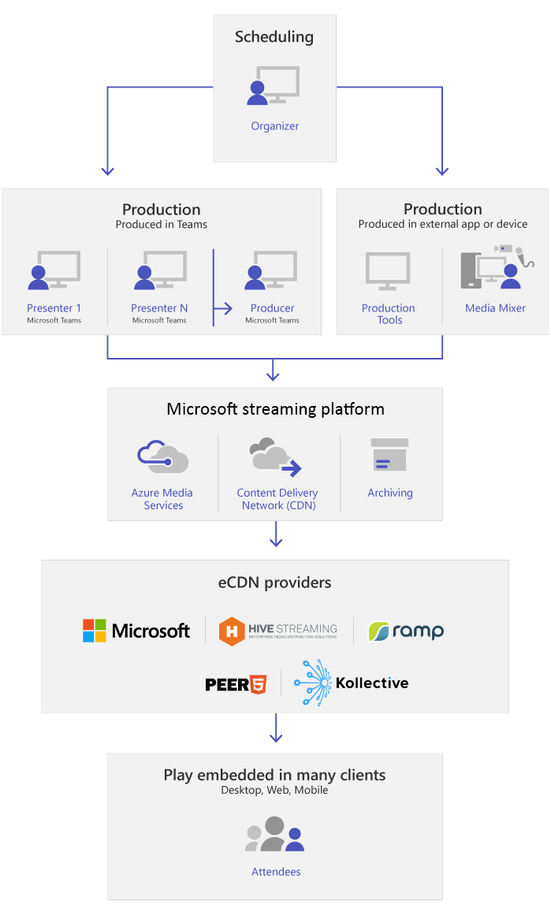

# What are Microsoft Teams live events

> [!NOTE]
> We're currently still supporting live events. While we still recommend you to upgrade to [Teams town halls](../plan-town-halls.md) to take advantage of new features and experiences, your users can continue to schedule events. For more information, see [Updates for Town Hall in Microsoft Teams and Teams Live Events](https://techcommunity.microsoft.com/t5/microsoft-teams-blog/extension-for-teams-live-events-retirement/ba-p/4148352).

## Overview

Teams live events allow users in your organization to broadcast video and meeting content to large online audiences, taking live video streaming to a new level. These events foster connection throughout the entire engagement lifecycle, engaging attendees before, during, and after the event. Your users can create a live event wherever their audience, team, or community resides, using either Teams or Viva Engage.

Teams live events extend the capabilities of Teams meetings by allowing users to broadcast video and meeting content to a wide online audience. These events are designed for one-to-many communications, where the host leads the interactions and the audience primarily views the shared content. Attendees can watch the live or recorded event in Viva Engage or Teams and interact with the presenters through moderated Q&A or a Viva Engage conversation.

So, let's get started. First, take a look at the following diagram that shows high level components involved in Microsoft 365 live events and how they're connected.

> [!NOTE]
> Teams Live Events, due to the nature of broadcast technology, often reach larger audiences than typical internal meetings. Like other large-scale media broadcasting services, we rely on Content Delivery Networks to deliver your live event content to recipients. This content is protected by encryption methods and authorized by access tokens issued based on your live event meeting configuration.
>
> It's important to ensure that the meeting content is suitable for a large audience or to appropriately limit the audience for sensitive content. As with any industry, compromises to other elements of your security, such as personnel or infrastructure, could impact the security of your live events. Organizations should include Live Events and other broadcast services in their security planning and exercises.

## Event group roles

Live events in Teams empower multiple roles (organizer, producer, presenter, and attendee) to successfully broadcast and participate in an event. To learn more, see [Event group roles](https://support.office.com/article/get-started-with-microsoft-teams-live-events-d077fec2-a058-483e-9ab5-1494afda578a?ui=en-US&rs=en-US&ad=US#bkmk_roles).

## Key components

You can see from the diagram in the overview section that there are five key components that are used with live events in Teams.

> [!NOTE]
> For an overview of how to set up live events and the attendee experience, check out these short [videos](https://support.office.com/article/video-plan-and-schedule-a-live-event-f92363a0-6d98-46d2-bdd9-f2248075e502).

### Scheduling

Teams allows organizers to create an event with the appropriate attendee permissions, designate event team members, select a production method, and invite attendees. If the organizer creates the live event from within a Viva Engage group, live event attendees can use Viva Engage conversation to interact with people in the event.

:::image type="content" source="../media/new-live-event-ui-small.png" alt-text="Screen shot showing the live event screen to create and schedule a new live event." lightbox="../media/new-live-event-ui-expand.png":::

> [!NOTE]
> To schedule live events, organizers must use the Teams web client. When organizers are scheduling their live event, they’re prompted to open a web form.
> :::image type="content" source="../media/live-event-pop-up-small.png" alt-text="Screenshot of Contoso Education's meeting theme featuring their brand logo, image, and colors." lightbox="../media/live-event-pop-up-expand.png":::
> [!IMPORTANT]
> Users can't schedule meetings or live events when they're offline or running with limited bandwidth.

### Production

Video input is the foundation of the live event and it can vary from a single webcam to a multi-camera professional video production. Teams live events support a spectrum of production scenarios, include an event produced in Teams using a webcam or an event produced in an external app or device. You can choose these options depending on their project requirements and budget. There are two ways to produce events:

- **Teams**: This production method allows users to produce their live events in Teams using their webcam or using A/V input from Teams room systems. This option is ideal for using PC-connected audio and video devices or inviting remote presenters. This option allows users to easily use their webcams and share their screen as input in the event.

- **Teams Encoder**: Allows users to produce their live events directly from an external hardware or software-based encoder with [Teams](../teams-stream-overview.md). This option is best if you already have studio quality equipment (for example, media mixers) that supports streaming to a Real-time Messaging Protocol (RTMP) service. This type of production is typically used in large-scale events such as executive town halls – where a single stream from a media mixer is broadcasted to the audience.

  

### Streaming platform

The live event streaming platform is made up of the following pieces:

- **Azure Media Services**: [Azure Media Services](/azure/media-services/) gives you broadcast-quality video streaming services to reach larger audiences on today’s most popular mobile devices. Media Services enhances accessibility, distribution, and scalability, and makes it easy and cost-effective to stream content to your local or worldwide audiences—all while protecting your content.
- **Azure Content Delivery Network (CDN)**: Once your stream goes live, it's delivered through the [Azure Content Delivery Network (CDN)](/azure/cdn/). Azure Media Services provides integrated CDN for streaming endpoints. This allows the streams to be viewed worldwide with no buffering.

### Enterprise Content Delivery Network (eCDN)

The goal of eCDN is to take the video content from the internet and distribute the content throughout your enterprise without impacting network performance. You can use either the [Microsoft first-party eCDN solution](/ecdn) or, alternatively, one of the following certified eCDN partners to optimize your network for live events held within your organization:

- [Hive](https://www.hivestreaming.com/partners/integration-partners/microsoft/)
- [Kollective](https://kollective.com/ecdn-solutions/microsoft-live-events/)
- [Ramp](https://rampecdn.com)

For details, see [Enterprise content delivery networks for streaming Microsoft Teams events](../streaming-ecdn-enterprise-content-delivery-network.md).

### Attendee experience

The attendee experience is the most important aspect of live events and it's critical for attendees to participate in the live event without any issues. The attendee experience uses Teams (for events produced in Teams) and Azure Media Player (for events produced in an external app or device) and works across desktop, browser, and mobile (iOS, Android). Microsoft 365 and Office 365 provide Viva Engage and Teams as two collaboration hubs, and the live attendee experience is integrated into these collaboration tools.

### Live event usage report

As an admin, you can find real-time usage analytics for live events in Microsoft Teams admin center. The [live event usage report](../teams-analytics-and-reports/teams-live-event-usage-report.md) shows the activity overview of the live events held in the organization. You can view event usage information, including event status, start time, views, and production type.

## Next steps

Go to [Plan for Teams live events](plan-for-teams-live-events.md).

### Related topics

- [Get started with Microsoft Teams live events](https://support.office.com/article/d077fec2-a058-483e-9ab5-1494afda578a)
- [Live events in Viva Engage](https://support.office.com/article/live-events-in-yammer-4ece0ee2-c268-4636-bf2a-16e454befe57)
- [Live streaming events in Microsoft Teams](../teams-stream-overview.md)
