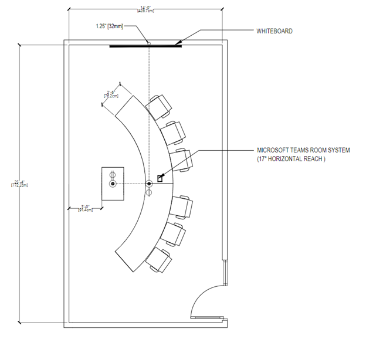

# Meeting room guidance for Teams

This article is intended to guide users on how to optimize meeting spaces with Microsoft Teams Rooms solutions and devices. It includes information on Teams Rooms device and solution uses, layouts, and specifications.

# [Meeting room uses and layouts](#tab/uses)

## Overview

Microsoft Teams Rooms solutions offer flexibility of purpose and even flexibility of movement throughout a space that traditional meeting rooms do not. For example, with Teams Rooms devices, users can enhance their collaboration with a digital whiteboard, and intelligent people-tracking cameras make sure every local participant can be seen no matter where they are in the room. Any type of space and any type of meeting can be optimized with Teams Rooms devices or Teams Rooms solutions.

### Presentation-focused meetings

Meet and present meetings are the first bucket, and this meeting is generally more formal. Audio-visual is a priority, and there is a focus on presenting content. The device is typically fixed, allowing users to remain seated while interacting with the device from a center-of-table console.

Meet and present spaces prioritize presentation and discussion, which means the layout and technology must be optimized for content sharing and remote co-creation. Everyone needs to be involved in the discussion and must be able to see and interact with shared content.

**Meet and present** **space layouts:** Tables should be fixed and located in front-of-room displays. In smaller rooms, the tables may be attached to the wall, but in larger spaces, they must be separated to accommodate camera considerations.

### Co-creation-focused meetings

Meet and co-create meetings are generally less formal with a priority on co-creation, inking, and whiteboard. Access to personal files is also a focus for this bucket. The device can be mobile, encouraging users to stand up, gather, and interact with the device.

The right space bridges users and the technology seamlessly and eliminates friction for even the most novice users. Teams devices are designed to be user-friendly enough for young students or new users to navigate adeptly, and for educators or admin to control and customize from first use.

**Meet and co-create space layouts:** Tables and co-creation equipment can have flexible positions and should accommodate groups of people working at either the tables or the equipment.

### Presentation and co-creation-focused meetings

Remember, both types of rooms can handle both types of experiences when needed. Rooms can also be designed to accommodate both easily by having technology for each use. The important thing to remember is that no matter what space you are equipping, from a private office to a lecture hall, it needs to be Teams enabled.

**Combination presentation and co-creation space layouts:** A combination of use cases from other meeting scenarios can be combined to form multi-purpose rooms where presentation-focused meetings, as well as co-creation work, can be achieved with equal efficiency, often simultaneously.

## Optimizing the meeting experience

A great meeting experience is the result of using the best possible technology for a meeting space in ways that facilitate the exchange of ideas without being intrusive.

### Native Teams Rooms experiences versus other devices

Teams Rooms go beyond what can be done with Teams on personal devices by providing unique in-room capabilities, like one-touch join, content cameras to share physical whiteboards into the meeting in an intelligent way, and proximity features like seamlessly transferring a Teams meeting from your personal device to the room.

Non-native and self-built systems that rely on external services, or a bring-your-own-device connection, will never truly match the ease of use or immersive quality of a native Teams Room.

It's understood that over the course of a deployment, there may need to be intermediate steps (such as quickly deploying bring-your-own-device meeting rooms) implemented on your path to a fully native Teams experience in your meeting spaces.

### Using Teams to create the best possible meeting experience

By having both Teams on all your personal devices and properly deployed Microsoft Teams Rooms in all your spaces, you will be able to facilitate the best possible meeting experience for every one of your users. As you plan to achieve the best possible experience, you will need to address all your spaces in terms of both technological deployment and end-user guidance and training.

It's normal when planning for a large-scale, company-wide rollout for it to happen in stages with some rooms seeing technology added at different times, or even certain components being installed earlier than others (such as deploying Teams panels for scheduling in every room in a particular building while installing Teams Rooms solutions one floor or even room at a time).

Prepare your users to do this in stages to maximize your Teams meeting experience at every point along the way.

#### Good experience – Personal devices alone in a meeting space

You can start with this plan by addressing all your non-AV or non-collaboration-equipped meeting spaces. You can still take advantage of Teams in your meeting rooms, even if those meeting rooms have not yet had Teams devices installed.

*Audio:* A great bridge to a complete Teams Rooms is to plan for meeting technology by either providing your individual users with Teams-certified audio devices for smaller rooms and groups, or by deploying them in rooms ahead of a full Teams Rooms solution for larger spaces meant for larger groups where a small device won’t cut it.

*Video:* When these rooms are used, individual users can bring their own devices to share in the Teams meeting content and capture their expressions with their individual cameras. Users can then designate someone to be the single source of audio for the local group, connecting that personal device to the certified audio device, so that everyone (both local and remote) has a positive experience with meeting audio.

*Engagement:* Enabling your meeting rooms for a better Teams meeting experience, even when it requires the use of personal devices and peripherals, will still allow your users to expand on what they can do with Teams. When your users are situated in private offices and at individual workstations, Teams facilitates in-person discussions in addition to engaging with remote participants.

#### Better experience – Teams Rooms solutions and no personal devices

If you install Teams Rooms solutions or if you already have rooms that have already been deployed with appropriate Teams Rooms devices for their respective spaces, then you are well on your way to having great meeting experiences.

*Audio:* Audio for these meeting spaces will be handled by the Teams Rooms solution and its Microsoft-certified audio devices.

*Video:* Video in these spaces will be handled by the Teams Rooms solution and its Microsoft-certified cameras.

*Engagement:* Your end users will be able to take advantage of the complete Teams Rooms experience for their meetings, ensuring that everyone can join meetings easily and have great and audio and video.

#### Best experience – Teams Rooms solutions used in conjunction with personal devices

Training your users to use technology in coordination leads to the most efficient and streamlined outcome. The best possible scenario is a combination of installed technology and personal devices.

*Audio:* Most meeting-room connectivity and audio-video work will be handled by the Teams Rooms solution, while individual users can join the same meeting with cameras on and audio off for a completely immersive experience.

*Video:* Remote users will be able to see everyone take part in the meeting beyond just speaking and content sharing. A remote user can turn on personal video to gain a view from anywhere in the room with the ability to focus in on any participant.

*Engagement:* Chat can remain dynamic with all participants, local and remote, involved and engaged. Video sharing from both Teams Rooms and via individual cameras allows remote participants to feel engaged with everyone.

Using Teams on all devices ensures that local room users and remote users feel equally engaged in meetings.

## Technology considerations

The right audio and video technology choices will help users get the most out of their Microsoft Teams meetings.

### Audio

Audio considerations are critical to ensure both remote and in-room participants can be clearly heard and understood. Microphone and speaker coverage must include every seat in the room without leaving gaps.

*The right audio devices for each space*:

A single source of audio for a space is required to ensure that there are no audio issues in a meeting room.

Pairing the right microphone and speakers for each space will give the best possible results for being heard clearly without distraction.

- In shared spaces, the options expand, but the same principles remain: meeting participants need to be heard and hear others clearly.

  - All-in-one audio devices are easy-to-deploy, high-quality options for **smaller spaces** with a limited number of participants seated relatively close to the audio device.

  - In **larger spaces**, the microphones and speakers separate to ensure maximum coverage across all participants in the space. Many solutions for medium- to large-sized rooms are available as part of a kit that requires no configuration, only physical installation of microphones and speakers.

  - In **the very largest and most complex spaces**, solutions are available that allow for a variety of microphone and speaker types to be used together, such as capturing a lecturer and audience voice from a large hall while simultaneously bringing the call to everyone. These solutions are best achieved when deployed with a Microsoft partner who has expertise in the design and deployment of more technically involved solutions.

### Video

Video is equally important as audio. Capturing physical, non-verbal communication like facial expressions or gestures is as important as the classroom or meeting content to ensure maximum engagement and understanding. Rooms need to be equipped with the appropriate size of display so that everyone can experience the meeting properly, whether in the room or remote. This is why rooms also need to have the right camera coverage and field of view (FOV) to effectively capture all the in-room meeting participants for those joining remotely.

*The right cameras for each space*:

As important as good audio, high-quality video is a necessity for modern Teams collaboration. Technology for cameras has advanced significantly with high-quality cameras now available for all spaces.

- Included cameras in devices like laptops and tablets should be used in all meetings to ensure that everyone is seen and heard. For users looking to bring a richer video experience to **a** **personal space**, external cameras represent a step up from embedded devices and can be used in a greater number of scenarios and configurations, ensuring that call participants share the best quality view of themselves. These devices easily install with simple USB connection found on every PC.

- In shared spaces, the options and features expand. **Smaller rooms** may be covered by cameras included within all-in-one audio devices, such as soundbars. These cameras typically feature a wide field of view, ensuring that they capture every participant in the space in a single shot. Many of these cameras also feature things like intelligent framing of the image, so that the camera only shows the people in the meeting and not empty chairs, or people counting, to track and understand space utilization.

- In **larger rooms**, cameras feature the technology needed to capture participants in a variety of locations at varying distances away. These cameras can capture groups or focus on specific individuals while maintaining great visual clarity. Devices that can track and feature only active speakers are regularly used in larger spaces so that many participants may be featured individually throughout a meeting as they contribute their thoughts.

# [Enhanced Microsoft Teams Room](#tab/emtr)

## Enhanced Microsoft Teams Room

This section explores how Microsoft is transforming standard conference rooms into enhanced Microsoft Teams Rooms that bring the best of the new Teams front row experience. Use this article for room design and technology guidance, recommended products, and Microsoft Corporate Facilities reference specifications.

## Microsoft's vision for the future of meeting rooms

The future of work will be fluid, dynamic, and powered by the cloud. Microsoft enables meeting experiences that allow people to be there, from anywhere, at any time. These meetings are hybrid, which means you can join them seamlessly. Meetings enhanced with Microsoft devices are inclusive; every voice is heard, and everyone is clearly represented.

Microsoft sees a future where meetings are immersive and spaces are designed around people. Our dynamic meeting views keep everyone connected to the content and each other: Formal presentations are paired with collaborative chats. Digital canvases unleash group creativity. Everyone can connect face to face wherever they are.

The vision for the future of meetings is grounded in a simple belief: meetings should offer so much more than just a one-time transaction. Meetings will be designed for everyone, whether they're in the room or across the world.

## What is an enhanced Microsoft Teams Room?

In Microsoft's hybrid workplace, the next generation of room standards are informed by the needs of both remote and in-room participants. An enhanced room is a Microsoft Teams Room designed to deliver an *elevated* hybrid meeting experience, fostering more natural and immersive connections while enabling everyone in the meeting to feel included, represented, and productive. The room follows a set of principles made real through a combination of Teams Rooms software and hardware capabilities and room configuration guidance.

The concept for the enhanced Microsoft Teams Room is designed around two key goals that are supported by a set of experience principles.

**Goal 1: Everyone in the meeting feels included, represented, and productive.**

Design principles:

- Remote participants can establish a genuine presence in the room

- In-room participants can retain their individual identity in the meeting

- All meeting participants can engage in boundaryless collaboration.

**Goal 2: Connections feel natural and immersive.**

Design principles:

- Experiences are scaled for human connection, enabling interactions that feel like everyone is in the same room.

An enhanced room experience is all those components and ideas put together with no single feature defining the experience. The individual features and concepts found in our enhanced Microsoft Teams Rooms may also be deployed on their own.

Examples of specific feature deployment:

- Take advantage of our new front row front-of-room display experience in all types of meeting spaces where there is a Microsoft Teams Room solution that supports it.

- Implement curved tables and front-facing layouts with traditional Microsoft Teams Room experiences to promote better human connection in the room while maintaining continuity of experience across all meeting spaces.

## When should you deploy this room type?

Enhanced Microsoft Teams Rooms are not meant to be a replacement for all other meeting spaces inside your organization, but rather to act as a supplement to existing meeting spaces that utilize Microsoft Teams. They should be deployed strategically within your organization to the spaces and locations where face-to-face interactions with remote meeting participants will be most valued.

Microsoft Teams Rooms will continue to deliver people-centric hybrid meeting experiences made available through software updates. However, there are hardware technologies and room configuration guidance that play a key role in optimizing some of the enhanced experiences. It's the combination of these components that comprise an enhanced Microsoft Teams Room. When evaluating how many Microsoft Teams Rooms you want to evolve to an enhanced Microsoft Teams Room, consider the following:

- What hardware upgrades and/or investments would need to be made.

- Most conference rooms are designed to maximize valuable square footage with a close relationship between room dimension and room capacity. An enhanced Microsoft Teams Room prioritizes the meeting experience above maximizing square footage. Not every organization can prioritize this way for every meeting space, as it could reduce the number of meeting rooms they can have.

### Understanding this space

*Balancing hybrid flexibility with inclusion*:

At Microsoft, our flexible work guidelines prioritize giving employees choice and flexibility about where to work and when. This fundamental shift in policy has made us rethink the evolution of our meeting spaces and technology.

Our research has shown that remote meetings during the pandemic have had many benefits—particularly around increased feelings of equity and inclusion. As we think about returning in a hybrid setting, with remote and in-person collaboration happening simultaneously, we sought to create meeting spaces that better support our flexible work policies while maintaining a level playing field for all participants through room design and technology.

### What is this space used for?

This space is dedicated to the most immersive Teams meeting experience for a small group of people in the physical room.

Just like a typical Microsoft Teams Room, meeting participants are able to meet remotely and locally to work together seamlessly while both presenting and co-creating content.

### How is this space laid out?

The room layout is designed for maximum visibility and engagement with remote participants and content.

The layout features a curved table for in-person eye contact and orientation to remote participants with all chairs facing the display so participants are able to follow along.

### How does the audio work?

Using audio solutions certified for Microsoft Teams Rooms, people are able to hear and be heard clearly.

In the future, Teams Rooms will support audio systems that utilize a concept called spatial audio. With spatial audio, sound emanates from the direction of the person speaking. For example, if a person located on the right side of the meeting gallery speaks, the audio will come from the speaker located closest to that location. This kind of immersive audio experience helps meetings more closely resemble an in-person conversation.

### How does the camera work?

An ultrawide-angle camera is positioned at the front of the room below the displays to capture everyone in the space.

The ultrawide-angle camera features intelligent tracking of meeting participants so they can be represented individually in a large view instead of as faces within a large image of the entire room.

### How do the front-of-room displays work?

This room is optimized for the Microsoft Teams Rooms layout called front row and is displayed through a specialized short-throw high-resolution projector, creating an immersive front-of-room experience designed specifically for Teams meetings.

### What is front row?

To give people in the room a greater sense of connection to remote participants and support collaboration before, during, and after meetings, Microsoft introduced a new content layout for Microsoft Teams Rooms called front row. Visually, this new layout moves the video gallery to the bottom of the screen and is fixed at a specific ratio to keep faces lifelike in size. With this layout, in-room participants can see remote colleagues face to face across a horizontal plane—similar to if they were in the same room.

Meeting content is surrounded by contextual fluid components like the agenda, tasks, and notes, which can be updated in real time, helping participants stay engaged and productive. Additionally, the meeting chat is brought clearly into view so that when joining a Teams meeting from a Teams Room, you can easily see and engage in the conversation in real time. In an enhanced Microsoft Teams Room, this content is displayed on a wide-aspect-ratio screen to maximize the size of meeting content and the number of participants that can be viewed simultaneously.

This layout is supported across both single- and dual-display configurations. While the front row layout is especially impactful in an enhanced room, front row can be used in any Teams Room running on Windows, regardless of the furniture and hardware configuration.

### How do you co-create content?

In Microsoft Teams Rooms, users can take advantage of traditional, analog whiteboarding by using the intelligent capture feature. For a modernized experience where all participants can draw and ink together, Microsoft Whiteboard can be accessed using a touchscreen front-of-room display, companion devices like a PC, phone, or tablet, and through Microsoft Surface Hub.

## Enhanced Microsoft Teams Room design guidance

This section is intended to cover building a room from scratch.

### Room layout

#### Room size

25 ft x 14 ft

#### Room capacity

This enhanced Microsoft Teams Room is optimized for between 6 - 8 people.

#### Room furniture

This room features a curved table with participants seated on one side, allowing in-room participants to retain visibility of each other and be positioned face to face with remote participants.

This room features a standard meeting room table with a height of 30 in or 76 cm.

#### Equipment mounting

Selecting a location for hardware is typically driven by the selection of Teams Room-certified hardware used within a given meeting space.

For the initial deployments of enhanced rooms within our Microsoft facilities, we have chosen to mount the Microsoft Teams Rooms compute and touch console at the table, with an integrated camera and soundbar device (with discrete left- and right-channel audio for spatial audio) mounted on specialized furniture, located below the displayed image as well as between the front-of-room projection and the table. It's important to keep the console within reach of participants without impeding their use of the table for personal devices and/or documents. For the display, a short-throw high-resolution projector is used.

Most participants will choose to share content within this type of meeting room by joining the Teams meeting via a personal device. However, in-room local video presentation should also be made available at the table in an easily accessible manner for those who are unable to join the meeting call.

#### Touch console placement

The Microsoft Teams Rooms touch console should be mounted in the center of the table within easy reach of meeting participants without blocking usage of the table for personal devices or documents.

#### Local video presentation

Though many participants may choose to share content within this type of meeting room by joining the Teams meeting via a personal device to the Teams call, in-room local video presentation should also be made available at the table in an easily accessible manner.

## Infrastructure

### Infrastructure power

At a minimum, electrical power connections should be provided at both the table (for end users) and at the equipment mounting location. If co-create devices are used in the space, electrical power connections may also be required at their location(s).

### Infrastructure data

Networking connections should be provided at both the table (for end users) and at the equipment mounting location (for the main network for the Teams Rooms solution). If co-create devices are used in the space, network connections will also be required that connect to the main network for the Teams Rooms solution.

### Acoustic wall treatments

At least two walls in a room of this type should be acoustically treated to prevent echo and ambient noise issues during meetings.

### Window treatments

Light from windows in a room of this type may negatively affect the lighting and introduce glare and shadows to both the camera image and the front-of-room display. Any space featuring windows should also feature window treatments that allow for external light to be blocked during meetings.

### Floor treatments

The floor in a room of this type should be carpeted or otherwise acoustically treated to prevent echo and ambient noise issues during meetings.

### Lighting

Overhead lights should be provided to illuminate the space evenly, with meeting room participants not appearing to be washed out or sitting in a dark space. Efforts to minimize direct lighting on front-of-room displays, co-create devices, or other reflective surfaces within the space should be taken to avoid introducing glare.

## Technology guidance

### Microsoft Teams Rooms solution

Enhanced rooms for Microsoft Teams require the use of Microsoft Teams Rooms on Microsoft Windows.

### Cameras

#### Camera options

A room of this type requires the use of an intelligent, ultrawide-angle front-of-room camera that is appropriately rated for the width and depth of space.

#### Camera placement

The camera should be placed at the front of the room below the front-of-room projection but above the top of the table to capture all the meeting room participants at as close to eye level as possible. In most scenarios, the ideal height is 3 feet, 7 inches, or 1090mm.

### Microphones

#### Microphone options

Front-of-room microphone arrays and tabletop and overhead microphones will work for this type of space.

#### Microphone placement

Microphone arrays need to be positioned to provide coverage for all meeting room participants within the certified range of the device.

### Speakers

#### Speaker options

Front-of-room speaker arrays and overhead speakers will work for this type of space.

Note: Spatial audio is not yet available and may require specific audio devices.

#### Speaker placement

Speakers need to be positioned to provide coverage for all meeting room participants within the certified range of the device or devices used.

### Front-of-room display

#### Display type

A room of this type requires the use of an ultrawide aspect ratio, high-resolution front-of-room display that is appropriately sized for the width and depth of space to ensure maximum visibility and clarity.

Example display types include:

- Laser projectors

- LED video walls

- Specialty LCD or OLED flat panel displays

#### Display functions

Enhanced Microsoft Teams Rooms, as with all other Microsoft Teams Rooms solutions, require the use of displays that can accommodate the following features for proper operation:

- Sleep and Quick Wake Up from sleep based on HDMI sync.

  - For projectors, automatic warm-up and cooldown periods must be supported without required user intervention.

- Displays must support the appropriate EDID and resolutions required by the Microsoft Teams Rooms design.

#### Display placement

An enhanced room requires that the display is placed in front of all the in-room meeting participants, directly opposite the table.

The horizontal center line of the display must be centered on the same center line as the table.

The vertical center line of the display must be no more than +/- 15 degrees offset from the eye line of a typical in-room meeting participant seated at the table.

The bottom of the display should be placed at 3 feet, 8 inches, or 1110mm. 

#### Display count

An enhanced room requires that the display is either a single wide-aspect ratio display or a blended combination of displays that can achieve the effect of being a single display when seen by in-room meeting participants.

### Co-create options

#### Microsoft Whiteboard

All Teams Rooms are able take advantage of Microsoft Whiteboard through an interactive collaboration device such as a Microsoft Surface Hub, a touchscreen front-of-room display, and through companion devices like a PC, phone, or tablet.

#### Traditional whiteboard

All Teams Rooms on Windows can leverage traditional whiteboards in a Teams meeting by using the intelligent capture feature and a secondary content camera.

## Recommended products for this space

### Microsoft Teams Room console and compute

- A Windows-based Microsoft Teams Rooms solution.

As shown:

[Logitech TAP for the touch console paired with a Lenovo Compute device.](https://www.microsoft.com/en-us/microsoft-teams/across-devices/devices/product/logitech-tap-room-systems-with-thinksmart-edition-tiny/523)

Other options:

- [Lenovo ThinkSmart Core + Controller](https://www.microsoft.com/en-us/microsoft-teams/across-devices/devices/product/lenovo-thinksmart-core-controller/948)

- [Crestron Flex customizable conference system](https://www.microsoft.com/en-us/microsoft-teams/across-devices/devices/product/crestron-flex-customizable-conference-system/849)

- [Crestron Flex customizable conference system Advanced](https://www.microsoft.com/en-us/microsoft-teams/across-devices/devices/product/crestron-flex-customizable-conference-system/849)

- [Poly G10-T](https://www.microsoft.com/en-us/microsoft-teams/across-devices/devices/product/poly-g10-t/564)

### Camera

- An ultrawide camera with intelligent framing.

As shown:

[Jabra Panacast 50](https://www.microsoft.com/en-us/microsoft-teams/across-devices/devices/product/jabra-panacast-50-series/922)

Other options:

- [Jabra PanaCast](https://www.microsoft.com/en-us/microsoft-teams/across-devices/devices/product/jabra-panacast/353)

- [Yealink UVC30](https://www.microsoft.com/en-us/microsoft-teams/across-devices/devices/product/yealink-uvc30-room/409)

- [Yealink UVC40](https://www.microsoft.com/en-us/microsoft-teams/across-devices/devices/product/yealink-uvc40/648)

- [Bose Videobar VB1](https://www.microsoft.com/en-us/microsoft-teams/across-devices/devices/product/bose-videobar-vb1/809)

- [Poly Studio](https://www.microsoft.com/en-us/microsoft-teams/across-devices/devices/product/poly-studio/206)

- Poly Studio E70

- [Logitech Rally](https://www.logitech.com/product/rally-ultra-hd-conferencecam)

- [Logitech Rally Bar](https://www.logitech.com/products/video-conferencing/room-solutions/rallybar.960-001308.html)

- [Logitech Rally Bar Mini](https://www.logitech.com/products/video-conferencing/room-solutions/rallybarmini.960-001336.html)

### Microphone

- A certified microphone solution that will clearly capture all the in-room meeting participants.

As shown:

[Jabra Panacast 50](https://www.microsoft.com/en-us/microsoft-teams/across-devices/devices/product/jabra-panacast-50-series/922)

Other options:

- [Yealink UVC40](https://www.microsoft.com/en-us/microsoft-teams/across-devices/devices/product/yealink-uvc40/648)

- [Bose Videobar VB1](https://www.microsoft.com/en-us/microsoft-teams/across-devices/devices/product/bose-videobar-vb1/809)

- [Poly Studio](https://www.microsoft.com/en-us/microsoft-teams/across-devices/devices/product/poly-studio/206)

- [Lenovo ThinkSmart Bar](https://www.microsoft.com/en-us/microsoft-teams/across-devices/devices/product/lenovo-thinksmart-bar/949)

- [Lenovo ThinkSmart Bar XL](https://www.microsoft.com/en-us/microsoft-teams/across-devices/devices/product/lenovo-thinksmart-bar/949)

- [Biamp Devio conference room hub with Parle Ceiling mic](https://www.microsoft.com/en-us/microsoft-teams/across-devices/devices/product/biamp-devio-conference-room-hubs/920)

- [Biamp Devio conference room hub with Parle table mic](https://www.microsoft.com/en-us/microsoft-teams/across-devices/devices/product/biamp-devio-conference-room-hubs/920)

- [Shure MXA710-4FT wall-mount audio system](https://www.microsoft.com/en-us/microsoft-teams/across-devices/devices/product/shure-mxa710-audio-systems/967)

- [Nureva HDL300 audio conferencing system](https://www.microsoft.com/en-us/microsoft-teams/across-devices/devices/product/nureva-hdl300-audio-conferencing-system/739)

- [QSC Meeting room audio: in--ceiling speakers](https://www.microsoft.com/en-us/microsoft-teams/across-devices/devices/product/qsc-meeting-room-audio-in-ceiling-speakers/700)

- [QSC Directional audio - ceiling audio](https://www.microsoft.com/en-us/microsoft-teams/across-devices/devices/product/qsc-directional-audio/704)

- [QSC Meeting room audio: pendant speakers](https://www.microsoft.com/en-us/microsoft-teams/across-devices/devices/product/qsc-meeting-room-audio-pendant-speakers/711)

- [Biamp audio with Parlé ceiling mic](https://www.microsoft.com/en-us/microsoft-teams/across-devices/devices/product/biamp-complete-room-audio-with-parle-ceiling-mic/613)

- [Biamp audio with Parlé tabletop mics](https://www.microsoft.com/en-us/microsoft-teams/across-devices/devices/product/biamp-complete-room-audio-with-parle-ceiling-mic/613)

- [Bose DS4 ceiling audio solution](https://www.microsoft.com/en-us/microsoft-teams/across-devices/devices/product/bose-ds4-ceiling-audio-solution/694)

- [Bose ES1 ceiling audio solution](https://www.microsoft.com/en-us/microsoft-teams/across-devices/devices/product/bose-es1-ceiling-audio-solution/506)

- [Shure Microflex Advance MXA910 + IntelliMix P300](https://www.microsoft.com/en-us/microsoft-teams/across-devices/devices/product/shure-microflex-advance-mxa910-intellimix-p300/429)

- [Biamp Tesira DSP & Sennheiser TeamConnect Ceiling 2](https://www.microsoft.com/en-us/microsoft-teams/across-devices/devices/product/biamp-tesira-dsp-sennheiser-teamconnect-ceiling-2/359)

### Speakers

- A certified speaker solution that will provide clear and intelligible audio to all the in-room meeting participants.

As shown:

[Jabra Panacast 50](https://www.microsoft.com/en-us/microsoft-teams/across-devices/devices/product/jabra-panacast-50-series/922)

Other options:

- [Yealink UVC40](https://www.microsoft.com/en-us/microsoft-teams/across-devices/devices/product/yealink-uvc40/648)

- [Bose Videobar VB1](https://www.microsoft.com/en-us/microsoft-teams/across-devices/devices/product/bose-videobar-vb1/809)

- [Poly Studio](https://www.microsoft.com/en-us/microsoft-teams/across-devices/devices/product/poly-studio/206)

- [Lenovo ThinkSmart Bar](https://www.microsoft.com/en-us/microsoft-teams/across-devices/devices/product/lenovo-thinksmart-bar/949)

- [Lenovo ThinkSmart Bar XL](https://www.microsoft.com/en-us/microsoft-teams/across-devices/devices/product/lenovo-thinksmart-bar/949)

- [Biamp Devio conference room hub with Parle Ceiling mic](https://www.microsoft.com/en-us/microsoft-teams/across-devices/devices/product/biamp-devio-conference-room-hubs/920)

- [Biamp Devio conference room hub with Parle table mic](https://www.microsoft.com/en-us/microsoft-teams/across-devices/devices/product/biamp-devio-conference-room-hubs/920)

- [Shure MXA710-4FT wall-mount audio system](https://www.microsoft.com/en-us/microsoft-teams/across-devices/devices/product/shure-mxa710-audio-systems/967)

- [Nureva HDL300 audio conferencing system](https://www.microsoft.com/en-us/microsoft-teams/across-devices/devices/product/nureva-hdl300-audio-conferencing-system/739)

- [QSC Meeting room audio: in--ceiling speakers](https://www.microsoft.com/en-us/microsoft-teams/across-devices/devices/product/qsc-meeting-room-audio-in-ceiling-speakers/700)

- [QSC Directional audio - ceiling audio](https://www.microsoft.com/en-us/microsoft-teams/across-devices/devices/product/qsc-directional-audio/704)

- [QSC Meeting room audio: pendant speakers](https://www.microsoft.com/en-us/microsoft-teams/across-devices/devices/product/qsc-meeting-room-audio-pendant-speakers/711)

- [Biamp audio with Parlé ceiling mic](https://www.microsoft.com/en-us/microsoft-teams/across-devices/devices/product/biamp-complete-room-audio-with-parle-ceiling-mic/613)

- [Biamp audio with Parlé tabletop mics](https://www.microsoft.com/en-us/microsoft-teams/across-devices/devices/product/biamp-complete-room-audio-with-parle-ceiling-mic/613)

- [Bose DS4 ceiling audio solution](https://www.microsoft.com/en-us/microsoft-teams/across-devices/devices/product/bose-ds4-ceiling-audio-solution/694)

- [Bose ES1 ceiling audio solution](https://www.microsoft.com/en-us/microsoft-teams/across-devices/devices/product/bose-es1-ceiling-audio-solution/506)

- [Shure Microflex Advance MXA910 + IntelliMix P300](https://www.microsoft.com/en-us/microsoft-teams/across-devices/devices/product/shure-microflex-advance-mxa910-intellimix-p300/429)

- [Biamp Tesira DSP & Sennheiser TeamConnect Ceiling 2](https://www.microsoft.com/en-us/microsoft-teams/across-devices/devices/product/biamp-tesira-dsp-sennheiser-teamconnect-ceiling-2/359)

### Displays

- A short-throw or ultra-short throw, high resolution and high brightness laser projector with automatic wake on sync and cooldown during sleep function. A low gain projector screen with ambient light rejecting properties will provide the best picture quality in bright rooms.

As shown:

- [Epson EB-PU1007 Projector with ELPLX01S Ultra Short Throw lens](https://epson.com/For-Work/Projectors/Large-Venue/EB-PU1007B-WUXGA-3LCD-Laser-Projector-with-4K-Enhancement/p/V11HA34820)
- [Da-Lite UTB Contour Screen | HD Progressive 0.6 Screen | Cinemascope 138" Diagonal](https://www.legrandav.com/products/da-lite/screens/fixed_frame_screens/utb_contour)

Other options:

For the ideal scenario other display options (alternate projectors, LED walls, and flat panel displays) should be able to create a table spanning image, support a 4k image, and a 21:9 aspect ratio.

### Co-create options

- An analog whiteboard with a content camera OR

- A compatible interactive touch display.

As shown:

[Logitech Scribe](https://www.microsoft.com/en-us/microsoft-teams/across-devices/devices/product/logitech-scribe/966)

Other options:

Content cameras:

- [Yealink UVC30 content camera](https://www.microsoft.com/en-us/microsoft-teams/across-devices/devices/product/yealink-uvc30-content-camera/647)

- [Huddly Canvas](https://www.microsoft.com/en-us/microsoft-teams/across-devices/devices/product/huddly-canvas/568)

- [Logitech BRIO Content Camera Kit](https://www.microsoft.com/en-us/microsoft-teams/across-devices/devices/product/logitech-brio-content-camera-kit/349)

Interactive touch devices:

[Microsoft Surface Hub 2S](https://www.microsoft.com/en-us/microsoft-teams/across-devices/devices/product/microsoft-surface-hub-2s/822?)
