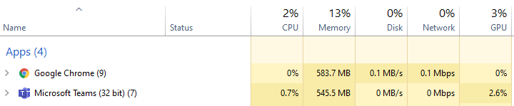
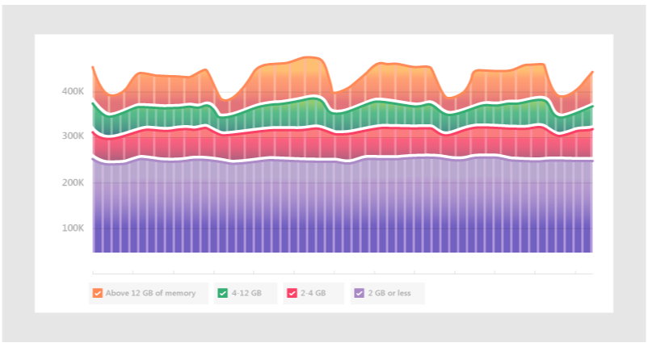
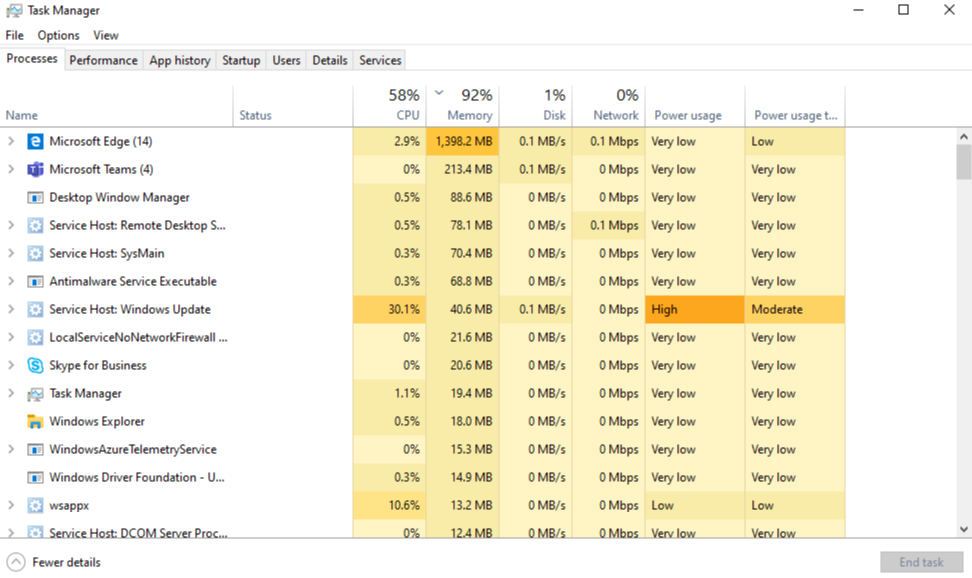
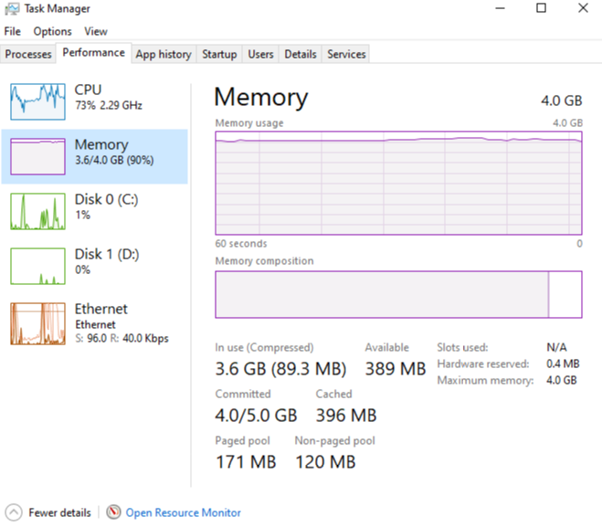

# How Microsoft Teams uses memory

Some Microsoft Teams users have questions about how Teams uses memory. This article describes how memory is used by Teams, and why the Teams desktop application (app) and the Teams web app do not prevent other apps and workloads on the same computer from having enough memory to run optimally. Teams is designed to use modern web technology. To achieve this, the Teams desktop client was developed on Electron, which uses Chromium for rendering. This is the same rendering engine behind many of today's most popular browsers, including Edge and Chrome.

## How Teams works

Teams being designed on Electron allows for faster development, and it also maintains parity between Teams versions across different operating systems (Windows, Mac, and Linux). This parity is possible because Electron and Chromium maintain a similar code base across all versions. Another advantage of this architecture is there's a similar memory usage profile between the Teams web app and the desktop version. Both the web app and the desktop versions use memory in a similar way to how a browser would use it. More information about Electron is available at [their Web site](https://electronjs.org/).

See [Chromium Memory Usage](https://www.chromium.org/developers/memory-usage-backgrounder) and [Key Concepts in Chrome Memory](https://chromium.googlesource.com/chromium/src.git/+/master/docs/memory/key_concepts.md) for more information.

The following image shows side-by-side memory usages of the Teams desktop app for Windows and the Teams Web app (in this example, running in Google Chrome).

## Memory usage in Teams

It is important to understand the *expected* behavior of Teams when it comes to system memory, and to know the symptoms of truly problematic system memory issues.

### Expected memory usage by Teams

Whether you're running the Teams desktop app or the Teams web app, Chromium detects how much system memory is available and utilizes enough of that memory to optimize the rendering experience. When other apps or services require system memory, Chromium gives up memory to those processes. Chromium tunes Teams memory usage on an ongoing basis in order to optimize Teams performance without impacting anything else currently running.

In this way, similar Chromium workloads can utilize varying amounts of memory, depending on the amount of system memory that is available.

The following graph depicts memory usage by Teams on four separate systems, each with different amounts of memory available. Each of the systems is processing similar workloads (same apps open and running).

When computers have more memory, Teams will use that memory. In systems where memory is scarce, Teams will use less.

### Symptoms of system memory issues

If you see one or more of the following symptoms on your computer, you could have a serious system memory issue:

- High memory use when multiple large applications are running simultaneously.
- Slow system performance or applications hanging.
- Sustained overall system memory usage of 90% or higher across all apps. With this amount of memory usage, Teams should be giving memory back to other apps and workloads. Sustained memory usage of 90% could mean Teams isn't giving memory back to the system, which indicates a problem.

The following images show examples of views in Task Manager when system memory usage is abnormally high.

