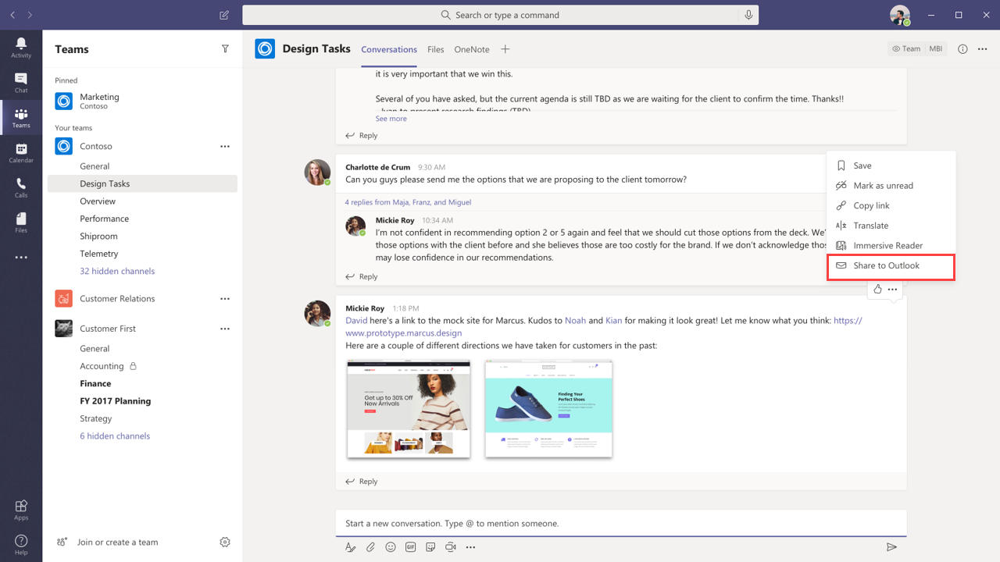
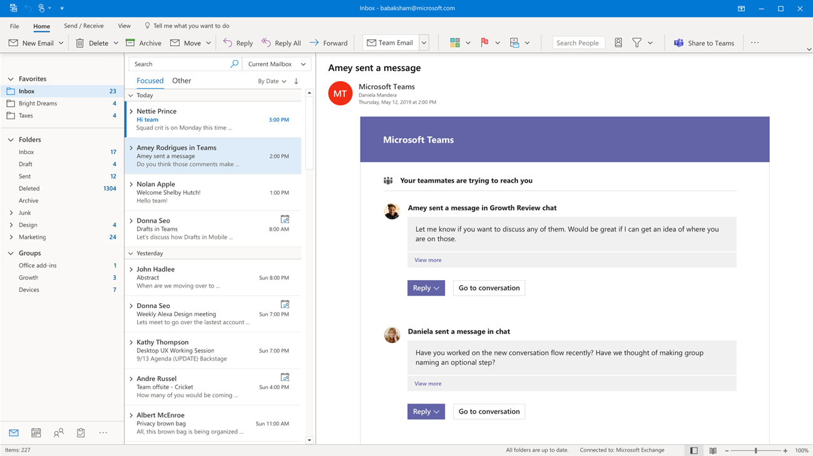
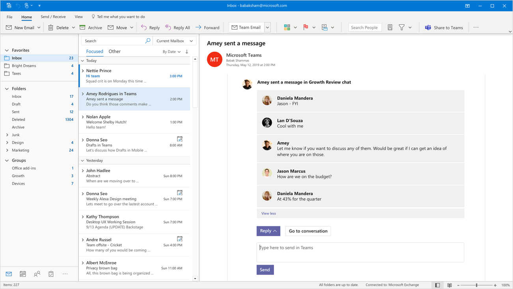

# Teams and Outlook email integration

Microsoft Teams includes features that make it easy for users in your organization to share information between email in Outlook and chat or channel conversations in Teams and to stay on top of missed conversations. This article gives you an overview of these features and the admin controls that apply.

## Share to Outlook

**Share to Outlook** lets users share a copy of a Teams conversation to an email in Outlook, without having to leave Teams. This feature is handy if users need to share conversations or status updates with users outside their immediate team or even your organization. Go to the top of the conversation in Teams, select **... More options**, and then select **Share to Outlook**.  To learn more, see [Share to Outlook from Teams](https://support.office.com/article/share-to-outlook-from-teams-f9dabbe9-9e9b-4e35-99dd-2eeeb67c4f6d).

To use this feature, Outlook on the web must be turned on for the user. If Outlook on the web is turned off, the **Share to Outlook** option isn't displayed in Teams for the user. For steps on how to turn on and turn off Outlook on the web, see [Enable or disable Outlook on the web for a mailbox](/exchange/recipients-in-exchange-online/manage-user-mailboxes/enable-or-disable-outlook-web-app).

## Actionable activity emails

Users automatically get actionable missed activity emails which help them to catch up on missed conversations in Teams. The missed activity emails show the latest replies from a conversation, including messages that were sent after the missed message, and users can click **Reply** to respond directly from within Outlook. To learn more, see [Reply to missed activity emails from Outlook](https://support.office.com/article/reply-to-missed-activity-emails-from-outlook-bc0cf587-db26-4946-aac7-8eebd84f1381). 

> [!NOTE]
> This feature isn't supported in Outlook for Mac or some older versions of Outlook for Windows. For more information, see [Actionable messages in Outlook and Office 365 Groups](/outlook/actionable-messages/).

You can use the [Set-OrganizationConfig](/powershell/module/exchange/organization/set-organizationconfig) cmdlet together with the **SmtpActionableMessagesEnabled** parameter to turn off actionable emails. By default, the **SmtpActionableMessagesEnabled** parameter is set to **true**. Setting the parameter to **false** turns off actionable email messages across Office 365. For Teams users, this means that the **Reply** option to respond directly in Outlook isn't available in missed activity emails. Instead, the missed activity emails include a **Reply in Teams** option for users to reply in Teams.

See also [Actionable messages in Outlook and Office 365 Groups](/outlook/actionable-messages/).
