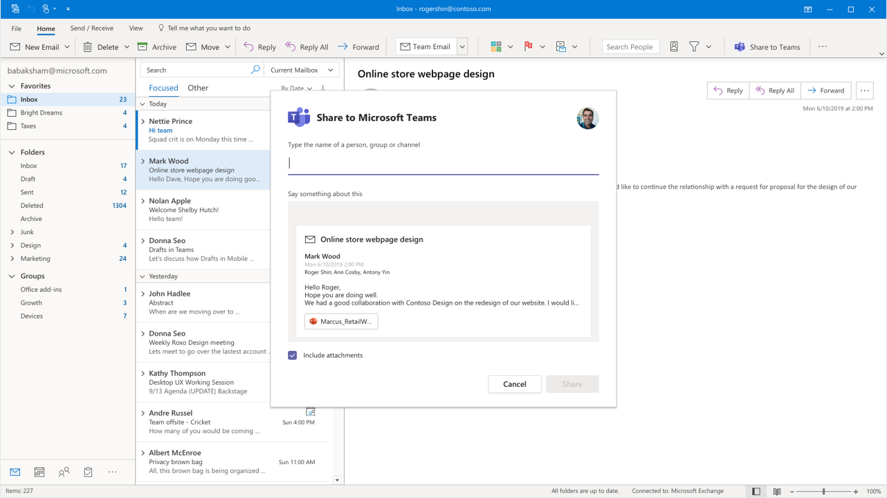

# Teams and Outlook email integration

Microsoft Teams includes features that make it easy for users in your organization to share information between email in Outlook and chat or channel conversations in Teams and to stay on top of missed conversations. This article gives you an overview of these features and admin controls that apply.

## Share to Teams

**Share to Teams** is an Outlook add-in that lets users share an email from Outlook (including attachments) along with a message to a chat or channel in Teams. A preview of the email is displayed in Teams and people in the chat or channel can open the email and attachments. To learn more, see \<link to end user article>.

The Share to Teams add-in is available for Outlook for Windows and Outlook on the web. It's automatically installed for users who have Teams and Office 2016 and ???   << **Is Mac and mobile supported?  What other versions of Office?**

If you want to limit the availability of the add-in to certain users in your organization, you can use the [Disable-App](https://docs.microsoft.com/powershell/module/exchange/mailboxes/disable-app?view=exchange-ps) cmdlet to turn off the add-in for specific users. When the add-in is turned off, it isn't displayed in Outlook for the user. Note that the add-in must be already installed before you can use the cmdlet to turn it off.

## Share to Outlook

**Share to Outlook** lets users share a copy of a Teams conversation to an email in Outlook, without having to leave Teams. Go to the top of the conversation in Teams, select **˙˙˙ More options**, and then select **Share to Outlook**.  To learn more, see \<link to end user article>.

To use this feature, Outlook on the web must be turned on for the user. If Outlook on the web is turned off, the **Share to Outlook** option isn't displayed in Teams for the user. For steps on how to turn on and turn off Outlook on the web, see [Enable or disable Outlook on the web for a mailbox](https://docs.microsoft.com/exchange/recipients-in-exchange-online/manage-user-mailboxes/enable-or-disable-outlook-web-app).

## Actionable activity emails

Users automatically get actionable missed activity emails which help them to catch up on missed conversations in Teams. The missed activity emails show the latest replies from a conversation, including messages that were sent after the missed message, and users can respond directly from within Outlook.

