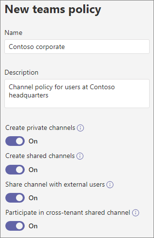

# Manage teams policies in Microsoft Teams

As an admin, you can use teams policies in Microsoft Teams to control what users in your organization can do in teams and channels. For example, you can set whether users are allowed to discover private teams in search results and in the team gallery and whether users are allowed to create private channels.

You manage teams policies in the Microsoft Teams admin center. You can use the global (Org-wide default) policy or create custom policies and assign them to users. Users in your organization will automatically get the global policy unless you create and assign a custom policy.

You can edit the global policy or create and assign a custom policy. If a user is assigned a custom policy, that policy applies to the user. If a user isn't assigned a custom policy, the global policy applies to the user. After you edit the global policy or assign a policy, it can take up to 24 hours for changes to take effect.

## Create a custom teams policy

1. In the left navigation of the Microsoft Teams admin center, go to **Teams** > **Teams policies**.
2. Click **Add**.
3. Enter a name and description for the policy.

    
4. Choose the settings that you want:

- [**Discover private teams**](https://docs.microsoft.com/MicrosoftTeams/teams-policies#discoverteams): Turn on this setting to allow users to discover private teams in search results and in the team gallery.
- [**Create private channels**](https://docs.microsoft.com/MicrosoftTeams/teams-policies#createchannels): Turn on this setting to allow users to create private channels.

5. Click **Save**.

## Edit a teams policy

You can edit the global policy or any custom policies that you create.

1. In the left navigation of the Microsoft Teams admin center, go to **Teams** > **Teams policies**.
2. Select the policy by clicking to the left of the policy name, and then click **Edit**.
3. Turn on or turn off the settings that you want, and then click **Save**.

## Assign a custom teams policy to users

You can use the Microsoft Teams admin center to assign a custom policy to one or more users or the Skype for Business PowerShell module to assign a custom policy to groups of users, such as a security group or distribution group.

### Assign a custom teams policy to a user

1. In the left navigation of the Microsoft Teams admin center, go to **Users**, and then click  the user.
2. Click **Policies**, and then next to **Assigned policies**, click **Edit**.
3. Under **Teams policies**, select the policy you want to assign, and then click **Save**.

To assign a custom teams policy to multiple users at a time, see [Edit Teams user settings in bulk](edit-user-settings-in-bulk.md).

Or, you can also do the following:

1. In the left navigation of the Microsoft Teams admin center, go to **Teams** > **Teams policies**.
2. Select the policy by clicking to the left of the policy name.
3. Select **Manage users**.
4. In the **Manage users** pane, search for the user by display name or by user name, select the name, and then select **Add**. Repeat this step for each user that you want to add.
5. When you're finished adding users, click **Save**.

### Assign a custom teams policy to users in a group

You may want to assign a custom teams policy to multiple users that you’ve already identified. For example, you may want to assign a policy to all users in a security group. You can do this by connecting to the Azure Active Directory PowerShell for Graph module and the Skype for Business PowerShell module. For more information about using PowerShell to manage Teams, see [Teams PowerShell Overview](teams-powershell-overview.md).

In this example, we assign a teams policy called Marketing Teams Policy to all users in the Contoso Marketing group.  

> [!NOTE]
> Make sure you first connect to the Azure Active Directory PowerShell for Graph module and Skype for Business PowerShell module by following the steps in [Connect to all Office 365 services in a single Windows PowerShell window](https://docs.microsoft.com/office365/enterprise/powershell/connect-to-all-office-365-services-in-a-single-windows-powershell-window).

Get the GroupObjectId of the particular group.
```
$group = Get-AzureADGroup -SearchString "Contoso Marketing"
```
Get the members of the specified group.
```
$members = Get-AzureADGroupMember -ObjectId $group.ObjectId -All $true | Where-Object {$_.ObjectType -eq "User"}
```
Assign all users in the group to a particular teams policy. In this example, it's Marketing Teams Policy.
```
$members | ForEach-Object { Grant-CsTeamsChannelsPolicy -PolicyName "Marketing Teams Policy" -Identity $_.EmailAddress}
``` 
Depending on the number of members in the group, this command may take several minutes to execute.

## Related topics

- [Manage discovery of private teams in Teams](manage-discovery-of-private-teams.md)
