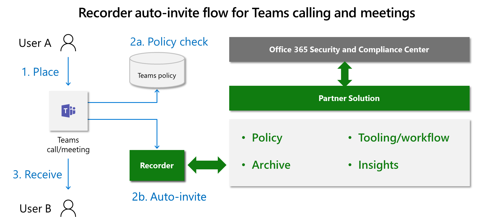
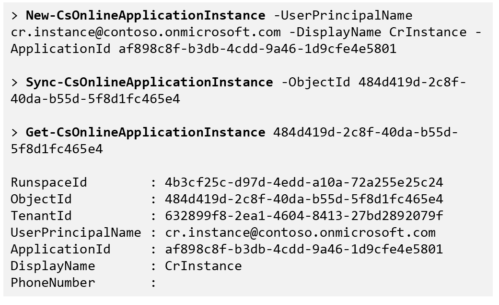
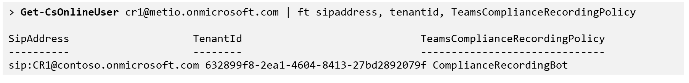
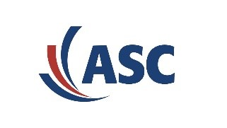
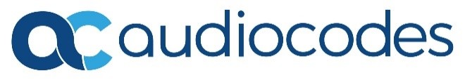
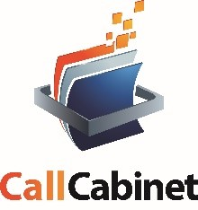
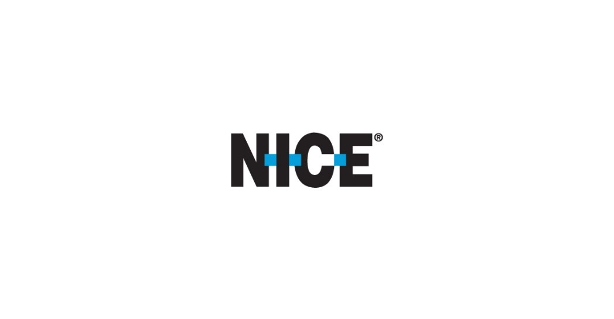
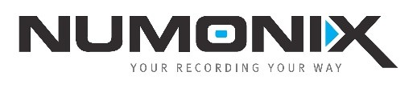
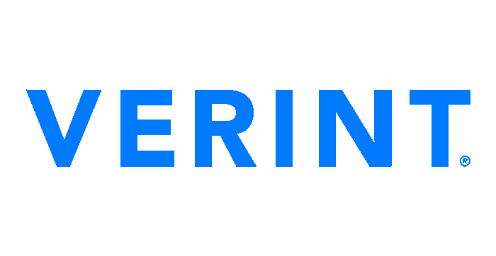

# Introduction to Teams policy-based recording for callings & meetings

Policy-based recording enables organizations that adopt Microsoft Teams for calling
and meetings to stipulate, using an administrative policy, when calls and
online meetings should be automatically recorded and captured for
subsequent processing and retention as required by relevant corporate or
regulatory policy.

Teams has been enhanced to support integration of
third-party recording solutions, including the platform
functionality, user experiences, and administrative interfaces needed to
provide an end-to-end solution for configuring, managing, recording,
storing, and analyzing Teams communications. This includes communications platform APIs and events for recording, which provides:

- Seamless, high-quality media capture across devices and all
    supported endpoints for audio, video, screen share, and chat.

- Support for interaction capture between Teams users and supported
    calling endpoints (Teams, Skype for Business, PSTN)

- New administrative policies for compliance recording, including
    integration with existing Teams administrative calling and
    meeting tools and policies

- Enabled for Teams users with a separate license

The compliance recording solution integration capabilities were also
reviewed at Ignite 2019 in the [Compliance
Recording and Microsoft Teams
session](https://myignite.techcommunity.microsoft.com/sessions/83184?source=sessions).

## Teams interaction recording overview

Interaction recording use cases can effectively be separated into four
primary categories of recording functionality – Convenience, Functional,
Organizational, and Lawful Intercept, as shown in the image:

Each of the categories entails different requirements for how recordings
are initiated, what is recorded, where recordings are stored, who is
notified, who controls access, and how retention is handled.

|                        | Convenience        | Functional         | Org - General      | Org - Regulated | Lawful Intercept   |
| ---------------------- | ------------------ | ------------------ | ------------------ | --------------- | ------------------ |
| Initiator              | User               | App/Solution       | Admin (system)     | Admin (system)  | LEA                |
| Target                 | Per-call / meeting | Per-call / meeting | Per-call / meeting | Per-user        | Per-endpoint / DID |
| Storage owner          | User               | App                | Admin              | Compliance      | LEA                |
| Notification required? | Yes                | Yes                | Yes                | Yes             | No                 |
| Access Owner           | User               | App                | Admin              | Compliance      | LEA                |
| Retention Policy?      | Optional           | Yes                | Yes                | Yes             | Yes                |

Teams provides various capabilities for
[convenient](https://docs.microsoft.com/microsoftteams/cloud-recording)
and functional recording for meetings and live events. Organizational
recording means enabling organizations adopting Teams for calling and
meetings to stipulate, by way of an administrative policy, when calls and online
meetings should be automatically recorded and captured for subsequent
processing and retention as required by relevant corporate or regulatory
policy. Users under this policy will be aware that their digital
interactions with Teams are being recorded but will not be able to
disable the recording and will not have access to the recording once the
interaction is complete. The recording becomes part of the
organizational archive available to compliance and legal personnel for
eDiscovery, legal hold, and other corporate retention uses.

## Example user needs

<table>
<thead>
<tr class="header">
<th><strong>Persona</strong></th>
<th><strong>Needs</strong></th>
</tr>
</thead>
<tbody>
<tr class="odd">
<td>Recorded users</td>
<td><ul>
<li>
Be notified when recording is in progress.
</li>
<li>
Be informed when policy and/or recorder error is causing changes in calling behavior.
</li>
</ul></td>
</tr>
<tr class="even">
<td>Communications admin</td>
<td><ul>
<li>
Understand why and how to apply / enforce recording policies to Teams users / endpoints.
</li>
<li>
Configure and maintain Teams recording policies for the organization.
</li>
<li>
Monitor and troubleshoot recording-related issues with Teams calls and meetings.
</li>
<li>
Support internal compliance officer with operational analytics on usage, quality, and reliability.
</li>
</ul></td>
</tr>
<tr class="odd">
<td>Compliance officer</td>
<td><ul>
<li>
Collect all Teams communications in the manner required to meet compliance obligations in appropriate regional boundaries.
</li>
<li>
Search for interactions based on communication-related metadata or interaction content. Common examples include:

<ul>
<li>
<strong>Metadata</strong> - Participants, time, direction, dialed number, origin number, Custom business data
</li>
<li>
<strong>Content</strong> – Transcription, sentiment, phonetics, related interactions
</li>
</ul></li>
<li>
Analyze and interact with collected communications, including the ability to monitor interactions as they are being collected.
</li>
<li>
Ensure security of collected communications and prevent tampering at all stages.
</li>
</ul></td>
</tr>
</tbody>
</table>

## Solution architecture overview

Compliance recording solutions are integrated with Teams as
shown in the following diagram:

## Recorder

The core component of the compliance recording solution is the recorder.
Recorders are built as scalable Azure-based services (bots) that
[leverage Microsoft’s communications
platform](https://docs.microsoft.com/graph/cloud-communications-concept-overview)
and register as applications with Microsoft Graph. The recorder provides
the direct interaction with the Teams calls and meetings
[communications platform
APIs](https://docs.microsoft.com/graph/api/resources/communications-api-overview?view=graph-rest-1.0)
and provides the endpoint for media ingestion.

A [sample compliance recorder application is
available](https://github.com/microsoftgraph/microsoft-graph-comms-samples/tree/a3943bafd73ce0df780c0e1ac3428e3de13a101f/Samples/BetaSamples/LocalMediaSamples/ComplianceRecordingBot)
that shows how to configure the bot, create the app instance and assign
the compliance policies. The sample also has examples on API usage for
recording specific interactions such as handling
[incoming
call](https://github.com/microsoftgraph/microsoft-graph-comms-samples/blob/a3943bafd73ce0df780c0e1ac3428e3de13a101f/Samples/BetaSamples/LocalMediaSamples/ComplianceRecordingBot/FrontEnd/Http/Controllers/PlatformCallController.cs#L199-L244) routing,
[changing recording
states](https://github.com/microsoftgraph/microsoft-graph-comms-samples/blob/a3943bafd73ce0df780c0e1ac3428e3de13a101f/Samples/BetaSamples/LocalMediaSamples/ComplianceRecordingBot/FrontEnd/Bot/CallHandler.cs#L135-L138),
and [removing the user who is being
recorded](https://github.com/microsoftgraph/microsoft-graph-comms-samples/blob/a3943bafd73ce0df780c0e1ac3428e3de13a101f/Samples/BetaSamples/LocalMediaSamples/ComplianceRecordingBot/FrontEnd/Bot/CallHandler.cs#L121-L126).
Graph documentation on the specific APIs can be found here for
[updateRecordingStatus](https://docs.microsoft.com/graph/api/call-updaterecordingstatus?view=graph-rest-1.0&tabs=http)
and
[incomingContext](https://docs.microsoft.com/graph/api/resources/incomingcontext?view=graph-rest-1.0).

The exact implementation of the recorder service will vary by partner
but must be designed to support multiple recorders in order to achieve
high availability and geographical distribution of deployment to reduce
latency from Teams to the recorder. In addition, it is expected that
Recorders themselves be designed with resiliency and redundancy in mind.

Partners must confirm the minimum required release version of the
Microsoft Graph communications APIs and SDKs with Microsoft before
submitting their solution for certification to ensure that all
requirements of compliance recording integration are supported.

Two specific requirements that are fundamental for compliance recording
scenario are:

- Recorder bot must be deployed in Azure

- Recorder bot must run on a Windows VM in Azure

The Azure and Windows VM requirements only apply to the Teams Bot
component, which means that a partner may implement the rest of the
platform of their choice provided they can meet the relevant performance
and functional requirements for compliance recording.

## Compliance recording policy assignment and provisioning

IT Administrators can determine which users are to be recorded and which
recorder will be used for each user, by creating and assigning
compliance recording policies. Recorders are automatically invited to
participate in conversations based on the configuration of these
policies when a communication interaction takes place. Compliance
recording policies are managed using [Microsoft
Powershell](https://docs.microsoft.com/microsoftteams/teams-powershell-overview)
and can be applied at the tenant and per-user level for each
organization. You can find more information on Microsoft Docs for
[Meeting
policies](https://docs.microsoft.com/microsoftteams/meeting-policies-in-teams)
and [calling
policies](https://docs.microsoft.com/microsoftteams/teams-calling-policy).

Register a compliance recorder for an organization.

1. Create an application instance in your tenant.

2. Create a Compliance Recording policy

3. Assign the Compliance Recording policy to a user:

[https://docs.microsoft.com/en-us/powershell/module/skype/set-csteamscompliancerecordingpolicy?view=skype-ps](https://docs.microsoft.com/powershell/module/skype/set-csteamscompliancerecordingpolicy?view=skype-ps)

## User experiences

Support for notifications is enabled using the Teams client experiences. The experiences can be either visual or audio.

**Teams clients - visual notice**
- Desktop/web
- Mobile (iOS/Android)
- Teams phones
- Teams rooms

**Other endpoints - audio notice**
- SIP phones
- Skype for Business
- Audio conferencing
- PSTN callers

## Compliance recording for Teams certification programs

In addition to publishing publicly-available APIs allowing partners to develop and integrate CCaaS solutions with Teams, we have developed the compliance recording for Microsoft Teams certification program to provide customers with the assurance that each participating partner’s solution has been tested and verified to provide the quality, compatibility and reliability they expect from Microsoft solutions.  

The following partners are in the process of certifying their solution for Microsoft Teams.  

| Partner | Solution website |
|--------------|--------|
| |https://www.asc.de/english/ASC_Recording_Insights_for_Microsoft_Teams.html |
||https://www.audiocodes.com/solutions-products/products/products-for-microsoft-365/smarttap-360-recording |
||https://www.callcabinet.com/compliance-microsoft-teams-call-recording/ |
||https://www.niceactimize.com/compliance/ms-teams-recording.html |
||https://numonix.cloud    |
||https://hubs.ly/H0qtN7Q0  |
||https://www.verba.com/solutions/microsoft-teams-recording/ |
|||