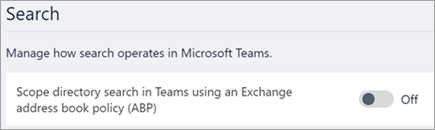

# Use Microsoft Teams scoped directory search

Microsoft Teams scoped directory search allows organizations to create virtual boundaries that control how users can find and communicate with other users in their organization. 

Microsoft Teams lets organizations provide custom views of the directory to their users. Microsoft Teams uses [Exchange address book policies](https://docs.microsoft.com/exchange/address-books/address-book-policies/address-book-policies) to support these custom views. Once the policies are enabled, the results returned by searches for other users (for example, to initiate a chat or to add members to a team) will be scoped according to the configured policies. Users will not be able to search or discover teams when scoped search is in effect. 

## When should you use scoped directory searches?

Scenarios that benefit from scoped directory searches are similar to address book policy scenarios. For example, you may want to use scoped directory search in the following situations:

- Your organization has multiple companies within its tenant that you want to keep separate. 
- Your school wants to limit chats between faculty and students. 
 
To learn how to use address book policies, read [Address book policies in Exchange Online](https://docs.microsoft.com/exchange/address-books/address-book-policies/address-book-policies).

> [!IMPORTANT]
> Address book policies provide only a virtual separation of users from directory perspective. Users can still initiate communications with others by providing complete email addresses. It is also important to note that any user data that had already been cached, prior to the enforcement of new or updated address book policies, will remain available to users for up to 30 days.

## Turn on scoped directory search

1. Use address book policies to configure your organization into virtual subgroups. For more information, see [Procedures for address book policies](https://docs.microsoft.com/exchange/address-books/address-book-policies/address-book-policies).

2. In the Microsoft Teams admin center, select **Org-wide settings** > **Teams settings**.

3. Under **Search**, next to **Scope directory search in Teams using an Exchange address book policy (APB)**, turn the toggle **On**.

    

> [!NOTE]
> Hybrid configurations (Teams with Exchange on-premises) do not support scoped search mode. 

