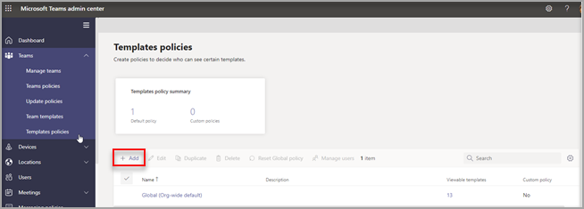
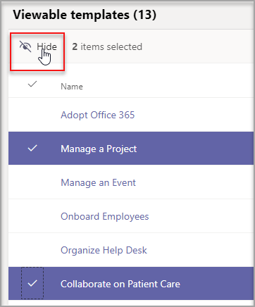
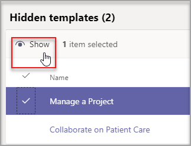
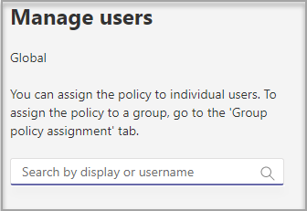
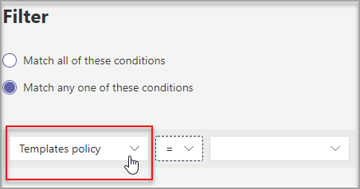

# Manage team templates in the admin center

Manage the team templates that your end users see by creating templates policies in the admin center. Within each templates policy, you can designate which templates are shown or hidden.
Assign different users to different templates policies so that your users view only the subset of team templates specified.

Watch this short video to learn how to manage templates policies.

> [!VIDEO https://www.microsoft.com/videoplayer/embed/RWyXL9]

## Create templates policies and assign available templates

1. Sign in to the Teams admin center.

2. Go to **Teams** > **Templates policies**.

3. Choose **Add**.

    

1. Give the policy a name and add a short description.

2. In the **Viewable templates** list, select the templates you want to hide, and then select **Hide**.

    

    You can see the templates you've chosen to hide in the **Hidden templates** list.

1. To unhide certain templates, go the **Hidden templates** list.

2. Select the templates to unhide, and then select **Show**.

   

   The selected templates will appear in the **Viewable templates** list.
3. Choose **Save**.

   Your new templates policy is displayed in the **Templates policies** list.

## Assign users to a templates policy

Users assigned to a policy will only be able to view the viewable templates within that policy.

1. From **Templates policies**, select a policy, and then select **Manage users**.

2. Type the users to assign to this policy.

   

3. Select **Apply**.

> [!Note]
> It might take up to 24 hours for your new policy to take effect for end users.

## Size limits for templates policies

You can hide a max of 100 templates per policy. The **Hide** button is disabled if the given policy already has 100 templates hidden.

## Frequently asked questions

**Q: Can I batch assign users to templates policies?**
  
A: Yes, we support batch assignment for template policy in PowerShell. The policy type for this action is TeamsTemplatePermissionPolicy. 

[Learn more](/powershell/module/teams/new-csbatchpolicyassignmentoperation)

+++++

Yes, you can use PowerShell to assign a templates policy to large sets of users at a time. To do this, use the [New-CsBatchPolicyAssignmentOperation](/powershell/module/teams/new-csbatchpolicyassignmentoperation) cmdlet together with TeamsTemplatePermissionPolicy as the ```PolicyType``` to submit a batch of users and the templates policy that you want to assign. For example:

```powershell
New-CsBatchPolicyAssignmentOperation -OperationName <Any operation name> -PolicyType TeamsTemplatePermissionPolicy -PolicyName <policy name> -Identity <users identity | list of user identities>
```

The assignments are processed as a background operation and an operation ID is generated for each batch. You can then use the [Get-CsBatchPolicyAssignmentOperation](/powershell/module/teams/get-csbatchpolicyassignmentoperation) cmdlet to track the progress and status of the assignments in a batch.

To learn more, see [Assign a policy to a batch of users](assign-policies-users-and-groups.md#assign-a-policy-to-a-batch-of-users) and [Assign policies in Teams](policy-assignment-overview.md).

**Q: Can groups be assigned to templates policies?**

A: Currently, no. This functionality will be available in the future.

**Q: If a new template is created, will the template be included in my policies?**

A: Any new templates will be visible by default. You can choose to hide the template in the admin center in the Templates Policies section.

**Q: What happens if a template is deleted?**

A: Any deleted templates will no longer be present in any templates policies.

**Q: Can I assign multiple users to a templates policy in the Teams admin center?**

A: Yes.

1. In the Teams admin center, go to **Users** > **Manage users**.
1. In the list of users, select the users you want to assign to the templates policy.
1. Select **Edit settings**, and then under **Templates policy**, choose the policy you want to assign.
1. Choose **Apply**.

[Learn more](./assign-policies-users-and-groups.md#assign-a-policy-to-a-batch-of-users).

**Q: How do I view all users assigned to a specific policy?**

A: In the Teams admin center:

1. Go to **Users** > **Manage users**.
2. Select **Filter**, and then set a filter for the templates policy.
3. Choose **Apply**.



**Q: Can I manage templates policies via PowerShell?**

A: No, managing templates in PowerShell isn't supported.

**Q: Are templates policies applicable to EDU?**

A: No, templates policies for EDU aren't supported.

## Related articles

- [Get started with team templates in the admin center](./get-started-with-teams-templates-in-the-admin-console.md)

- [Create a custom team template](./create-a-team-template.md)

- [Create a template from an existing team](./create-template-from-existing-team.md)

- [Create a team template from an existing team template](./create-template-from-existing-template.md)

- [Assign policies to your users in Microsoft Teams - Microsoft Teams \| Microsoft Docs](./policy-assignment-overview.md)

- [New-CsBatchPolicyAssignmentOperation](/powershell/module/teams/new-csbatchpolicyassignmentoperation)
