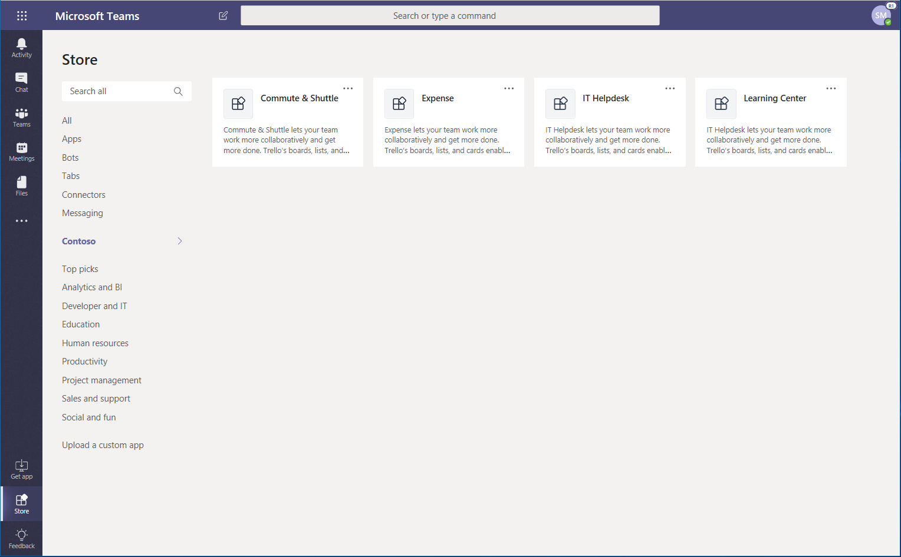
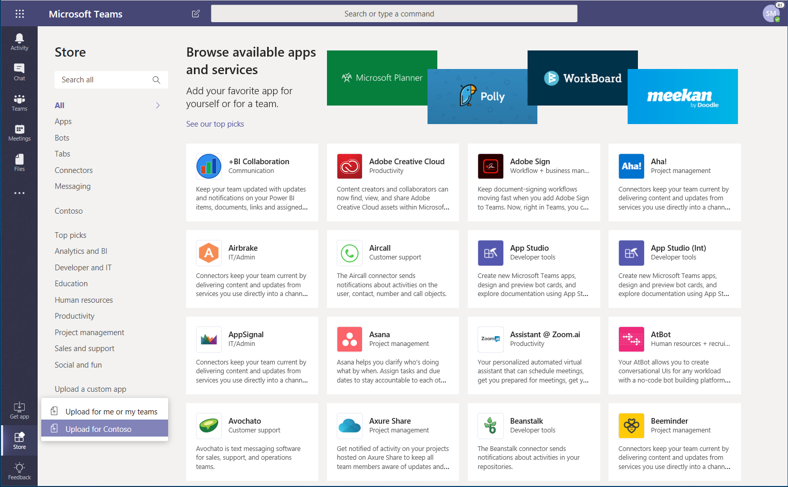
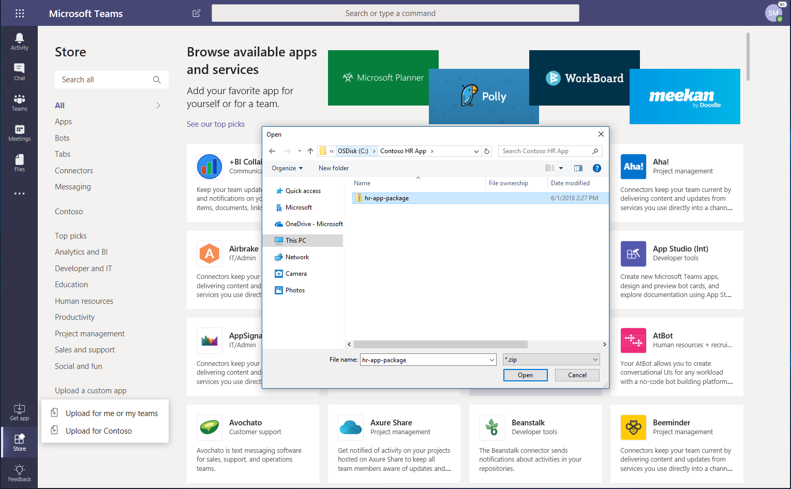
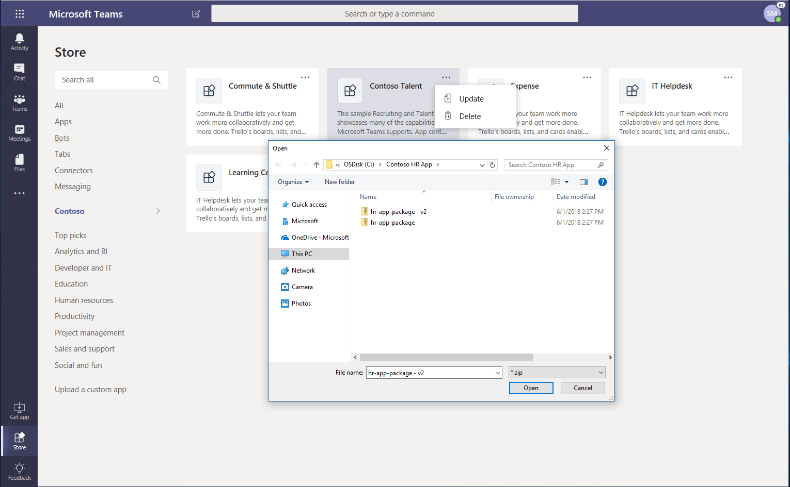
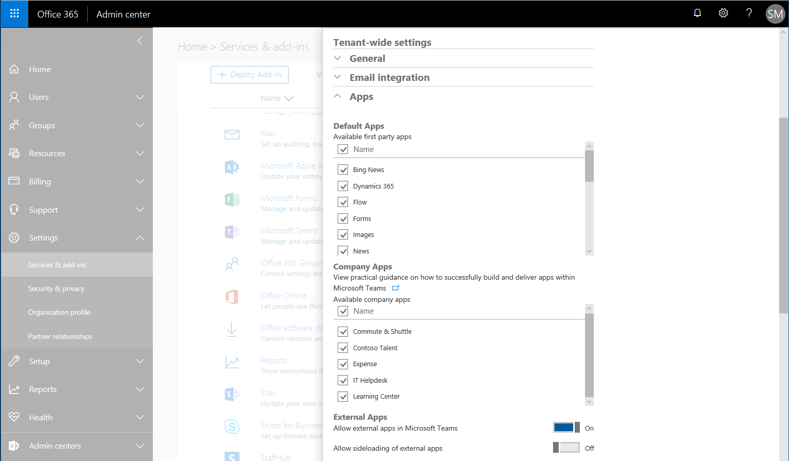

Publish apps in the Microsoft Teams Tenant Apps Catalog
=======================================================

You can use the Microsoft Teams Tenant Apps Catalog to test and distribute line-of-business applications to your organization.

The Teams Tenant Apps Catalog lets you distribute line-of-business applications that were built specifically for your organization and that you rely on to complete critical business functions.

To publish apps for your organization, sign in to your Teams client using an account with the global admin or teams service admin roles and then follow the instructions below.

## Publish an app in the Tenant Apps Catalog from the Teams client

> [!NOTE]
> You need to be signed in to the Microsoft Teams client with an account that has either the global admin or teams service admin role enabled to publish apps for your organization. Learn more about [using administrator roles to manage Teams](https://docs.microsoft.com/MicrosoftTeams/using-admin-roles).

### Get a Teams app package

A Teams app package is created by using [Teams App Studio](https://docs.microsoft.com/microsoftteams/platform/get-started/get-started-app-studio). Once you have the app package, you can add it to the enterprise app catalog. While all users in the tenant can view the app catalog, only global admins and teams service admins have the ability to publish and manage it.

### Go to the Tenant Apps Catalog

Start the Microsoft Teams client and sign in using your global or teams service admin credentials. From the Microsoft Teams Store, select the new section named for your specific organization (in this example, Contoso). Users in your organization can view apps in the catalog and install them for teams of which they are a member.

### Add an app to the Tenant Apps Catalog

1. From the store, select **Upload a custom app** > **Upload for Contoso**.

    

    (You can also choose **Upload for me or my teams**, which is called *sideloading*. Sideloading makes the app available only to your teams or to teams you select.)

2. Navigate to the app package and select it, and then click **Open**.

    

When you go back to your Tenant Apps Catalog, the new enterprise app will be there. Remember, only you and members of your organization have access to this app catalog.

### Update an app in the Tenant Apps Catalog

1. From your Tenant Apps Catalog, select “**…**” on the top right of the app you want to update.

2. Navigate to the updated app package and select it, and then click **Open**.

    

The app will be revised to version 2.0. You can also delete the app for your entire company from this menu.

## Use the Office 365 admin portal to manage the Tenant Apps Catalog

If you have apps that need bug fixes, you can temporarily disable apps through the Office 365 admin portal. Select **Settings** > **Services & add-ins** > **Microsoft Teams**. In addition to previous settings, there is now a section dedicated to your company's apps. You can choose which apps you want to enable or disable.

Disabling an app will block users from interacting with the app, without deleting the app entirely. These controls give you additional flexibility and control when managing apps in your enterprise.
