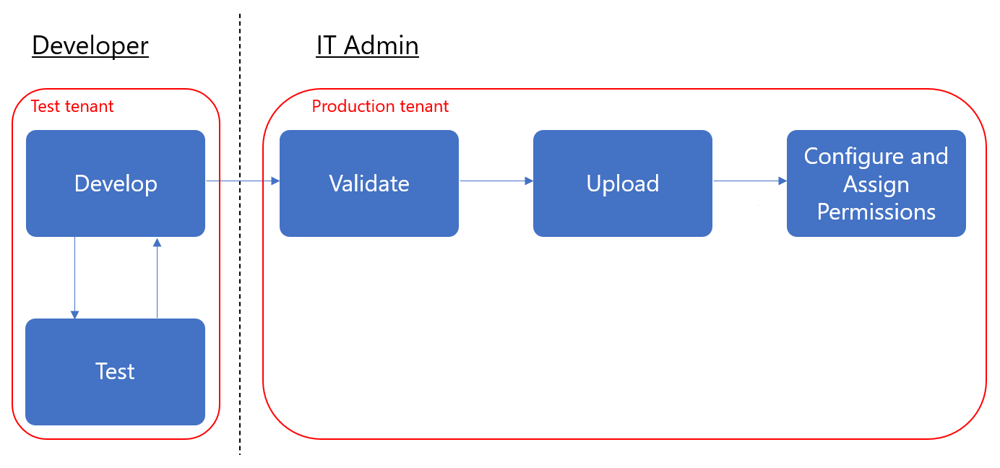
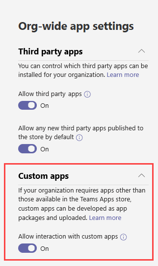
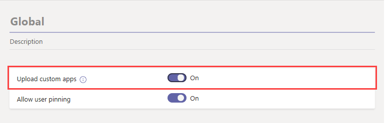
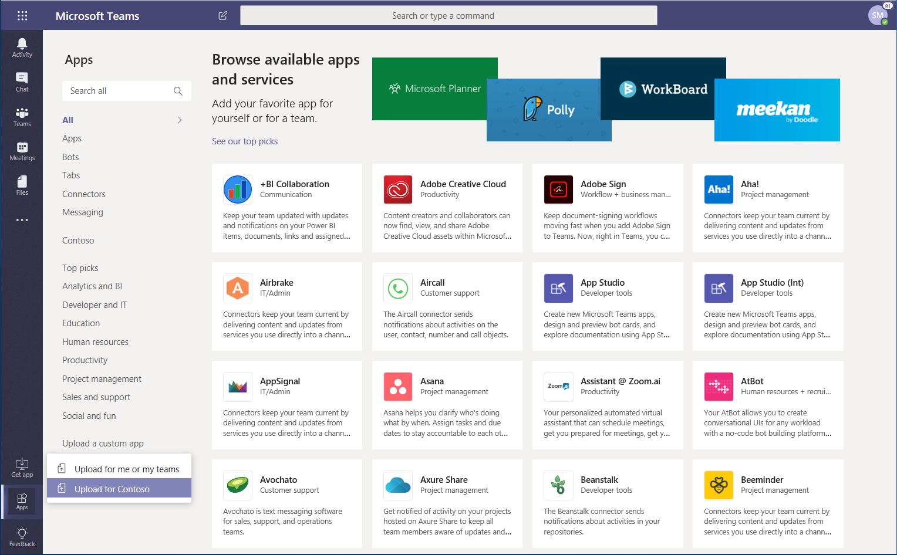
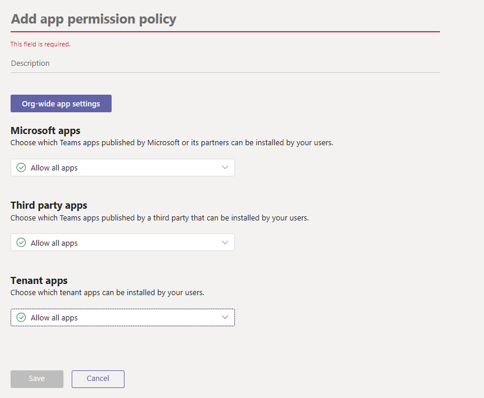
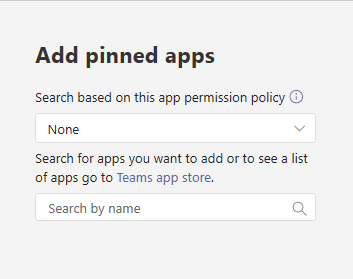
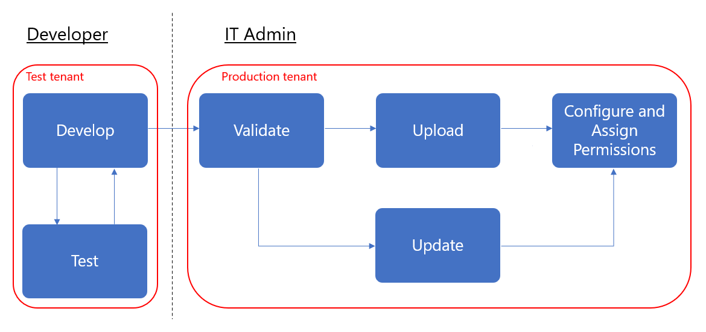
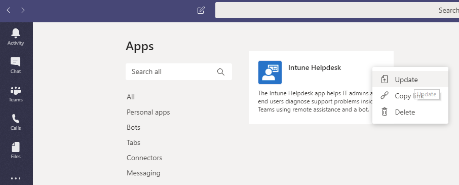

# Troubleshoot Teams installation and update issues

This article provides guidance for how to diagnose and troubleshoot installation and update issues for the Teams desktop client app running on Windows.

## Check whether Teams is updated successfully

Follow these steps to check whether a Teams update is successfully installed.

1. In Teams, select your profile picture, and then click **About** > **Version**.
2. On the same menu, click **Check for updates**.
3. Wait for the banner at the top of the app to indicate that a “refresh” of Teams is needed. The link should be shown about a minute later as this process downloads the new version of Teams. The banner also lets you know if you’re already running the latest version in which case, no update is necessary.
4. Click the refresh link in the banner.
5. Wait until Teams restarts, and then repeat step 1 to see whether the app is updated.
6. If you see a failure message or if the version number is the same as step 1, the update process failed.

## Troubleshoot installation and update issues

### Troubleshoot installation issues

During the installation phase, the Teams installer logs the sequence of events to %LocalAppData%\SquirrelTemp\SquirrelSetup.log. The first thing to look at is an error message or a call stack near the end of the log. Note that call stacks at the beginning of the log may not mean that an installation issue exists. It can be easier to compare your log against the log from a successful installation (even on another machine) to see what's expected.

If SquirrelSetup.log doesn't indicate the issue or if you need more information about the issue, see [Collect logs](#collect-logs) to get more comprehensive system logs.

### Troubleshoot update issues

When Teams is successfully installed, the log location switches from %LocalAppData%\SquirrelTemp to %AppData%\Microsoft\Teams. At this location, there are two log files of interest, SquirrelSetup.log and logs.txt.

- The SquirrelSetup.log file at this location is written by Update.exe, which is an executable for servicing the Teams app. 
- The Logs.txt file is used by the Teams app (specifically Teams.exe) to record significant application events. It will likely contain failure information.

These log files contain personally identifiable information (PII) and so they're not sent to Microsoft.

Teams can automatically start the update process (depending on the policy) or users can manually check for updates by going to their profile picture > **Check for updates**. Both methods use the following sequence of events.

1. **Check for updates**. Teams makes a web request and includes the current app version and deployment ring information. The goal of this step is to get the download link. A failure at this step is logged in Logs.txt.
2. **Download update**. Teams downloads the update by using the download link obtained from step 1. When the download is complete, Teams calls Update.exe to stage the download. A download failure is also logged in Logs.txt.
3. **Stage the update**. The downloaded content is verified and unpacked into an intermediate folder, %LocalAppData%\Microsoft\Teams\stage), which is done by Update.exe. Failures at this step are logged in SquirrelTemp.log.
4. **Install the update**. There are multiple ways to start Teams. The system automatically starts Teams when a user logs in or you can start Teams through a shortcut. In this step, Update.exe checks for the presence of the staging directory, verifies the content again, and performs file operations to un-stage the app. The old application directory in %LocalAppData%\Microsoft\Teams\current is backed up to %LocalAppData%\Microsoft\Teams\previous and the stage folder is renamed to "current". Failures at this step are logged in SquirrelTemp.log.

If SquirrelTemp.log or Logs.txt don't contain sufficient information to troubleshoot the issue, go to [Collect logs](#collect-logs) to get more comprehensive system logs.

## Work with logs

### Collect logs

### Analyze logs

This article provides end-to-end guidance for how to take your Teams app from development to deployment. This guidance focuses on the Teams aspects of the app and is intended for IT pros. For more information on developing Teams apps, see <a href="https://docs.microsoft.com/microsoftteams/platform" target="_blank">here</a>.

## Getting started

To create and manage line-of-business (LOB) apps in Teams, you’ll need two tenants: a test tenant for development and a production tenant.

> [!NOTE]
> If you don’t already have a test tenant, you can quickly create one and populate it with test data using the Office 365 Developer Program. <a href="https://developer.microsoft.com/office/dev-program" target="_blank">Learn more here</a>.

## Step 1: Develop and test

### Create test users

Make sure that your developers, whether in-house or external, have accounts in your test tenant. <a href="https://docs.microsoft.com/office365/admin/add-users/add-users" target="_blank">Learn more about adding users</a>.

### Allow custom apps in the test tenant

To give developers the access they need for testing, allow all users in the test tenant to upload custom apps (also known as sideloading). This lets developers upload a custom app to be used personally or across the test tenant without having to submit the app to the Teams apps store. Uploading a custom app lets developers test an app before you distribute it more widely.

To allow users to upload custom apps, follow these steps:

1. Turn on the **Allow interaction with custom apps** org-wide setting. To do this:
    1. In the left navigation of the <a href="https://admin.teams.microsoft.com/" target="_blank">Microsoft Teams admin center</a>, go to **Teams apps** > **Permission policies**, and then click **Org-wide settings**.
    2. Under **Custom apps**, turn on **Allow interaction with custom apps**, and then click **Save**.

    

2. Turn on the **Upload custom apps** setting in the global app setup policy. To do this:
    1. In the left navigation of the <a href="https://admin.teams.microsoft.com/" target="_blank">Microsoft Teams admin center</a>, go to **Teams apps** > **Setup policies**, and then click the **Global (Org-wide default)** policy.
    2. Turn on **Upload custom apps**, and then click **Save**.

    

> [!NOTE]
> There's also an upload custom app setting at the team level. By default this setting is on. However, if developers are unable to upload a custom app to a team, check the setting by following the steps <a href="https://docs.microsoft.com/microsoftteams/teams-custom-app-policies-and-settings#configure-the-team-custom-app-setting" target="_blank">here</a>.

### Create your app

Developers should now have what they need to create your app. See <a href="https://docs.microsoft.com/microsoftteams/platform" target="_blank">here</a> for guidance on that.

## Step 2: Validate in production

### Get the app package

When the app is ready for use in production, the developer should produce an app package. They can use <a href="https://docs.microsoft.com/microsoftteams/platform/get-started/get-started-app-studio" target="_blank">App Studio</a> for that. They'll send you the file in .zip format.

Microsoft uses <a href="https://docs.microsoft.com/microsoftteams/platform/publishing/office-store-approval" target="_blank">these guidelines</a> to ensure apps comply with the quality and security standards of the global Teams apps store.

### Allow trusted users to upload custom apps in the production tenant

To validate that the app is working correctly in your production tenant, you need to allow yourself and/or trusted users in your organization to upload custom apps.  Much like in the earlier <a href="https://docs.microsoft.com/microsoftteams/manage-your-lob-apps#allow-custom-apps-in-the-test-tenant" target="_blank">step</a>, you use app setup policies to do this.

> [!NOTE]
> If you’re uncomfortable with uploading the app to your production tenant for validation, even for yourself or trusted users, you can skip this step and follow steps 3 and 4 to upload the unvalidated app to your tenant apps store. Then, restrict access to that app to only yourself and users you trust. These users can then get the app from the tenant apps store to perform validation. After the app is validated, use the same permission policies to open access and roll the app out for production use.

To allow trusted users to upload custom apps, follow these steps:

1. Turn on the **Allow interaction with custom apps** org-wide setting. To do this:
    1. In the left navigation of the <a href="https://admin.teams.microsoft.com/" target="_blank">Microsoft Teams admin center</a>, go to **Teams apps** > **Permission policies**, and then click **Org-wide settings**.
    2. Under **Custom apps**, turn on **Allow interaction with custom apps**, and then click **Save**.
2. Turn off the **Upload custom apps** setting in the global app setup policy. To do this:
    1. In the left navigation of the <a href="https://admin.teams.microsoft.com/" target="_blank">Microsoft Teams admin center</a>, go to **Teams apps** > **Setup policies**, and then click the **Global (Org-wide default)** policy.
    2. Turn off **Upload custom apps**, and then click **Save**.
3. Create a new app setup policy that allows uploading custom apps and assign it to your set of trusted users. To do this:
    1. In the left navigation of the <a href="https://admin.teams.microsoft.com/" target="_blank">Microsoft Teams admin center</a>, go to **Teams apps** > **Setup policies**, and then click the **Add**. Give the new policy a name and description, turn on **Upload custom apps**, and then click **Save**.
    2. Select the new policy you created, and then click **Manage users**. Search for a user, click **Add**, and then click **Apply**. Repeat this step to assign the policy to all your trusted users.

        

    These users can now upload the app manifest to validate that the app is working correctly in the production tenant.

## Step 3: Upload to the Tenant Apps Catalog

To make the app available to users in the tenant apps store, upload the app. You can do this using the Teams desktop client. Follow the steps <a href="https://docs.microsoft.com/microsoftteams/tenant-apps-catalog-teams#go-to-the-tenant-apps-catalog" target="_blank">here</a>.

## Step 4: Configure and assign permissions

### Control access to the app

By default, all users have access to this app in the the Teams apps store. To restrict and control who has permission to use the app, you can create and assign a new app permission policy. Follow the steps <a href="https://docs.microsoft.com/microsoftteams/teams-app-permission-policies#create-a-custom-app-permission-policy" target="_blank">here</a>.

### Pin the app for users to discover

By default, for users to find this app they would have to go to Teams apps store and browse or search for it. To make it easy for users to get to the app, you can pin the app to the app bar in Teams. To do this, create a new app setup policy and assign it to users. Follow the steps  <a href="https://docs.microsoft.com/microsoftteams/teams-app-setup-policies#create-a-custom-app-setup-policy" target="_blank">here</a>.

## Step 5: Update the app

To update an app, developers should continue to follow [step 1](#step-1-develop-and-test) and [step 2](#step-2-validate-in-production).

You can update the app through the Tenant Apps Catalog. To do this, in the Teams desktop client, go to **Apps** > **Built for &lt;Your tenant name&gt;**, click **…** in the upper-right corner of the app, and then click **Update**. Doing this replaces the existing app in the Tenant Apps Catalog, and all permission policies and setup policies remain enforced for the updated app. 

