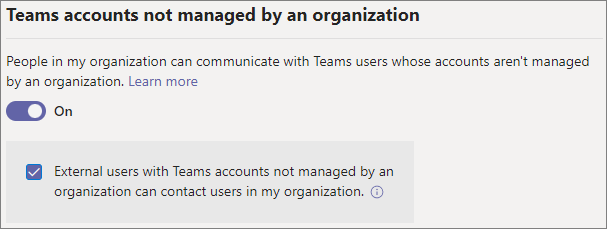

# Manage external meetings and chat

With the *external access* feature in Teams, you can allow people in your organization to chat and meet with people outside the organization. You can configure external access with:

- Other Microsoft 365 organizations

- Teams users not managed by an organization

- Skype users

Note that these external users won't have access to your teams, sites, or other Microsoft 365 resources. If you want people from other organizations to have access to your teams and channels, see [Collaborate with guests in a team](/microsoft-365/solutions/collaborate-as-team) and [Collaborate with external participants in a shared channel](/microsoft-365/solutions/collaborate-teams-direct-connect).

Users in your organization can accept or block incoming chats from people outside the organization. For details, see [Accept or block people outside your org who send you a chat](https://support.microsoft.com/office/4b5b917d-895a-4379-a204-a111b2e24f41).

Once you have configured external access, you can specify which users in your organization can use each type of external access. For details, see [Limit external meetings and chat to specific users](limit-external-meetings-chat-to-specific-users.md). Only these users can use the external access options that you configure here.

> [!NOTE]
> Teams users can add apps when they host meetings or chats with people from other organizations. They can also use apps shared by people in other organizations when they join meetings or chats hosted by those organizations. The data policies of the hosting user's organization, as well as the data sharing practices of any third-party apps shared by that user's organization, are applied.

## Specify trusted Microsoft 365 organizations

For meetings and chat with other Microsoft 365 organizations, you can specify which domains you want to trust. By default, all external domains are allowed. You can allow or block certain domains in order to define which organizations your organization trusts for external meetings and chat.

In order to chat and meet with people in external domains, those organizations must trust your domain as well.

You can specify which domains are allowed or which domains are blocked. If you specify blocked domains, all other domains will be allowed; if you specify allowed domains, all other domains will be blocked. There are four scenarios for configuring trusted organizations:

- **Allow all external domains**: This is the default setting in Teams, and it lets people in your organization find, call, chat, and set up meetings with people external to your organization in any domain.

    In this scenario, your users can communicate with all external domains that are running Teams or Skype for Business so long as the other organization also supports external communications.
    
- **Allow only specific external domains**: By adding domains to an **Allow** list, you limit external access to only the allowed domains. Once you set up a list of allowed domains, all other domains will be blocked.

- **Block specific domains** - By adding domains to a **Block** list, you can communicate with all external domains *except* the ones you've blocked.  Once you set up a list of blocked domains, all other domains will be allowed.

- **Block all external domains** - Prevents people in your organization from finding, calling, chatting, and setting up meetings with people external to your organization in any domain.

> [!NOTE]
> People from blocked domains can still join meetings anonymously if anonymous access is allowed. To learn more, see [Manage meeting settings in Teams](meeting-settings-in-teams.md).

To allow specific domains

1. In the Teams admin center, go to **Users** > **External access**.

2. Under **Choose which domains your users have access to**, choose **Allow only specific external domains**.

3. Select **Allow domains**.

4. In the **Domain** box, type the domain that you want to allow and then click **Done**.

5. If you want to allow another domain, click **Add a domain**.

6. Click **Save**.

To block specific domains

1. In the Teams admin center, go to **Users** > **External access**.

2. Under **Choose which domains your users have access to**, choose **Block only specific external domains**.

3. Select **Block domains**.

4. In the **Domain** box, type the domain that you want to allow and then click **Done**.

5. If you want to block another domain, click **Add a domain**.

6. Click **Save**.

### Diagnostic Tool

If you're an administrator, you can use the following diagnostic tool to validate if a Teams user can communicate with a Teams user in a trusted organization:

1. Select **Run Tests** below, which will populate the diagnostic in the Microsoft 365 Admin Center. 

   > [!div class="nextstepaction"]
   > [Run Tests: Teams Trusted Organizations](https://aka.ms/TeamsFederationDiag)

2. In the Run diagnostic pane, enter the **Session Initiation Protocol (SIP) Address** and the **Federated tenant's domain name**, and then select **Run Tests**.

3. The tests will return the best next steps to address any setting or policy configurations that are preventing communication with the external user.

## Skype for Business Online

If you want chats and calls to arrive in the user's Skype for Business client, configure your users to be in any mode other than TeamsOnly.

## Manage chat with external Teams users not managed by an organization

> [!NOTE]
> The capabilities discussed in this section aren't available in GCC, GCC High, or DOD deployments, or in private cloud environments.

You can choose to enable or disable communications with external unmanaged Teams users (those not managed by an organization, such as Microsoft Teams (free)). If enabled, you can also control if people with unmanaged Teams accounts can start chats with people in your organization.

To allow chat with unmanaged Teams accounts
1. In the Teams admin center, go to **Users** > **External access**.

1. Turn on the **People in my organization can communicate with Teams users whose accounts aren't managed by an organization** setting.

1. If you want to allow external users to start the conversation, select the **External users with Teams accounts not managed by an organization can contact users in my organization** checkbox.

1. Select **Save**.

Note that if **External users with Teams accounts not managed by an organization can contact users in my organization** is turned off, unmanaged Teams users will not be able to search by email address to find people in your organization. All communications with unmanaged Teams users must be initiated by people in your organization.

To prevent chat with unmanaged Teams accounts
1. In the Teams admin center, go to **Users** > **External access**.

1. Turn off the **People in my organization can communicate with Teams users whose accounts aren't managed by an organization** setting.

1. Select **Save**.

## Manage chat and calls with Skype users

> [!NOTE]
> The capabilities discussed in this section aren't available in GCC, GCC High, or DOD deployments, or in private cloud environments.

Follow these steps to let Teams users in your organization chat with and call Skype users. Teams users can then search for and start a one-on-one text-only conversation or an audio/video call with Skype users and vice versa.

To configure chat and calls with Skype users
1. In the Teams admin center, go to **Users** > **External access**.

1. Turn the **Allow users in my organization to communicate with Skype users** setting on or off.

1. Select **Save**.

To learn more about the ways that Teams users and Skype users can communicate, including limitations that apply, see [Teams and Skype interoperability](teams-skype-interop.md).

## Configure settings by using PowerShell

Trusted organizations can be configured by using the [Set-CSTenantFederationConfiguration](/powershell/module/skype/set-cstenantfederationconfiguration) cmdlet.

The following table shows the cmdlet parameters used for configuring trusted organizations.

|Configuration|Parameter|
|:-------|:--------|
|Allow or prevent meetings and chat with other Teams organizations and Skype for Business|`-AllowFederatedUsers`|
|Specify allowed domains|`-AllowedDomains`|
|Specify blocked domains|`-BlockedDomains`|

Chat with Teams users not managed by an organization and Skype users can be configured by using the [Set-CSTenantFederationConfiguration](/powershell/module/skype/set-cstenantfederationconfiguration) cmdlet.

The following table shows the cmdlet parameters used for configuring chat with Skype and unmanaged Teams users.

|Configuration|Parameter|
|:-------|:--------|
|Allow or prevent chat with Teams users that are not managed by an organization|`-AllowTeamsConsumer`|
|Allow or prevent Teams users not managed by an organization starting conversations|`-AllowTeamsConsumerInbound`|
|Allow or prevent chat with Skype users|`-AllowPublicUsers`|

Before you can run these cmdlets you must be connected to Microsoft Teams PowerShell. For more information, see [Manage Teams with Microsoft Teams PowerShell](/microsoftteams/teams-powershell-managing-teams).

## Related topics

[Use guest access and external access to collaborate with people outside your organization](communicate-with-users-from-other-organizations.md)