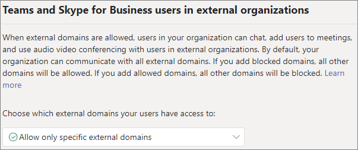

# Configure trusted organizations for external meetings and chat

You can configure meetings and chat with people in other organizations by using the *external access* feature in Teams. External access is a way for Teams users from outside your organization to find, call, chat, and set up meetings with you in Teams.

This article covers how to manage external meetings and chat with people in other Microsoft 365 organizations. If you are using Skype for Business hybrid, see [Configure external meetings and chat with Skype for Business Server hybrid](external-meetings-skype-for-business-server-hybrid.md). For information about managing chat and meetings with people who are not managed by an organization, see [Manage external meetings and chat with people not managed by an organization](skype-extended-directory-access.md).

With external access, people from trusted organizations can chat and meet with people in your organization, but they won't have access to your teams, sites, or other Microsoft 365 resources. If you want people from other organizations to have access to your teams and channels, see [Collaborate with guests in a team](/microsoft-365/solutions/collaborate-as-team) and [Collaborate with external participants in a shared channel](/microsoft-365/solutions/collaborate-teams-direct-connect). 

If you want to limit external meetings and chat to specific users in your organization, see [Limit external meetings and chat to specific users](limit-external-meetings-chat-to-specific-users.md).

> [!NOTE]
> Teams users can add apps when they host meetings or chats with people from other organizations. They can also use apps shared by people in other organizations when they join meetings or chats hosted by those organizations. The data policies of the hosting user's organization, as well as the data sharing practices of any third-party apps shared by that user's organization, are applied.

## Specify trusted organizations

External meetings and chat is managed by specifying which domains you want to trust. By default, all external domains are allowed. You can allow or block certain domains in order to define which organizations your organization trusts for external meetings and chat.

In order to chat and meet with people in external domains, those organizations must trust your domain as well. 

You can specify which domains are allowed or which domains are blocked. If you specify blocked domains, all other domains will be allowed; if you specify allowed domains, all other domains will be blocked. There are four scenarios for configuring trusted organizations:

- **Allow all external domains**: This is the default setting in Teams, and it lets people in your organization find, call, chat, and set up meetings with people external to your organization in any domain.

    In this scenario, your users can communicate with all external domains that are running Teams or Skype for Business so long as the other organization also supports external communications.
    
- **Allow only specific external domains**: By adding domains to an **Allow** list, you limit external access to only the allowed domains. Once you set up a list of allowed domains, all other domains will be blocked.

- **Block specific domains** - By adding domains to a **Block** list, you can communicate with all external domains *except* the ones you've blocked.  Once you set up a list of blocked domains, all other domains will be allowed.

- **Block all external domains** - Prevents people in your organization from finding, calling, chatting, and setting up meetings with people external to your organization in any domain.

> [!NOTE]
> People from blocked domains can still join meetings anonymously if anonymous access is allowed. To learn more, see [Manage meeting settings in Teams](meeting-settings-in-teams.md).

To allow specific domains

1. In the Teams admin center, go to **Users** > **External access**.

2. Under **Choose which domains your users have access to**, choose **Allow only specific external domains**.

3. Select **Allow domains**.

4. In the **Domain** box, type the domain that you want to allow and then click **Done**.

5. If you want to allow another domain, click **Add a domain**.

6. Click **Save**.

To block specific domains

1. In the Teams admin center, go to **Users** > **External access**.

2. Under **Choose which domains your users have access to**, choose **Block only specific external domains**.

3. Select **Block domains**.

4. In the **Domain** box, type the domain that you want to allow and then click **Done**.

5. If you want to block another domain, click **Add a domain**.

6. Click **Save**.

## Configure trusted organizations by using PowerShell

Trusted organizations can be configured by using the [Set-CSTenantFederationConfiguration](/powershell/module/skype/set-cstenantfederationconfiguration) cmdlet.

The following table shows the cmdlet parameters used for configuring trusted organizations.

|Configuration|Parameter|
|:-------|:--------|
|Enable/disable meetings and chat with other Teams organizations and Skype for Business|`-AllowFederatedUsers`|
|Specify allowed domains|`-AllowedDomains`|
|Specify blocked domains|`-BlockedDomains`|

Before you can run these cmdlets you must be connected to Microsoft Teams PowerShell. For more information, see [Manage Teams with Microsoft Teams PowerShell](/microsoftteams/teams-powershell-managing-teams).

## Skype for Business Online

If you want chats and calls to arrive in the user's Skype for Business client, configure your users to be in any mode other than TeamsOnly.

## Diagnostic Tool

If you're an administrator, you can use the following diagnostic tool to validate if a Teams user can communicate with a Teams user in a trusted organization:

1. Select **Run Tests** below, which will populate the diagnostic in the Microsoft 365 Admin Center. 

   > [!div class="nextstepaction"]
   > [Run Tests: Teams Trusted Organizations](https://aka.ms/TeamsFederationDiag)

2. In the Run diagnostic pane, enter the **Session Initiation Protocol (SIP) Address** and the **Federated tenant's domain name**, and then select **Run Tests**.

3. The tests will return the best next steps to address any setting or policy configurations that are preventing communication with the external user.

## Related topics

[Use guest access and external access to collaborate with people outside your organization](communicate-with-users-from-other-organizations.md)