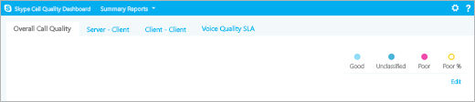
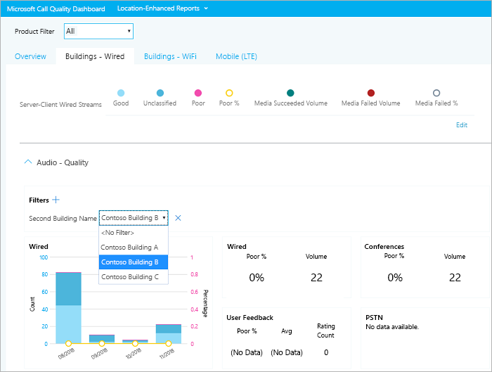
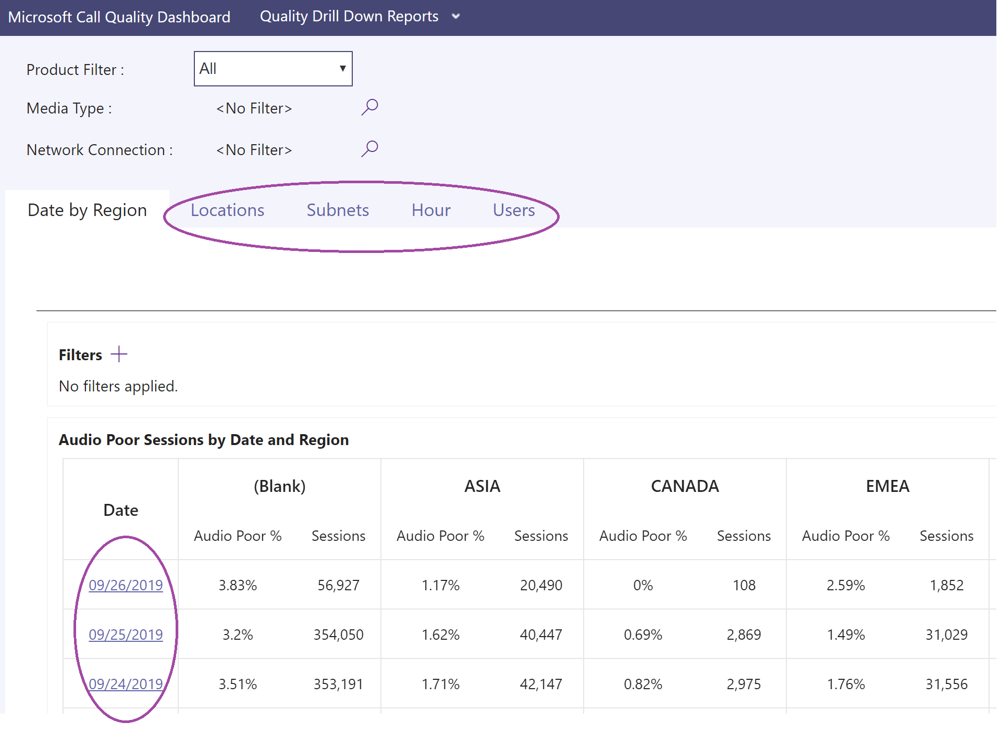
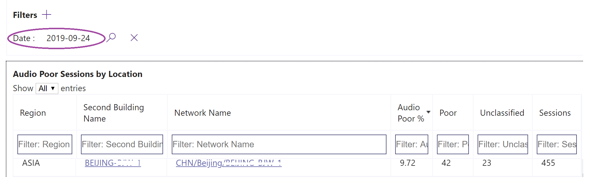
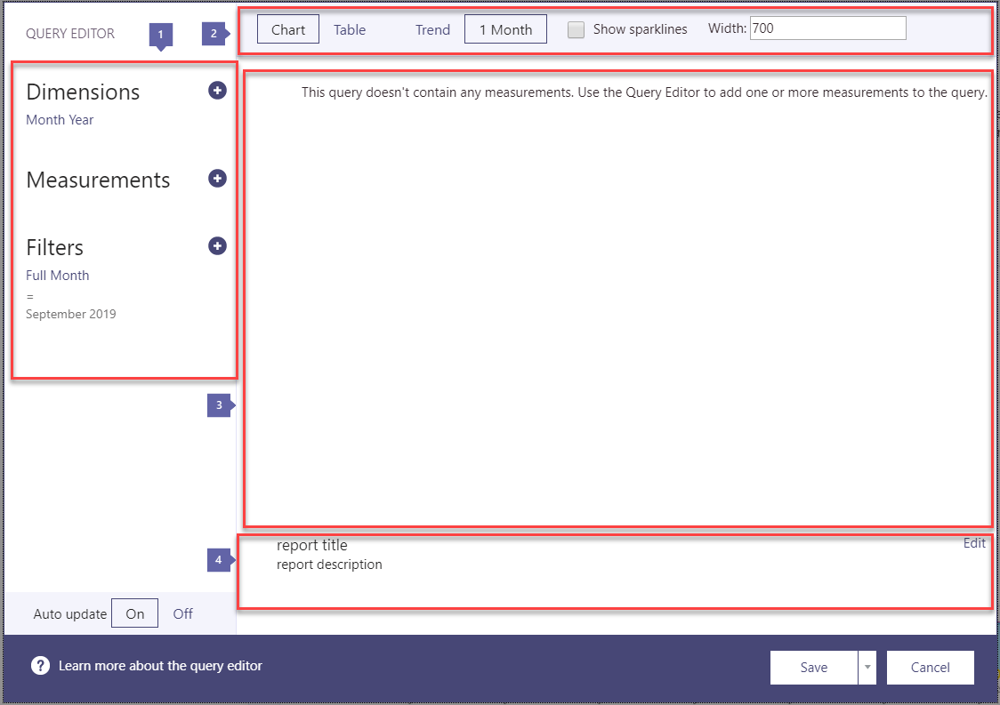

# Turn on and use Call Quality Dashboard (CQD)

Learn how to configure your Office 365 organization to use the Call Quality Dashboard (CQD) to monitor call quality.
  
Call Quality Dashboard (CQD) provides insight into the quality of calls made using Microsoft Teams and Skype for Business Online services. This topic describes the steps to start collecting data you can use to troubleshoot call quality issues.

Currently, Advanced CQD and CQD are both available for use. Advanced CQD is available at https://cqd.teams.microsoft.com. New URL but the same log in with your administrator credentials.

## What's the Call Quality Dashboard, and when should I use it?
  
Call Analytics is designed to help admins and helpdesk agents troubleshoot call quality problems with *specific calls*. Call Quality Dashboard (CQD) is designed to help Teams admins, Skype for Business admins, and network engineers *optimize a network*. CQD shifts focus from specific users and instead looks at aggregate information for an entire Teams or Skype for Business organization. If you need to look at call and meeting information for a *specific user*, you'll use [per-user call analytics](use-call-analytics-to-troubleshoot-poor-call-quality.md) instead.
  
Suppose a user's poor call quality is due to a network issue that also affects many other users. The individual call experience isn't visible in CQD, but the overall quality of calls made using Teams or Skype for Business is captured. With  CQD, overall patterns may become apparent, so network engineers can make informed assessments of call quality. CQD provides reports of call quality metrics that give you insight into overall call quality, server-client streams, client-client streams, and voice quality [SLA](https://go.microsoft.com/fwlink/p/?linkid=846252).
  

CQD's Location-Enhanced Reports aggregate call quality and reliability within a user's building. The data can be assessed to determine if the problem is isolated to a single user or affects a larger segment of users.

> [!NOTE]
> To enable building or endpoint-specific views in CQD, an admin must [upload building or endpoint information](turning-on-and-using-call-quality-dashboard.md#upload-tenant-data-information) on CQD's Tenant Data Upload page.

If you want non-admin users (such as helpdesk agents) to use Call Quality Dashboard, you can assign those users one of the following roles, which gives access to CQD and per-user call analytics:

- Global Administrator
- Global Reader
- Skype for Business Administrator
- Teams Service Administrator
- Teams Communications Administrator
- Teams Communications Support Engineer
- Teams Communications Support Specialist
- Reports Reader

> [!NOTE]
> The Teams Communications Support Engineer, Teams Communications Support Specialist, and Reports Reader roles cannot modify files on CQD's Tenant Data Upload page nor activate CQD for a tenant.

For more information about these roles, see [About Office 365 admin roles](/office365/admin/add-users/about-admin-roles).

For more information about CQD, see [Dimensions and measures available in Call Quality Dashboard](dimensions-and-measures-available-in-call-quality-dashboard.md).

## Latest changes and updates

The updated CQD (as of early November 2019) delivers a Near Real-Time CQD dashboard. CQD data is now available on average in 30 minutes (in comparison to the previous CQD which is on average of 24 hours).  The updated CQD uses End User Identifiable Information (EUII), giving admins the ability to drill down and zoom in to the user level. There is also report interactivity to support new scenarios such as:

- Call Quality by Region:
  - date-by-region
  - aggregated down to hour-by-region
  - specific locations
  - specific subnet
  - impacted user or users

- Call Reliability/Failure by Region:
  - date-by-region
  - aggregated down to hour-by-region
  - specific locations
  - specific subnet
  - impacted user or users

- Rate My Call (RMC) by Region: from month-by-region aggregated down to specific locations to users who provide low RMC ratings. CQD v3 also includes verbatim feedback.
- Helpdesk: available for a specific user on P2P calls or Meetings, or for all participants and call details. Helps identify possible system issues based on network location, devices, or firmware.  
- Client Versions: View the Session and Users counts for each Client Version, or drill down to User names for each client version. Pre-built filters for Product and Client Type help focus the versions to specific clients.
- Endpoints: Shows Machine Endpoints mapped to Make/Model of the PC/Mac. Shows aggregated quality by Make/Model. Mapping data is uploaded similar to Building data.

Advanced CQD (V3) also provides RBAC support, in case EUII access is not available.  

An admin can manage Skype for Business Server 2019 (not just Skype for Business Online and Microsoft Teams) through CQD version 3. This requires a hybrid implementation and the use of Call Data Connector. See [Plan Call Data Connector](/SkypeForBusiness/hybrid/plan-call-data-connector) for more information.

CQD version 2 added:

- Data for Microsoft Teams and Skype for Business Online
- Summary reports include a product filter to select all data, Microsoft Teams data, or Skype for Business Online data
- Updated Video and VBSS stream quality classification logic. Refer to [Stream Classification in Call Quality Dashboard](stream-classification-in-call-quality-dashboard.md) for the classifier definitions.

Refer to this article for a list of [Dimensions and measures available in Call Quality Dashboard](dimensions-and-measures-available-in-call-quality-dashboard.md).
  
> [!NOTE]
> To see information about updates and changes to the dashboard,  click the link in the **Good news!** banner when it displays on the dashboard.

CQD version 1 provided Skype for Business Server 2015 admins the following features:

- Access to cached report data for fast access
- Deep links to report pages for sharing and publishing information
- Streamlined report editing and creation, and editable metadata for report descriptions
- Web APIs that give programmatic access to the cube data for use in custom dashboards

## CQD Near-Real-Time (NRT) Data

Advanced CQD (V3, released November 2019) uses a near-real-time data feed. Call Records are available at the CQD portal within 30 minutes of the end of the call. Call Records from the NRT pipeline are only available for a few months before they are removed from the data set. CQD v3 merges data from the current v2 pipeline with NRT data from the v3 pipeline. Queries on the v2 and v3 portals for the data from the Archival period produce the same results. V2 and v3 data queries for the NRT Data and NRT Data + PII periods will be different.

### PII/EUII Data

PII or EUII data only comes from the v3 pipeline. Due to compliance reasons, PII/EUII data is only kept for 30 days. As NRT data crosses the 30-day mark, the PII/EUII fields are cleared out, resulting in PII-free NRT data. The PII/EUII fields are:

- Full IP address
- Media Access Control (MAC) Address
- Basic Service Set identifier (BSSID)
- Session Initiation Protocol (SIP) URI (Skype for Business only)
- User Principal Name (UPN)
- Machine Endpoint Name
- User Verbatim Feedback
- Object ID (the Active Directory object ID of the endpoint's user)

### Date controls

CQD v3 adds the following new Rolling Trend types:

- 5-day
- 7-day
- 30-day
- 60-day
- 90-day

The URL Date parameter can now accept a Day field. Rolling-day reports use dates specified in the YYYY-MM-DD format as the last day of the trend.  The URL Date parameter “00”  indicates “today”.

|URL| End date of Rolling Day Trend|
|:---|:---|
|https://<cqdv3>/spd/#/Dashboard/<reportid>/2019-02/   |Current Day of Feb 2019|
|https://<cqdv3>/spd/#/Dashboard/<reportid>/2019-02-15/|Feb 15, 2019|
|https://<cqdv3>/spd/#/Dashboard/<reportid>/00/        |Current Day|
|||

By default the current day of the month is used as the last day of the Rolling Day Trend.

### Drill Thru Functionality

CQD v3 supports the use of drill through or drill-down fields in SPD reports. If these dimension fields are selected,  the report automatically opens a different report tab and filters on the selected value. Fields with an assigned drill through filter are distinguished by a different cursor icon (the pointer) when you hover over them.

When a drill through field is selected, the Dashboard automatically navigates to the new, specified tab and applies a filter with the selected value. If that tab has its own drill through fields and one is selected, the previous drill through filters and the new one all propagate forward. This allows you to build a report that progressively narrows the resulting data set.

For example, in a Call quality drill-through report, a user can click the date they would like to 'drill-through', which leads to the Location tab.

You can add multiple dates from the location tab, such as adding 2019-09-22 to Date: 2019-09-24: 

> [!NOTE]
> Don't jump directly to the last tab. Without filters selected from a previous drill-through the results would be too large to show on a table.

## Activate Microsoft Call Quality Dashboard (CQD) Summary Reports

Before you can start using CQD, activate it for your Office 365 organization as follows:

 **Using the Microsoft Teams admin center**

1. Sign in to your Office 365 organization using Microsoft Teams service admin account, and then select the **Admin** tile to open the Admin center.
2. In the left pane, under **Admin centers**, select **Microsoft Teams** to open the Microsoft Teams admin center.
3. In the Microsoft Teams admin center, select **Call quality dashboard** in the left pane.
4. On the page that opens \(https://cqd.teams.microsoft.com\), click **Sign in** and enter your Global Administrator account or Microsoft Teams Service Admin account information.

    
  
After you sign in, once activated, the CQD will begin collecting and processing data.  
> [!NOTE]
> It may take one or more hours to process enough data to display meaningful results in the reports.

 **Using the Skype for Business legacy portal**

1. Sign in to your Office 365 organization using an admin account, and then select the **Admin** tile to open the Admin center.
2. In the left pane, under **Admin centers**, select **Microsoft Teams** to open the Microsoft Teams admin center.
3. In the Microsoft Teams admin center, select **Legacy Portal** in the left pane, select **Tools**, and then select **Skype for Business Online Call Quality Dashboard**.

     

4. On the page that opens, sign in with your Global Administrator account, and then provide the credentials for the account when prompted.

After you sign in, once activated, the Call Quality Dashboard will begin collecting and processing data.

## Features of the Call Quality Dashboard for Microsoft Teams and Skype for Business Online

CQD Summary Reports provide a subset of the features planned for Detailed Reports. The differences between the editions are summarized here:
  
|Feature|Summary Reports|Detailed Reports|
|:--- |:--- |:--- |
|Application sharing metric | No | Yes |
|Customer building information support | Yes | Yes |
|Customer endpoint information support | Only in cqd.teams.microsoft.com | Only in cqd.teams.microsoft.com |
|Drill down analysis support   | No   | Yes   |
|Media reliability metrics   | No   | Yes   |
|Out-of-the-box reports   | Yes   | Yes   |
|Overview reports   | Yes   | Yes   |
|Per-user report set   | No   | Yes   |
|Report set customization (add, delete, modify reports)   | No   | Yes   |
|Video-based screen sharing metrics   | No   | Yes   |
|Video metrics   | No   | Yes   |
|Amount of data available   | Last 6 months   | Last 6 months   |
|Microsoft Teams data   | Yes   | Yes   |
| | | |

### Out-of-the-box reports

All editions of CQD provide an experience that gives you call quality metrics without the need to create new reports. Once data is processed in the back-end, you see call quality data in the reports.
  
### Overview reports

All editions of the CQD provide a high-level entry point to the overall call quality information, but the way information is presented in Summary Reports is different from Detailed Reports.  
  
Summary Reports provide a simplified tabbed page report view so you can quickly browse and understand the overall call quality status and trends.

The four tabs include:
  
- **Overall Call Quality** — provides information about all streams, which is an aggregation that shows monthly and daily trends for:
  - Server-Client streams
  - Client-Client streams
  - Separate Server-Client and Client-Client streams
- **Server—Client** — provides details for the streams between Server and Client endpoints.
- **Client—Client** — provides details for the streams between two Client endpoints.
- **Voice Quality SLA** — provides information about calls that are included in the Skype for Business Online Voice Quality SLA.

> [!NOTE]
> CQD Version 3 works with Microsoft Teams, Skype for Business Online, and Skype for Business Server. To use CQD with Skype for Business Server 2019, you will have to [Configure Call Data Connector](https://docs.microsoft.com/skypeforbusiness/hybrid/configure-call-data-connector). See [Plan Call Data Connector](https://docs.microsoft.com/skypeforbusiness/hybrid/plan-call-data-connector) before you start.

- Call Quality by Region:

  - date-by-region
  - aggregated down to hour-by-region
  - specific locations
  - specific subnet
  - impacted user or users

- Call Reliability/Failure by Region:
  - date-by-region
  - aggregated down to hour-by-region
  - specific locations
  - specific subnet
  - impacted user or users

- Rate My Call (RMC) by Region: from month-by-region aggregated down to specific locations to users who provide low RMC ratings. CQD v3 also includes verbatim feedback.
- Helpdesk: available for a specific user on P2P calls or Meetings, or for all participants and call details. Helps identify possible system issues based on network location, devices, or firmware.  
- Client Versions: View the Session and Users counts for each Client Version, or drill down to User names for each client version. Pre-built filters for Product and Client Type help focus the versions to specific clients.
- Endpoints: Shows Machine Endpoints mapped to Make/Model of the PC/Mac. Shows aggregated quality by Make/Model. Mapping data is uploaded similar to Building data.

### Overall Call Quality tab

Use the data on this tab to evaluate call quality status and trends based on stream counts and poor percentages. The legend in the upper-right corner shows which color and visual elements represent these metrics.
  

  
Streams are classified in three groups: Good, Poor, and Unclassified. There are also calculated  *Poor %*  values that give you the ratio of streams classified as *Poor*  to the total classified stream count. Since *Poor % = Poor streams/ (Poor streams+ Good streams) * 100*, the *Poor %*  is unaffected by the presence of multiple *Unclassified*  streams. To see what classifies a stream as poor or good, refer to [Stream Classification in Call Quality Dashboard](stream-classification-in-call-quality-dashboard.md).
  
Use the scale on the left to measure the stream count values.
  

  
Use the scale on the right to measure the Poor % values.
  

  
You can also obtain the actual numerical values by hovering the mouse over a bar.
  
> [!NOTE]
> The following example is from a very small sample data set, and the values aren't realistic for an actual deployment.
  

  
The overall stream volume helps determine how relevant the calculated Poor percentages are. The smaller the volume of overall streams, the less reliable the reported Poor percentage values are.
  
### Server-Client tab and Client-Client tabs

These two tabs provide details for the streams that took place in their endpoint-to-endpoint scenarios. The Server-Client tab has four collapsible sections  that represent four scenarios under which media streams would flow.
  
- Wired Inside
- Wired Outside
- Wifi Inside
- Wifi Outside

Similarly, the Client-Client tab has five collapsible sections:

- Wired Inside — Wired Inside
- Wired Inside — Wired Outside
- Wired Outside — Wired Outside
- Wired Inside — Wifi Inside
- Wired Inside — Wifi Outside

#### Inside Test

During processing, the CQD back-end classifies a stream as  *Inside*  or *Outside*  using Building information, if it exists. Endpoints of each stream are associated with a subnet address. If the subnet is in the list of the subnets marked InsideCorp in the uploaded Building information, then it is considered *Inside*. If Building information has not yet been uploaded, then Inside Test  always classifies the streams as *Outside*.  

> [!NOTE]
> The Inside Test for a Server-Client scenario only considers the client endpoint. Because servers are always outside from a user's perspective, this isn't accounted for in the test.
  
#### Wired vs. wifi

As the names indicate, the classification criteria is based on the type of client connections. Again, server is always wired and it isn't included in the calculation.
  
> [!NOTE]
> Given a stream, if one of the two endpoints is connected to a Wifi network, then it is classified as Wifi in CQD.
  
## Selecting product data to see in reports

In the Summary and Location Enhanced Reports, you can use the **Product Filter** drop-down to show all product data, only Microsoft Teams data, or only Skype for Business Online data.
  

  
In Detailed reports, you can use the **Is Teams** dimension to filter the data to Microsoft Teams or Skype for Business Online data.
  
## Upload Tenant Data information

The CQD Summary Reports dashboard includes a **Tenant Data Upload** page, accessed by selecting **Tenant Data Upload** from the settings menu in the top-right corner. This page is used for admins to upload their own information, such as:

- A map of IP address and geographical information
- A map of each wireless AP and its MAC address
- A map of Endpoint to Endpoint Make/Model/Type, etc.
  
> [!NOTE]
> Reporting Labels that you upload to CQD will be handled as *Support Data* under your agreement for Office 365, including any information that would otherwise be considered *Customer Data* or *Personal Data*. Please do not include data you do not wish to provide to Microsoft as *Support Data*, this information will be visible to Microsoft Engineers for support purposes.

  
1. On the **Tenant Data Upload** page, use the drop-down menu to choose a data file type to upload. The file data type denotes the content of the file (for example, "Building" refers to mapping of IP address and building and other geographical information, “Endpoint” refers to mapping of Endpoint Name to Endpoint Make/Model/Type information). Currently CQD supports “Building” and “Endpoint” data types for cqd.teams.microsoft.com (in preview stage and not officially available yet), cqd.lync.com only supports the "Building" data type.

2. After you select the file data type, click **Browse** to choose a data file.

   - A data file must be a .tsv (Tab-separated values) file or a .csv (Comma-separated value) file. With a .csv file, any field that contains a comma must be surrounded by quotes or have the comma removed. For example, if your building name is NY,NY,  enter  "NY,NY" in the .csv file.
   - The data file must be no larger than 50 MB.
   - Files uploaded to cqd.teams.microsoft.com have an expanded row limit of 1,000,000 to keep query performance fast. This limit also applies to CQD v2  on cqd.lync.com.
   - For each data file, each column in the file must match a predefined data type, discussed later in this topic.
3. Next, specify a **Start date** and, optionally, **Specify an end date**.
4. Finally, select **Upload** to upload the file to the CQD server.
    Before the file is uploaded, it is first validated. Once validated, it is stored in an Azure blob. If validation fails or the file fails to be stored in an Azure blob, an error message requests a correction to the file. The following image shows a sample error with an incorrect number of columns in the data file.

     
  
5. If no errors occur during validation, the file upload succeeds. You can then see the uploaded data file in the **My uploads** table. The bottom of that page also shows a full list of all files uploaded for the current tenant.
    Each record shows one uploaded tenant data file, with file type, last update time, time period, description, a remove icon, and a download icon. To remove a file, select the trash bin icon in the table. To download a file, select the download icon in the **Download** column of the table.

     

6. If you choose to use multiple building data files or multiple endpoint data files, some reports generate more slowly.

### Tenant data file format and structure

### Building data file

CQD uses a Building data file, which helps provide useful call details. The Subnet column is derived by expanding the Network+NetworkRange column, then joining the Subnet column to the call record’s First Subnet or Second Subnet column to show Building, City, Country, or Region information. The format of the data file you upload must meet the following criteria to pass the validation check before upload:

You can download a sample template [here](https://github.com/MicrosoftDocs/OfficeDocs-SkypeForBusiness/blob/live/Teams/downloads/locations-template.zip?raw=true)
  
- The file must be either a .tsv file (columns are separated by a TAB) or a .csv file (columns are separated by a comma).
- The data file doesn't include a table header row. The first line of the data file is expected to be real data, not header labels like "Network".
- Data types in the file can only be String, Integer, or Boolean. For the  Integer data type, the value must be a numeric value. Boolean values must be either 0 or 1.
- If a column uses the String data type, a data field can be empty but must still be separated by a tab or comma. An empty data field just assigns an empty String value.
- There must be 14 columns for each row, each column must have the appropriate data type, and the columns must be in the order listed in the following table:

||||||||||||||||
|:--- |:--- |:--- |:--- |:--- |:--- |:--- |:--- |:--- |:--- |:--- |:--- |:--- |:---  |:--- |:---|
|**Column field name**|NetworkIP  |NetworkName              |NetworkRange|BuildingName  |OwnershipType| BuildingType  |BuildingOfficeType|City   |ZipCode|Country|State |Region|InsideCorp&dagger;|ExpressRoute&Dagger;|VPN (optional)|
|**Data type**        | String    | String                  |Number      | String       | String      | String        |String            |String |String |String |String|String|Boolean   |Boolean     |Boolean|
|**Example value**    |192.168.1.0|USA/Seattle/SEATTLE-SEA-1| 26         | SEATTLE-SEA-1| Contoso     | IT Termination|Engineering       |Seattle|98001  |US     |WA    |MSUS  | 1        |0           | 0|
|||||||||||||||||

&dagger; This setting can be used to reflect whether or not the subnet is inside the corporate network. You can customize usage for other purposes if you decide to.

&Dagger; This setting can be used to reflect whether or not the network uses Azure ExpressRoute. You can customize usage for other purposes if you decide to.  

**Sample row:**

`192.168.1.0,USA/Seattle/SEATTLE-SEA-1,26,SEATTLE-SEA-1,Contoso,IT Termination,Engineering,Seattle,98001,US,WA,MSUS,1,0,0`

> [!IMPORTANT]
> The network range can be used to represent a supernet (combination of several subnets with a single routing prefix). All new building uploads will be checked for any overlapping ranges. If you have previously uploaded a building file, you should download the current file and re-upload it to identify any overlaps and fix the issue before uploading again. Any overlap in previously uploaded files may result in the wrong mappings of subnets to buildings in the reports. Certain VPN implementations do not accurately report the subnet information. It is recommended that when adding a VPN subnet to the building file, instead of one entry for the subnet, separate entries are added for each address in the VPN subnet as a separate 32-bit network. Each row can have the same building metadata. For example, instead of one row for 172.16.18.0/24, you should have 256 rows, with one row for each address between 172.16.18.0/32 and 172.16.18.255/32, inclusive.
>
> The VPN column is optional and will default to 0.  If the VPN column’s value is set to 1, the subnet represented by that row will be fully expanded to match all IP addresses within the subnet.  Please use this sparingly and only for VPN subnets since fully expanding these subnets will have a negative impact on query times for queries involving building data.

### Endpoint data file

CQD uses an Endpoint data file. The column values are used in the call record’s First Client Endpoint Name or Second Client Endpoint Name column to show Endpoint Make, Model, or Type information. The format of the data file you upload must meet the following criteria to pass the validation check before upload:

- The file must be either a .tsv file (columns are separated by a TAB) or a .csv file (columns are separated by a comma).
- The content of the data file doesn't include table headers. The first line of the data file is expected to be real data, not a header label like "EndpointName".
- All seven columns use the String data type only. The maximum allowed length is 64 characters.
- A data field can be empty but must still be separated by a tab or comma. An empty data field just assigns an empty String value.
- EndpointName must be unique, otherwise the upload fails. If there is a duplicate row or two rows that use the same EndpointName the conflict will  cause incorrect joining.
- EndpointLabel1, EndpointLabel2, and EndpointLabel3 are customizable labels. They can be empty Strings or values such as “IT Department designated 2018 Laptop” or “Asset Tag 5678”.
- There must be seven columns for each row and the columns must be in the following order:

  **Field order:**

EndpointName, EndpointModel, EndpointType, EndpointLabel1, EndpointLabel2,  EndpointLabel3

  **Sample row:**

`1409W3534, Fabrikam Model 123, Laptop, IT designated 2018 Laptop, Asset Tag 5678, Purchase 2018,`  

## Create custom detailed reports

If you find you want to create a specific report that focuses on a dimension of the data in a way the provided detailed reports do not, create a custom report.

From the pull-down list of reports at the top of the screen displayed at login \(the **Summary Reports** screen\) Select **Detailed Reports**  and then **New** d Click "Edit" in the action menu of a report to see the Query Editor. Each report is backed by a query into the cube. A report is a visualization of the data returned by its query. The Query Editor helps you edit these queries and the display options of the report. When you open the Query Editor for a new report, you see something similar to this screenshot:

1. Dimensions, measures, and filters are chosen in the left pane. Click the "plus" button next to a heading to open the dialog where you can add a  dimension, measure, or filter and check the corresponding box. If you edit an existing report, you can uncheck existing values to remove them. For details, see [Dimensions and measures available in Call Quality Dashboard](dimensions-and-measures-available-in-call-quality-dashboard.md).
2. Options for chart customization are displayed at the top.
3. A preview of the report is available in the Query Editor.
4. A detailed report name and description can be created with the edit box at the bottom.

## Frequently Asked Questions

### Why does my CQD v2 report data look different than the CQD v3 report data? 

If you see data differences between CQD v2 and v3, make sure that data comparison or validation is done on an 'apples-to-apples'  and narrow level, not an aggregated level. For example, if you filter both reports for MSIT ‘Building 30' WiFi Teams Desktop client data, the Percentage of Poor Quality should be the same between v2 and v3.

CQD v2 and CQD v3 have different total counts since CQD v3 has new scenarios not present in CQD v2. Summary Total or Aggregated all-up numbers with no filters are expected to be different.  

If the usage scenario includes Skype for Business Server 2019 calls, CQD v3 data includes Skype Bot calls (auto attendant, CVI, Virtual Desktop Interface), Live Events, and PSTN calls. CQD v2 does not use this data. (CQD v3 requires Skype for Business Server 2019 with cloud data connector configured.)

For instance, if you see 200,000 audio streams with 5000 failures in a CQD v2 Summary Report it would not be unusual to see 300,000 audio streams with 5500 failures (the difference can be due to Skype for Business Server 2019 calls, CVI calls, PSTN calls, and so on) in a CQD v3 Summary report.

To disambiguate unexpected differences, look at more than one breakdown of the overall data. Filter the data by one or more of the following parameters:

- User Agent Category Pair
- First Product
- Second Product

### Other expected differences between CQD v2 and CQD v3

There are several Quality and Reliability improvements in Teams but not Skype for Business Online:

- Auto-reconnect
- Fast roaming
- Improved BW management

When you compare data for these two services:

- Pick a scenario with a tight focus, such as corporate wired connections, Windows Desktops, or a single region or building.
- Check the Teams MR, TR, or MP IP ranges. The Teams ranges are newer than Skype for Business Online, and that can cause connectivity issues involving firewalls
- Don't compare summary or top-level numbers. These comparisons will lead you to compare a large call volume of Skype for Business Online calls on a corporate wired connection to a small volume of Teams calls on an LTE or private network.
- Beware of location bias and population differences: There are many comparisons that are too dissimilar to be useful:
  - NOAM : APAC
  - NY : Goa
  - Wired : wifi
  - Corporate network : home network
  

## Related topics

[Dimensions and measures available in Call Quality Dashboard](dimensions-and-measures-available-in-call-quality-dashboard.md)

[Stream Classification in Call Quality Dashboard](stream-classification-in-call-quality-dashboard.md)

[Set up Skype for Business Call Analytics](set-up-call-analytics.md)

[Use Call Analytics to troubleshoot poor call quality](use-call-analytics-to-troubleshoot-poor-call-quality.md)

[Call Analytics and Call Quality Dashboard](difference-between-call-analytics-and-call-quality-dashboard.md)
