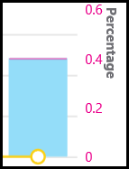

# Turn on and use Call Quality Dashboard for Microsoft Teams and Skype for Business Online

Learn how to configure your Office 365 organization to use the Call Quality Dashboard to monitor call quality.
  
The Call Quality Dashboard (CQD) provides insights into the quality of calls made using Microsoft Teams and Skype for Business Online services. This topic describes the steps to start collecting data you can use to troubleshoot call quality issues.

## Latest changes and updates

CQD version 3 has delivered a near real-time CQD dashboard with EUII, and report interactivity to support new scenarios such as:

- Call Quality by Region:

  - date-by-region
  - aggregated down to hour-by-region
  - specific locations
  - specific subnet
  - impacted user or users

- Call Reliability/Failure by Region:
  - date-by-region
  - aggregated down to hour-by-region
  - specific locations
  - specific subnet
  - impacted user or users

- Rate My Call (RMC) by Region: from month-by-region aggregated down to specific locations to users who provide low RMC ratings. CQD v3 also includes verbatim feedback.
- Helpdesk: available for a specific user on P2P calls or Meetings, or for all participants and call details. Helps identify possible system issues based on network location, devices, or firmware.  
- Client Versions: View the Session and Users counts for each Client Version, or drill down to User names for each client version. Pre-built filters for Product and Client Type help focus the versions to specific clients.
- Endpoints: Shows Machine Endpoints mapped to Make/Model of the PC/Mac. Shows aggregated quality by Make/Model. Mapping data is uploaded similar to Building data. (Self-serve upload functionality coming soon).  <!-- needs PM update  -->

CQD version 2 added:

- Microsoft Teams data in addition to Skype for Business Online data.
- Summary reports include a product filter to select all data, Microsoft Teams data, or Skype for Business Online data.
- Video and VBSS stream quality classification logic updates. Refer to [Stream Classification in Call Quality Dashboard](stream-classification-in-call-quality-dashboard.md) for the latest classifier definitions.

Refer to this article for a list of [Dimensions and measures available in Call Quality Dashboard](dimensions-and-measures-available-in-call-quality-dashboard.md).
  
> [!NOTE]
> To see information about updates and changes to the dashboard,  click the link in the **Good news!** banner when it displays on the dashboard.
  
## Activate Microsoft Call Quality Dashboard (CQD) Summary Reports

Before you can start using the CQD, activate it for your Office 365 organization.

 **Using the Microsoft Teams admin center**

1. Sign in to your Office 365 organization using Microsoft Teams service admin account, and then select the **Admin** tile to open the Admin center.
2. In the left pane, under **Admin centers**, select **Microsoft Teams** to open the Microsoft Teams admin center.
3. In the Microsoft Teams admin center, select **Call quality dashboard** in the left pane.
4. On the page that opens, sign in with your Global Administrator account or Microsoft Teams Service Admin account, and then provide the credentials for the account when prompted.

     
  
After you sign in, once activated, the CQD will begin collecting and processing data.  
> [!NOTE]
> It may take one or more hours to process enough data to display meaningful results in the reports.

 **Using the Skype for Business legacy portal**

1. Sign in to your Office 365 organization using an admin account, and then select the **Admin** tile to open the Admin center.
2. In the left pane, under **Admin centers**, select **Microsoft Teams** to open the Microsoft Teams admin center.
3. In the Microsoft Teams admin center, select **Legacy Portal** in the left pane, select **Tools**, and then select **Skype for Business Online Call Quality Dashboard**.

     

4. On the page that opens, sign in with your Global Administrator account, and then provide the credentials for the account when prompted.

     
  
After you sign in, once activated, the CQD will begin collecting and processing data.

## Features of the Call Quality Dashboard for Microsoft Teams and Skype for Business Online

<!-- this isn't very clear, it doesn't call out v1 and v2. unsure how to elaborate for v3-->
CQD Summary Reports provide a subset of the features planned for Detailed Reports. The differences between the editions are summarized here:
  
|Feature|Summary Reports|Detailed Reports|
|:-----|:-----|:-----|
|Application sharing metric   | No   | Yes   |
|Customer building information support   | Yes   | Yes   |
|Customer endpoint information support   | Only in cqd.teams.microsoft.com   | Only in cqd.teams.microsoft.com   |
|Drill down analysis support   | No   | Yes   |
|Media reliability metrics   | No   | Yes   |
|Out-of-the-box reports   | Yes   | Yes   |
|Overview reports   | Yes   | Yes   |
|Per-user report set   | No   | Yes   |
|Report set customization (add, delete, modify reports)   | No   | Yes   |
|Video-based screen sharing metrics   | No   | Yes   |
|Video metrics   | No   | Yes   |
|Amount of data available   | Last 6 months   | Last 6 months   |
|Microsoft Teams data   | Yes   | Yes   |

### Out-of-the-box reports

All editions of CQD provide an experience that gives you call quality metrics without the need to create new reports. Once data is processed in the back-end, you see call quality data in the reports.
  
### Overview reports

Both editions of the CQD provide a high-level entry point to the overall call quality information, but the way information is presented in Summary Reports is different from Detailed Reports.  <!-- needs PM update  -->
  
Summary Reports provide a simplified tabbed page report view so you can quickly browse and understand the overall call quality status and trends.
  
The four tabs include:
  
- **Overall Call Quality** — provides information about all streams, which is an aggregation that shows monthly and daily trends for: 
  - Server-Client streams 
  - Client-Client streams 
  - Separate Server-Client and Client-Client streams
- **Server—Client** — provides details for the streams between Server and Client endpoints.
- **Client—Client** — provides details for the streams between two Client endpoints.
- **Voice Quality SLA** — provides information about calls that are included in the Skype for Business Online Voice Quality SLA.

### Overall Call Quality tab

Use the data on this tab to evaluate call quality status and trends based on stream counts and poor percentages. The legend in the upper-right corner shows which color and visual elements represent these metrics.
  

  
Streams are classified in three groups: Good, Poor, and Unclassified. There are also calculated  *Poor %*  values that give you the ratio of streams classified as *Poor*  to the total classified stream count. Since *Poor % = Poor streams/ (Poor streams+ Good streams) * 100*, the *Poor %*  is unaffected by the presence of multiple *Unclassified*  streams. To see what classifies a stream as poor or good, refer to [Stream Classification in Call Quality Dashboard](stream-classification-in-call-quality-dashboard.md).
  
Use the scale on the left to measure the stream count values.
  

  
Use the scale on the right to measure the Poor % values.
  

  
You can also obtain the actual numerical values by hovering the mouse over a bar.
  
> [!NOTE]
> The following example is from a very small sample data set, and the values aren't realistic for an actual deployment.
  

  
The overall stream volume helps determine how relevant the calculated Poor percentages are. The smaller the volume of overall streams, the less reliable the reported Poor percentage values are.
  
### Server-Client tab and Client-Client tabs

These two tabs provide details for the streams that took place in their endpoint-to-endpoint scenarios. The Server-Client tab has four collapsible sections  that represent four scenarios under which media streams would flow.
  
- Wired Inside
- Wired Outside
- Wifi Inside
- Wifi Outside

Similarly, the Client-Client tab has five collapsible sections:

- Wired Inside — Wired Inside
- Wired Inside — Wired Outside
- Wired Outside — Wired Outside
- Wired Inside — Wifi Inside
- Wired Inside — Wifi Outside

#### Inside Test

During processing, the CQD back-end classifies a stream as  *Inside*  or *Outside*  using Building information, if it exists. Endpoints of each stream are associated with a subnet address. If the subnet is in the list of the subnets marked InsideCorp in the uploaded Building information, then it is considered *Inside*. If Building information has not yet been uploaded, then Inside Test  always classifies the streams as *Outside*.  

> [!NOTE]
> Inside Test for Server-Client scenario only considers the client endpoint. Because servers are always outside from a user's perspective, this isn't accounted for in the test.
  
#### Wired vs. wifi

As the names indicate, the classification criteria is based on the type of client connections. Again, server is always wired and it isn't included in the calculation.
  
> [!NOTE]
> Given a stream, if one of the two endpoints is connected to a Wifi network, then it is classified as Wifi in CQD.
  
## Selecting product data to see in reports

In the Summary and Location Enhanced Reports, you can use the **Product Filter** drop-down to show all product data, only Microsoft Teams data, or only Skype for Business Online data.
  

  
In Detailed reports, you can use the **Is Teams** dimension to filter the data to Microsoft Teams or Skype for Business Online data.
  
## Upload Tenant Data information

The CQD Summary Reports dashboard includes a **Tenant Data Upload** page, accessed by selecting **Tenant Data Upload** from the settings menu in the top-right corner. This page is used for admins to upload their own information, such as:  
- a map of IP address and geographical information
- a map of each wireless AP and its MAC address
- a map of Endpoint to Endpoint Make/Model/Type, etc.
  

  
1. On the **Tenant Data Upload** page, use the drop-down menu to choose a data file type to upload. The file data type denotes the content of the file (for example, "Building" refers to mapping of IP address and building and other geographical information, “Endpoint” refers to mapping of Endpoint Name to Endpoint Make/Model/Type information). Currently CQD supports “Building” and “Endpoint” data types for cqd.teams.microsoft.com (in preview stage and not officially available yet), cqd.lync.com only supports the "Building" data type. Subsequent releases will add more data types.  <!-- needs PM update  -->
2. After you select the file data type, click **Browse** to choose a data file.

   - The data file must be a .tsv (Tab-separated values) file or a .csv (Comma-separated value) file. With a .csv file, any field that contains a comma must be surrounded by quotes or have the comma removed. For example, if your building name is NY,NY,  enter  "NY,NY" in the .csv file.
   - The data file must be no larger than 50 MB.
   - Files uploaded to cqd.teams.microsoft.com have an expanded row limit of 1,000,000 to keep query performance fast. This limit may apply to cqd.lync.com as well. <!-- PM review -->
   - For each data file, each column in the file must match a predefined data type, discussed later in this topic.

3. Next, specify a **Start date** and, optionally, **Specify an end date**.
4. Finally, select **Upload** to upload the file to the CQD server.
    Before the file is uploaded, it is first validated. Once validated, it is stored in an Azure blob. If validation fails or the file fails to be stored in an Azure blob, an error message requests a correction to the file. The following image shows a sample error with an incorrect number of columns in the data file.

     
  
5. If no errors occur during validation, the file upload succeeds. You can then see the uploaded data file in the **My uploads** table. The bottom of that page also shows a full list of all files uploaded for the current tenant.
    Each record shows one uploaded tenant data file, with file type, last update time, time period, description, a remove icon, and a download icon. To remove a file, select the trash bin icon in the table. To download a file, select the download icon in the **Download** column of the table.

     

6. If you choose to use multiple building data files or multiple endpoint data files, some reports generate more slowly.

### Tenant data file format and structure

### Building data file

CQD uses a Building data file. The Subnet column is derived by expanding the Network+NetworkRange column, then joining the Subnet column to the call record’s First Subnet or Second Subnet column to show Building, City, Country, or Region information. The format of the data file you upload must meet the following criteria to pass the validation check before upload:
  
- The file must be either a .tsv file, which means, in each row, columns are separated by a TAB, or a .csv file with each column separated by a comma.
- The content of the data file doesn't include table headers. That means the first line of the data file is expected to be real data, not header labels like "Network".
- For each column, the data type can only be String, Number, or Bool. If it is Number, the value must be a numeric value. If it is Bool, the value must be either 0 or 1.
- For each column, if the data type is string, the data can be empty but still must be separated by an appropriate delimiter (a tab or comma). This assigns that field an empty string value.
- There must be 14 columns for each row, each column must have the following data type, and the columns must be in the order listed in the following table:

|Column Name|Data type|Example|
|:-----|:-----|:-----|
|Network   | String   | 192.168.1.0   |
|NetworkName   | String   | USA/Seattle/SEATTLE-SEA-1   |
|NetworkRange   | Number   | 26   |
|BuildingName   | String   | SEATTLE-SEA-1   |
|OwnershipType   | String   | Contoso   |
|BuildingType   | String   | IT Termination   |
|BuildingOfficeType   | String   | Engineering   |
|City   | String   | Seattle   |
|ZipCode   | String   | 98001   |
|Country   | String   | US   |
|State   | String   | WA   |
|Region   | String   | MSUS   |
|InsideCorp   | Bool   | 1   |
|ExpressRoute   | Bool   | 0   |

> [!IMPORTANT]
> The network range can be used to represent a supernet (a combination of several subnets with a single routing prefix). All new building uploads are checked for overlaps in ranges. If you previously uploaded a building file, download and then re-upload the current file to identify overlaps, and fix issues (if any are present) before uploading again. Any overlap in previously uploaded files may result in faulty mappings of subnets to buildings in the reports. Certain VPN implementations do not accurately report the subnet information. When you add a VPN subnet to the building file, instead of one entry for the subnet, add separate entries for each address in the VPN subnet as a separate 32-bit network. Each row can have the same building metadata. For example, instead of one row for 172.16.18.0/24, you should have 256 rows, with one row for each address between 172.16.18.0/32 and 172.16.18.255/32, inclusive.

### Endpoint data file

CQD uses an Endpoint data file by joining its EndpointName column to the call record’s First Client Endpoint Name or Second Client Endpoint Name column to show Endpoint Make, Model, or Type information. The format of the data file you upload must meet the following criteria to pass the validation check before upload:

- The file must be either a .tsv file (columns are separated by a TAB) or a .csv file (columns are separated by a comma).
- The content of the data file doesn't include table headers. The first line of the data file is expected to be real data, not a header label like "EndpointName".
- For each column, the data type can only be String. The maximum allowed length is 64 characters.
- For each column, the data can be empty (but still must be separated by an appropriate delimiter (that is, a tab or comma). An empty data field just assigns an empty string value.
- EndpointName must be unique, otherwise the upload fails due to a duplicate row that causes incorrect joining.
- EndpointLabel1, EndpointLabel2, EndpointLabel3 are customizable labels. They can be empty strings or values such as “IT Department designated 2018 Laptop” or “Asset Tag 5678” and so on.
- There must be seven columns for each row and the columns must be in the order listed in the following table:

|Column Name|Data type|Example|
|:-----|:-----|:-----|
|EndpointName   | String   | 1409W3534   |
|EndpointMake   | String   | Fabrikam Inc   |
|EndpointModel   | String   | Fabrikam Model 123   |
|EndpointType    | String   | Laptop   |
|EndpointLabel1   | String   | IT designated 2018 Laptop   |
|EndpointLabel2   | String   | Asset Tag 5678   |
|EndpointLabel3   | String   | Purchase 2018    |

## Select media type in detailed reports

<!-- serious overhaul needed, PM review, this is totally different -->

The detailed reports look at quality and media reliability for audio, video, application sharing, and video-based screen-sharing media types. Dimensions, measures, and filters specific to a single media type have "Audio", "Video", "AppSharing", or "VBSS" as a prefix.
  

  
A view of the dimensions and measures for a single media type may require the MediaType dimension and filter. For example, to have a report that shows the total session counts across different media types, include the MediaType dimension.
  

## Related topics

[Set up Skype for Business Call Analytics](set-up-call-analytics.md)

[Use Call Analytics to troubleshoot poor  call quality](use-call-analytics-to-troubleshoot-poor-call-quality.md)

[Call Analytics and Call Quality Dashboard](difference-between-call-analytics-and-call-quality-dashboard.md)
