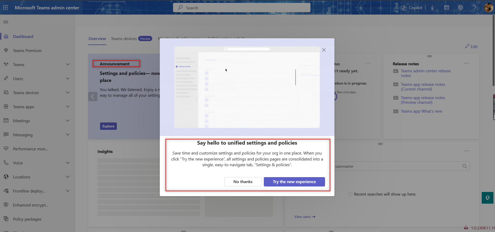
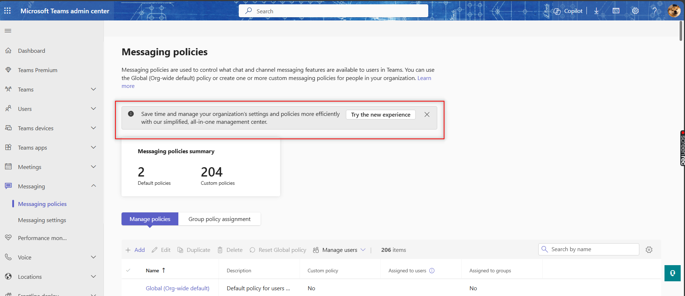
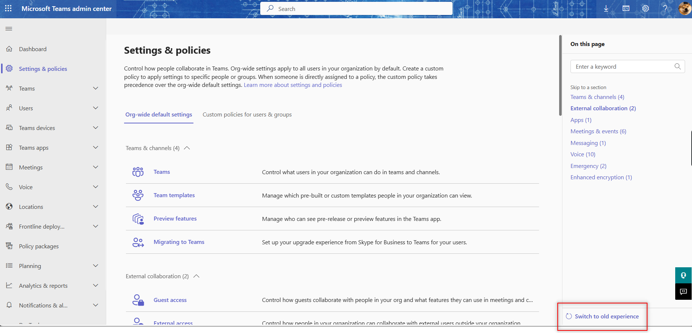
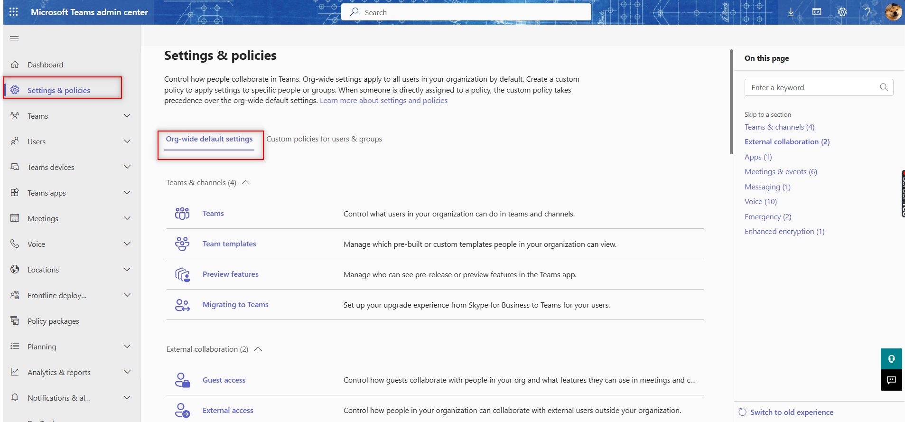
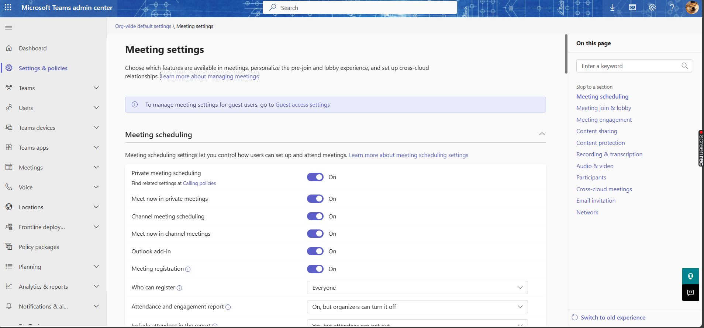
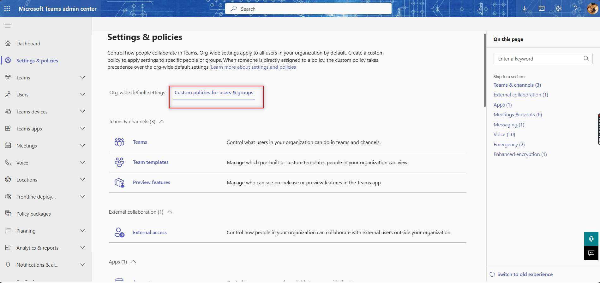
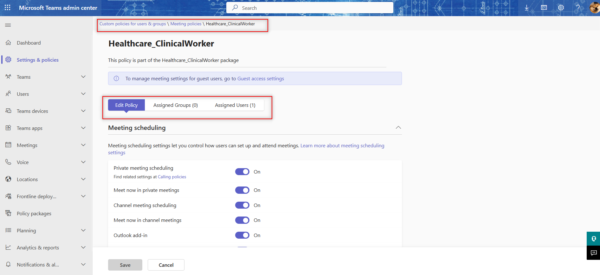

# Introducing the unified policies and settings management in Teams admin center

If you're an IT admin, chances are you have been going to different tabs in the left navigation panel in Teams admin center to setup various policies such as Meeting, messaging, live events, calling. As an IT admin, you need to have full control over how your organization uses Microsoft Teams. You need to be able to find, configure, and manage settings and policies for Teams features in a simple and intuitive way. You also need to be able to customize these settings and policies for specific users and groups, without having to deal with complex and disconnected workflows.

That's why we're introducing a new unified settings and policy experience in Teams admin center in Spring 2024. This experience enables you to manage settings and policies for Teams from a single place, with a clear and consistent navigation, a rich and informative side panel, and a streamlined and powerful assignment capability. You'll be able to apply settings and policies to your entire organization, or to specific users and groups, with ease and confidence.

## What is the new experience?

In Teams admin center left navigation, you can find the new combined settings and policy experience under one tab: **Settings & policies**. This new experience has two main tabs: Org-wide default settings and Custom policies for users & groups.

- **Org-wide default settings**: This is where you can configure settings that apply to your whole organization by default. These settings are organized by feature areas, such as Meetings, Voice, Apps, etc.

We have made it easier for you to manage the org-wide settings for a feature, by adding the right panel for fast actions.

- **Custom policies for users & groups**: This is where you can create and manage custom policies that override the org-wide settings for specific users and groups. These policies are also organized by feature areas, and you can view the details of each policy, such as the settings values, the assigned users and groups, and the last updated date and user. You can also assign policies to users and groups, either individually or in bulk, and edit or delete policies as needed.

We've improved the custom policy page by adding a three tab structure for a feature area. The tabs are edit policy - where you can customize the settings, Assigned group, and Assigned users that show the group policy assignments and direct user assignments for that specific custom policy.

## How to use the new experience?

To use the new unified settings and policy experience, you need to opt in from the Teams admin center dashboard or from any of the existing settings or policy pages. You'll see a card or a banner that invites you to try the new experience, and you can Select it to switch to the new experience. You'll also see a guided tour and coach marks that help you to explore the new features and functionalities.

*Figure 1: Opt in from Teams admin center dashboard*

*Figure 2: Opt in from existing messaging policy page*

You can always opt out from the new experience and go back to the old one, if you prefer, by clicking on the banner at the top of the new experience.

*Figure 3: Opt out from new Settings & Policies home page*

To configure org-wide settings, you can follow these steps:

1. Select the **Settings & policies** tab in the left navigation, and then on the **Org-wide settings tab**.
*Figure 4: Org-wide default settings home page*

1. Select the feature area that you want to configure, such as Meetings, Voice, Apps, etc.

    
*Figure 5: Org-wide default Meeting settings page*

1. Find the setting that you want to change, and use the toggle, dropdown, or input field to change its value.

1. Select **Save** to apply the changes, or **Cancel** to discard them.

1. Review the changes in the dialog box that appears, and Select **Apply** to confirm them, or **Cancel** to go back.

To create and manage custom policies, you can follow these steps:

1. Select the **Settings & policies** tab in the left nav, and then the **Custom policies for users & groups** tab.

    
*Figure 6: Custom policies for users & groups home page*

1. Select the feature area that you want to create or manage a custom policy for, such as Meetings, Voice, Apps, etc.

1. Select the **+Add** button to create a new custom policy, or on the name of an existing custom policy to edit it.

    
*Figure 7: Custom Meeting policy page*

1. Select **Save** to create or update the custom policy, or **Cancel** to discard it.

1. Select the **Assigned groups** or **Assigned users** tab to view or assign the custom policy to groups or individual users respectively.

## Related topics

[Manage Teams with policies](/microsoftteams/manage-teams-with-policies)
[Assign policies in Teams](/microsoftteams/policy-assignment-overview)
[Assign policies to users and groups](/microsoftteams/assign-policies-users-and-groups)
