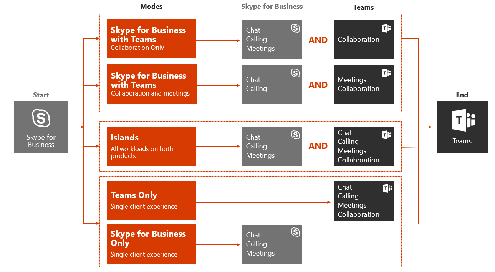
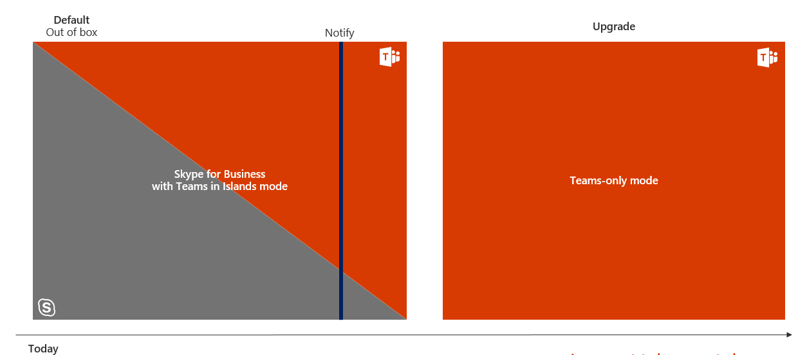
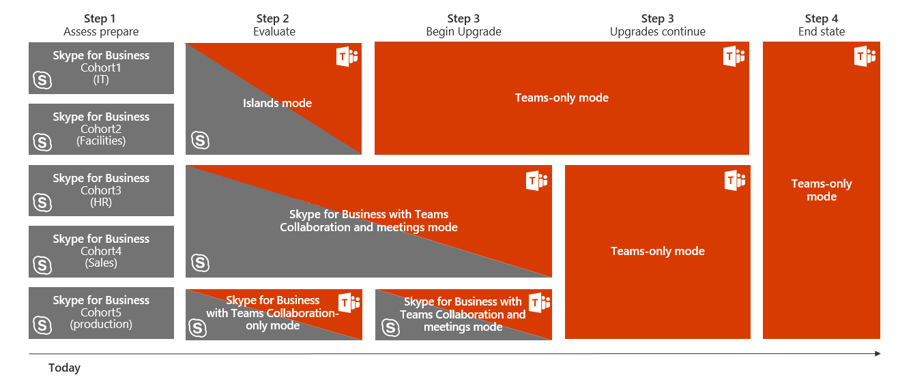

This article is part of the Project Definition stage of your upgrade journey. Before proceeding, confirm that you’ve completed the following activities:

- [Enlisted your project stakeholders](upgrade-enlist-stakeholders.md)
- [Defined your project scope](https://aka.ms/SkypetoTeams-Scope)
- [Understood coexistence and interoperability of Skype for Business and Teams](https://aka.ms/SkypeToTeams-Coexist)

# Choose your upgrade journey from Skype for Business to Teams

As an existing Skype for Business customer, your complete transition to Teams might take some time. However, you can begin realizing the value of Teams today, by enabling your users to use Teams alongside Skype for Business. Given that there’s some overlapping functionality between the two apps, we recommend that you review the available coexistence and upgrade modes to help determine which path is right for your organization. For example, you might opt to enable all workloads on both solutions without interoperability. Or, you might decide to manage the user experience, either by gradually introducing Teams capabilities or by targeting groups of users for select capabilities, until your organization is ready to upgrade everyone to Teams. Use the outcome of your pilot to help assess the right upgrade journey for your organization.

> [!IMPORTANT]
> Skype for Business Online will be retired on July 31, 2021, after which it will no longer be accessible or supported. To maximize benefit realization and ensure your organization has proper time to implement your upgrade, we encourage you to begin your journey to Microsoft Teams today.

This article outlines the various modes that enable you to manage which modalities in Skype for Business and Teams are available to your users. As with any deployment, we strongly encourage you to [pilot your intended plan](pilot-essentials.md) with a selected group of users before upgrading your organization to Teams. Remember, introducing new technology can be disruptive for users. Take time to assess user readiness and implement a communication and training plan prior to implementing any of the modes outlined herein.

> [!TIP]
> Join us for live, interactive workshops in which we’ll share guidance, best practices, and resources designed to kick start upgrade planning and implementation.
>
>Join the [Plan your upgrade](https://aka.ms/SkypeToTeamsPlanning) session first to get started.

## Upgrade journey building blocks

To formally prepare your organization for its journey to Teams, you need to start planning for the upgrade scenarios that will eventually let your organization fully embrace Teams as your sole communications and collaboration solution.

To help guide your decision-making process, familiarize yourself with the various modes, concepts, and terminology relevant to upgrading from Skype for Business to Teams. For more information, see [Microsoft Teams and Skype for Business coexistence and interoperability](https://aka.ms/SkypeToTeams-Coexist)

A user that has been migrated to Teams no longer uses a Skype for Business client except to join a meeting hosted in Skype for Business. All incoming chats and calls land in the user’s Teams client, regardless of whether the sender uses Teams or Skype for Business. Any new meetings organized by the upgraded user will be scheduled as Teams meetings. If the user attempts to use the Skype for Business client, initiation of chats and calls is blocked1. However, the user can (and must) still use the Skype for Business client to join meetings they are invited to.

Administrators manage their transition to Teams using the concept of [mode](migration-interop-guidance-for-teams-with-skype.md#coexistence-modes), which is a property of [TeamsUpgradePolicy](https://docs.microsoft.com/powershell/module/skype/grant-csteamsupgradepolicy?view=skype-ps). A user that has been migrated to Teams as described above is in “TeamsOnly” mode. For an organization that is migrating to Teams, the ultimate goal is to move all users to TeamsOnly mode.

There are two methods for migrating an existing organization with Skype for Business (whether online or on-premises) to Teams:

- **Overlapping capabilities method** (using Islands mode): Users in an existing Skype for Business organization are introduced to Teams so that they can use both clients side by side during a transitional phase. During this period, most--but not all--functionality of Teams is available to them. The mode for this configuration is referred to as Islands, and this is the default mode for any existing organization with Skype for Business. Once the organization is ready, the administrator moves the users to TeamsOnly mode.
- **Select capabilities method** (using one or more of the Skype for Business modes): The administrator manages the transition (from Skype for Business to Teams) of chat, calling, and meeting scheduling functionality for users in their organization. Each of these functions is available either in Skype for Business or Teams, but not both. Administrators use TeamsUpgradePolicy to control when to shift this functionality to Teams for their users. Users who are not yet in TeamsOnly mode continue to use Skype for Business for chat and calling, and the two sets of users can communicate via interop functionality. Administrators manage the transition by progressively migrating more users into TeamsOnly mode.

1Older Skype for Business clients that shipped before 2017 do not honor TeamsUpgradePolicy. Make sure you are using the latest Skype for Business client available in your Office channel.

Below are the key factors to help decide the appropriate path for your organization. 

## Overlapping capabilities method (using Islands mode)

With the overlapping capabilities method, users can use both Teams and Skype for Business clients for chat, VoIP calling, and meetings. In this method, chat and VOIP calling in Teams is intra-organization focused, while Skype for Business enables chat and VOIP/PSTN calling with external organizations (if configured). Meetings can be scheduled and attended in both products.

When using the overlapping capabilities method, the communication traffic for Skype for Business and Teams remains separate (even for the same user) and the two different clients never communicate with each other (for users within the same organization). User experiences are based on the recipient’s configuration. For example, assume recipient User A is using this upgrade method:

- Communication initiated from another user’s Skype for Business client will always land in User A’s Skype for Business client.
- Communication initiated from the Teams client from a *user in the same organization* will always land in User A’s Teams client.
- Communication initiated from Teams client from a *user in an external organization* will always land in User A’s Skype for Business client.

If you have assigned an Office 365 license to your users, this will be the default upgrade experience for your organization. When you assign an Office 365 license, both Teams and Skype for Business Online licenses are assigned by default.2

For this method to work effectively, all users must run both clients simultaneously. Incoming chats and calls from within the organization to a user in Islands mode can land in either the Skype for Business or Teams client--and this is not under the control of the recipient. It depends on what client the sender uses to initiate the communication. If the sender and recipient are in different organizations, incoming calls and chats to a user in Islands mode always land in the Skype for Business client.

For example, if an Islands mode recipient is signed in to Skype for Business but not Teams, and someone messages them from Teams, the Islands mode recipient will not see the message (but they will eventually get an email saying they missed a message in Teams). Likewise, if a user is running Teams but not Skype for Business, and someone messages that user from Skype for Business, the user will not see that chat. The behavior in each of these cases is similar for calling. If users do not run both clients, it can easily lead to frustration.

Presence also functions independently between Teams and Skype for Business using this upgrade method. This means other users may see different presence states for User A, depending on which client they use. For more details, see [Presence](upgrade-to-Teams-on-prem-overview.md#presence).

- Other users, when using Teams, will see presence based on User A’s activity in Teams.
- Other users, when using Skype for Business, will see presence based on User A’s activity in Skype for Business.

However, non-upgraded recipients in Islands mode may continue to receive chats and calls from a TeamsOnly user in either their Skype for Business or Teams clients. For existing conversations the TeamsOnly user will reply to the client the sender initiated the chat or call from. 

For new conversations from the TeamsOnly user’s point of view, the chat or call will always go to the Islands mode users Teams client. This is because the Teams client maintains separate conversation threads for Teams-to-Teams and Teams-to-Skype for Business communication, even for the same user. To learn more, see [Teams Conversations - Interop versus native threads](upgrade-to-Teams-on-prem-overview.md#teams-conversations---interop-versus-native-threads).

The following table summarizes the Teams experience for both Islands mode and TeamsOnly mode:

| Teams experience | In Islands mode | In TeamsOnly mode |
|:------------------ | :------------------- | :------------------ |
| Incoming chats and calls received in:|  Teams or Skype for Business | Teams |
| PSTN calls received in: | Skype for Business  (Using PSTN functionality in Teams is not supported in Islands mode.) 	| Teams |   
 |Presence	| Presence in Skype for Business and Teams is independent. Users may see different states for the same Islands user, depending on which client they use. | Presence is based solely on the user’s activity in Teams. All other users, regardless of which client they use, see that presence. | 
 | Meeting Scheduling	| Users can schedule meetings in either Teams or Skype for Business. They will see both add-ins in Outlook.	| 	Users only schedule meetings in Teams. Only the Teams add-in is available in Outlook. | 

The following table summarizes the pros and cons of using the overlapping capabilities method to migrate your organization to Teams.

| Pros     |       Cons |
| :------------------ | :---------------- |
| Allows for rapid adoption within an organization.| Potential for end user confusion because there are two clients with similar functionality, but different user interfaces. Also, they have no control over which client the incoming chats/calls land in. |
| Allows users to learn and get familiar with Teams while still having full access to Skype for Business. | Potential for end user dissatisfaction due to missed messages if the user is not running both clients.|
| Minimal administration effort to get started in Teams. | Can be challenging to “get out of Islands” mode and move to TeamsOnly mode if users and those they regularly communicate with are not actively using Teams.|
|Enables users to leverage capabilities to enhance teamwork that are not available in Skype for Business.| A user who is using Skype for Business on premises and Teams will not be able to communicate from Teams with another user who is using Skype for Business on premises but does not have Teams.  |

2This is true even if the user is homed on-premises in Skype for Business Server. Whether the user is homed on-premises or online, leave the Skype for Business Online license enabled, because it is currently needed for full Teams functionality.
3Note that migration of Skype for Business meetings to Teams meetings is only triggered when applying TeamsUpgradePolicy to individual users, not on a per tenant basis. See Meeting Migration for details.

=========original article below============

When some of your users are ready to use only Teams for their day-to-day communications and collaboration needs, you can start upgrading these users to Teams by enabling **Teams Only** mode for them.

If it’s not feasible for your whole organization to move to Teams, you can start by piloting Teams alongside Skype for Business in **Islands** coexistence mode. As the additional coexistence modes, (i.e. **Skype for Business with Teams collaboration** and **Skype for Business with Teams collaboration and meetings**), are become progressively fully available in the next few months, you can also start by fully adopting Teams as a group collaboration solution first while keeping Skype for Business as your organization’s unified communications solution. That is Microsoft’s recommended path for customers using Skype for Business Server (on-premises or hybrid) and customers with significant complexity whose trajectory to Teams will include a long coexistence period.

The following table compares coexistence and upgrade modes.

|Mode |Situation |Recommended Use |Advantages |Caveats |
|---|---|---|---|---|
|Islands |Smaller or simpler Skype for Business deployment  Ability and willingness to manage some short-term complexity to move to Teams more quickly |Go to the full Teams experience as quickly as possible  Conduct a proof of concept (PoC) of Teams  Recommended upgrade path for organizations who adopted Skype for Business Online |Simple to operate  Richest Teams experience up-front for all capabilities |Requires good user communication to avoid confusion and to drive usage toward Teams  Exit strategy requires users to have fully adopted Teams prior to starting upgrade to Teams Only phase  No interop for users in Islands mode; also no federation from Teams when the user’s Skype for Business account is homed on-premises|
|Skype for Business with Teams collaboration |Skype for Business deployment with requirements that aren’t yet met by Teams (for example, advanced compliance)  Long-term need for and/or commitment to Skype for Business|Start Teams adoption quickly, focusing on group collaboration first  Want to keep all unified communications workloads on Skype for Business for now  Recommended use as the starting point for organization starting their journey from on premises (or hybrid) Skype for Business|No overlapping capabilities between Teams and Skype for Business  Instant messaging chat and meeting scheduling will reside in Skype for Business (tied to calling)  Interoperability with users in Teams Only|
|Skype for Business with Teams collaboration and meetings |Skype for Business deployment with significant use of enterprise voice and requirements that aren’t yet met by Teams calling  Long-term need for and/or commitment to Skype for Business  Might be using a third-party meeting service|Start Teams adoption quickly, going beyond group collaboration  Improve your users’ meetings experience  Recommended use for on premises organizations wanting to take advantage of Teams meetings prior to being ready to fully upgrade (generally due to Enterprise Voice on-premises). |No overlapping capabilities  Superior meetings on Teams. Features roadmap, UX and cross platform, quality and reliability  "Better Together" experiences between Skype for Business and Teams  Interoperability users in Teams Only.|Instant messaging and chat will reside in Skype for Business (tied to calling)|
|Teams Only |Teams Only is the final destination for all users, eventually.  Some users need to stay on Skype for Business  You’re upgrading your Skype for Business Online users to Teams while keeping Skype for Business on-premises users on Skype for Business Server  You might have already deployed users in islands mode and are ready to retire Skype for Business for groups of users |Reduce variable costs on Skype for Business (on-premises server operations, outsourcing contract, and so on)  Go to the full Teams experience as quickly as possible, for at least some users|Limits user confusion by providing only one client to work with Interoperability with users in Skype for Business Only, Skype for Business with Teams Collaboration, Skype for Business with Teams Collaboration and Meetings|Interoperability only supports basic chat and calling between Skype for Business and Teams, and interop escalation scenarios for desktop sharing and multi-party chat and calling|
|Skype for Business only |Some users need to stay on Skype for Business  |Limits user confusion by providing only one client to work with  User can still participate in Teams meetings they are invited to|Continue to meet business requirements that currently can only be met by Skype for Business  Interoperability with users in Teams Only|Interoperability only supports basic chat and calling between Skype for Business and Teams, and interop escalation scenarios for desktop sharing and multi-party chat and calling|

> [!TIP]
> To help identify the recommended upgrade mode based on the capabilities you want to enable in Teams while Skype for Business is still in use, leverage the [Skype to Teams Upgrade Wizard](https://aka.ms/SkypeToTeamsWizard).

## Upgrade journeys

You can take multiple approaches to upgrading from Skype for Business, either online or on-premises, to Teams:

- In a direct upgrade journey, you first deploy Teams alongside Skype for Business in **Islands** mode as part of evaluation and early adoption, and then upgrade your users to **Teams Only** mode with the goal of quickly retiring Skype for Business from the environment for all users in the organization. This is the recommended journey for Skype Business online customers, unless they are concerned their users will be confused with having two tools to conduct the same action (chat, calling, meeting scheduling).
- A gradual upgrade journey delivers a specific coexistence and upgrade mode to a specific group of users (also called a *cohort*), depending on their communications and collaboration requirements. Over time, the entire organization can converge into using Teams Only and eventually replace Skype for Business. However, if your organization has compelling business reasons to keep Skype for Business—such as a dependency on a Unified Communications Managed API (UCMA)–based solution that integrates with line-of-business applications, or an ethical wall solution currently available for Skype for Business only, or a complex Enterprise Voice deployment that will take time to upgrade to **Teams Only**—you can upgrade a portion of users to **Teams Only** mode while retaining Skype for Business users in one of the coexistence modes for a portion of your user population. Gradual upgrade journey is the recommended approach for on-premises (and hybrid) customers starting with Skype for Business with Teams Collaboration coexistence mode and moving from there to Teams Only mode when requirement for the users met (possibly through the Skype for Business with Teams Collaboration and Meetings coexistence mode).

> [!IMPORTANT]
> For both types of upgrade journey, if your organization is currently a Skype for Business on-premises deployment only, you need to start planning to implement Skype for Business hybrid before upgrading your users to **Teams Only** mode. This will also help facilitate interoperability with Teams.

> [!NOTE]
> **Teams Only** mode requires that the users who are part of cohorts be homed in Skype for Business Online, and a hybrid relationship between your Skype for Business on-premises deployment and your Skype for Business Online tenant is required to facilitate the interoperability between Skype for Business and Teams. The move to Skype for Business Online must be completed for users who are part of the cohorts before they’re upgraded to **Teams Only** mode. Skype for Business Server 2019, and Skype for Business Server 2015 with CU8 update can simplify the mechanics of upgrading on-premises users to Teams by managing the migration to Skype for Business Online and upgrading the users to **Teams Only** mode in one step.

### Direct upgrade journey

The direct upgrade journey is illustrated in the following diagram.

Teams is deployed to all users in the organization and configured in **Islands** mode. When your organization determines that Teams is ready to fulfill all of your communications and collaboration needs, notify the users and upgrade them to **Teams Only** mode. At that point, Skype for Business can be retired from the environment.

### Gradual upgrade journey

An example of a gradual upgrade journey is illustrated in the following diagram.

Teams is deployed in the organization in **Islands** mode for evaluation and then move to different coexistence and upgrade modes for different groups of users. For example, a group of users can be enabled for **Islands** mode, another enabled for **Skype for Business with Teams collaboration and meetings** mode, while a third group of users might initially be enabled for **Skype for Business with Teams collaboration only** mode.

Over time, groups of users can be upgraded to **Teams Only** mode, followed by the rest of the organization. Eventually, the entire organization will be ready to retire Skype for Business and use only Teams for communications and collaboration, or—if business requirements dictate that Skype for Business be retained for a specific group—the majority of users in the organization can use Teams Only.   
<table>
<tr><td>  Decision point</td><td><ul> Which upgrade journey is suitable to your organization's business requirements?  </ul></td></tr>
<tr><td> Next step</td><td><ul> Identifying your current deployment model, use case scenarios, and key considerations for your organization will inform the journey to Teams that’s best suited to your organization.  </ul></td></tr>
</table>

<table>
<tr><td>  Decision point</td><td><ul> Which upgrade scenario is applicable to your organization?  </ul></td></tr>
<tr><td> Next steps</td><td><ul> Decide the timeline of your organization's upgrade journey based on messaging, meetings, and calling business requirements.   Decide the required additional work to complete your upgrade journey.  </ul></td></tr>
</table>

After you’ve chosen the best upgrade journey for your organization, [perform your upgrade to Teams](https://aka.ms/SkypeToTeams-Upgrade).
