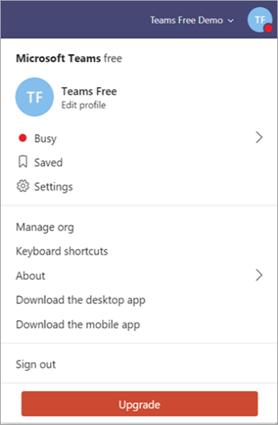

Upgrade Microsoft Teams free to Office 365 subscription version
======================================================

If your organization is using the free version of Microsoft Teams, you can easily upgrade to the full version by purchasing an Office 365 subscription plan for your users. The full version provides additional Teams features — like scheduling, audio conferencing, enhanced administration, and security capabilities — that the free version doesn’t provide. Office 365 combines the familiar Microsoft Office desktop suite with cloud-based versions of Microsoft's next-generation communications and collaboration services — including Exchange Online, SharePoint Online, and Office Online — to help users be productive from virtually anywhere through the internet. When you upgrade Teams, your existing Teams data will not be lost; all your teams, channels, chats, files, and permissions come with you. 

> [!NOTE]
> If you already have an Office 365 subscription, you’re eligible for the trial version of Teams (with your corporate identity), not the free version. The Teams trial provides the full version of Teams for a limited time. For more information, see [Manage the Microsoft Teams Commercial Cloud Trial offer](iw-trial-teams.md).

## How does Teams free compare to the full version of Teams?

Teams free is designed for small to medium businesses and has the following features:

- 300 maximum users
- Unlimited chat messages and search
- Guest access
- Integration with apps and services, including the Online versions of Word, Excel, PowerPoint, and OneNote
- 2 GB of storage per user and 10 GB of shared storage
- 1:1 and group online audio and video calling
- Channel meetings
- Screen sharing

The full version of Teams included with an Office 365 subscription provides the following features in addition to the features that Teams free provides:

- No user limit (with an enterprise license)
- Exchange email hosting and custom email domain
- OneDrive, SharePoint, Planner, Yammer, and more Office 365 services
- 1 TB of storage per user
- Scheduled meetings
- Audio conferencing
- Enhanced security and compliance features, including multi-factor authentication, single sign-on, and advanced auditing and reporting
- Administrative controls and support features, including 24 x 7 phone and web support, admin tools for managing users and apps, usage reporting for Office 365 services, service-level agreement, and configurable user settings and policies

For a detailed comparison of Teams free and Teams features, see [Compare Teams plans](https://products.office.com/microsoft-teams/free).

## Upgrade requirements

You can upgrade to the full version of Teams if you meet the following requirements:

- You are the person who signed up for the existing Teams free subscription.
- If you are bringing your own domain, it isn’t already associated with Azure Active Directory (via trial or purchased O365 subscription).

> [!NOTE]
> To upgrade and transfer your data, you have to buy your subscription through the upgrade process in the Teams application. If you purchased Office 365 with Teams without going through the upgrade process, you can’t transfer your data because you will already have a separate tenant.

## Limitations

Keep the following limitations in mind:

- You can’t switch back to Teams free after you upgrade.
- You can’t merge multiple Teams free tenants into a single paid tenant.
- All users must be in the same domain. (All users will get a sign-in in the format *username*@*domain.com*.)
- All users must be upgraded: a mix of Teams free and paid subscription users in the same tenant is not supported.

## How do I upgrade my organization?

To upgrade to the full version of Teams, select **Upgrade** in Teams.

Enter the email address that you use to sign in to Teams, and then purchase an Office 365 Business Premium plan. If you would like to purchase Office 365 Business Essentials or an Enterprise edition of Office 365, [contact support](https://portal.office.com/support/altusupport.aspx?app=teamsfreeupgrade).

## What's next?

After your upgrade is complete, see [Get started with Microsoft Teams](get-started-with-teams-quick-start.md) for first steps and [Adopt Microsoft Teams](adopt-microsoft-teams-landing-page.md) for a phased approach to Teams adoption across your organization.

## More information

- To find out more about Teams versions and their capabilities, see [Compare Teams plans](https://products.office.com/microsoft-teams/free).
- For more information about upgrading to the full version of Teams, see [Upgrade from Teams free to Teams](https://support.office.com/article/Upgrade-from-Teams-free-to-Teams-29475bbd-a34f-4175-9b33-d44430f8ad39).
- For additional admin tasks associated with upgrading users, including adding user licenses, changing user names, and assigning temporary passwords, see [For admins upgrading from Teams free to a paid subscription](https://support.office.com/article/for-admins-upgrading-from-teams-free-to-a-paid-subscription-75a95e7f-001e-42d0-a787-ae8b992d5a52).
- For information about managing Teams free in your organization, see [Manage the free version of Microsoft Teams](manage-freemium.md).

