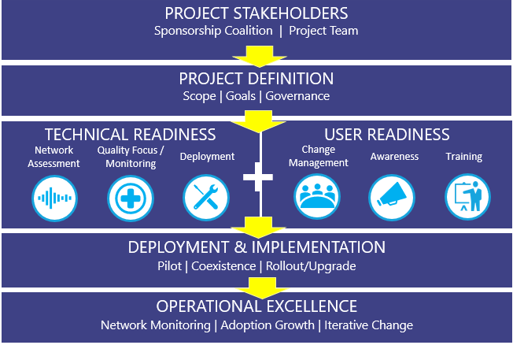

<h2>Skype for Business to Microsoft Teams  upgrade journey </h2>
<ul class="panelContent cardsW cols cols2">
    <li>
        

            

                

                    

                        
Supporting Microsoft’s intelligent communications vision, Microsoft Teams is the central hub for teamwork, bringing together chat, meetings, calling, collaboration, app integration, and file storage. As an existing Skype for Business customer, you’re invited to upgrade to Microsoft Teams, to experience this full suite of communication and collaboration capabilities in a single client experience.

                        
Your upgrade journey might take some time, and because you’re a valued Skype for Business customer, we’re here to support you every step of the way. Whether you’re just getting started with Teams, already using Teams alongside Skype for Business, or ready to upgrade, we’re working hard to bring you the right level of guidance for your organization and encourage you to take the next steps to begin realizing the value Teams can offer your organization.

                        
To help take the guesswork out of your upgrade journey, we’ve employed a proven success framework for driving change, incorporating guidance, tips, and resources throughout. Each step builds on the previous one. For optimal results, we recommend following the steps in order.

                        

                    

                

            

        

    </li>
    <li>
        

            

                

                    

                        

                            
                        

                    

                

            

        

    </li>
</ul>
<ul class="panelContent cardsFTitle">
    <li>
        <a href="https://review.docs.microsoft.com/en-us/MicrosoftTeams/upgrade-essentials?branch=upgrade-working">
        

            

                

                    

                        

                            
                        

                    

                    

                        <h3>Plan</h3>
                    

                

            

        

        </a>
    </li>
    <li>
        <a href="https://docs.microsoft.com/en-us/MicrosoftTeams/prepare-network">
        

            

                

                    

                        

                            
                        

                    

                    

                        <h3>Deploy</h3>
                    

                

            

        

        </a>
    </li>
<!--    <li>
        <a href="https://docs.microsoft.com/en-us/MicrosoftTeams/user-access">
        

            

                

                    

                        

                            
                        

                    

                    

                        <h3>Manage</h3>
                    

                

            

        

        </a>
    </li>
-->
</ul>

> [!Important]
> If you’re an admin on your Office 365 tenant, you might start seeing upgrade options in your PowerShell cmdlet or Teams Admin Center. Having the option to upgrade doesn’t necessarily mean your organization is ready for this change. For an optimal user experience, be sure to validate that the features you need are available, and verify that your technical team and user population are ready before you activate any upgrade options for your tenant.
