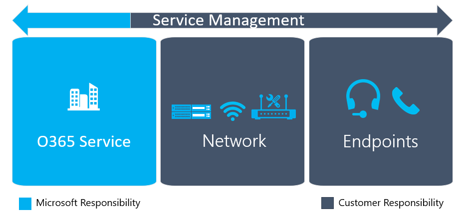
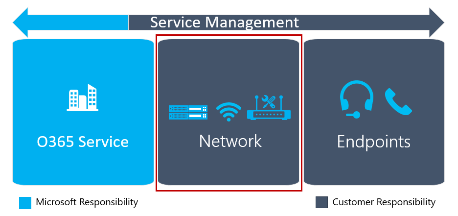
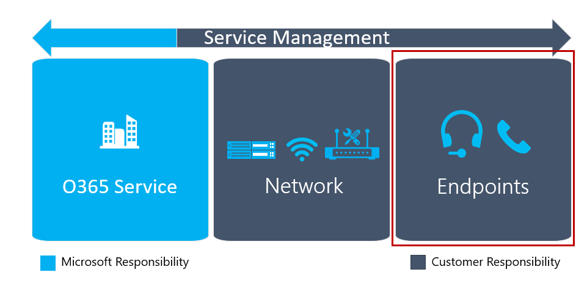

This article is part of the Technical Readiness stage of your upgrade journey, an activity you complete in parallel with the User Readiness stage. Before proceeding, confirm that you’ve completed these activities from previous stages:

- [Enlisted your project stakeholders](upgrade-enlist-stakeholders.md)
- [Defined your project scope](https://aka.ms/SkypetoTeams-Scope)
- [Understood coexistence and interoperability of Skype for Business and Teams](https://aka.ms/SkypeToTeams-Coexist)
- [Chosen your upgrade journey](upgrade-and-coexistence-of-skypeforbusiness-and-teams.md)

<!-- [!INCLUDE [envision-planning-for-service-management-and-quality-complete-guide](envision-planning-for-service-management-and-quality-complete-guide.md)]-->

# Plan for quality

If you’re deploying audio, video, or meetings, you can take some additional steps to optimize your environment for that functionality. This content will provide an overview of the requirements that are necessary to deliver and maintain a high-quality Microsoft Teams deployment. You can help ensure a successful deployment by planning for service management and quality, before your first pilot or production deployment.

The guidance is organized into the following sections:

- First is an overview of user experience and the key components that underpin quality. This highlights the areas to focus on prior to onboarding to Microsoft Teams.

- Second, guidance is given for planning a support model to manage Microsoft Teams prior to the first user pilot or production deployment. This section describes the tasks that need to be performed on a regular basis to maintain a high-quality Teams deployment. In addition, this section introduces you to further guidance which you can use to start understanding and operationalizing these tasks.

- Third, specific guidance helps with planning your network and endpoints in your organization to support Microsoft Teams.

- Lastly, next steps are summarized with references to related content.

## Key technical components that affect user experience

The key technical components that affect user experience will be reviewed in this section. Before reviewing the key components, it’s critical that you understand user experience and its importance in realizing your organization’s business goals. Let’s review how we define the user experience first.

### User experience defined

Business goals can be realized when you deploy Microsoft Teams and when users adopt Teams as their core collaboration and communication solution. Quality can help ensure a positive user experience, a key attribute in driving usage and adoption. By delivering a high-quality service that delights people, individuals and teams can gain confidence and find new and innovative ways of using the service that drive business benefits.

At the heart of this is the user’s experience with Teams—the person’s emotions and attitudes toward the service. So what contributes to the user experience? It ranges from users’ knowing how and why to use Teams and incorporating it into their daily workflow to experiencing exceptional call quality and being able to connect reliably, regardless of where they are. User experience is very broad in nature; this article focuses only on those technical elements that can be controlled by your organization. Additional information about user readiness can be found in [Prepare your organization for Teams](https://aka.ms/SkypeToTeams-UserReadiness).

There are specific requirements to the deployment that are critically important to deliver a fantastic user experience—especially when using the Cloud Voice features in Teams. It is critical to treat Microsoft Teams as a first-class citizen with other communication and collaboration investments, prioritizing real-time traffic accordingly. The following section gives an overview of the key components that affect user experience. In further sections, we will provide you guidance on how to start planning to deploy and maintain the key components that comprise quality.

### Key components of quality

An organization or supporting partner should start planning for three key components during the Technical Readiness stage of a Teams deployment: service management, network, and endpoints. The combination of all three areas is fundamental to the quality of the user experience.

#### Service management

Service management can be divided into two distinct categories of responsibility:

- **Microsoft responsibility**. Microsoft is responsible for the infrastructure components that the Office 365 service comprises. Microsoft is accountable to customers to ensure that any of their users connecting to Teams is provided with a reliable and high-quality experience.

- **Customer responsibility**. You and your organization are responsible for managing various aspects of the Office 365 service, on-premises network, and user endpoints. For example, as new IP addresses are added to Office 365, you must update the appropriate firewalls to allow communication to the new endpoints to avoid user disruption.

For detailed guidance for service management planning, see [Plan for service management](#plan-for-service-management).

#### Network

In most organizations, networks were initially designed to provide access to data and applications that resided in their datacenters. Cloud-based applications like Office 365 require changes to these networks to support the new access and data flows that Teams requires. Before you can enable users for Teams in your organization, you must evaluate and optimize your current network. This is critically important when leveraging cloud voice capabilities.

In traditional networks, users will need to traverse the perimeter networks of an organization to access Teams. Many organizations will have security-based devices such as proxy servers, firewalls, and VPNs that can block, impede, or provide an unoptimized path for network traffic.

Furthermore, the core internal networks need to be optimized and right-sized to provide sufficient capacity and quality for supporting the Teams workloads, including real-time media. You can use bandwidth planning, remediation, and optimization to help ensure your network provides a high-quality and efficient path to Office 365.

For detailed guidance about network planning, see [Plan for network quality](#plan-for-network-quality).

#### Endpoints

Microsoft Teams supports a variety of endpoints. From PCs to tablets to phones, you can access Teams anywhere from virtually any device.

To give your users the best experience possible, you need to consider these important aspects: Do your endpoints meet the Teams hardware and software requirements? Have you configured and optimized endpoints to support Wi-Fi networks? Which devices will you use to make and receive voice calls? Are those devices optimized for Teams?

For detailed guidance about endpoint planning, see [Plan for endpoint quality](#plan-for-endpoint-quality).

## Plan for service management

Service management is a broad topic that covers day-to-day operations of the Microsoft Teams service after it has been deployed and enabled for users. The Teams service encompasses Microsoft Office 365 and the infrastructure components that are deployed on-premises (for example, networking).

The notion of service management is most likely not a new concept for most organizations. You probably have already implemented processes and tasks that are associated with existing services. That said, you can probably augment what you have in place when you plan for service management today to support Microsoft Teams in the future.

Service management encompasses all the activities and processes involved in managing Microsoft Teams end to end. As described earlier, some components of service management—the infrastructure components that the Office 365 service itself comprises—are Microsoft’s responsibility, whereas the customer is accountable to its users to manage the various aspects of Teams, the network, and endpoints they provide. This section of the document will focus on the customer’s responsibility from a service management perspective.

### Introduction to the Operations Guide

**What**, **Who**, and **How** are three important questions that need to be answered when it comes to service management.

You can use the [Operations Guide](1-drive-value-operate-my-service.md) to help you address all three of these questions. The guide provides a list of activities to be performed on a daily, weekly, monthly, and as-needed basis. These activities and tasks are critical for maintaining a high-quality Teams deployment. Determining who will be responsible for performing specific activities in service management is a critical aspect of your planning that you need to do early in the [planning stage](upgrade-enlist-stakeholders.md) to ensure a successful deployment. After you’ve figured out the tasks and activities, they need to be understood and followed by the groups or individuals that you assign to them. The Operations Guide provides knowledge and guidance for how to perform each of the tasks, and/or references to outside content.

### Operational role mapping

Planning for service management early is a critical milestone, because the operations phase begins when the first pilot users are enabled. The project team must review and agree on the tasks and activities required, identify the team that’s responsible for each operational task, and then get a commitment and sign-off from each respective team.

After sign-off is complete, the responsible team must then start operationalizing these roles and responsibilities. This might include training and readiness, updating the staffing model, or ensuring that external partners are ready to deliver.

Mapping operational roles as you gather your [project team](upgrade-enlist-stakeholders.md) enables all teams to start their operational tasks during the pilot, and ramp up operations and make sure that everything is ready after the deployment starts.

The Operations Guide provides a list of common tasks mapped to typical roles that should be valid in most scenarios. You need to customize these responsibilities to work for your organization.

### The Quality Champion role

A group or individual needs to be accountable for quality in all organizations. This is the most important role in service management. The Quality Champion is a customer role that's assigned to a person or group who is passionate about their users' experience. This role requires the skills to identify trends in the environment and the sponsorship to work with other teams to drive remediation. The best candidate for the Quality Champion is typically the customer service owner, who—depending on the organization’s size and complexity—could be any person or group who is passionate about user experience.

The Quality Champion leverages existing tools and documented processes, such as the Call Quality Dashboard (CQD) and the Quality Experience Review Guide, to monitor user experience, identify quality trends, and drive remediation where needed. The Quality Champion works with the respective teams to drive remediation actions, reporting to a steering committee on their progress and open issues.

The tasks and activities associated with the role have been documented in the Operations Guide. This role should be assigned during the [planning stage](https://aka.ms/SkypeToTeams-Plan). A key step in operationalizing the role of Quality Champion is gaining the knowledge required for the role and ensuring the prerequisites are in place to deliver on the tasks. A key task for this role is running a regular Quality Experience Review.

### Introduction to the Quality Experience Review Guide

The Quality Experience Review Guide has a set of activities that assess and provide remediation guidance in key areas that have the greatest impact for improving user experience as shown in the figure below.

By continually assessing and remediating the areas described in this document, you can reduce their potential to negatively affect user experience. Most user-experience problems encountered in a deployment can be grouped into the following categories:

- Incomplete firewall or proxy configuration

- Poor Wi-Fi coverage

- Insufficient bandwidth

- VPN

- Use of unoptimized or built-in audio devices

- Problematic subnets or network devices

The guidance provided in the Quality Experience Review Guide focuses on using Call Quality Dashboard (CQD) Online as the primary tool to report and investigate each area described, with a focus on audio to maximize adoption and impact. Any optimizations made to the network to improve the audio experience will also directly translate to improvements in video and desktop sharing.

We highly recommend that you nominate the Quality Champion early on. After being nominated, they should start to familiarize themselves with the content in the Quality Experience Review Guide.

The Quality Experience Review Guide can be found [here](https://aka.ms/qerguide).

## Plan for network quality

Planning for network quality will be the focus for the following section.

As previously mentioned, planning for network quality prior to onboarding to Microsoft Teams is critical. For further guidance for network readiness, see [Prepare your organization's network for Microsoft Teams](prepare-network.md).

In most organizations, networks can comprise both managed and unmanaged networks.

Managed networks are components of the network infrastructure that an organization has direct control over. As a result, managed networks have a direct influence on the quality that can be provided to real-time traffic workloads.

Conversely, unmanaged networks are segments of the network that a customer has limited control, or no control, over.

Internet connections between the organization and Office 365 are networks where a customer has limited control. The networks are managed by an ISP, but organizations should be able to influence the quality of the network by upgrading their bandwidth, advocating for route optimizations, or—if all else fails—switching ISPs.

Home networks or networks in hotels or coffee shops are examples of networks where a customer has no control.

In the following sections, we will focus on the quality requirements of managed networks.

### Key network planning areas

The following sections focus on the important areas for delivering a high-quality network.

> [!NOTE]
> Many networks evolve over time due to upgrades, expansion, or other business requirements. Ensure that you have operational processes in place to maintain these areas as part of your service management planning.

#### Bandwidth

Bandwidth planning is a critical aspect of the network readiness activity. Ensuring that there's enough bandwidth for the Microsoft Teams workloads is imperative. To be able to right-size an existing network, you must understand what’s currently provisioned, the current utilization, and—ultimately—the remaining available bandwidth.

To measure current utilization, you need to monitor the network. This measurement can then be used as the starting point for bandwidth planning. In addition, the network should be continually monitored during the deployment and after the deployment to ensure that the network is sufficiently provisioned.

> [!NOTE]
> When monitoring network utilization, it’s important to avoid using averages over the day. These averages can include non-core hours that skew the result. Averages can hide peak periods and mask an underlying problem.

#### Quality of service (QoS)

QoS should be implemented on all segments of the managed network, even networks that have been adequately provisioned for bandwidth. In the latter case, QoS acts as a risk mitigation in the event of unanticipated network load. When QoS is implemented, voice traffic will be prioritized so that these unanticipated events don’t affect quality.

A QoS implementation should include areas of the network, from the endpoint all the way up to the egress points and from the egress points back to the endpoint. This will ensure that voice traffic is being prioritized in both directions. QoS should be implemented on both wired and Wi-Fi networks.

For implementing QoS on your network, the following guidance can help [Quality of Service in Microsoft Teams](qos-in-teams.md)

#### Proxy servers

Many organizations view traffic destined for the internet as a security risk, and they mitigate this risk by monitoring and evaluating traffic at the egress points in the network. Proxy servers are a class of devices that can be deployed to meet this requirement.

A proxy server can introduce problems when performing packet inspection or modification to the payload. This can lead to call setup failures, dropped calls, and poor call quality. If real-time media is forced to traverse a proxy server, the media stack in Teams will be forced to fail back to TCP, which can further reduce quality. UDP is always preferred over TCP.

In addition, a proxy server might not be designed to handle the additional load of Office 365, and specifically Microsoft Teams workloads—including real-time media.

Due to the potential problems a proxy server can introduce, and these additional capacity concerns, Microsoft recommends bypassing the proxy server and making a direct connection to Office 365.

The configuration required to bypass the proxy server varies among vendors, but the common approach typically involves updating the proxy auto-config (PAC) file. The PAC file is a configuration file that describes which traffic goes through the proxy and what traffic bypasses it.

Some proxy server vendors provide an automated process for ensuring the configuration is up to date. If your vendor doesn’t provide this automatic process, you can download an updated PAC file from <https://aka.ms/o365proxies>.

[Proxy Servers for Teams or Skype for Business Online and Teams](proxy-servers-for-skype-for-business-online.md)

#### Firewalls

Ensuring that the right ports and protocols are open to all Office 365 IPs and URLs is required to gain access to Microsoft Teams. It’s also critical for a high-quality deployment. Simply making a call or joining a conference call is not enough to be sure your firewall is properly configured.

If only TCP is opened on the firewall, the session will be established, but the preferred transport (UDP) is not negotiated. Both TCP and UDP are required to be open on the firewall to provide the best user experience.

Due to its stateful nature, TCP isn’t preferred for real-time media and is only provided as a failback network transport for Microsoft Teams. With TCP, if there’s packet delay or loss, those packets must be retransmitted until they’re acknowledged. This can result in media packets that are no longer relevant competing with timely delivery of current media packets. The user’s Teams client attempts to stretch audio and can produce audible artifacts depending on network conditions. With the additional overhead of TCP, a generally acceptable experience can shift to a poor user experience. For this reason, the stateless network transport UDP is required.

Full guidance for opening the firewall for Microsoft Teams is provided in the [Office 365 URLs and IP address ranges](https://aka.ms/o365ips) article.

After the firewall is opened, you can use the [Microsoft Network Assessment Tool](https://www.microsoft.com/download/details.aspx?id=53885) to validate connectivity for cloud voice capabilities.

> [!IMPORTANT]
> The Microsoft Office 365 IPs and URLs will change over time. As part of service management planning, it’s important to ensure an operational process is in place and a group is accountable to monitor the [Office 365 URLs and IP address ranges](https://aka.ms/o365ips) and make updates accordingly.

#### Local internet egress

Many networks were designed to use a hub and spoke topology. In this topology, internet traffic typically traverses the WAN to a central datacenter before it emerges (egresses) to the internet. Often, this is done to centralize network security devices with the goal of reducing overall cost.

Back-hauling traffic across the WAN increases latency and has a negative impact on quality and the user experience. Because Microsoft Teams runs on Microsoft’s large global network, there’s often a network peering location close to the user. A user will most likely get better performance by egressing out of a local internet point close to their location and on to our voice-optimized network as soon as possible. For some workloads, DNS requests are used to send traffic to the nearest front-end server. In such cases, it’s important that when using a local egress point, it’s paired with local DNS resolution.

Optimizing the network path to Microsoft’s global network will improve performance and ultimately provide the best experience for users. For more detail, see the blog post [Getting the best connectivity and performance in Office 365](https://techcommunity.microsoft.com/t5/Office-365-Blog/Getting-the-best-connectivity-and-performance-in-Office-365/ba-p/124694).

#### VPN

VPNs provide a valuable service to many organizations. Unfortunately, they are typically not designed or configured to support real-time media. Some VPNs might also not support UDP. VPNs also introduce an extra layer of encryption on top of already-encrypted media traffic. In addition, connectivity to the Microsoft Teams service might not be efficient due to hair-pinning traffic through a VPN device. Furthermore, they are not necessarily designed from a capacity perspective to accommodate the anticipated loads that Teams will require.

The recommendation is to provide an alternate path that bypasses the VPN for Teams traffic. This is commonly known as split-tunnel VPN. Split tunneling means that traffic for Office 365 will not traverse the VPN but will go directly to Office 365. This change will have a positive impact on quality, but also provides the secondary benefit of reducing load from the VPN devices and the organization’s network.

To implement a split-tunnel, consult with your VPN vendor for the configuration details.

#### Wi-Fi

Like VPN, Wi-Fi networks are not necessarily designed or configured to support real time media. Planning for, and/or optimizing, a Wi-Fi network to support Teams is an important consideration for a quality deployment.

There are several factors that come into play for optimizing a Wi-Fi network.

- Implementing QoS or Wi-Fi Multimedia (WMM) to ensure that media traffic is getting prioritized accordingly over the Wi-Fi networks.

- Planning and optimizing the W-Fi bands and access point placement. The 2.4 GHz range may provide an adequate experience depending on access point placement, but access points are often affected by other consumer devices that operate in that range. The 5 GHz range is better suited to real-time media due to their dense range but requires more access points to get sufficient coverage. Endpoints also need to support that range and be configured to leverage those bands accordingly.

- If dual band Wi-Fi networks are deployed, consider implementing band steering. Band steering is a technique implemented by Wi-Fi vendors to influence dual-band clients to use the 5Ghz range.

- Channel Overlap – When access points of the same channel are too close together they can cause signal overlap and unintentionally compete, resulting in a bad experience for the user. Ensure that access point that are next to each other are on channels than do not overlap.

Each wireless vendor has its own recommendations for deploying its wireless solution. We recommend that you consult your vendor for specific guidance.

### Network readiness assessment

Part of the network readiness activities includes a network assessment. After you’ve completed your planning and configuration, the assessment can give you a baseline understanding of the quality of your network before you onboard users to Microsoft Teams. The assessment results will also help you identify and prioritize remediation efforts before enabling users for Teams.

The network assessment should be performed on both wired and Wi-Fi networks for all buildings that are being enabled for cloud voice capabilities in Teams.

The network assessment can be conducted by using a Microsoft partner, third-party tools, or the [Microsoft Network Assessment tool](https://www.microsoft.com/download/details.aspx?id=53885).

## Plan for endpoint quality

As you can see from the diagram below, endpoints are an important building block in providing a high-quality experience for users.

Microsoft Teams endpoints can run on many devices, including PCs, Macs, tablets, and mobile devices. Part of the experience not only encompasses the device, but how a user connects to the device—for example, by using the device’s built-in mic/speaker, earbuds, or an optimized headset. Using an optimized headset can enrich the overall user experience.

The following guidance on endpoint planning will help you ensure your organization has a successful onboarding experience with Teams.

### Endpoint capability

The first part of planning is to ensure all the PCs and other devices in your organization can run Microsoft Teams. This involves not just looking at the hardware requirements, but also understanding what else the PC is doing in the background. Many organizations run other software, including intrusion detection systems and antimalware software, which can affect the base performance of a device.

Microsoft Teams has clients available for web, desktop (Windows and Mac), and mobile (Android, iOS, and Windows Mobile). For information about the software requirements for each platform, see [Get clients for Microsoft Teams](get-clients.md).

### Endpoint firewalls

Client-side firewalls can have a significant impact on the user experience. Client-side firewalls can affect call quality in addition to preventing a call from being established. Configure the appropriate exclusions on the client firewall based on the information in [Office 365 URLs and IP address ranges](https://aka.ms/o365ips). Your third-party vendor will have specific guidance on how to create the exclusions.

> [!NOTE]
> Microsoft Teams will automatically update the Windows Firewall with an appropriate firewall configuration.

### Wi-Fi recommendations for endpoints

Planning and deploying an optimized Wi-Fi network to support real-time workloads in Microsoft Teams will require significant planning. The following sections provide some general guidance that can help you avoid some common pitfalls when planning for endpoints.

#### Wi-Fi drivers

Some Wi-Fi drivers may be problematic. As an example, a driver might have very aggressive roaming behaviors between access points, causing poor call quality. This is not a common thing, but it’s important to ensure that Wi-Fi drivers on the PC have been updated and tested prior to deployment.

#### Wi-Fi bands

There are primarily two types of bands used in Wi-Fi equipment today, 2.4 GHz and 5.0 GHz. If your organization provides both bands, you should configure your driver settings to prefer the 5.0 GHz band. This band is much denser in terms of throughput and is less affected by the interference seen in the 2.4 GHz band. This recommendation assumes that you’ve properly optimized the 5.0 GHz network band.

#### Wi-Fi radio type

Plan for devices that support the newer Wi-Fi radio types. You can get very good Wi-Fi performance if you leverage 802.11ac or newer on the devices you provision.

#### Wireless avoidance

Some organizations prefer to avoid Wi-Fi altogether. Sometimes this guidance is provided through a recommendation to users to connect directly to a wired network. In some cases, the network binding order might have the wireless connection preferred and continue to use that connection even though the PC is connected to the wired connection. To avoid this unintended behavior, configure the binding order to avoid this scenario.

#### 802.11 power save protocol

If your organization uses wireless access points or routers that don’t support the 802.11 power save protocol, you might experience dropped calls or poor call quality in Microsoft Teams running on Windows devices. If it’s not possible to upgrade your wireless access point or routers, you should update Windows Power Plan settings on devices that run on battery power. Further detail and configuration guidance is provided in the following [support article](https://support.microsoft.com/help/928152/you-may-experience-connectivity-issues-or-performance-issues-when-you).

### Devices for Teams

Microsoft Teams can be used for meetings or as a phone system. When using these features, the interface device that is used for Teams plays an important role in the user experience.

Using a built-in PC speaker and microphone might sound acceptable to the user who has that configuration. But typically those devices aren’t optimized for noise cancellation, and any type of ambient noise can have a downstream impact on others on the call. Leveraging devices optimized for these scenarios will help ensure a high-quality experience.

Each device needs to meet the needs of your users. You’ll need to tailor devices such as headsets for the different personas and use cases in your organization. A persona-to-device mapping exercise should be completed as part of the planning process.

After you’ve selected the devices, include them in the pilot test plan for final validation. Leverage surveys during the pilot to collect feedback to ensure your device strategy is optimal.

At this time, we recommend using audio devices that were certified through the Skype for Business Certification program. To find devices certified under this program, refer to the [USB Devices Certified for Skype for Business](http://partnersolutions.skypeforbusiness.com/solutionscatalog/personal-peripherals-pcs) solutions catalog.

## Client updates

One of the key benefits of Microsoft Teams is that the client is kept up to date automatically. The clients on the PC and Mac are updated by using a background process that checks for new builds and downloads the new client when the app is idle. The client download size is roughly 100 MB.

An organization doesn’t have any control or access to a policy setting to manage the update process. To mitigate the risk of a problem that might be discovered in a newer build, the last known good version is kept on the endpoint. If there’s a problem with a new build, the Microsoft Teams service can revert the endpoint to the previous version automatically.

## Next steps and references

This table includes a summary of planning activities with links to related content.

| Area | Details | References |
|---|---|---|
| Plan for service management | Conduct an operational role mapping exercise   Signoff from accountable teams   Role readiness | [Operations Guide](1-drive-value-operate-my-service.md) |
| | Nominate Quality Champion(s)   Quality Champion readiness|   [Quality Experience Review Guide](https://aka.ms/qerguide) |
| | Install Quality Experience Review templates   Upload a building file | [QERLite templates](https://aka.ms/qertemplates)   [Upload Building Information](turning-on-and-using-call-quality-dashboard.md)|
| Plan for network quality | Perform network planning |  |
| | Implement QoS | [Quality of Service in Microsoft Teams](qos-in-teams.md) |
| | Bypass proxy servers | [Proxy Guidance](https://support.office.com/article/Managing-Office-365-endpoints-99cab9d4-ef59-4207-9f2b-3728eb46bf9a) |
| | Implement split-tunnel VPN |  |
| | Optimize Wi-Fi networks for real-time media | Consult third-party vendors |
| | Implement local internet egress | [Local Internet Egress](https://techcommunity.microsoft.com/t5/Office-365-Blog/Getting-the-best-connectivity-and-performance-in-Office-365/ba-p/124694) |
| | Implement network connectivity   Validate network connectivity | [Office 365 URLs and IP addresses](https://aka.ms/o365ips) |
| | Perform network assessment |[Network Assessment Tool](https://www.microsoft.com/download/details.aspx?id=53885)  |
| Plan for endpoint quality | Update endpoint firewalls | [Office 365 URLs and IP addresses](https://aka.ms/o365ips) |
| | Validate software requirements | [Get clients for Microsoft Teams](get-clients.md) |
| | Implement endpoint Wi-Fi recommendations | Consult third-party vendors |
| | Conduct persona to devices mapping   Provision devices and pilot them |  [Device Catalog](http://partnersolutions.skypeforbusiness.com/solutionscatalog/personal-peripherals-pcs) |

After you’ve finished planning, proceed to the next step: [Prepare your environment for Teams](https://aka.ms/SkypeToTeams-TechnicalReadiness).
