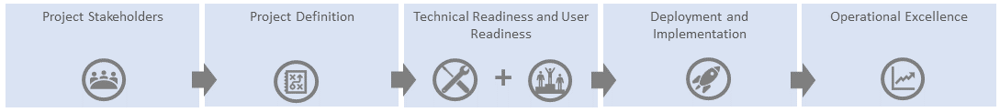

# Plan for your upgrade

A healthy technical environment, sustained user adoption, and the realization of your business goals all begin with proper planning. A solid plan gives you a framework for your upgrade project and ensures that all stakeholders are working toward the same goals. By taking time to properly define success, you can measure results as you progress through your deployment and verify that you’re achieving the outcomes you wanted. Planning your journey includes:

- [Enlisting your project stakeholders](upgrade-enlist-stakeholders.md).
- [Defining the scope of your project](https://aka.ms/SkypetoTeams-Scope).
- [Understanding coexistence and interoperability of Skype for Business and Teams](https://aka.ms/SkypeToTeams-Coexist).

> [!TIP]
> Join us for live, interactive workshops in which we’ll share guidance, best practices, and resources designed to kick start upgrade planning and implementation.
>
> Join the [Plan your upgrade](https://microsoftteams.eventbuilder.com/PlanYourUpgrade) session first to get started.
