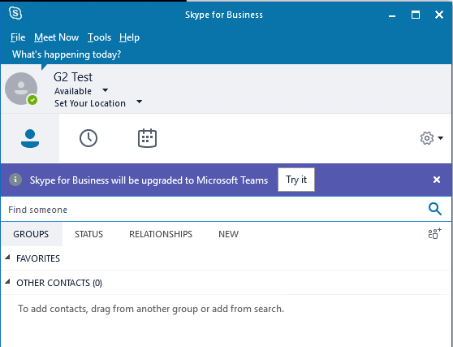
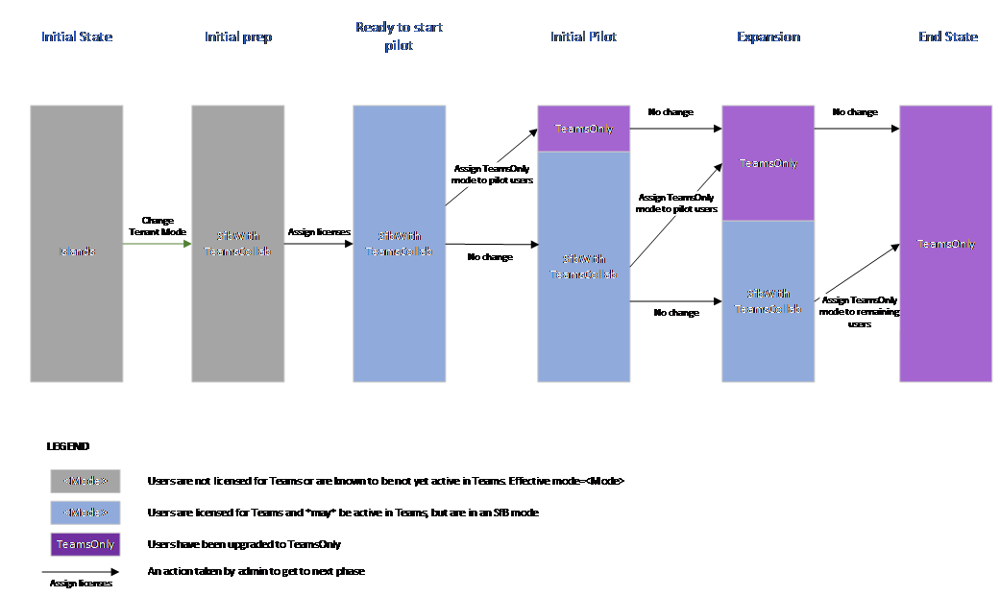
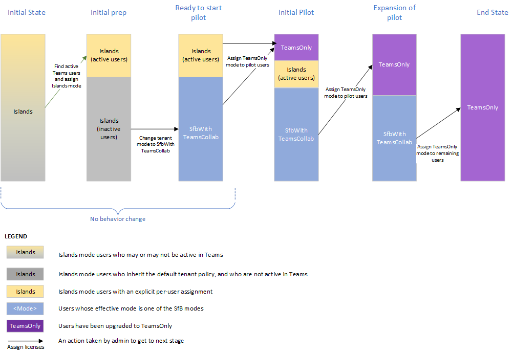
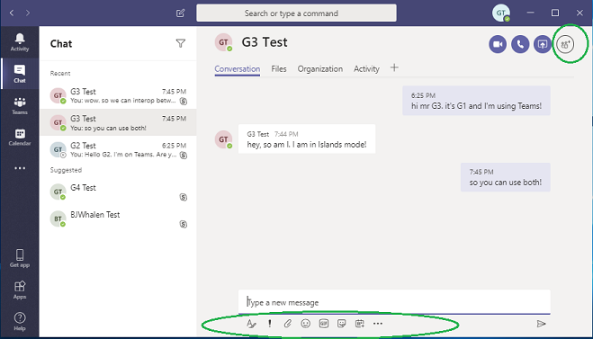
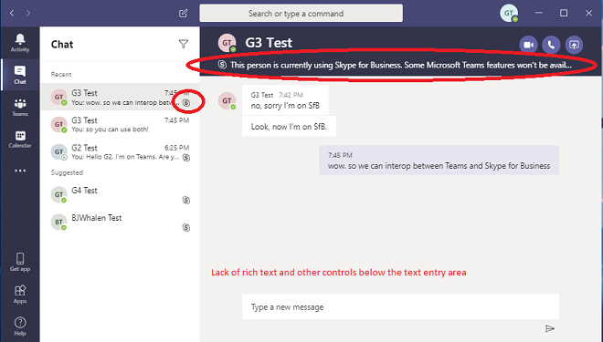
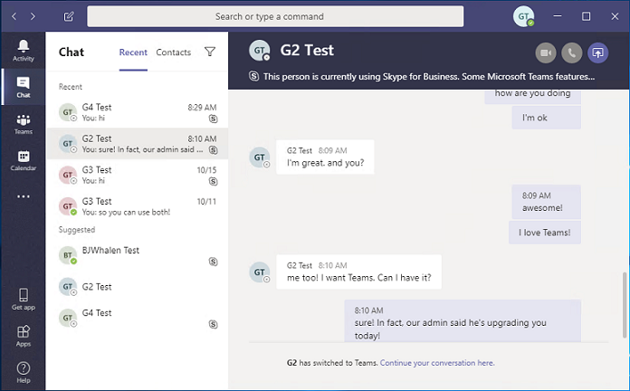

# Upgrade from Skype for Business to Teams &mdash; for IT administrators

## Overview

When upgrading from Skype for Business to Teams, some organizations require a progressive rollout that is planned and managed by their IT departments. This article is primarily targeted to IT administrators in large, on-premises organizations, but it might also apply to some Skype for Business Online organizations.  Before reading this article,  be sure to read [Getting started with your Teams Upgrade](upgrade-start-here.md) and [About the Upgrade framework](upgrade-framework.md).

>[!NOTE]
>This article uses the terms Skype for Business Online, Skype for Business on-premises, and Skype for Business.  The latter term refers to both online and on-premises versions.

A user that has been migrated to Teams no longer uses a Skype for Business client except to join a meeting hosted in Skype for Business.  All incoming chats and calls land in the user’s Teams client, regardless of whether the sender uses Teams or Skype for Business. Any new meetings organized by the migrated user will be scheduled as Teams meetings. If the user attempts to use the Skype for Business client, initiation of chats and calls is blocked.  However, the user can (and must) still use the Skype for Business client to join meetings they are invited to. (Older Skype for Business clients that shipped before 2017 do not honor TeamsUpgradePolicy. Make sure you are using the latest Skype for Business client.)
 
Administrators manage their transition to Teams using the concept of [mode](migration-interop-guidance-for-teams-with-skype.md#coexistence-modes), which is a property of [TeamsUpgradePolicy](https://docs.microsoft.com/powershell/module/skype/grant-csteamsupgradepolicy?view=skype-ps). A user that has been migrated to Teams as described above is in “TeamsOnly” mode.  For an organization that is migrating to Teams, the ultimate goal is to move all users to TeamsOnly mode.

There are two methods for migrating an existing organization with Skype for Business (whether online or on-premises) to Teams:

- **Side-by-side method** (using Islands mode):  Users in an existing Skype for Business organization are introduced to Teams so that they can use both clients side by side during a transitional phase. During this period, most--but not all--functionality of Teams is available to them. The mode for this configuration is referred to as Islands, and this is the default mode for any existing organization with Skype for Business. Once the organization is ready, the administrator moves the users to TeamsOnly mode.

- **A managed method** (using one or more of the Skype for Business modes): The administrator manages the transition (from Skype for Business to Teams) of chat, calling, and meeting scheduling functionality for users in their organization.  Each of these functions is available either in Skype for Business or Teams, but not both. Administrators use TeamsUpgradePolicy to control when to shift this functionality to Teams for their users. Users who are not yet in TeamsOnly mode continue to use Skype for Business for chat and calling, and the two sets of users can communicate via interop functionality. Administrators manage the transition by progressively migrating more users into TeamsOnly mode.  

This article helps you choose the right method for your organization by describing both methods and presenting the pros and cons of each. 

## Side-by-side method (using Islands mode)

With the side-by-side method, users can use both Teams and Skype for Business clients for chat, VoIP calling, and meetings. This state is referred to as “Islands” mode because the communication traffic for Skype for Business and Teams remains separate (even for the same user) and the two different clients never communicate with each other (for users within the same organization). For example, assume recipient User A is in Islands mode:

- Communication initiated from another user’s Skype for Business client will always land in User A’s Skype for Business client.
- Communication initiated from another user’s Teams client will always land in User A’s Teams client, *if the other user is in the same organization*. 
- Communication initiated from another user’s Teams client will always land in User A’s Skype for Business client, *if the other user is in a federated organization*.

Islands mode is the default mode of TeamsUpgradePolicy for any existing organization that is not yet TeamsOnly. When you assign an Office 365 license, both Teams and Skype for Business Online licenses are assigned by default. (This is true even if the user is homed on-premises in Skype for Business Server. Whether the user is homed on-premises or online, leave the Skype for Business Online license enabled, because it is currently needed for full Teams functionality.) In fact, if you have not taken any steps to change the default configuration, you may already have significant usage of Teams in your organization.  This is one of the benefits of the side-by-side approach. It allows for rapid, end-user driven adoption within an organization.

For this method to work effectively, it requires all users to run both clients simultaneously. Incoming chats and calls from within the organization to a user in Islands mode can land in either the Skype for Business or Teams client--and this is not under the control of the recipient. It depends on what client the sender uses to initiate the communication. If the sender and recipient are in different organizations, incoming calls and chats to a user in Islands mode always land in the Skype for Business client.  

For example, if an Islands mode recipient is running Skype for Business but not Teams, and someone messages them from Teams, the Islands mode recipient will not see the message (but they will eventually get an email saying they missed a message in Teams). Likewise, if a user is running Teams but not Skype for Business, and someone messages that user from Skype for Business, the user will not see that chat.  They will get an email saying there was a missed message. The behavior in each of these cases is similar for calling. If users do not run both clients, it can easily lead to frustration.

When User A is in Islands mode, User A’s presence as seen by other users in Teams and in Skype for Business is independent:

- Other users, when using Teams, will see presence based on User A’s activity in Teams. 
- Other users, when using Skype for Business, will see presence based on User A’s activity in Skype for Business. 

This means other users may see different presence states for User A, depending on which client they use. For more details, see [Presence](#presence).

Once you are ready to upgrade users to TeamsOnly mode, you can upgrade users individually or you can upgrade the entire tenant at once using the tenant-wide policy. Once a user is upgraded to TeamsOnly mode, they receive all incoming chats and calls in Teams. (Note that migration of Skype for Business meetings to Teams meetings is only triggered when applying TeamsUpgradePolicy to individual users, not on a per tenant basis. See [Meeting Migration](#meeting-migration) for details.)

However, non-upgraded recipients in Islands mode may continue to receive chats and calls from a TeamsOnly user in either their Skype for Business or Teams clients.  This is because the Teams client maintains separate conversation threads for Teams-to-Teams and Teams-to-Skype for Business communication, even for the same user.  (See [Teams Conversations - Interop versus native threads](#teams-conversations---interop-versus-native-threads).)  For example, assume Islands User A uses Teams to message TeamsOnly User B. When User B replies to that chat, the communication will land in User A’s Teams client. Now assume User A uses his Skype for Business client to message TeamsOnly User B. User B will receive the chat in Teams, but this will be a separate conversation in User B's Teams client compared to the other conversation. If User B replies to this conversation with User A, it will land in User A’s Skype for Business client. 

The following table summarizes the Teams experience for both Islands mode and TeamsOnly mode:  

| Teams experience | In Islands mode | In TeamsOnly mode |
|:------------------ | :------------------- | :------------------ |
| Incoming chats and calls received in:|  Teams or Skype for Business | Teams |
| PSTN calls received in: | Skype for Business <br>(Using PSTN functionality in Teams is not supported in Islands mode.) 	| Teams |   
 |Presence	| Presence in Skype for Business and Teams is independent. Users may see different states for the same Islands user, depending on which client they use. | Presence is based solely on the user’s activity in Teams. All other users, regardless of which client they use, see that presence. | 
 | Meeting Scheduling	| Users can schedule meetings in either Teams or Skype for Business. They will see both add-ins in Outlook.	| 	Users only schedule meetings in Teams. Only the Teams add-in is available in Outlook. | 

The following table summarizes the pros and cons of using the side-by-side method to migrate your organization to Teams.

| Pros     |       Cons |
| :------------------ | :---------------- |
| Allows for rapid adoption within an organization.| Potential for end user confusion because there are two clients with similar functionality, but different user interfaces. Also, they have no control over which client the incoming chats/calls land in. |
| Allows users to learn and get familiar with Teams while still having full access to Skype for Business. | Potential for end user dissatisfaction due to missed messages if the user is not running both clients. Users may complain that they are not receiving messages.|
| Minimal administration effort to get started in Teams. | Can be challenging to “get out of Islands” mode and move to TeamsOnly mode if not everyone in the organization is using Teams, especially if not all users are active in Teams. For example, once a subset of users is upgraded to TeamsOnly mode, those users will only send in Teams. For the rest of the population in Islands mode, those messages will always land in Teams. But if some of that population is not running Teams, they will perceive these messages as missed. |
|  | When using Teams, users who have an on-premises account in Skype for Business Server do not have interop or federation support.  This can potentially create confusion if you have a mix of Islands users--some who are homed in Skype for Business Online and some in Skype for Business on-premises.   |

## Managed transition method (using Skype for Business modes)

Some organizations may prefer to provide their end users a simpler, more predictable experience as their organization transitions from Skype for Business to Teams. In this model, IT administrators use one of the Skype for Business modes in TeamsUpgradePolicy to explicitly designate which users remain in Skype for Business prior to migrating to TeamsOnly mode. As they are ready to shift selected users to TeamsOnly mode, the administrator updates the mode for those users to TeamsOnly.  As the deployment progresses, more and more users are transitioned from Skype for Business to TeamsOnly mode.  During this transition:

- Users still on Skype for Business receive all incoming chats and calls in their Skype for Business client, regardless of whether the communication originated from the other user’s Teams or Skype for Business client. In addition, for these Skype for Business users, calling and chat functionality in the Teams client are disabled to help prevent end user confusion and to ensure proper routing. 

- Users in TeamsOnly mode receive all incoming chats and calls in their Teams client, regardless of where the communication originated from:  Teams, Skype for Business, or any kind of federated user. 

Unlike the Islands method, in the managed transition method, Skype for Business users and TeamsOnly users can communicate with each other. Communication between a Skype for Business user and Teams user is known as interoperability or “interop”. (See [Interoperability](#interoperability).) Interop communication is possible on a one-to-one basis for chats and calls between a user in Skype for Business and another user in Teams. In addition, invited users can always join either a Skype for Business or Teams meeting, however, they must use a client that corresponds to the type of meeting. For more information, see [Meetings](#meetings).

Because users in a managed transition are typically not in Islands mode, presence for a user is consistent regardless of which client is used by the other user. If the user is in one of the Skype for Business modes, all other users see presence based on that user’s activity in Skype for Business. Similarly, if a user is in TeamsOnly mode, all other users see presence based on that user’s activity in Teams. For details, see [Presence](#presence).

For an organization that has not yet started using Teams, the administrator should change the tenant-wide mode from Islands to SfbWithTeamsCollab. (For organizations that already have some Teams usage, the administrator should “grandfather” users already active in Teams to ensure this change does not apply to them. For details, see [A managed upgrade for an organization that is already using Teams in Islands mode](#a-managed-upgrade-for-an-organization-that-is-already-using-teams-in-islands-mode).)

When mode changes from Islands to SfbWithTeamsCollab, a user that has never used Teams will see no difference in how they use Skype for Business. However, should that user start to use Teams, they would only be exposed to functionality such as Teams & Channel and Files. Chat, calling and meeting scheduling would not be available in Teams, since the administrator has (for now) designated Skype for Business as the desired client for those functions.  

Note: When User A changes from Islands to one of the Skype for Business modes, the Teams client of any other user that communicates with User A needs to know that User A’s mode changed so it can route the communication to the appropriate client for User A.  For any users who have already established native Teams-to-Teams chats with User A, it can take up to 36 hours for these other users' Teams clients to be aware of the mode change from Islands to any Skype for Business mode.   In contrast, changes for an existing user to TeamsOnly mode are discovered by other clients within 2 hours.

When administrators are ready, they can shift chat, calling, and meeting scheduling for a given user to Teams all at once by updating the user’s mode to TeamsOnly.  

Alternatively, the administrator can first shift only meeting scheduling to Teams, while leaving chat and calling functions in Skype for Business using the SfBWithTeamsCollabAndMeetings mode. This mode allows organizations to transition to Teams for meetings--if users are not yet ready to move to TeamsOnly mode (typically because more time may be needed to migrate existing PSTN functionality). This transitional scenario is referred to as [Meetings First](meetings-first.md).


The following table summarizes the pros and cons of using Skype for Business modes as a transitional step toward TeamsOnly mode.


| Pros     |       Cons |
| :------------------ | :---------------- |
| Predictable routing for the end user.  All calls and chats either land in Skype for Business or Teams (but not both), based on administrator selection.  | Interop conversations lack support for rich text, file sharing, and screen sharing.  This can be worked around with on-demand meetings but this is not as seamless.  |
| Eliminate end user confusion because a given functionality is only available in one client.  | Users can’t try both clients side-by-side for the same set of functionality. This may especially be a factor if the users perceive the shift from Skype for Business to Teams as a major paradigm shift. |
| Allows for incremental introduction of Teams.  |  | |
| Administrator is in full control of the transition from Skype for Business to Teams. |  | | 
| Allows an organization to use Teams for meetings, even if it is not yet ready to move entirely to TeamsOnly mode. |  | |
| Presence of a given user as viewed by others is the same, regardless of which client they use.  |  | |

## Summary of upgrade methods

The following table summarizes the upgrade methods:

| Side-by-side (using Islands mode)     |      Managed (using Skype for Business modes) |
| :------------------ | :---------------- |
| Prior to being upgraded to TeamsOnly, users must run both clients simultaneously since incoming chats and calls may land in either client.   | Chats and calls only land in one client, based on the recipient’s mode. Non-upgraded users may run both clients, but there is no functional overlap (calling and chat are not available in Teams).  Administrators can also control whether users schedule meetings in Teams or Skype for Business.   |
| Users can use Skype for Business and Teams side by side for same functionality.   | Allows administrators to introduce net new functionality of Teams to end users (Teams and Channels), without providing same functionality that also exists in Skype for Business.   |
|Interop between Skype for Business and Teams does not exist while both users are in Islands mode. Once some users are upgraded to TeamsOnly, interop conversation may occur between those users and other users still in Islands mode. However, the Islands user could choose to use Teams and avoid the interop conversation. | Interop is required for communication between Skype for Business and Teams users.   |

## Tools for managing the upgrade

For either of the methods described above, administrators manage the transition to TeamsOnly using [TeamsUpgradePolicy](https://docs.microsoft.com/powershell/module/skype/grant-csteamsupgradepolicy?view=skype-ps), which controls a user’s coexistence mode. For more information on each of the modes, see [Coexistence modes](migration-interop-guidance-for-teams-with-skype.md#coexistence-modes).

Whether the administrator performs a managed transition using Skype for Business modes or simply upgrades to TeamsOnly mode from the default Islands configuration, TeamsUpgradePolicy is the primary tool.  Like any other policy in Teams, TeamsUpgradePolicy can be assigned directly to a user, and it can also be set as the tenant-wide default. Any assignment to a user takes precedence over the tenant default setting.  It can be managed both in the Teams Admin Console and in PowerShell.

Administrators can assign any mode of TeamsUpgradePolicy to users whether the user is homed in Skype for Business Online or on-premises, except that TeamsOnly mode can only be assigned to a user who is already homed in Skype for Business Online. This is because interop with Skype for Business users and federation are only possible if the user is homed in Skype for Business Online.

Users with Skype for Business accounts homed on-premises [must be moved online](https://docs.microsoft.com/SkypeForBusiness/hybrid/move-users-from-on-premises-to-teams) (either to Skype for Business Online or direct to Teams) using Move-CsUser in the Skype for Business on-premises toolset. These users can be moved to TeamsOnly in either 1 or 2 steps:

-	1 step:  Specify the -MoveToTeams switch in Move-CsUser. This requires Skype for Business Server 2019 or Skype for Business Server 2015 with CU8.

-	2 steps: After running Move-CsUser, grant TeamsOnly mode to the user using TeamsUpgradePolicy.

Unlike other policies, it is not possible to create new instances of TeamsUpgradePolicy in Office 365. All the existing instances are built into the service.  (Note that mode is a property within TeamsUpgradePolicy, rather than the name of a policy instance.) In some--but not all--cases, the name of the policy instance is the same as mode. In particular, to assign TeamsOnly mode to a user, you will grant the “UpgradeToTeams” instance of TeamsUpgradePolicy to that user. To see a list of all instances, you can run the following command:

```
Get-CsTeamsUpgradePolicy|ft Identity, Mode, NotifySfbUsers
```

To upgrade an online user to TeamsOnly mode, assign the “UpgradeToTeams” instance: 

```
Grant-CsTeamsUpgradePolicy -PolicyName UpgradeToTeams -Identity $user 
```

To upgrade an on-premise Skype for Business user to TeamsOnly mode, use Move-CsUser in the on-premises toolset:

```
Move-CsUser -identity $user -Target sipfed.online.lync.com -MoveToTeams -credential $cred
```

To change the mode for all users in the tenant, except those who have an explicit per-user grant (which takes precedence), run the following command:

```
Grant-CsTeamsUpgradePolicy -PolicyName SfbWithTeamsCollab -Global
```


>[!NOTE]
>If you have any users with Skype for Business accounts on-premises, you should not assign TeamsOnly mode at the tenant level, unless you explicitly assign some other mode to all users with on-premises Skype for Business accounts.


### Using notifications in Skype for Business clients

Administrators have the option to provide end user notifications in the Skype for Business client to inform users that they will soon be upgraded to Teams, as shown in the following diagram. For example, a week before the administrator plans to upgrade a group of users to TeamsOnly mode, the administrator might want to turn on these notifications for that group of users. These notifications are enabled using an instance of TeamsUpgradePolicy with NotifySfbUsers=true.  For all modes other than TeamsOnly, there are actually two instances per mode, corresponding to the two values of NotifySfbUsers.  For all modes other than TeamsOnly, there are actually two instances per mode, corresponding to the two values of NotifySfbUsers. 



If your users are homed in Skype for Business Online, simply assign the policy instance that has the same mode as the user, but with NotifySfbUsers=true. 

If your users are homed in Skype for Business Server on-premises, you’ll need to use the on-premises toolset and you’ll need Skype for Business Server 2019 or CU8 for Skype for Business Server 2015. In the on-premises PowerShell window, create a new instance of TeamsUpgradePolicy with NotifySfbUsers=true:

```
New-CsTeamsUpgradePolicy -Identity EnableNotification -NotifySfbUsers $true
```

Then, using the same on-premises PowerShell window, assign that new policy to the desired users:

```
Grant-CsTeamsUpgradePolicy -Identity $user -PolicyName EnableNotification
```

### Meeting migration

When a user is migrated to TeamsOnly mode, by default their existing Skype for Business meetings that they organized will be converted to Teams. You can optionally disable the default behavior when assigning TeamsOnly mode to a user. When moving users from on-premises, meetings must be migrated to the cloud to function with the online user account, but if you do not specify -MoveToTeams, the meetings will be migrated as Skype for Business meetings, rather than converted to Teams. 

When assigning TeamsOnly mode at the tenant level, meeting migration is not triggered for any users. If you wish to assign TeamsOnly mode at the tenant level and migrate meetings, you can use PowerShell to get a list of users in the tenant (for example, using Get-CsOnlineUser with whatever filters are needed) and then loop through each of these users to trigger meeting migration using Start-CsExMeetingMigration. For details, see [Using the Meeting Migration Service (MMS)](https://docs.microsoft.com/skypeforbusiness/audio-conferencing-in-office-365/setting-up-the-meeting-migration-service-mms).


### Additional considerations for organizations with Skype for Business Server on-premises

- Setting up Skype for Business hybrid is a prerequisite to migrate to TeamsOnly mode. While it is possible to use Teams in Islands mode without hybrid, the transition to TeamsOnly mode cannot be made until the user is moved from Skype for Business on-premises to Skype for Business Online (using [Move-CsUser](https://docs.microsoft.com/SkypeForBusiness/hybrid/move-users-between-on-premises-and-cloud)). For more information, see [Configure hybrid connectivity](https://docs.microsoft.com/skypeforbusiness/hybrid/configure-hybrid-connectivity).

- Teams users who have a Skype for Business account on-premises (that is, they have not yet been moved to the cloud by using Move-CsUser) cannot interoperate with any Skype for Business users, nor can they federate with external users. This functionality is only available once the users are moved to the cloud (either in Islands mode, or as TeamsOnly users). 

- If you have any users with Skype for Business accounts on-premises, you should not assign TeamsOnly mode at the tenant level, unless you explicitly assign some other mode to all users with on-premises Skype for Business accounts. 

- You must ensure your users are properly synchronized into Azure AD with the correct Skype for Business attributes. These attributes are all prefixes with “msRTCSIP-”. If users are not synchronized properly to Azure AD, the management tools in Teams will not be able to manage these users. For more information, see [Configure Azure AD Connect for Teams and Skype for Business](https://docs.microsoft.com/SkypeForBusiness/hybrid/configure-azure-ad-connect).

- To create a new TeamsOnly or Skype for Business Online user in a hybrid organization, *you must first enable the user in Skype for Business Server on-premises*, and then move the user from on-premises to the cloud using Move-CsUser.  Creating the user in on-premises first ensures that any other remaining on-premises Skype for Business users will be able route to the newly created user. Once all users have been moved online, it is no longer necessary to first enable users in on-premises.

- When a user is moved from on-premises to the cloud, meetings organized by that user are migrated to either Skype for Business Online or Teams--depending on whether or not the -MoveToTeams switch is specified.

- If you would like display notifications in the Skype for Business client for on-premises users, you must use TeamsUpgradePolicy in the on-premises toolset. Only the NotifySfbUsers parameter is relevant for on-premises users.  On-premises users receive their mode from the online instances of TeamsUpgradePolicy. See the notes in [Grant-CsTeamsUpgradePolicy](https://docs.microsoft.com/powershell/module/skype/grant-csteamsupgradepolicy?view=skype-ps). 

>[!NOTE]
> Any new tenants created after Sept 3, 2019 are created as TeamsOnly tenants without the ability for admins to downgrade. Organizations with Skype for Business Server on-premises that previously never had an Office 365 subscription prior to Sept 3, 2019 will need to contact Microsoft Support to have their tenant downgraded, once they acquire a subscription with Office 365. 


## Perform the upgrade for your organization

This section describes the following upgrade options:

- Side-by-side upgrade (using Islands mode)
- A managed upgrade for an organization that has not yet started using Teams
- A managed upgrade for an organization that is already using Teams in Islands mode

### Side-by-side upgrade (using Islands mode)

For the side-by-side upgrade option:

- Consider this option if you can do a fast upgrade for your overall organization.  Since there is potential risk of confusion with running both clients, it’s best if you can minimize this time period. You should ensure your users know to run both clients.

- This option is the out-of-the box model, and doesn’t require administrator action to get started with Teams except to assign the Office 365 license. If your users already have Skype for Business Online, you may already be in this model.

- It can be challenging getting out of side-by-side mode and moving to TeamsOnly. Because upgraded 
users only communicate via Teams, any other user in the organization communicating with that user must be using Teams.  If you have users that have not started using Teams, they will be exposed to missing messages. Furthermore, they won’t see the TeamsOnly users online in Skype for Business. Some organizations choose to do a tenant-wide upgrade using the Tenant global policy to avoid this, however that requires waiting until all users are ready to be upgraded.


### A managed upgrade for an organization that has not yet started using Teams

If your organization does not yet have any active users in Teams, the first step is to set the default tenant-wide policy for TeamsUpgradePolicy to one of the Skype for Business modes, for example, SfbWithTeamsCollab.  Users who have not yet started using Teams won’t notice any difference in behavior. However, setting this policy at the tenant level makes it possible to start upgrading users to TeamsOnly mode, and ensures that the upgraded users can still communicate with non-upgraded users.  Once you have identified your pilot users you can upgrade them to TeamsOnly.  If they are on-premises, use Move-CsUser. If they are online, simply assign them TeamsOnly mode by using TeamsUpgradePolicy.  By default, any Skype for Business meetings scheduled by these users will be migrated to Teams.

Following are the key commands:

1. Set the tenant-wide default to mode SfbWithTeamsCollab as follows:

   ```
   Grant-CsTeamsUpgradePolicy -PolicyName SfbWithTeamsCollab -Global
   ```

2. Upgrade the user to TeamsOnly as follows:

   - If the user is already online:

     ```
     Grant-CsTeamsUpgradePolicy -PolicyName UpgradeToTeams -Identity $username 
     ```

   - If the user is on-premises:

     ```
     Move-CsUser -identity $user -Target sipfed.online.lync.com -MoveToTeams -credential $cred 
     ```

Notes
 
- Instead of setting the tenant-wide policy to SfbWithTeamsCollab, you could set it to SfbWithTeamsCollabAndMeetings. This causes all users to schedule all new meetings in Teams.
- Move-CsUser is a cmdlet in the on-premises tools. The MoveToTeams switch requires Skype for Business Server 2019 or Skype for Business Server 2015 with CU8. If you are using a prior version, you can first move the user to Skype for Business Online, and then grant TeamsOnly mode to that user.
- By default, Skype for Business meetings are migrated to Teams when upgrading to TeamsOnly mode or when assigning SfbWithTeamsCollabAndMeetings mode.  

The diagram below shows the conceptual phases of managed upgrade for an organization with no prior usage of Teams. The height of the bars represents number of users. During any phase of the upgrade, all users can communicate with each other.  Skype for Business users communicate with TeamsOnly users using Interop, and vice versa.




### A managed upgrade for an organization that is already using Teams in Islands mode

If some users in your organization are actively using Teams in Islands mode, you probably do not want to remove functionality from existing users. Therefore, an extra step is required before changing the tenant-wide policy. The solution is to “grandfather” these existing active Teams users into Islands mode, before setting the tenant-wide policy to SfbWithTeamsCollab.  Once you’ve done that, you can proceed with deployment as above, however, you’ll have two groups of users who are moving to TeamsOnly:  the users who were active in Teams will be in Islands mode, and the remaining users will be in SfbWithTeamsCollab mode. You can progressively move these users to TeamsOnly mode.

1. Find users who are active in Teams as follows:

   1. From the Office 365 Admin Portal, in the left-hand navigation, go to Reports, and then Usage. 
   2. In the “Select a report” dropdown, choose Microsoft Teams, and then User Activity. This will provide an exportable table of users who have been active in Teams. 
   3. Click Export, open Excel, and filter to show only the users who are active in Teams.

2. For each active Teams user found in step 1, assign them Islands mode in remote PowerShell. This allows you to go to the next step, and ensures you don’t change the user experience.  

   ```
   $users=get-content “C:\MyPath\users.txt” 
    foreach ($user in $users){ 
    Grant-CsTeamsUpgradePolicy -identity $user -PolicyName Islands} 
   ```

3. Set the tenant-wide policy to SfbWithTeamsCollab:

   ```
   Grant-CsTeamsUpgradePolicy -Global -PolicyName SfbWithTeamsCollab 
   ```

4. Upgrade selected users to TeamsOnly mode. You can choose to upgrade either users in Islands mode or SfbWithTeamsCollab mode, although you might want to prioritize upgrading the users in Islands mode first to minimize the potential for confusion that can arise when users are in Islands mode.   

   For users homed in Skype for Business Online:  

   ```
   Grant-CsTeamsUpgradePolicy -Identity $user -PolicyName UpgradeToTeams 
   ```

   For users homed in Skype for Business Server on-premises:  

   ```
   Move-CsUser -Identity $user -Target sipfed.online.lync.com -MoveToTeams -credential $cred 
   ```

The diagram below shows the conceptual phases of a managed transition in which there are active Islands users at the start. The height of the bars represents the number of users. During any phase of the upgrade, all users can communicate with each other.  Skype for Business users communicate with TeamsOnly users using interop, and vice versa.




   

## Considerations for PSTN calling

If PSTN calling functionality is involved, there are four possible scenarios when moving to TeamsOnly mode:

- *A user in Skype for Business Online, with a Microsoft Calling Plan*. Upon upgrade, this user will continue to have a Microsoft Calling plan.

- *A user in Skype for Business Online, with on-premises voice functionality* via Skype for Business on-premises or Cloud Connector Edition. The user’s upgrade to Teams needs to be coordinated with migration of the user to Direct Routing to ensure the TeamsOnly user has PSTN functionality.

- *A user in Skype for Business on-premises with Enterprise Voice, who will be moving to online and keeping on-premises PSTN connectivity*.  Migrating this user to Teams requires moving the user’s on-premises Skype for Business account to the cloud, and coordinating that move with migration of the user to Direct Routing. 

- *A user in Skype for Business on-premises with Enterprise Voice*, who will be moving to online and using a Microsoft Calling plan.  Migrating this user to Teams requires moving the user’s on-premises Skype for Business account to the cloud, and coordinating that move with either A) the port of that user’s phone number to a Microsoft Calling Plan or B) assigning a new subscriber number from available regions.

This article provides a high-level overview only.  For more information, see [Phone System Direct Routing](direct-routing-landing-page.md) and [Calling Plans](calling-plan-landing-page.md). In addition, note that using Phone System with Teams is only supported when the user is in TeamsOnly mode.  If the user is in Islands mode, Phone System is only supported with Skype for Business. 

### From Skype for Business Online with Microsoft Calling Plans 

This is the simplest upgrade scenario involving voice. 

1. Make sure users have been assigned a Teams license. By default, when you assign an Office 365 license, Teams is enabled, so unless you previously disabled the Teams license, no action should be necessary.

2.  If users already have a Microsoft Calling Plan with a phone number, the only required change is to assign the user TeamsOnly mode in TeamsUpgradePolicy.  Prior to assigning TeamsOnly mode, incoming PSTN calls will land in the user’s Skype for Business client. After the upgrade to TeamsOnly mode, incoming PSTN calls will land in the user’s Teams client.  

### From Skype for Business Online with on-premises voice

In this scenario, the user is already in Skype for Business Online, but their PSTN connectivity is on-premises, either using Skype for Business Server in hybrid mode or Cloud Connector Edition. Migrating these users to TeamsOnly mode with PSTN functionality means enabling them for Direct Routing, in which PSTN trunks connect directly to the Direct Routing service in the cloud, via your on-premises Session Border Controller (SBC).

The basic steps are listed below.  Steps 1-4 are listed in the suggested sequence, but they can be done in any order. The key is that all of these should be completed before Step 5.

1. If you are setting the tenant-wide policy to one of the Skype for Business modes, be sure to grandfather any existing Islands users by explicitly assigning them Islands mode, as previously described.

2. Configure your tenant for Direct Routing. See [Summary of per-tenant configuration of Direct Routing](#summary-of-per-tenant-configuration-of-direct-routing).

3. If desired, configure various Teams policies for these users (for example, TeamsMessagingPolicy, TeamsMeetingPolicy, etc.). This can be done at any time, but if you want to ensure that users have the correct configuration when they are upgraded, it’s best to do this before the user is upgraded to 
TeamsOnly mode.

4. Prepare select users for voice migration: 
   - If necessary, assign the Teams license.  Assuming the user is already functional in Skype for Business Online on-premises voice, the user already has Skype for Business Plan 2 as well as Microsoft Phone System. Leave both those plans enabled, including the Skype for Business Online Plan 2 license.  
   - Assign the desired OnlineVoiceRoutingPolicy. 

5. Upgrade the user: These steps should be coordinated. 

   - In Office 365, upgrade the user to TeamsOnly mode (Grant-CsTeamsUpgradePolicy).
   - On the SBC, configure voice routing to enable incoming calls by sending calls to Direct Routing instead of to the on-premises Mediation Server.


### From Skype for Business Server on-premises, with Enterprise Voice, to Direct Routing

In this scenario, the user is still homed in Skype for Business on-premises, and their PSTN connectivity is also on-premises. Migrating these users to TeamsOnly mode with PSTN functionality means enabling them for Direct Routing and then moving the user to the cloud. 
 
The basic steps are listed below.  Steps 1-5 are listed in the suggested sequence, but they can be done in any order. The key is that all of these should be completed before Step 6.

1. If you will be setting the tenant-wide policy to one of the Skype for Business modes, be sure to grandfather existing Islands users by explicitly assigning them Islands mode, as previously described.

2. If you haven’t already done so, [configure the organization for Skype for Business hybrid](https://docs.microsoft.com/SkypeForBusiness/hybrid/configure-hybrid-connectivity).

3. Configure your tenant for Direct Routing. See [Summary of per-tenant configuration of Direct Routing](#summary-of-per-tenant-configuration-of-direct-routing).

4. If desired, configure various Teams policies for these users (e.g. TeamsMessagingPolicy, TeamsMeetingPolicy, etc.). This can be done at any time, but if you want to ensure that users have the correct configuration when they are upgraded, it’s best to do this before the user is upgraded to TeamsOnly.

5. Assign the Office 365 licenses if necessary.  The user should have both Teams and Skype for Business Online Plan 2, as well as Phone System. If the Skype for Business Online Plan 2 is disabled, re-enable it.  

6. Upgrade the user: These steps should be coordinated. 

   - Using the on-premises Skype for Business tools, run Move-CsUser with -MoveToTeams switch. If you are using a version of Skype for Business Server that does not support the -MoveToTeams switch, first run Move-CsUser and then assign TeamsOnly mode in tenant remote PowerShell or Teams Admin Console.

   - On the SBC, configure voice routing to enable incoming calls by sending calls to Direct Routing instead of to the on-premises Mediation Server. 

   - In Office 365: Assign the relevant OnlineVoiceRoutingPolicy to enable outgoing calls. 


### From Skype for Business Server on-premises, with Enterprise Voice, to Microsoft Calling Plan

In this scenario, the user is still homed in Skype for Business on-premises, and their PSTN connectivity is also on-premises. Migrating these users to TeamsOnly mode with PSTN functionality means moving the user to the cloud and either porting their number from the old carrier to a Microsoft Calling plan or assigning the user a new number. 

The basic steps are listed below.  Steps 1-5 are listed in the suggested sequence, but they can be done in any order. The key is that all of these should be completed before Step 6. 

1. If you will be setting the tenant-wide policy to one of the Skype for Business modes, be sure to grandfather existing Islands users by explicitly assigning them Islands mode, as previously described. 

2. If you haven’t already done so, [configure the organization for Skype for Business hybrid](https://docs.microsoft.com/SkypeForBusiness/hybrid/configure-hybrid-connectivity). 

3. If desired, configure various Teams policies for these users (for example, TeamsMessagingPolicy, TeamsMeetingPolicy, etc.). This can be done at any time, but if you want to ensure that users have the correct configuration when they are upgraded, it’s best to do this before the user is upgraded to TeamsOnly. 

4. Assign the Office 365 licenses if necessary.  The user should have both Teams and Skype for Business Online Plan 2, as well as Phone System. If the Skype for Business Online Plan 2 is disabled, re-enable it.  

5. Get phone numbers for your users. (For details see [Manage phone numbers for your organization](https://docs.microsoft.com/MicrosoftTeams/manage-phone-numbers-for-your-organization/manage-phone-numbers-for-your-organization).)

   - If you will be re-using the numbers, submit a porting request to your carrier.  
   - Alternatively, you can acquire new numbers directly from Microsoft. 

6. Upgrade the user. Using the on-premises Skype for Business tools, run Move-CsUser with the -MoveToTeams switch.  

    - If you are porting numbers to Microsoft, you should coordinate the timing of this operation to occur when the port occurs. 

    - If you are using new numbers from Microsoft, you’ll need to change the LineUri for the user.  This should be done in the on-prem tools and then synchronized to the cloud via Azure AD Connect. You should time the Move-CsUser operation to be concurrent with when Azure AD Connect synchronizes the change. 

### Summary of per-tenant configuration of Direct Routing 

1. Ensure that your Session Border Controller (SBC) is supported with Direct Routing by reviewing [this list](direct-routing-border-controllers.md). You must also ensure that you have correct version of firmware.  

2. Pair your on-premises SBC with the Teams Direct Routing service. For details, see [Pair the SBC to the Direct Routing service of Phone System](direct-routing-configure.md#pair-the-sbc-to-the-direct-routing-service-of-phone-system). 

3. This configuration is essentially a mirror of the on-premises configuration. The online configuration consists of: 
   - OnlineVoiceRoutingPolicy (based on the on-premises VoiceRoutingPolicy if migrating users from Skype for Business   Online, and based on VoicePolicy if migrating users from on-premises with Enterprise Voice).
   - OnlinePSTNUsage objects (based on on-premises PSTN usage). 
   - OnlineVoiceRoute objects (based on-premises VoiceRoute). 

For more information, see [Configure Direct Routing](direct-routing-configure.md). 

### Manage EnterpriseVoiceEnabled property during migration 

Whether using Direct Routing or a Microsoft Calling plan, a user must have EnterpriseVoiceEnabled=true in Azure AD for the user to have PSTN functionality.  EnterpriseVoiceEnabled (“EV-enabled”) is a property (not a policy) that exists in both an on-premises directory and in the cloud. The value in the cloud is what matters for Teams.  The exact logic for how EV-enabled gets set to true depends on the following scenario: 

- If the user is EV-enabled in on-premises Skype for Business Server and a Phone System license is assigned to the user prior to moving the user to the cloud with Move-CsUser, the online user will be provisioned with EV-enabled=true. 

- If an existing TeamsOnly or Skype for Business Online user is assigned a Phone System license, EV-enabled is not set to true by default.  This also is the case if an on-premises user is moved to the cloud prior to assigning the Phone System license. In either case, the admin must specify the following cmdlet: 

  ```
  Set-CsUser -EnterpriseVoiceEnabled $True 
  ```

## Coexistence of Teams with Skype for Business

This section summarizes behavior that may be experienced when running both Teams and Skype for Business clients in the same organization, regardless of what mode and what upgrade method is used:

- [Meetings](#meetings)
- [Interoperability](#interoperability)
- [Teams conversations-Interop versus native threads](#teams-conversations---interop-versus-native-threads)
- [Presence](#presence)
- [Federation](#federation)
- [Contacts](#contacts)

### Meetings

Regardless of their mode, users can always join any type of meeting they are invited to, whether it is Skype for Business or Teams.  However, users must join the meeting with a corresponding client that matches the meeting type:

- If the meeting is a Teams meeting, all participants (whether they are TeamsOnly, Islands, or Skype for Business users) use the Teams client to join the meeting. If Teams is not installed, the user will be directed to the web, upon attempting to join a meeting.

- If the meeting is a Skype for Business meeting, all participants (whether they are TeamsOnly, Islands, or Skype for Business users) use the Skype for Business client to join the meeting. If the Skype for Business client is not installed, the user will be directed to the web to join via the Skype Meeting App.

When organizing meetings, the meeting type that gets scheduled is based on the mode of the organizer, as shown in the following table:

| Mode of organizer    |      Behavior |
| :------------------ | :---------------- |
| TeamsOnly, SfbWithTeamsCollabAndMeetings | 	All meetings scheduled in Teams. Skype for Business add-in is not available in Outlook. | 
| SfbWithTeamsCollab, SfbOnly	| All meetings scheduled in Skype for Business. Teams add-in is not available in Outlook. | 
| Islands | 	Meetings can be scheduled in either Skype for Business or Teams. Both add-ins are available in Outlook. | 


### Interoperability

Teams supports interoperability (“interop”) with Skype for Business in certain scenarios. Interop communication refers to a chat or call between a Skype for Business user and a Teams user.  Interop communication is only possible between two users; multi-party chat/calling or adding additional users is not supported.

An interop chat or call between two users is created when each of the following are true:

- One user is using Teams and the other is using Skype for Business.

- The mode of the recipient of the initial communication is NOT Islands (otherwise the communication would land in the same client) if both users are in the same organization. In federated scenarios, the sending user is using Teams, and the recipient is not in TeamsOnly mode. 

- The Teams user does NOT also have a Skype for Business account homed on-premises. 

Within the interop communication, chat is plain-text only. In addition, file sharing and screen sharing are not possible *in the interop chat itself*. However, users in an interop conversation can easily achieve file and/or screen sharing by creating an on-demand meeting, from within the interop chat, as described below:

- If the Teams user attempts to share their screen, an on-demand Teams meeting is automatically created and an invite link to that meeting is sent to the Skype for Business user’s client. Upon clicking the link, the Skype for Business user will open Teams and join the meeting. Both users are now in a Teams meeting and can share as needed.

- If the Skype for Business user is using a client from 2018 or later and attempts to share any content, an on-demand Skype for Business meeting is automatically created and an invite link to that meeting is sent to the Teams user’s client. Upon clicking the link, the Teams user will attempt to join the Skype for Business meeting. If the Teams user has the Skype for Business client installed, it will open and the user is prompted to sign in (if not already signed in).  If the Teams user does not have the Skype for Business client installed, the user will be prompted to use the web version. Once both users are signed in, they are in a Skype for Business meeting and can share as needed.

### Teams conversations - Interop versus native threads

Because interop communications do not support all the features of native Teams conversation, the Teams client maintains separate conversation threads for Teams-to-Teams and Teams-to-Skype for Business communication. These conversations are rendered differently in the user interface: Interop threads can be differentiated from a regular native Teams thread by:

- Lack of controls for rich text, file/screensharing, inability to add users.
- A modification to the target user’s icon, showing an “S” for Skype for Business.

These differences are shown in the following screenshots:

A native Teams-to-Teams conversation with User G3 Test



An interop conversation with the same User G3 Test



Once a conversation thread is created, its type never changes. Once created, an interop thread in Teams will always route to the target user’s Skype for Business client. A native thread will always route to the target user’s Teams client.  If a recipient user’s mode changes, existing Teams threads to that user will no longer function and a note will be displayed on that chat with a link to start a new native conversation as shown in the following screenshot. For more details, see [Chats and calls from pre-existing threads](coexistence-chat-calls-presence.md#chats-and-calls-from-pre-existing-threads).




### Presence

Presence for a given user is based on the user’s activity in the service via the client. The presence is then published for other users to see.  Skype for Business and Teams are separate services with separate clients, so each service has its own presence state for a user.   There is also synchronization between the presence services in Teams and in Skype for Business Online.  This allows one service to potentially publish the presence of the user from the other service if needed. 

Presence publishing behavior is based on the user’s mode. There are three basic cases:

- If a user is in TeamsOnly mode, all other users see Teams presence for that user, regardless of which client they use.

- If a user is in any of the Skype for Business modes, all other users see Skype for Business presence for that user, regardless of which client they use.

- If a user is in Islands mode, presence published in Skype for Business and Teams are independent, so the presence shown to users within the same organization will depend on the client of the other user. Users in federated organizations will see presence of that user based on their Skype for Business activity, since federated traffic to an Islands mode user lands in Skype for Business.

For example, Assume User A is in Islands mode. If User A is active in Teams but is not signed in to Skype for Business, other users would see User A as active from their Teams client, but in their Skype for Business client they would see User A as offline. This is by design, since User A cannot be reached if they are not running the client. 

For additional information, see [Presence](coexistence-chat-calls-presence.md#presence).

### Federation

Federation from Teams to another user using Skype for Business requires the Teams user to be homed online in Skype for Business. TeamsUpgradePolicy governs routing for incoming federated chats and calls. Federated routing behavior is the same as for same-tenant scenarios, except in Islands mode. When recipients are in Islands mode:

- Chats and calls initiated from Teams land in Skype for Business if the recipient is in a federated tenant.
- Chats and calls initiated from Teams land in Teams if the recipient is in the same tenant.
- Chats and calls initiated from Skype for Business always land in Skype for Business.

A federated chat between a Teams user and a Skype for Business is an interop thread, so rich text and sharing are not possible. The user interface exposes federated chats in a similar manner to same-tenant interop threads, except there is a note indicating the user is external.

When Teams first introduced federation, a federated chat between two Teams users was also an interop thread, but in the future, native Teams federation will be introduced which provides full functionality for conversations between users who are in TeamsOnly mode. . 

For more details, see [Federated routing for new chats or calls](coexistence-chat-calls-presence.md#federated-routing-for-new-chats-or-calls).

### Contacts

Teams and Skype for Business have separate lists of contacts. This means that contact additions, removal, and modifications made in one system are not synchronized to the other system. However, contacts from Skype for Business are automatically copied over to Teams when either of two specific events occur: 

- For any Skype for Business Online user, the first time they log onto Teams, contacts from Skype for Business will be copied over to Teams.  This behavior is not available for users with an on-premises account in Skype for Business Server.  

- After a user is upgraded to TeamsOnly (either via assigning TeamsUpgradePolicy or via Move-CsUser -MoveToTeams), the next time a user logs into Teams, existing contacts in Skype for Business will be merged with existing contacts already in Teams. This behavior happens whether the user’s Skype for Business Account is homed on-premises or online. 

In both cases, the transfer of contacts from Skype for Business to Teams is asynchronous so it may be a few minutes before contacts appear in Teams. The two events above are what trigger the copy.  

## Related links

[Migration and interoperability guidance for organizations using Teams together with Skype for Business](migration-interop-guidance-for-teams-with-skype.md) 

[Configure hybrid connectivity between Skype for Business Server and Office 365](https://docs.microsoft.com/SkypeForBusiness/hybrid/configure-hybrid-connectivity)

[Move users between on-premises and cloud](https://docs.microsoft.com/SkypeForBusiness/hybrid/move-users-between-on-premises-and-cloud)

[Setting your coexistence and upgrade settings](setting-your-coexistence-and-upgrade-settings.md)

[Grant-CsTeamsUpgradePolicy](https://docs.microsoft.com/powershell/module/skype/grant-csteamsupgradepolicy?view=skype-ps)

[Using the Meeting Migration Service (MMS)](https://docs.microsoft.com/skypeforbusiness/audio-conferencing-in-office-365/setting-up-the-meeting-migration-service-mms)

