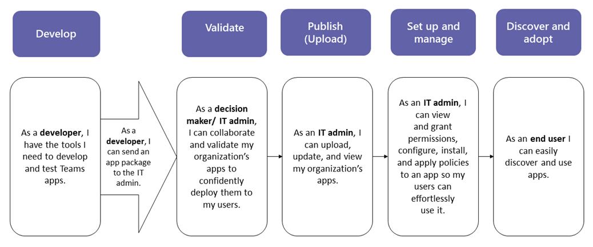
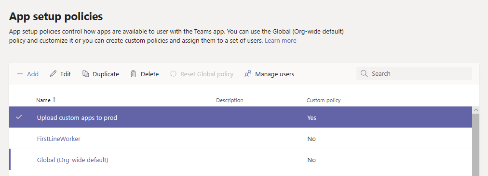
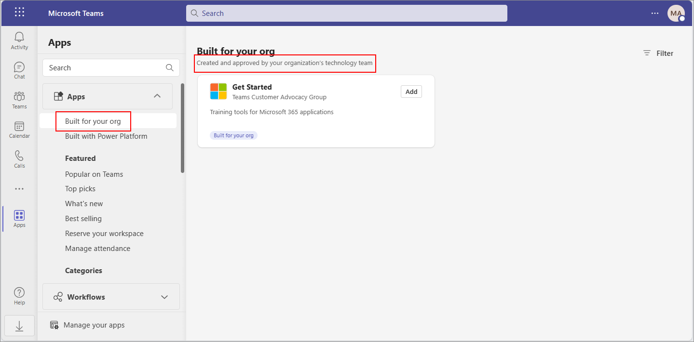
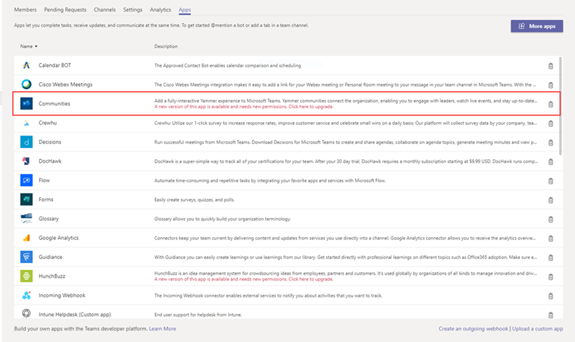
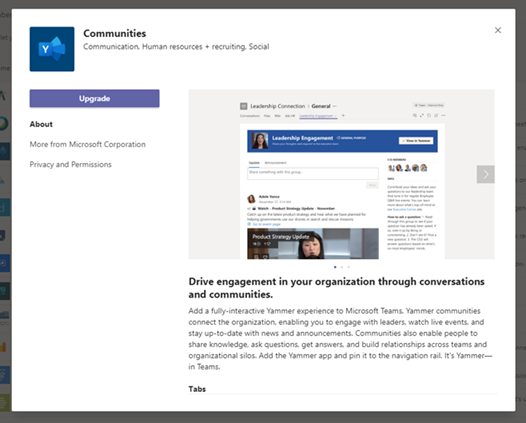

# Publish a custom app by uploading an app package

> [!NOTE]
> When you publish a custom Teams app, it's available to users in your organization's app store. There are two ways to publish a custom app and the way that you use depends on how you get the app. **This article focuses on how to publish a custom app by uploading an app package (in .zip format) that a developer sends you**. The other method, approving a custom app, is used when a developer submits an app directly to the [Manage apps](manage-apps.md) page through the Teams App Submission API. To learn more about that method, see [Publish a custom app submitted through the Teams App Submission API](submit-approve-custom-apps.md).

This article provides end-to-end guidance for how to take your Teams app from development to deployment to discovery. This guidance focuses on the Teams aspects of the app and is intended for admins and IT pros. For more information about developing Teams apps, see the [Teams developer documentation](/microsoftteams/platform/).

## Develop

### Create your app

The Microsoft Teams developer platform makes it easy for developers to integrate your own apps and services to improve productivity, make decisions faster, and create collaboration around existing content and workflows. Apps built on the Teams platform are bridges between the Teams client and your services and workflows, bringing them directly into the context of your collaboration platform. For more information, go to the [Teams developer documentation](/microsoftteams/platform/).

## Validate

### Get the app package

When the app is ready for use in production, the developer should produce an app package. They can use [App Studio](/microsoftteams/platform/concepts/build-and-test/app-studio-overview) for that. They'll send you the file in .zip format.

Microsoft uses [these guidelines](/microsoftteams/platform/concepts/deploy-and-publish/appsource/prepare/teams-store-validation-guidelines) to ensure apps comply with the quality and security standards of the global Teams apps store.

### Allow trusted users to upload custom apps

To validate that the app is working correctly in your production tenant, you need to allow yourself and/or trusted users to upload custom apps in the production tenant. You use [app setup policies](teams-app-setup-policies.md) to do this.

> [!NOTE]
> If you're uncomfortable with uploading the app to your production tenant for validation, even for yourself or trusted users, you can skip this step and follow the steps in the [Upload](#upload) and [Set up and manage](#set-up-and-manage) sections to publish the unvalidated app to your organization's app store. Then, restrict access to that app to only yourself and users you trust. These users can then get the app from your organization's app store to perform validation. After the app is validated, use the same permission policies to open access and roll the app out for production use.

To allow trusted users to upload custom apps, follow these steps:

1. Turn on the **Allow interaction with custom apps** org-wide app setting. To do this:
    1. In the left navigation of the Microsoft Teams admin center, go to **Teams apps** > **Manage apps**, and then click **Org-wide app settings**.
    2. Under **Custom apps**, turn on **Allow interaction with custom apps**, and then click **Save**.
2. Turn off the **Upload custom apps** setting in the global app setup policy. To do this:
    1. In the left navigation of the Microsoft Teams admin center, go to **Teams apps** > **Setup policies**, and then click the **Global (Org-wide default)** policy.
    2. Turn off **Upload custom apps**, and then click **Save**.
3. Create a new app setup policy that allows uploading custom apps and assign it to your set of trusted users. To do this:
    1. In the left navigation of the Microsoft Teams admin center, go to **Teams apps** > **Setup policies**, and then click the **Add**. Give the new policy a name and description, turn on **Upload custom apps**, and then click **Save**.
    2. Select the new policy you created, and then click **Manage users**. Search for a user, click **Add**, and then click **Apply**. Repeat this step to assign the policy to all your trusted users.

        

    These users can now upload the app manifest to validate that the app is working correctly in the production tenant.

## Upload

To make the app available to users in your organization's app store, upload the app. You can do this on the [Manage apps](manage-apps.md) page of the Microsoft Teams admin center.

1. In the left navigation of the Microsoft Teams admin center, go to **Teams apps** > **Manage apps**.
2. Select **Upload**, click **Upload**, select the app package that you received from the developer, and select **Open**.

   

## Set up and manage

### Control access to the app

By default, all users in your organization can access the app in your organization's app store. To restrict and control who has permission to use the app, you can create and assign an app permission policy. To learn more, see [Manage app permission policies in Teams](teams-app-permission-policies.md).

### Pin and install the app for users to discover

By default, for users to find the app they have to go to your organization's app store and browse or search for it. To make it easy for users to get to the app, you can pin the app to the app bar in Teams. To do this, create an app setup policy and assign it to users. To learn more, see [Manage app setup policies in Teams](teams-app-setup-policies.md).

### Search the audit log for Teams app events

You can search the audit log to view Teams apps activity in your organization. To learn more about how to search the audit log and to see a list of Teams activities that are logged in the audit log, see [Search the audit log for events in Teams](audit-log-events.md).

Before you can search the audit log, you have to first turn on auditing in the [Security & Compliance Center](https://sip.protection.office.com/homepage). To learn more, see [Turn audit log search on or off](/microsoft-365/compliance/turn-audit-log-search-on-or-off). Keep in mind that audit data is only available from the point at which you turned on auditing.

## Discover and adopt

Users who have permissions to the app can find it in your organization's app store. Go to **Built for *Your Organization Name*** on the Apps page to find your organization's custom apps.

If you created and assigned an app setup policy, the app is pinned to the app bar in Teams for easy access for those users who were assigned the policy.

## Update

To update an app, developers should continue to follow the steps in the [Develop](#develop) and [Validate](#validate) sections.

You can update the app on the Manage apps page in the Microsoft Teams admin center. To do this, in the left navigation of the Microsoft Teams admin center, go to **Teams apps** > **Manage apps**. Click the app name, and then click **Update**. Doing this replaces the existing app, and all app permission policies and app setup policies remain enforced for the updated app.

### End user update experience

In most cases, after you complete an app update the new version automatically appears for end users. However, there are some updates to the [Microsoft Teams manifest](/microsoftteams/platform/resources/schema/manifest-schema) that require user acceptance to complete:

- A bot was added or removed
- An existing bot's "botId" property changed
- An existing bot's "isNotificationOnly" property changed
- A bot's SupportsCalling, SupportsVideo, and SupportsFiles capability was added
- A messaging extension was added
- A new connector was added
- Permissions inside "Authorization" were added or changed

## Related topics

- [Publish a custom app submitted through the Teams App Submission API](submit-approve-custom-apps.md)

- [Manage your apps in the Microsoft Teams admin center](manage-apps.md)
- [Manage custom app policies and settings in Teams](teams-custom-app-policies-and-settings.md)

- [Manage app permission policies in Teams](teams-app-permission-policies.md)
- [Manage app setup policies in Teams](teams-app-setup-policies.md)
