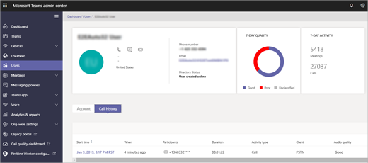
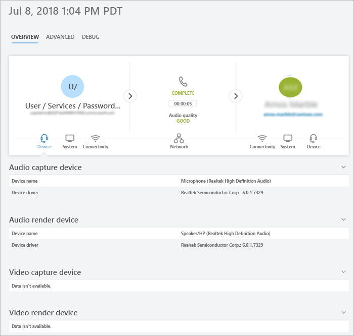

# Use per-user call analytics to troubleshoot poor call quality

Per-user call analytics helps you troubleshoot call or connection problems with Microsoft Teams. You can see detailed information about the devices, networks, and connectivity for the calls and meetings of each user in your Office 365 account. If you upload building, site, and tenant information, it will also be shown for each call and session. Use this information to help you figure out why a user had a poor call or meeting experience. 

As the Teams admin, you get full access to all the features of per-user call analytics. In addition, you can assign Azure Active Directory roles to support staff. Assign the **Teams communications support specialist** role to users who should have a limited (tier 1 support) view of per-user call data. Assign the **Teams communications support engineer** role to users who need access to all per-user call data. These permission levels prevent access to the rest of the Teams admin center. To learn how to assign these roles, read [Give permission to support and helpdesk staff](set-up-call-analytics.md#give-permission-to-support-and-helpdesk-staff).

## Where to find per-user call analytics

To see all call information and data for a user, go to the [Teams admin center](https://admin.teams.microsoft.com). Under **Users**, select a user and then open the **Call History** tab on the user's profile page. Here you'll find all calls and meetings for that user for the last 30 days.

To get additional information about a given session, including detailed media and networking statistics, click a session to see the details.

  

  
## What does each Teams Support role do?

The **Teams communications support specialist** (Tier 1 support) handles basic call-quality problems. They don't investigate issues with meetings. Instead, they collect related information and then escalate to a communications support engineer. 

The **Teams communications support engineer** (Tier 2 support) sees information in detailed call logs that are hidden from the Teams communications support specialist. The table below lists the information available to each Teams communication support role.

The following table tells you what per-user information is available for each communications support role.

|**Activity**|**Information**|What the communications support **specialist** sees|What the communications support **engineer** sees|
|:-----|:-----|:-----|:-----|
|**Calls**   |Caller name    |Only the name of the user for whom the agent searched.    |User name.    |
||Recipient name    |Shows as Internal User or External User.    |Recipient name.    |
||Caller phone number    |Entire phone number except last three digits are obfuscated with asterisk symbols. For example, 15552823***.    |Entire phone number except last three digits are obfuscated with asterisk symbols. For example, 15552823***.    |
||Recipient phone number    |Entire phone number except last three digits are obfuscated with asterisk symbols. For example, 15552823***.    |Entire phone number except last three digits are obfuscated with asterisk symbols. For example, 15552823***.    |
||**Call Details** > **Advanced** tab   |Information not shown.    |All details shown, such as device names, IP address, subnet mapping, and more.    |
||**Call Details** > **Advanced** > **Debug** tab   |Information not shown.    |All details shown, such as DNS suffix and SSID.    |
|**Meetings**   |Participant names    |Only the name of the user for whom the agent searched. Other participants identified as Internal User or External User.    |All names shown.    |
||Participant count    |Number of participants.    |Number of participants.    |
||Session details    |Session details shown with exceptions. Only the name of the user for whom the agent searched is shown. Other participants identified as Internal User or External User. Last three digits of telephone number obfuscated with asterisk symbols.    |Session details shown. User names and session details shown. Last three digits of telephone number obfuscated with asterisk symbols.    |
||||
  
## Troubleshoot user call quality problems 

1. Sign in with your Teams communications support or Teams admin credentials.

2. In your web browser go to *https://admin.teams.microsoft.com*.
    
3. On the **Dashboard**, in **User Search**, start typing either the name or sip address of the user whose calls you want to troubleshoot or select **View users** to see a list of users.
    
    
  
4. Select the user from the list.

5. Select **Call history**, and then select the call or meeting that you want to troubleshoot.
    
    
  
6. Select the **Advanced** tab, and then look for yellow and red items which indicate poor call quality or connection problems.
    
    In the session details for each call or meeting, minor issues appear in yellow. (For example, in the following screenshot, the values are in yellow for Average jitter, Max jitter, and Average packet loss rate.) If something is yellow, it's outside of normal range, and it may be contributing to the problem, but it's unlikely to be the main cause of the problem. If something is red, it's a significant problem, and it's likely the main cause of the poor call quality for this session. 
    
    
  
In rare cases, quality of experience data isn't received for audio sessions. Often this is caused by the call dropping and connection with the client terminating. When this occurs, the session rating is **unavailable**.
  
For audio sessions that do have quality of experience (QoE) data, the following table describes major issues that qualify a session as **poor**.
  
|**Issue**|**Area**|**Description**|
|:-----|:-----|:-----|
|Call setup    |Session    |The error code Ms-diag 20-29 indicates the call setup failed. The user couldn't join the call or meeting.    |
|Audio network classified poor call    |Session    |Network quality issues (such as packet loss, jitter, NMOS degradation, RTT, or concealed ratio) were encountered. For more information about the conditions used to classify poor calls, see this [Microsoft blog post](https://go.microsoft.com/fwlink/p/?linkid=852133).    |
|Device not functioning    |Device    | A device isn't functioning correctly. Device not functioning ratios are :    DeviceRenderNotFunctioningEventRatio >= 0.005    DeviceCaptureNotFunctioningEventRatio >= 0.005   |
   
## Related topics
[Set up per-user call analytics](set-up-call-analytics.md)

  
 
