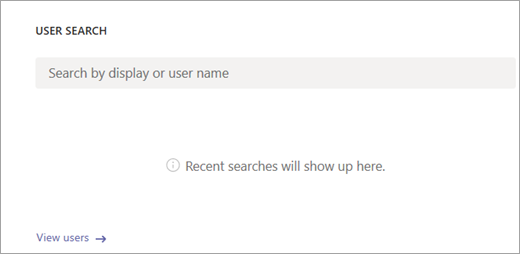
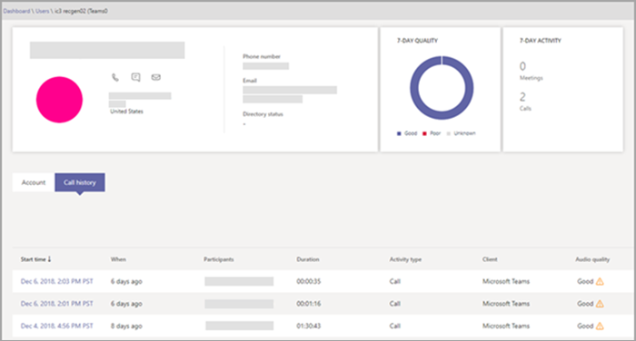
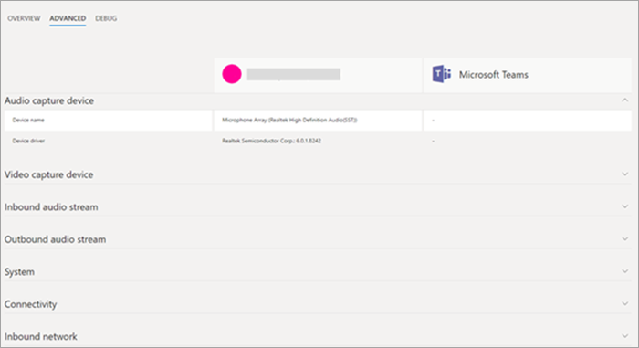

# Use Call Analytics to troubleshoot poor call quality

Call Analytics helps you troubleshoot call or connection problems with Microsoft Teams and Skype for Business. Call Analytics shows detailed information about the devices, networks, and connectivity for the calls and meetings of each user in your Office 365 account. If building, site, and tenant information has been added to Call Analytics, it will also be shown for each call and session. Information available via Call Analytics can help you figure out why a user had a poor call or meeting experience. 
  
## Call Analytics permissions

As the admin, you get full access to all the features of Call Analytics. In addition, you can assign Azure Active Directory roles to support staff. Assign the Teams communications support specialist role to users who should have a limited view of Call Analytics. Assign the Teams communications support engineer role to users who need access to the full functionality of Call Analytics. Both permission levels prevent access to the rest of the Microsoft Teams admin center.

Communications support specialists handle basic call-quality problems. They don't investigate issues with meetings. Instead, they collect related information and then escalate to a communications support engineer. Communications support engineers see information in detailed call logs that's hidden from communications support specialists. The following table gives an overview of information available to communications support specialists and communications support engineers when they use Call Analytics.

The permissions level assigned to you determines what type of information you have access to in Call Analytics:
  
- **Teams service administrator or Teams communications administrator**: You have access to all the information in Call Analytics and in the Microsoft Teams admin center.
    
- **Teams communications support specialist**: You see a limited set of data in Call Analytics. You can troubleshoot calls, but you'll hand off problems with meetings to a Teams communications support engineer. You don't have access to the rest of the Microsoft Teams admin center.
    
- **Teams communications support engineer**: You see all available data in Call Analytics and can help troubleshoot problems with both calls and meetings. You don't have access to the rest of the Microsoft Teams admin center.
    
> [!NOTE]
> The communications support specialist role is equivalent to tier 1 support and the communications support engineer role is equivalent to tier 2 support.

For more information about Teams admin roles, see [Use Microsoft Teams admin roles to manage Teams](using-admin-roles.md). For a detailed comparison of the Teams communications support specialist and Teams communications support engineer roles, see [Set up Call Analytics](set-up-call-analytics.md#set-call-analytics-permissions) 
  
See your Teams and Skype for Business admin if you need help with permissions.
  
## Troubleshoot call quality problems using Call Analytics

1. Sign in with your Teams communications support or Teams admin credentials.

2. In your web browser go to *https://admin.teams.microsoft.com*.
    
3. On the **Dashboard**, in **User Search**, start typing either the name or sip address of the user whose calls you want to troubleshoot or select **View users** to see a list of users.
    
    
  
4. Select the user from the list.

5. Select **Call history**, and then select the call or meeting that you want to troubleshoot.
    
    
  
6. Select the **Advanced** tab, and then look for yellow and red items which indicate poor call quality or connection problems.
    
    In the session details for each call or meeting, minor issues appear in yellow. (For example, in the following screenshot, the values are in yellow for Average jitter, Max jitter, and Average packet loss rate.) If something is yellow, it's outside of normal range, and it may be contributing to the problem, but it's unlikely to be the main cause of the problem. If something is red, it's a significant problem, and it's likely the main cause of the poor call quality for this session. 
    
    
  
In rare cases, quality of experience data isn't received for audio sessions. Often this is caused by the call dropping and connection with the client terminating. When this occurs, the session rating is **unavailable**.
  
For audio sessions that do have quality of experience (QoE) data, the following table describes major issues that qualify a session as **poor**.
  
|**Issue**|**Area**|**Description**|
|:-----|:-----|:-----|
|Call setup    |Session    |The error code Ms-diag 20-29 indicates the call setup failed. The user couldn't join the call or meeting.    |
|Audio network classified poor call    |Session    |Network quality issues (such as packet loss, jitter, NMOS degradation, RTT, or concealed ratio) were encountered. For more information about the conditions used to classify poor calls, see this [Microsoft blog post](https://go.microsoft.com/fwlink/p/?linkid=852133).    |
|Device not functioning    |Device    | A device isn't functioning correctly. Device not functioning ratios are :    DeviceRenderNotFunctioningEventRatio >= 0.005    DeviceCaptureNotFunctioningEventRatio >= 0.005   |
   
## Related topics
[Set up Call Analytics](set-up-call-analytics.md)

[Call Analytics and Call Quality Dashboard](difference-between-call-analytics-and-call-quality-dashboard.md)

  
 
