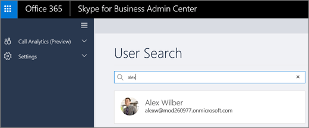
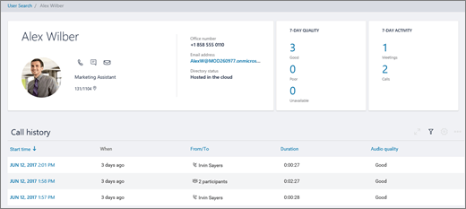
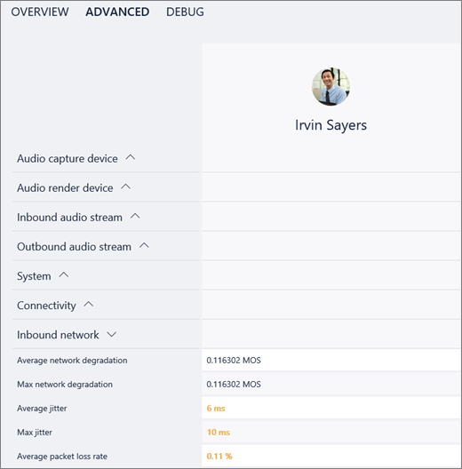

# Use Call Analytics to troubleshoot poor call quality

Call Analytics helps you to troubleshoot call or connection problems with Microsoft Teams and Skype for Business. Call Analytics shows detailed information about the devices, networks, and connectivity for the calls and meetings of each user in your Office 365 account. If building, site, and tenant information has been added to Call Analytics, it will also be shown for each call and session. Information available via Call Analytics can help you figure out why a user had a poor call or meeting experience. 
  
**Call Analytics is now available in the Microsoft Teams and Skype for Business Admin Center.** To see all of the call information and data for a user, use the **Call History** tab. You can do this by looking on the user's profile page by either searching for the user from the dashboard or finding the user from **Users** in the left navigation.

> [!IMPORTANT]
> Helpdesk agent permissions and network topology upload will be available in the new admin portal in the coming months. In the meantime, you can continue to use  https://adminportal.services.skypeforbusiness.com for Tier 1 and Tier 2 helpdesk access.
  
## Troubleshoot call quality problems using Call Analytics

The permissions level assigned to you determines what type of information you have access to in Call Analytics:
  
- **Skype for Business admin**: You have access to all the information in Call Analytics and in the Skype for Business Admin center.
    
- **Helpdesk agent with Tier 1 permissions**: You see a limited set of data in Call Analytics. You can troubleshoot calls, but you'll hand off problems with meetings to a Tier 2 agent. You don't have access to the rest of the Skype for Business Admin center.
    
- **Helpdesk agent with Tier 2 permissions**: You see all available data in Call Analytics and can help troubleshoot problems with both calls and meetings. You don't have access to the rest of the Skype for Business Admin center.
    
See your Skype for Business admin if you need help with permissions.
  
 **Open Call Analytics as a Tier 1 or Tier 2 helpdesk agent**
  
1. Go to the Office 365 admin center and sign in using your work or school account. Then in your web browser go to *https://adminportal.services.skypeforbusiness.com*.
    
2. In **User Search**, start typing either the name or sip address of the user whose calls you want to troubleshoot and then select the user from the list.
    
    
  
3. In **Call history**, select the call or meeting that you want to troubleshoot.
    
    
  
4. Select the **Advanced** tab, and then look for yellow and red items which indicate poor call quality or connection problems.
    
    In the session details for each call or meeting, minor issues appear in yellow. (For example, in the following screenshot, the values are in yellow for Average jitter, Max jitter, and Average packet loss rate.) If something is yellow, it's outside of normal range, and it may be contributing to the problem, but it's unlikely to be the main cause of the problem. If something is red, it's a significant problem, and it's likely the main cause of the poor call quality for this session. 
    
    
  
In rare cases, quality of experience data isn't received for audio sessions. Often this is caused by the call dropping and connection with the client terminating. When this occurs, the session rating is "unavailable".
  
For audio sessions that do have quality of experience (QoE) data, the following table describes major issues that qualify a session as "poor."
  
|**Issue**|**Area**|**Description**|
|:-----|:-----|:-----|
|Call setup    |Session    |The error code Ms-diag 20-29 indicates the call setup failed. The user couldn't join the call or meeting.    |
|Audio network classified poor call    |Session    |Network quality issues were encountered in areas such as packet loss, jitter, NMOS degradation, RTT, or concealed ratio. For more information about the conditions used to classify poor calls, see this [Microsoft blog post](https://go.microsoft.com/fwlink/p/?linkid=852133).    |
|Device not functioning    |Device    | A device isn't functioning correctly. Device not functioning ratios are :    DeviceRenderNotFunctioningEventRatio >= 0.005    DeviceCaptureNotFunctioningEventRatio >= 0.005   |
   
## Related topics
[Set up Skype for Business Call Analytics](set-up-call-analytics.md)

[Call Analytics and Call Quality Dashboard](difference-between-call-analytics-and-call-quality-dashboard.md)

  
 
