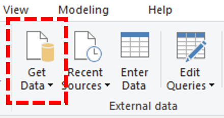
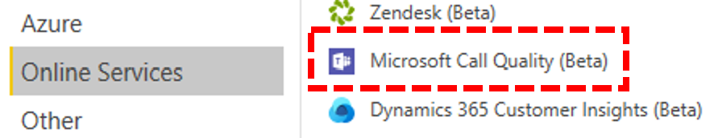
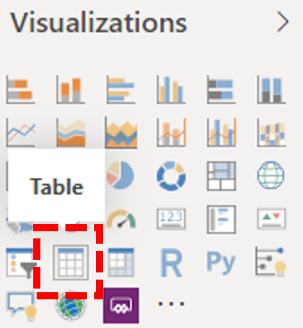
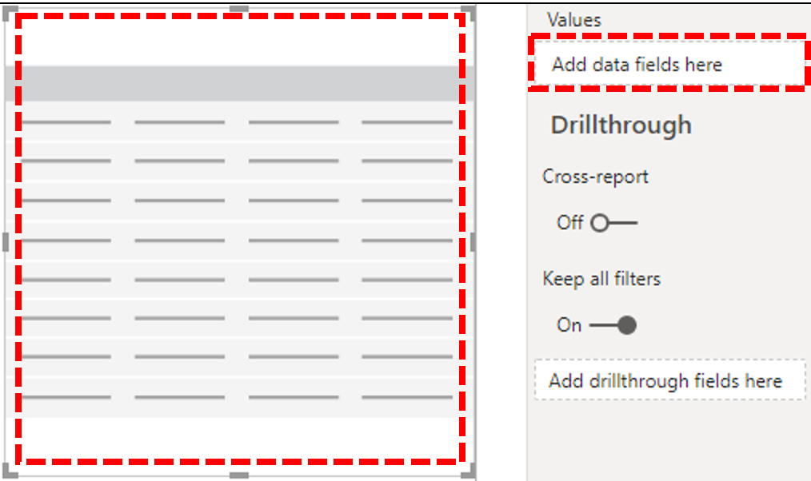
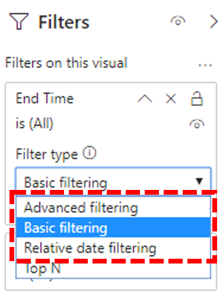
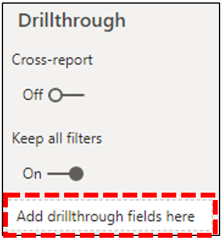
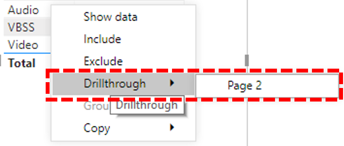

# Use Power BI for CQD reports

## Download Power BI query templates for CQD

New in January 2020, for CQD reports in Microsoft Teams, if you’d rather use Power BI to query and report your data, [download our Power BI query templates for CQD](https://github.com/MicrosoftDocs/OfficeDocs-SkypeForBusiness/blob/live/Teams/downloads/CQD-Power-BI-query-templates.zip?raw=true). When you open these customizable templates in Power BI, you’ll be prompted to sign in with your CQD admin credentials. You can customize these query templates and distribute them to anyone in your organization who has a Power BI license and CQD admin permissions.

## Power BI query templates for CQD

<table>
<thead>
<tr class="header">
<th>Power BI template name</th>
<th>Description</th>
</tr>
</thead>
<tbody>
<tr class="odd">
<td>CQD Helpdesk Report.pbix</td>
<td>Integrating building and EUII data, this report is designed to let you drill up from a single user to find the upstream root cause of poor call quality for that user (for example, the user is in a building that’s experiencing network problems).</td>
</tr>
<tr class="odd">
<td>CQD Location Enhanced Report.pbix</td>
<td>Re-imagining CQD SPD location reports. Includes 9 reports, providing Call Quality, Building WiFi, Reliability, and Rate My Call (RMC) information with additional drill-thrus by Building or by User.</td>
</tr>
<tr class="even">
<td>CQD Mobile Device Report.pbix</td>
<td>Provides insights specifically tuned towards mobile device users, including Call Quality, Reliability, and Rate My Call. View mobile network, WiFi network, and mobile operating system reports (Android, iOS).</td>
</tr>
<tr class="odd">
<td>CQD PSTN Direct Routing Report.pbix</td>
<td>Provides insights specific for PSTN calls that go through Direct Routing.</td>
</tr>
<tr class="even">
<td>CQD Summary Report.pbix</td>
<td>
Better visualizations, improved presentation, increased information density, and rolling dates. These reports make it easier to identifier outliers. Drill into call quality by location with an easy-to-use interactive map. 9 new reports:

<ol type="1">
<li>
Quality Overall
</li>
<li>
Reliability Overall
</li>
<li>
RMC (Rate My Call) Overall
</li>
<li>
Conference Quality
</li>
<li>
P2P Quality
</li>
<li>
Conference Reliability
</li>
<li>
P2P Reliability
</li>
<li>
Conference RMC
</li>
<li>
P2P RMC
</li>
</ol></td>
</tr>
<tr class="odd">
<td>CQD User Feedback (Rate My Call) Report.pbix</td>
<td>Shows Rate My Call data in a way that you can easily use to help support calling for your organization. Cross reference with verbatims to identify end user education opportunities.</td>
</tr>
</tbody>
</table>

### Factors that affect query performance

When you customize these queries, if you find that the queries are running very slowly (or timing out), consider these factors:

1.  Amount of building data included
2.  Tenant size, number of records
3.  Number of widgets per report page
4.  Number of rows returned in the query.

## Install Power BI Connector

In order to use the downloaded CQD Power BI query templates (PBIX files), you'll need to install the Power BI Connector file MicrosoftCallQuality.pqx (included in the template download).

### Installation

1.  Check to see if your computer already has a *\[Documents\]\\Power BI Desktop\\Custom Connectors* folder. If not, create this folder.
    
    - Certain processes and apps (e.g., OneDrive) may cause your Documents root folder to change; make sure that the *Power BI Desktop\\Custom Connectors* directory is inside your Documents root folder.

2.  Download the connector file (either a *\*.mez* or *\*.pqx* file) and place it in the *Custom Connectors* folder.

3.  **If the connector file is a *\*.mez* file,** you will also need to adjust your security settings as described in the [custom connector setup documentation](https://docs.microsoft.com/power-bi/desktop-connector-extensibility#data-extension-security).

If a new version of this Power BI Connector for Teams is released, replace the old connector file in the *Custom Connectors* folder with the new file.

To learn more, read [Connector extensibility in Power BI](https://docs.microsoft.com/power-bi/desktop-connector-extensibility).

### Setup

In order to build a report and run queries, you will first need to connect to the CQD data source. Follow the steps below in order to connect:

1. In Power BI Desktop, on the **Home** tab, click **Get Data**.
   

2. Under **Online Services**, select **Microsoft Call Quality (Beta)**, then click **Connect**.

   

3. Sign in with your CQD credentials.
    
   - The login credentials you use for CQD don't need to be the same credentials you use for logging into the Power BI Desktop app itself.

4. At the **Data Connectivity modes** prompt, select **DirectQuery**.

5. The final prompt shows you the entire data model for CQD. No data will be visible at this point, only the data model for CQD. Select **Load** to complete the setup process.

6. At this point, Power BI will load the data model onto the right side of the window. The page will remain otherwise blank, and no queries will be loaded by default. Proceed to **Building Queries** below in order to build a query and return data.

To learn more, read [Quickstart: Connect to data in Power BI Desktop](https://docs.microsoft.com/power-bi/desktop-quickstart-connect-to-data).

### Building queries

Once setup is complete, you should see the names of several hundred dimensions and measures load in the **Fields** pane. To construct a query from here, select the dimensions and measures you want for your query, then drag and drop them onto the page. Here’s a more detailed explanation, with a simple example:

1. Select the visualization you want to use from the **Visualizations** pane. A blank version of that visualization should appear on the page. In this example, we'll use the **Table** visualization.

    

2. Determine which dimensions and measures (denoted by an aggregation symbol by their name) you wish to use for your query, then manually select them and drag them onto the black visualization. Alternately, drag them onto the *Values* field beneath the visualization options.

   

    > [!NOTE]
    > CQD requires a measure for any query to run. Queries without a measure will fail.

3. Next, select any dimensions you want to filter on and drag them to the **Filters on this visual** field in the **Filters** pane. The CQD Power BI Connector currently supports **Basic filtering** (select values from a list of possible dimension values), **Advanced filtering** (manually specify values and operands to filter on, similar to CQD), and **Relative date filtering** (only available for the **End Time** and **Start Time** dimensions). The **Top N** filter type isn't supported by CQD.

   

4.  Finally, select the **Format** tab, in the **Visualizations** pane to style and format your query.

   > [!NOTE]
   > CQD queries require at least one measure in order to run. If your query doesn't load, double check that you have included a measure in the query.

### Creating a Drillthrough Report

[Drillthrough in Power BI](https://docs.microsoft.com/power-bi/desktop-drillthrough) allows you to create focused reports that you can quickly filter using the values of other reports as context. Once you know how to create your first query with the CQD Connector, creating a drillthrough is even simpler.

1.  Create another page for the focused report, and then add your queries to that page.

2.  Select the dimension you want to use as a drillthrough filter and drag them onto the **Drillthrough** field under on the **Visualizations** pane.

   

3.  From here, any other query on another page that uses that dimension can now drillthrough to that page, automatically applying the drillthrough dimension’s value as a filter.

   

Unlike CQD, Power BI supports non-sequential drillthrough. As long as a query includes the necessary dimension, it can drillthrough to any other page.

### Limitations

Despite making use of Power BI, not all Power BI functionality is support by the CQD Connector, either as a result of limitations of the CQD data model or DirectQuery connectors in general. Here's a list of the Connector’s more noteworthy limitations, but this list should not be considered exhaustive:

   **Calculated Columns** – DirectQuery connectors in general have limited support for calculated columns in Power BI. While some calculated columns may work with the Connector, these should be considered exceptions. As a general rule, calculated columns don't work.

   **Aggregations** – The CQD data model is built on a cube model, meaning that aggregations are already supported in the form of measures. Attempting to manually add aggregations to different dimensions or changing the aggregation type of a measure won't work with the Connector, and it will generally result in an error.

   **Custom Visuals** – While the CQD Connector does work with a range of custom visuals, we can't guarantee compatibility with all custom visuals. Many custom visuals rely on the use of calculated columns or imported data, neither or which are supported by DirectQuery connectors.

   **Referencing Cached Data** – Power BI currently does not support referencing cached data from a DirectQuery connector in any way. Any attempt to reference the results of a query will result in a new query.

   **Relative Data Filtering** – Is supported in the CQD Connector, but only with the **Start Time** and **End Time** dimensions. Although the **Date** dimension may be the obvious choice for relative date filtering, **Date** is not stored as a date time object and thus does not support relative date filtering in Power BI.

> [!NOTE]
> Although the Connector is in preview, these limitations are unlikely to change with the final release of the Connector. Most of these issues are either restrictions to DirectQuery connector design in Power BI or fundamental to the design of the CQD data model.

### Error codes

Because the CQD Power BI Connector is less restricted than the browser app in terms of kinds of queries you can construct, you may occasionally encounter a number of errors while building your queries. In the event that you receive an error message of the type “CQDError. RunQuery – Query Execution Error,” reference the list below with the ErrorType number provided in order to troubleshoot the possible issue with the query. The following are the most common Error Type codes you may encounter with the CQD Power BI Connector:

   **ErrorType 1 - Query Structure Error** - A query structure error is typically caused by the Connector failing to build a properly formatted query. This usually happens when using unsupported functionality, as specified in the Limitations above. Double check that you're not using any calculated columns or custom visuals for that query.

   **ErrorType 2 - Query Building Error** - A query building error is caused by the CQD Connector being unable to properly parse your query. This usually happens when using unsupported functionality, as specified in the Limitations above. Double check that you aren't using any calculated columns or custom visuals for that query.

   **ErrorType 5 - Execution Timeout** - The query has reached the maximum possible runtime before timing out. Try adding more filters to the query in order to limit its scope. Narrowing the data range is often the most effective way to achieve this.

   **ErrorType 7 - No Measurements Error** - CQD queries require a measure in order to function. Double check that your query includes measure. Measures in the CQD Connector are denoted by the aggregation (sum) symbol before their name.

## Related topics

[Set up Call Quality Dashboard (CQD)](turning-on-and-using-call-quality-dashboard.md)

[Use CQD to manage call and meeting quality](quality-of-experience-review-guide.md)