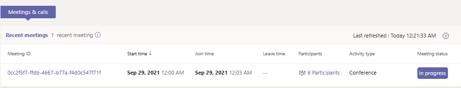
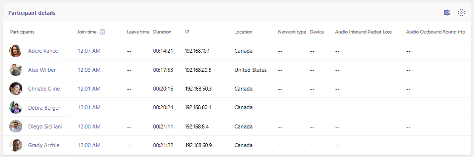
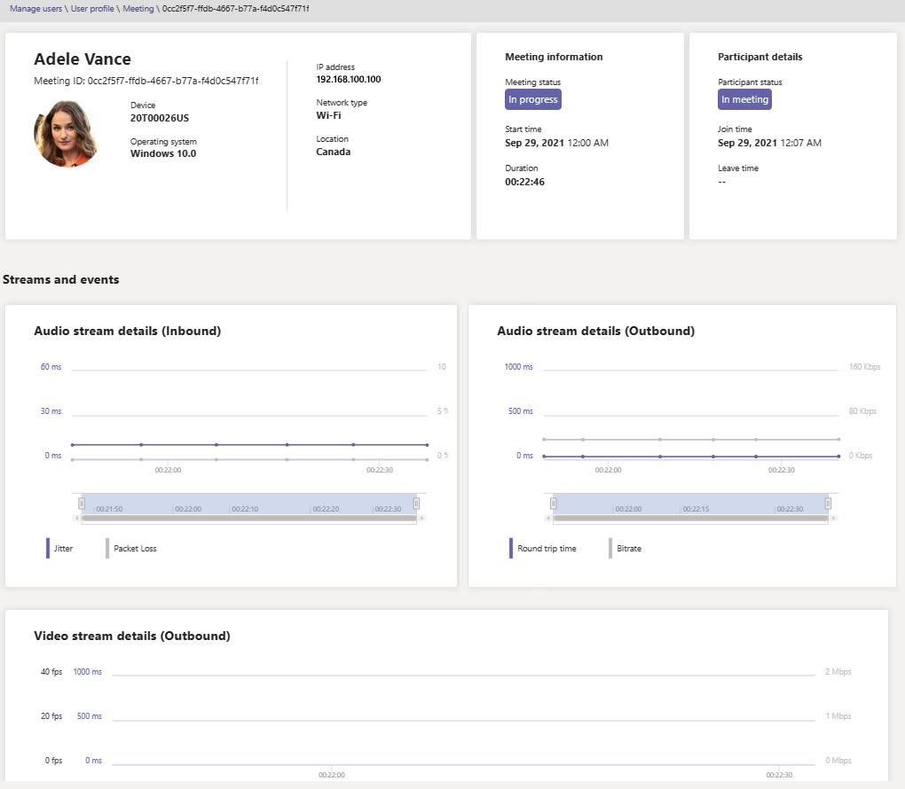

# Use real-time telemetry to troubleshoot poor meeting quality

> [!NOTE]
> This feature is currently in public preview until the end of 2021. After this time, the Advanced Communications add-on for Microsoft Teams will be required for each user whose telemetry you wish to view in real-time. For more information, see [Advanced Communications add-on for Microsoft Teams](/MicrosoftTeams/teams-add-on-licensing/advanced-communications).

This article explains how to use Real-time Analytics (RTA) to troubleshoot poor Microsoft Teams meeting quality for individual users. You can access Real-time Analytics if you have one of the following roles:

- Teams Administrator
- Teams Communications Support Specialist
- Teams Communications Support Engineer

For more information on Teams admin roles, see [Use Microsoft Teams administrator roles to manage Teams](/MicrosoftTeams/using-admin-roles).

Real-time Analytics lets IT admins look at their important users’ scheduled meetings and see audio, video, content sharing, and network-related issues. As an admin, you can use this telemetry to investigate these issues during meetings and troubleshoot in real-time.

## What is Real-time Analytics?

Today, individual meeting troubleshooting is available for Teams administrators through [Call Analytics](use-call-analytics-to-troubleshoot-poor-call-quality.md) after the meeting ends. Real-time Analytics lets admins troubleshoot scheduled meetings while they're in progress.

Real-time Analytics shows detailed information about Teams meetings for each user in your Office 365 account, updated in real-time. It includes information about devices, network, connectivity, audio, video, and content sharing issues, which will help admin troubleshoot call quality more effectively.

As a Teams admin, you get full access to all real-time telemetry data for each user. In addition, you can assign Azure Active Directory roles to support staff. To learn more about these roles, see [Give permission to support and help desk staff](set-up-call-analytics.md#give-permission-to-support-and-helpdesk-staff).

## Where to find per-user real-time troubleshooting telemetry

To see all meeting information and data for a user, go to the [Teams admin center](https://admin.teams.microsoft.com). Under **Users** > **Manage users**, select a user, and open the **Meetings & calls** tab on the user's profile page. Under **Recent meetings**, you'll see a list of meetings the user has attended within the past 24 hours *for which real-time telemetry is available*, including any in progress meetings. If the meeting is not in progress or doesn't have real-time telemetry data, it will show up in **Past meetings**.

To get additional information about participants of a meeting that's in progress, including their device, network, and audio statistics, find the meeting in **Recent meetings** and select the link under the **Participants** column.

To look at the telemetry of a given user for an in-progress meeting, including information around device, network, audio, video, and content sharing details, select the **Meeting ID**.

## Client platforms supported for real-time telemetry

- Windows
- macOS
- Linux
- Android
- iOS

## Teams devices with support for real-time telemetry

- MTR - Surface Hub
- MTR - Teams Display
- MTR - Collaboration bar
- IP Phone devices

## Limitations

- Real-time telemetry is only available for scheduled meetings. For ad hoc meetings like Meet Now, PSTN, 1:1 calls, and group calls, real-time telemetry isn't available.
- Real-time telemetry is only available for presenters of scheduled live event. It's currently not available for live event attendees.
- Real-time telemetry data is available for a meeting under **Recent meetings** for 24 hours after the meeting has ended. After 24 hours, you can't access the data and the meeting moves to **Past meetings**. If a meeting is longer than 3 hours, real-time telemetry will only be available for the *last 3 hours*.
- Telemetry isn't available in real-time when using older versions of Teams. If no telemetry is available, try updating your client.
- If external participants or anonymous users join a meeting, their display name will show as **unavailable** to retain cross-tenant privacy.

## Related topics

[Set up per-user call analytics](set-up-call-analytics.md)

[Use Microsoft Teams administrator roles to manage Teams](/MicrosoftTeams/using-admin-roles).
