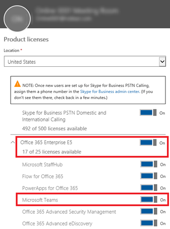

Manage user access to Microsoft Teams
=====================================
> [!IMPORTANT]
> [!INCLUDE [new-teams-sfb-admin-center-notice](includes/new-teams-sfb-admin-center-notice.md)]

At the user level, access to Microsoft Teams can be enabled or disabled on a per-user basis by assigning or removing the Microsoft Teams product license.

Use messaging policies, managed from the Teams Admin Center, to control what chat and channel messaging features are available to users in Teams. You can use the default policy or create one or more custom messaging policies for people in your organization. To learn more, read [Manage messaging policies in Teams](messaging-policies-in-teams.md).

> [!NOTE]
>Microsoft recommends that you turn on Teams for all users in a company so that teams can be formed organically for projects and other dynamic initiatives. Even if you are deciding to pilot, it may still be helpful to keep Teams enabled for all users, but only target communications to the pilot group of users.

## Manage Teams through the Microsoft 365 admin center

Teams user-level licenses are managed directly through the Microsoft 365 admin center user management interfaces. An administrator can assign licenses to new users when new user accounts are created, or to users with existing accounts. The administrator must have Office 365 Global Administrator or User Management Administrator privileges to manage Microsoft Teams licenses.

When a license SKU like E3 or E5 is assigned to a user, a Microsoft Teams license is automatically assigned, and the user is enabled for Microsoft Teams. Administrators can have a granular control over all the Office 365 services and licenses, and the Microsoft Teams license for a specific user or a group of users can be enabled or disabled.

 

A Teams user license can be disabled at any time. Once the license is disabled, the users access to Microsoft Teams will be prevented and the user will no longer be able to see Teams in the Office 365 app launcher and homepage.

## Manage via PowerShell

> [!IMPORTANT]
> New-MsolLicenseOptions will enable all services that were previously disabled unless explictitly identitied in your customized script. As an example, if you wanted to leave both Exchange & Sway disabled while additonally disabling Teams, you'd need to inlcude this in the script or both Exchange & Sway will become enabled for those users you've identified. If you wish to do utilize a GUI to manage this functionality, See: [Office 365 License Reporting and Management Tool -Assign Remove Licenses in Bulk](https://gallery.technet.microsoft.com/Office365-License-cfd9489c)

Enabling and disabling Teams as a workload license through PowerShell is done just as any other workload. The service plan name is TEAMS1 for Microsoft Teams. For GCC the service plan name is TEAMS_GOV. For GCC High the service plan name is TEAMS_GCCHIGH. For DoD the service plan name is TEAMS_DOD (See [Disable access to services with Office 365 PowerShell](https://docs.microsoft.com/office365/enterprise/powershell/disable-access-to-services-with-office-365-powershell) for more information.)

**Sample:** The following is just a quick sample on how you would disable Teams for everyone in a particular license type. You'll need to do this first, then individually enable it for the users who should have access for piloting purposes.

To display the subscription types you have within your organization, use the following command:

      Get-MsolAccountSku

Fill in the name of your plan that includes your organization name and the plan for your school (such as ContosoSchool:ENTERPRISEPACK_STUDENT), and then run the following commands:

      $acctSKU="<plan name>
      $x = New-MsolLicenseOptions -AccountSkuId $acctSKU -DisabledPlans "TEAMS1"
To disable Teams for all users with an active license for your named plan, run the following command:

      Get-MsolUser | Where-Object {$_.licenses[0].AccountSku.SkuPartNumber -eq  ($acctSKU).Substring($acctSKU.IndexOf(":")+1,  $acctSKU.Length-$acctSKU.IndexOf(":")-1) -and $_.IsLicensed -eq $True} |  Set-MsolUserLicense -LicenseOptions $x

| | | |
|---------|---------|---------|
|     |Decision Point         |<ul><li>What is your organization’s plan for Teams onboarding across the organization?  (Pilot or Open)</li></ul>         |
|     |Next Steps         |<ul><li>If onboarding via a closed Pilot, decide if you would like to do so via licensing, or targeted communication.</li><li>Depending on decision, take steps to make sure only Pilot users who are allowed to access Teams (if needed).</li><li>Document the guidelines for which users who will (or will not) have access to Teams.</li></ul>         |

## Manage Teams at the Office 365 tenant level
[!INCLUDE [global-switch-expiry-note](includes/global-switch-expiry-note.md)]

