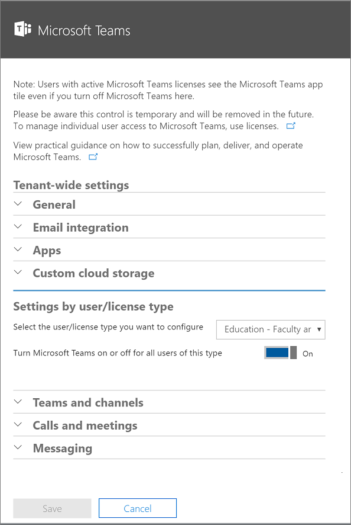

Manage user access to Microsoft Teams
=====================================
> [!IMPORTANT]
> [!INCLUDE [new-teams-sfb-admin-center-notice](includes/new-teams-sfb-admin-center-notice.md)]

At the user-level, access to Microsoft Teams can be enabled or disabled on a per-user basis by assigning or removing the Microsoft Teams product license.

Currently, there are no policy options for turning Microsoft Teams, or a subset of Microsoft Teams features on or off at an individual user level outside of licensing.

> [!NOTE]
>Microsoft recommends that Microsoft Teams is enabled for all users in a company so that teams can be formed organically for projects and other dynamic initiatives. Even if you are deciding to pilot, it may still be helpful to keep Microsoft Teams enabled for all users, but only target communications to the pilot group of users.

## Manage directly through the Office 365 admin center

Microsoft Teams user-level licenses are managed directly through the Office 365 admin center user management interfaces. An administrator can assign licenses to new users when new user accounts are created, or to users with existing accounts. The administrator must have Office 365 Global Administrator or User Management Administrator privileges to manage Microsoft Teams licenses.

When a license SKU like E3 or E5 is assigned to a user, a Microsoft Teams license is automatically assigned, and the user is enabled for Microsoft Teams. Administrators can have a granular control over all the Office 365 services and licenses, and the Microsoft Teams license for a specific user or a group of users can be enabled or disabled.

 

A Microsoft Teams user license can be disabled at any time. Once the license is disabled, the users access to Microsoft Teams will be prevented and the user will no longer be able to see Microsoft Teams in the Office 365 app launcher and homepage.

## Manage via PowerShell

Enabling and disabling Teams as a workload license through PowerShell is done just as any other workload. The service plan name is TEAMS1 for Microsoft Teams. (See [Disable access to services with Office 365 PowerShell](https://docs.microsoft.com/office365/enterprise/powershell/disable-access-to-services-with-office-365-powershell) for more information.)

**Sample:** Below is just a quick sample on how you would disable Microsoft Teams for everyone in a particular license type. You'll need to do this first, then individually enable it for the users who should have access for piloting purposes.

To display the subscription types you have within your organization, use the following command:

      Get-MsolAccountSku

Fill in the name of your plan that includes your organization name and the plan for your school (such as ContosoSchool:ENTERPRISEPACK_STUDENT), and then run the following commands:

      $acctSKU="<plan name>
      $x = New-MsolLicenseOptions -AccountSkuId $acctSKU -DisabledPlans "TEAMS1"
To disable Microsoft Teams for all users with an active license for your named plan, run the following command:

      Get-MsolUser | Where-Object {$_.licenses[0].AccountSku.SkuPartNumber -eq  ($acctSKU).Substring($acctSKU.IndexOf(":")+1,  $acctSKU.Length-$acctSKU.IndexOf(":")-1) -and $_.IsLicensed -eq $True} |  Set-MsolUserLicense -LicenseOptions $x

| | | |
|---------|---------|---------|
|     |Decision Point         |<ul><li>What is your organization’s plan for Microsoft Teams onboarding across the organization?  (Pilot or Open)</li></ul>         |
|     |Next Steps         |<ul><li>If onboarding via a closed Pilot, decide if you would like to do so via licensing, or targetted communication.</li><li>Depending on decision, take steps to make sure only Pilot users who are allowed to access Microsoft Teams (if needed).</li><li>Document the guidelines for which users who will (or will not) have access to Microsoft Teams.</li></ul>         |

## Manage via Office Sku level switch
    [!INCLUDE [global-switch-expiry-note](includes/global-switch-expiry-note.md)]

1.  Sign in to the [Office 365 Admin center](https://go.microsoft.com/fwlink/?linkid=854614) with an account that has Global Administrator privileges.

2.  Go to **Settings** > **Services & add-ins**.

    

3.  On the Services & add-ins page, click **Microsoft Teams**.

    

4.  To turn on Teams for the organization use the license picker and select each license then set the toggle to **On** and then click **Save**.

    