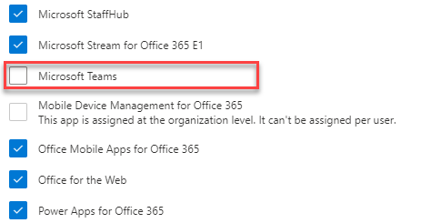

# Manage user access to Teams

You manage access to Teams at the user level by assigning or removing a Microsoft Teams product license. Except for joining Teams meetings anonymously, each user in your organization must have a Teams license before they can use Teams. You can assign a Teams license for new users when new user accounts are created or to users with existing accounts.

By default, when a licensing plan (for example, Microsoft 365 Enterprise E3 or Microsoft 365 Business Premium) is assigned to a user, a Teams license is automatically assigned, and the user is enabled for Teams. You can disable or enable Teams for a user by removing or assigning a license at any time.

Use messaging policies, managed from the <a href="https://go.microsoft.com/fwlink/p/?linkid=2024339" target="_blank">Teams Admin Center</a>, to control what chat and channel messaging features are available to users in Teams. You can use the default policy or create one or more custom messaging policies for people in your organization. To learn more, read [Manage messaging policies in Teams](messaging-policies-in-teams.md).
You manage Teams licenses in the Microsoft 365 admin center or by using PowerShell. You must be a Global admin or User management admin to manage licenses.

> [!NOTE]
> We recommend that you enable Teams for all users so that teams can be formed organically for projects and other dynamic initiatives. Even if you're running a pilot, it may still be helpful to keep Teams enabled for all users, but only target communications to the pilot group of users.

## Using the Microsoft 365 admin center

Teams user-level licenses are managed directly through the Microsoft 365 admin center user management interfaces. An administrator can assign licenses to new users when new user accounts are created, or to users with existing accounts. 

> [!IMPORTANT]
> The administrator must have Global Administrator or User Management Administrator privileges to manage Microsoft Teams licenses.
Use the Microsoft 365 admin center to manage Teams licenses for individual users or small sets of users at a time. You can manage Teams licenses on the **Licenses** page (for up to 20 users at at time) or **Active users** page. The method you choose depends on whether you want to manage product licenses for specific users or manage user licenses for specific products.

If you need to manage Teams licenses for a large number of users, such as hundreds or thousands of users, [use PowerShell](#using-powershell) or [group-based licensing in Azure Active Directory (Azure AD)](/azure/active-directory/users-groups-roles/licensing-groups-assign). 

### Assign a Teams license

The steps are different depending on whether you use the **Licenses** page or **Active users** page.  For step-by-step instructions, see [Assign licenses to users](/microsoft-365/admin/manage/assign-licenses-to-users).

|&nbsp;|&nbsp;|
|---------|---------|
|    |         |

### Remove a Teams license

> [!IMPORTANT]
> It takes about 24 hours for disabling a Teams SKU to take effect.

When you remove a Teams license from a user, Teams is disabled for that user, and they will no longer see Teams in the app launcher or homepage. For detailed steps, see [Unassign licenses from users](/microsoft-365/admin/manage/remove-licenses-from-users).

|&nbsp;|&nbsp;|
|---------|---------|
|    |         |

## Using PowerShell

Use PowerShell to manage Teams licenses for users in bulk. You enable and disable Teams through PowerShell in the same way that you would for any other service plan license. You'll need the identifiers for the service plans for Teams, which are as follows:

- Microsoft Teams: TEAMS1
- Microsoft Teams for GCC: TEAMS_GOV
- Microsoft Teams for DoD: TEAMS_DOD

### Assign Teams licenses in bulk

For detailed steps, see [Assign licenses to user accounts with PowerShell](/office365/enterprise/powershell/assign-licenses-to-user-accounts-with-office-365-powershell).

### Remove Teams licenses in bulk

For detailed steps, see [Disable access to services with PowerShell](/office365/enterprise/powershell/disable-access-to-services-with-office-365-powershell) and [Disable access to services while assigning user licenses](/office365/enterprise/powershell/disable-access-to-services-while-assigning-user-licenses).

#### Example 

The following is an example of how to use the [New-MsolLicenseOptions](/powershell/module/msonline/new-msollicenseoptions) and [Set-MsolUserLicense](/powershell/module/msonline/set-msoluserlicense) cmdlets to disable Teams for users who have a specific licensing plan. For example, follow these steps to first disable Teams for all users who have a particular licensing plan. Then enable Teams for each individual user who should have access to Teams.

> [!IMPORTANT]
> The [New-MsolLicenseOptions](/powershell/module/msonline/new-msollicenseoptions) cmdlet will enable all services that were previously disabled unless explicitly identified in your custom script. For example, if you want to leave both Exchange and Sway disabled while also disabling Teams, you'll need to include this in the script or both Exchange and Sway will be enabled for those users you identified.

Run the following command to display all available licensing plans in your organization. To learn more, see [View licenses and services with PowerShell](/office365/enterprise/powershell/view-licenses-and-services-with-office-365-powershell).


```powershell
Get-MsolAccountSku
```

Run the following commands, where \<CompanyName:License> is your organization name and the identifier for the licensing plan that you retrieved in the earlier step. For example, ContosoSchool:ENTERPRISEPACK_STUDENT.

```powershell
$acctSKU="<CompanyName:License>
$x = New-MsolLicenseOptions -AccountSkuId $acctSKU -DisabledPlans "TEAMS1"
```

Run the following command to disable Teams for all users who have an active license for the licensing plan.

```powershell
Get-MsolUser | Where-Object {$_.licenses[0].AccountSku.SkuPartNumber -eq  ($acctSKU).Substring($acctSKU.IndexOf(":")+1,  $acctSKU.Length-$acctSKU.IndexOf(":")-1) -and $_.IsLicensed -eq $True} |  Set-MsolUserLicense -LicenseOptions $x
```

## Related topics

- [Teams add-on licenses](teams-add-on-licensing/microsoft-teams-add-on-licensing.md)
- [Assign Teams add-on licenses](teams-add-on-licensing/assign-teams-add-on-licenses.md)
- [View licenses and services with PowerShell](/office365/enterprise/powershell/view-licenses-and-services-with-office-365-powershell)
- [Product names and service plan identifiers for licensing](/azure/active-directory/users-groups-roles/licensing-service-plan-reference)
- [Education SKU reference](sku-reference-edu.md)
