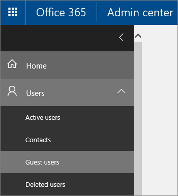

View guest users in a team
==========================
Anyone in a team can see all members of a team, including guests, via **Manage team** in Microsoft Teams.  [See who's on a team or in a channel ](https://support.office.com/article/see-who-s-on-a-team-or-in-a-channel-5c6be9be-9c45-4a0f-a1a0-f332b23cb6b7) has more details.

As an admin, you can use the Office 365 Admin center to view guest users in the tenant. However, this view shows *all* guest users in the tenant,  not just guest users in Microsoft Teams.
1. Sign in with your Office 365 global admin account at [https://portal.office.com/adminportal/home](https://portal.office.com/adminportal/home).
2. Go to **Users** > **Guest users**.

  
