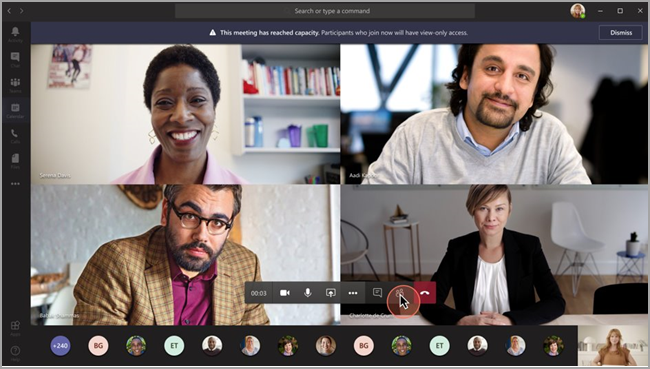
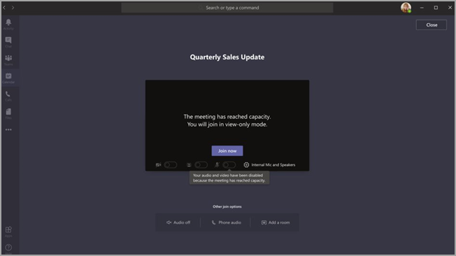

# Teams view-only meeting experience

> [!Note]
> View-only broadcasts is available in Microsoft 365 E3/E5 and Microsoft 365 A3/A5. This feature will be enabled March 1, 2021 as default OFF. The feature in Microsoft 365 Government Community Cloud (GCC) will begin to roll out at the end of March 2021. Government Community Cloud High (GCCH) and Department of Defense (DoD) will roll out at a later date. You must change the default policy after that date if you want to have the feature be default ON. Use PowerShell to enable the policy `Set-CsTeamsMeetingPolicy -Identity Global -StreamingAttendeeMode Enabled`.

> [!Note]
> If your meeting hits capacity, Teams will seamlessly scale to accommodate a 10,000-person view-only broadcast experience. Plus, during this time of increased remote work, take advantage of even larger 20,000-person broadcasts through the end of this year. Webinars currently don't support a view-only broadcast experience.

Microsoft Teams allows up to 10,000 attendees to join a Teams meeting. After the capacity of the main meeting has been reached (which is when 1000 users enter a meeting), additional attendees will join with a view-only experience.

Attendees who join the meeting first, up to the capacity of the main meeting, will get the full Teams meeting experience. They can share audio and video, see shared videos, and participate in meeting chat.

Attendees who join after the main meeting capacity has been reached will have a view-only experience.

Attendees will be able to join the view-only experience through desktop, web, and Teams mobile (Android and iOS).

> [!Note]
> The current limit capacity of the "main meeting", or in other words, the number of fully interactive users, is 1000 and includes GCC and webinars.

## Teams view-only experience controls

You enable the view-only experience using the [`Set-CsTeamsMeetingPolicy`](/powershell/module/skype/set-csteamsmeetingpolicy?view=skype-ps) cmdlet from the [SkypeForBusiness PowerShell module](/powershell/module/skype/?view=skype-ps) or at least version 2.0.0 of the [MicrosoftTeams module](https://www.powershellgallery.com/packages/MicrosoftTeams).

To use the recommended `MicrosoftTeams` module:

```PowerShell
Install-Module -Name "MicrosoftTeams" -MinimumVersion 2.0.0
Connect-MicrosoftTeams
```

To enable the view-only experience, you can use the following PowerShell snippet:

```PowerShell
Set-CsTeamsMeetingPolicy -Identity Global -StreamingAttendeeMode Enabled
```

To disable the view-only experience, you can also use PowerShell.

```PowerShell
Set-CsTeamsMeetingPolicy -Identity Global -StreamingAttendeeMode Disabled
```

In the future, you'll be able to enable or disable the view-only experience in the Teams admin center.

## Impact to users

A user's experience will vary depending on several factors.

When the capacity of the main meeting has been reached, an attendee will be unable to join the meeting if any of the following are true:

- An administrator has disabled the Teams view-only experience for either the organizer or for the entire tenant.
- The view-only attendee can't bypass the lobby. As an example, if an organizer of a meeting chooses to have only **People in my organization** bypass the lobby, and an attendee who is outside of the organization attempts to join as a view-only attendee, they won't be able to join.

When the capacity of the main meeting has been reached, the meeting organizer and presenters will see a banner informing them that new attendees will join as view-only attendees.

  

When the capacity of the main meeting has been reached, meeting attendees will be informed on the pre-join screen that they're joining in view-only mode.

  

If there's space, a user will always join the main meeting. If the main meeting reaches capacity, and one or more attendees leave the main meeting, the main meeting has available capacity. Attendees who join (or rejoin) the meeting will join the main meeting until it reaches capacity again. Attendees who are in the view-only experience won't automatically be promoted to the main meeting and can't be manually promoted to the main meeting.

If presenter and attendee roles have been set, and a presenter attempts to join a meeting after the main meeting has reached capacity, they'll join as a view-only attendee and have the same limitations as other view-only attendees. Support to ensure all presenters join the main meeting will roll out at a later date. The organizer will always be guaranteed space in the main meeting.

## Impact to meeting presenters and organizers

Limitations for meeting presenters and organizers include:

- You'll have no information about the view-only attendee. We don't support E-discovery for view-only attendees.
- Users in the main meeting can't see the view-only attendees.
- You can't remove a view-only attendee from the meeting.

> [!Note]
> Attendee count will only reflect the people in the main meeting and not the people in the view-only room. Therefore, presenters can't get an exact count of who is in the view-only experience.

## Experience for view-only attendees

The Teams view-only experience allows attendees to:

- Listen to the participants in the main Teams meeting.
- See the video feed for the active speaker (if the active speaker is sharing video).
- See content being shared using the share desktop or screen functionality.

The view-only attendee won't be able to experience the following options in meetings:

- Join the meeting if the attendee doesn't have permission to bypass the lobby based on set lobby policies or options.
- Join the view-only room using Audio Conferencing.
- Join the view-only room using Microsoft Teams Rooms system or using Cloud Video Interop (CVI) services.
- Share their audio or video.
- See or participate in the meeting chat.
- See the video feed of meeting participants unless the participant is the active speaker.
- See PowerPoint files that are shared using the PowerPoint Live functionality or individual application shares (other than desktop or screen sharing).
- Raise their hand in the meeting.
- Send or see reactions.
- Interact with any 3P App integrating into the Teams Meeting, including Polls.
- Access to meeting recording.

## View-only feature limitations

- View-only attendees will only be able to see Live Captions on Desktop and Web. Only English Captions are supported at this time.
- View-only attendees cannot register for Webinars.
- View-only attendees will be supported by streaming technology.
- View-only attendees won't be included in the attendance report.
- View-only attendees will have a single video experience. They can see either the active speaker or the content being shared, but not both.
- We don't currently support **Gallery**, **Large gallery**, or **Together mode** layouts for view-only attendees.
- View-only attendees are only supported by the following lobby policies: 'People in my organization,' 'People in my organization and guests,' 'People in my organization, trusted organizations, and guests,' and 'Everyone.' If you use a lobby policy that does not support View-only attendees, View-only attendees will be rejected from the meeting. 
- View-only attendees will not have access to the Q&A experience in meetings.
- View-only attendees won't have the same latency as a regular attendee. <sup>1</sup>

  <sup>1</sup> View-only attendees will be at a 30-second video and audio delay in the meeting.  
