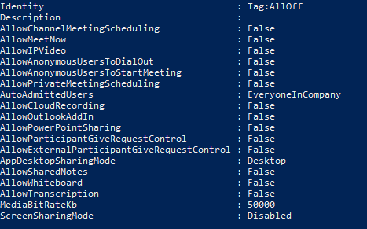

Run Microsoft Teams in a virtual environment
============================================

This article describes requirements and limitations for using Teams in a virtualized environment.

A Virtual Desktop Infrastructure (VDI) environment is used in some organizations where security and compliance issues are especially sensitive. Their users do their work on a virtual desktop containing all their desktop applications and files using Remote Desktop Services or a similar remote connection. Since Teams on the virtual desktop has not been optimized to access or use the audio or video devices on the user’s local device (without additional software), working in a VDI environment will usually have challenges related to multimedia scenarios such as calling, video calling, screen sharing, app sharing, co-authoring, and more. 

> [!NOTE]
> Organizations can choose to run Teams fully in VDI (using either the Web App or Desktop Client) but it is recommended that the following policies be turned off, so users don’t have a poor experience in a virtualized environment. Note that it can take some time for these policy changes to propagate. If you don’t see changes for a given account immediately, try again after a few hours. 

## Calling

The *CsTeamsCallingPolicy* cmdlets enable administrators to control whether calling and calling options in private and group chats are enabled or not. 

|Policy name |Description  |Recommended value  |
|---------|---------|---------|
|AllowPrivateCalling   |Controls whether the Calling app is available in the left rail of the Teams client or not. Also controls whether users see Calling and Video Call options in private chat. |Set this to **False** to remove the Calling app from the left rail and to remove the Calling and Video Call options in private chat. |

### PowerShell instructions

1.	Launch PowerShell as an Administrator.
2.	Connect to Skype Online Connector: 
\>> *# Set Office 365 User Name and Password* 
\>> *$username = “admin email address”* 
\>> *$password = ConvertTo-SecureString "password" -AsPlainText -Force* 
\>> *$LiveCred = new-object -typename System.Management.Automation.PSCredential -argumentlist $username, $password*  
\>> *# Connect to Skype Online* 
\>> *Import-Module SkypeOnlineConnector* 
\>> *$sfboSession = New-CsOnlineSession -Credential $LiveCred* 
\>> *Import-PSSession $sfboSession* 
3.	View list of Calling Policy Options: 
\>> *Get-CsTeamsCallingPolicy*
4.	Look for the pre-canned option where all calling policies are disabled: 

5.	Apply the “DisallowCalling” pre-canned policy option to all users who will be using Teams in a virtualized environment: 
\>> *Grant-CsTeamsMeetingPolicy -PolicyName AllOff -Identity “user email id”*

## Meetings

The *CsTeamsMeetingPolicy* cmdlets enable administrators to control the type of meetings that users can create or the features that they can access while in a meeting. It also helps determine how meetings deal with anonymous or external users.

|Policy name |Description  |Recommended value  |
|---------|---------|---------|
|AllowPrivateMeetingScheduling    |Determines whether a user would be allowed to schedule private meetings.         |Set this to **False** to prohibit the user from being able to schedule private meetings.         |
|AllowChannelMeetingScheduling     |Determines whether a user would be allowed to schedule channel meetings.         |Set this to **False** to prohibit the user from being able to schedule channel meetings.         |
|AllowMeetNow     |Determines whether a user would be allowed to create or start ad-hoc meetings.         |Set this to **False** to prohibit the user from being able to start ad-hoc meetings.         |
|ScreenSharingMode     |Determines the mode in which a user would be allowed to share screen in calls or meetings.         |Set this to **Disabled** to prohibit the user from sharing their screens.         |
|AllowIPVideo     |Determines whether video is enabled in a user's meetings or calls.         |Set this to **False** to prohibit the user from sharing their video.         |
|AllowAnonymousUsersToDialOut     |Determines whether anonymous users are allowed to dial out to a PSTN number.         |Set this to **False** to prohibit anonymous users from dialing out.         |
|AllowAnonymousUsersToStartMeeting     |Determines whether anonymous users can initiate a meeting.         |Set this to **False** to prohibit them from initiating a meeting.         |
|AllowOutlookAddIn     |Determines whether a user can schedule Teams Meetings in Outlook desktop client.         |Set this to **False** to prohibit a user from scheduling Teams meeting in Outlook client.         |
|AllowParticipantGiveRequestControl     |Determines whether participants can request or give control of screen sharing.         |Set this to **False** to prohibit the user from giving, requesting control in a meeting.         |
|AllowExternalParticipantGiveRequestControl     |Determines whether external participants can request or give control of screen sharing.         |Set this to **False** to prohibit an external user from giving, requesting control in a meeting.         |
|AllowPowerPointSharing     |Determines whether PowerPoint sharing is allowed in a user’s meetings.         |Set this to **True** to allow. Set this to **False** to prohibit user from sharing PowerPoint files in a meeting.         |
|AllowWhiteboard     |Determines whether whiteboard is allowed in a user’s meetings.         |Set this to **False** to prohibit whiteboard application in a meeting.         |
|AllowTranscription     |Determines whether real-time and/or post-meeting captions and transcriptions are allowed in a user's meetings.         |Set this to **False** to prohibit transcription and captioning in a meeting.         |

### PowerShell instructions

1.	Launch PowerShell as an Administrator.
2.	Connect to Skype Online Connector: 
\>> *# Set Office 365 User Name and Password* 
\>> *$username = “admin email address”* 
\>> *$password = ConvertTo-SecureString "password" -AsPlainText -Force* 
\>> *$LiveCred = new-object -typename System.Management.Automation.PSCredential -argumentlist $username, $password*  
\>> *# Connect to Skype Online* 
\>> *Import-Module SkypeOnlineConnector* 
\>> *$sfboSession = New-CsOnlineSession -Credential $LiveCred* 
\>> *Import-PSSession $sfboSession*
3.	View list of Meeting Policy Options: 
\>> *Get-CsTeamsMeetingPolicy*
4.	Look for the pre-canned option where all meeting policies are disabled: 

5.	Apply the “AllOff” pre-canned policy option to all users who will be using Teams in a virtualized environment: 
\>> *Grant-CsTeamsMeetingPolicy -PolicyName AllOff -Identity “user email id”*

##Known limitations

Besides the audio and video limitations previosly mentioned, there are some additional limitations users on virtualized environments might face:

- **Joining meetings created by others.** Even though the above policies restrict users from creating meetings, they will still be able to join meetings sent out by other users. Within these meetings, their ability to share video, use WhiteBoard and other features will depend on whether the admin disabled them or not.

- **Issues related to cached content.** If the virtual environment that Teams is running in is not persisted (data is cleaned up at the end of each user session), users might notice performance degradation due to the client having to re-download all content again, regardless of whether the given user accessed the same content in a previous session. This performance impact can be mitigated by using roaming cache solutions, such as those provided by FSLogix.

Once Teams has been optimized for use within Virtual Desktop environments, admins can revert these policies and allow users to use Teams as they normally would.

	 	 
	 	
	 	
		
	 	
	 	
		
		
	  	
	 	
	 	

