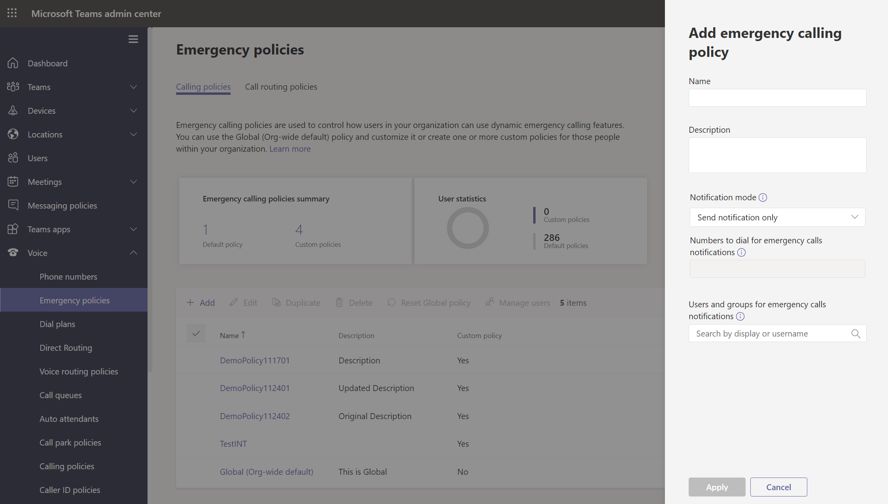
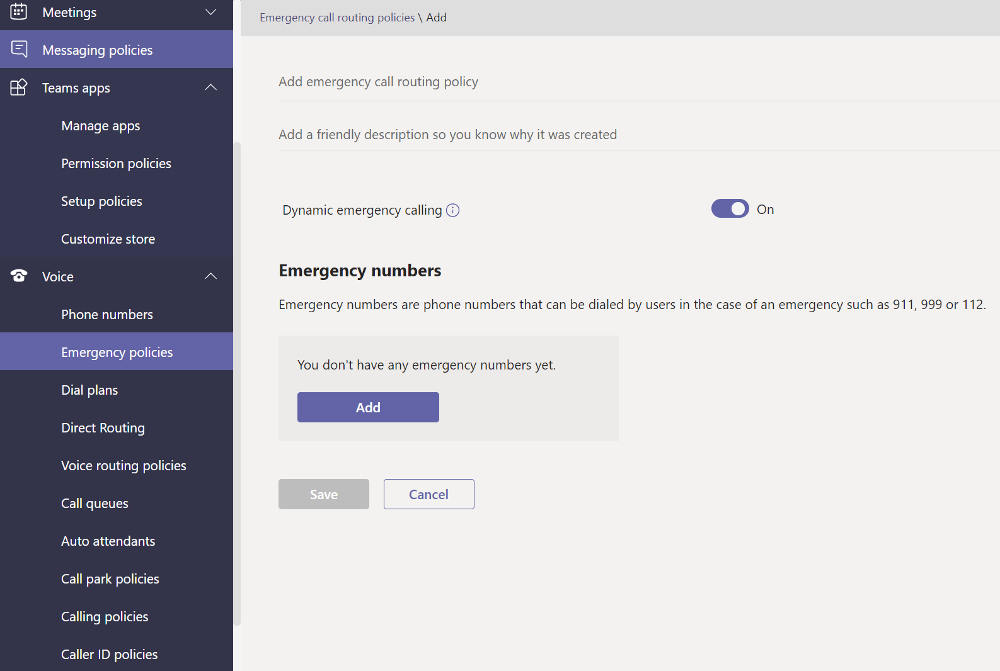
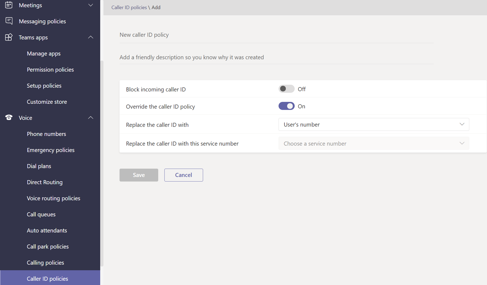
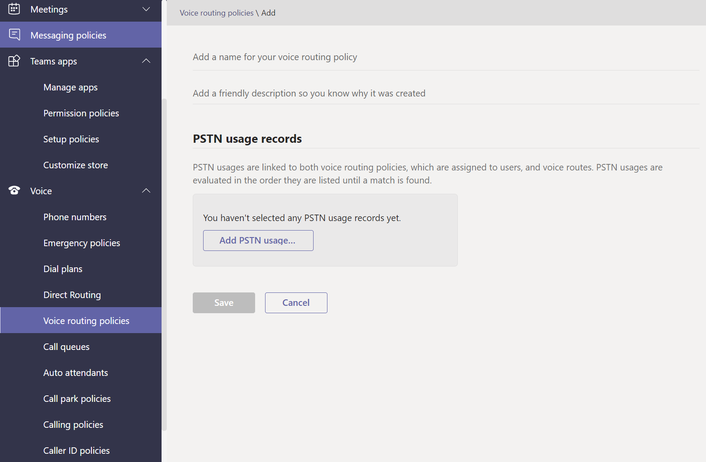
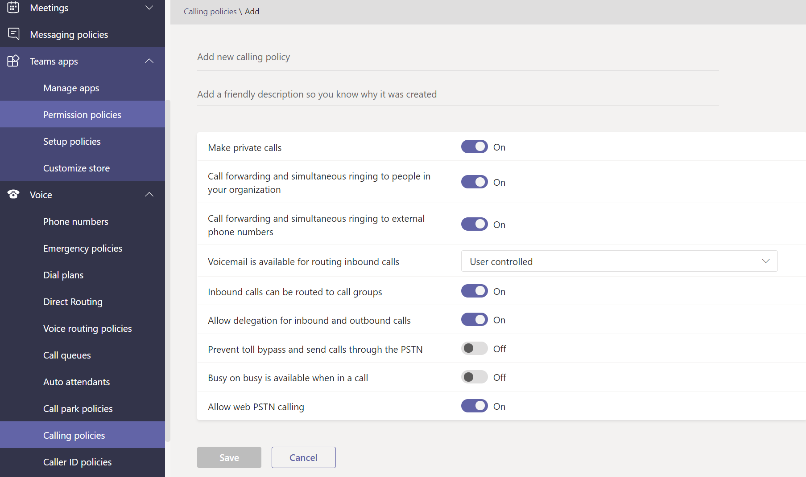
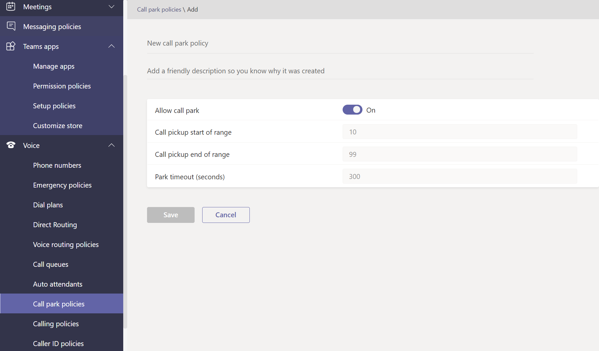
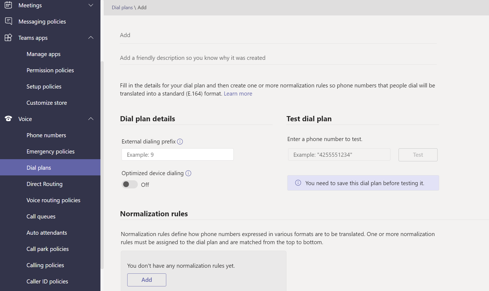

# Manage voice and calling policies in Microsoft Teams

Voice and calling policies are used to control voice and calling in Microsoft Teams.

## Emergency calling policies

You use [emergency calling policies](manage-emergency-calling-policies.md) to configure what happens when a user in your organization makes an emergency call. These policies are managed in the Teams admin center or using Windows PowerShell.

## Emergency call routing policies

If your organization has deployed **Phone System Direct Routing**, you can use [emergency call routing policies](manage-emergency-call-routing-policies.md) to determine where emergency calls are routed, whether enhanced emergency services are enabled, and which numbers are used for emergency services. These policies are managed using PowerShell or in the Microsoft Teams admin center.

## Caller ID policies

[Caller ID policies](caller-id-policies.md) are used to change or block caller ID.

## Voice routing policies

A [voice routing policy](manage-voice-routing-policies.md) is a container for Public Switched Telephone Network (PSTN) usage records. You can use these policies if your organization has deployed **Phone System Direct Routing**. Voice routing policies can be managed with PowerShell or in the Teams admin center.

## Calling policies

[Calling policies](teams-calling-policy.md) control which calling and call forwarding features are available to users including whether a user can make private calls, send calls to call groups, and route calls to voicemail.

## Call park and retrieve policies

[Call park and retrieve](call-park-and-retrieve.md) lets users put other users on hold and enables the same user or someone else to continue the call.

## Create and manage dial plans

[Dial plans](create-and-manage-dial-plans.md) translate dialed phone numbers for call authorization and routing. You can create and manage dial plans through PowerShell or in the Microsoft Teams admin center.

## Related topics

* [Manage emergency calling policies in Microsoft Teams](manage-emergency-calling-policies.md)
* [Manage emergency call routing policies](manage-emergency-call-routing-policies.md)
* [Manage caller ID policies in Microsoft Teams](caller-id-policies.md)
* [Manage voice routing policies](manage-voice-routing-policies.md)
* [Calling policies in Microsoft Teams](teams-calling-policy.md)
* [Call park and retrieve in Microsoft Teams](call-park-and-retrieve.md)
* [Create and manage dial plans](create-and-manage-dial-plans.md)
* [Manage Teams with policies](manage-teams-with-policies.md)
