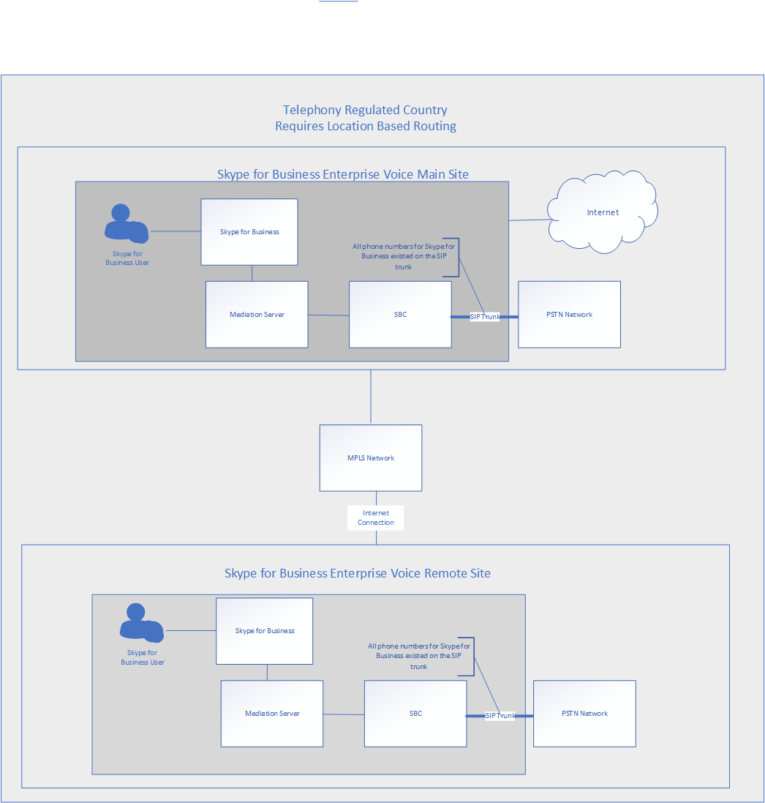
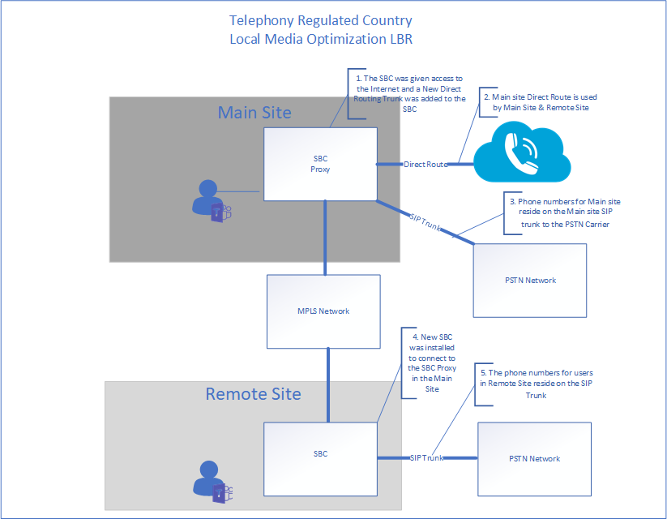

# Contoso case study: Location-Based Routing

Location-Based Routing (LBR) is a feature that restricts toll bypass based on policy and the user's physical location at the time of placing or receiving a call.  

## Overview

Contoso has two offices in a country where it is illegal to bypass the Public Switched Telephone Network (PSTN) provider to decrease long-distance calling costs. The main office has an Internet connection that is used by the main office and by the second office. Each office has their own Session Border Controller (SBC) connected to a PSTN carrier.  
 
In this country, Contoso had LBR configured for their Skype for Business deployment. To determine how to configure LBR for Teams, Contoso read [Plan Location-Based Routing for Direct Routing](location-based-routing-plan.md). Contoso determined that Teams and Skype for Business follow the same scenarios on when a call can be placed, when it can be received, when a PSTN call can be transferred to a Teams user, and when you can transfer another Teams user to the PSTN call.  

For Skype for Business, LBR was configured with the Session Border Controller (SBC) SIP Trunk connecting to the PSTN carrier. For this SBC, Contoso reviewed the [list of certified SBCs](direct-routing-border-controllers.md) and determined that the SBC deployed is certified for Direct Routing but is not certified for Media Bypass. To support LBR, Direct Routing needs to be configured to the SBC on-site, there needs to be a local Internet egress, and the SBC needs to be configured for Media Bypass. Based on this information, Contoso decided the following:

- To delay the enablement of Teams LBR until the existing SBC is certified for Media Bypass.   

- Contoso decided to use the main site SBC for the Direct Route to Office 365.  The main site SBC will be the proxy SBC for the remote site.  

- Contoso used a third-party consultant based in India to assist with certification of the LBR configuration with the telephony company in country.  

- To support users working from outside of the office to place PSTN calls, the company issued mobile phone was provided to their employees. 

The following diagrams show the before and after deployments for a country with telephony regulations that require Location-Based Routing:

**Original deployment**

**Deployment with Direct Routing**

## Configuration: 

To configure the network components in Teams, Contoso followed the instructions in [Manage your network topology for cloud voice features](manage-your-network-topology.md). Contoso completed the below steps to configure Location-Based Routing: 

- Define Network regions -  One network region was defined. 

- Define Network sites - Two network sites were defined. One site for each office location in the region.

- Define Network subnets - Each floor within an office location has their own subnet for the wired and wireless network. This configuration resulted in 20 subnets for Contoso. 

- Define trusted IP addresses - The external facing IP addresses for the SBC were added to the trusted IP address.  

