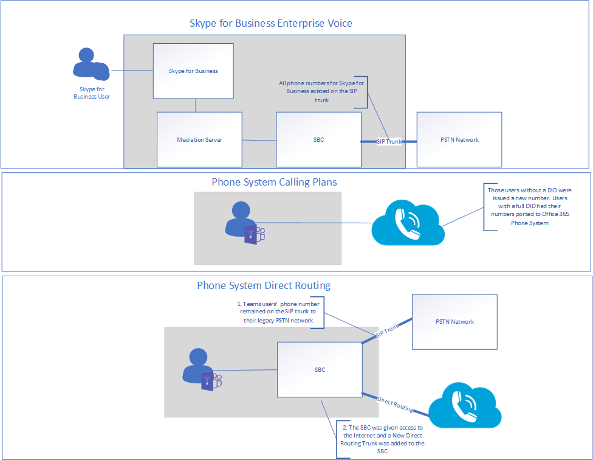
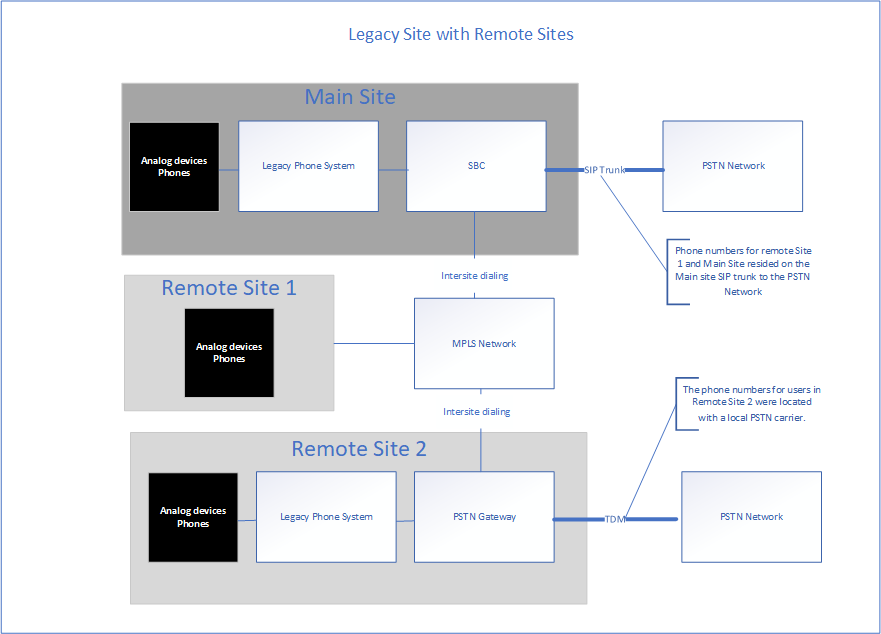
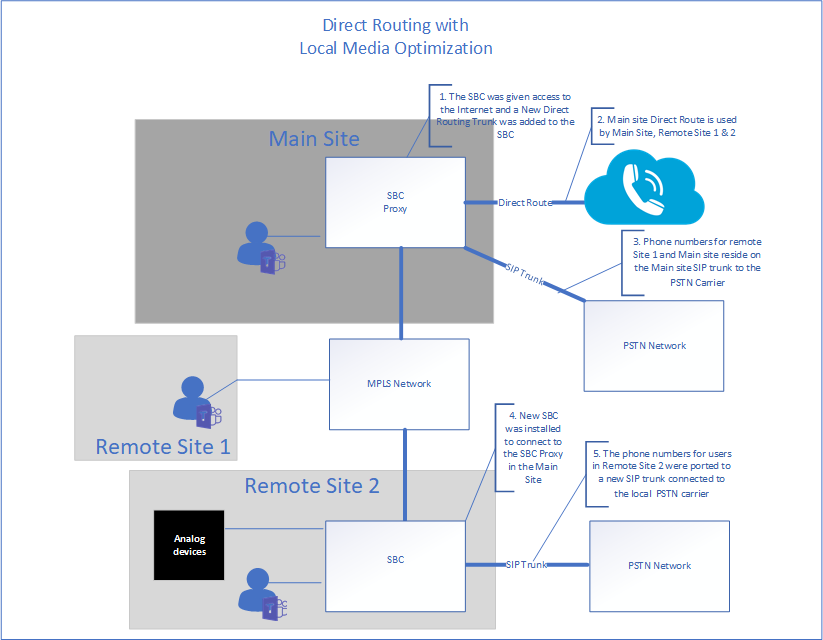
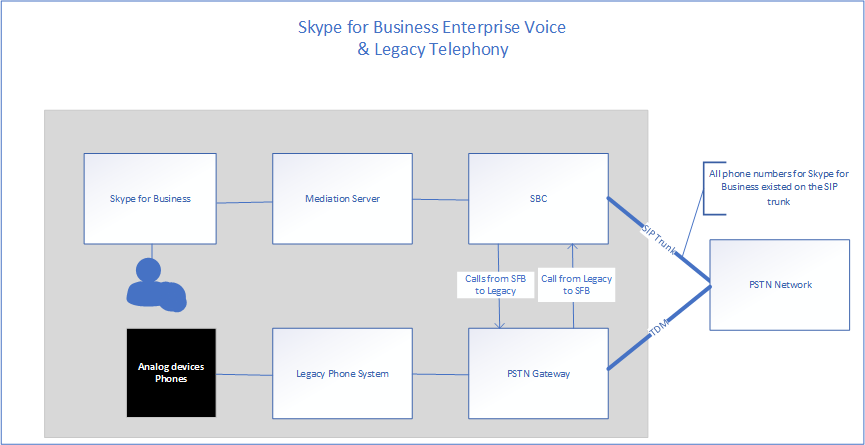
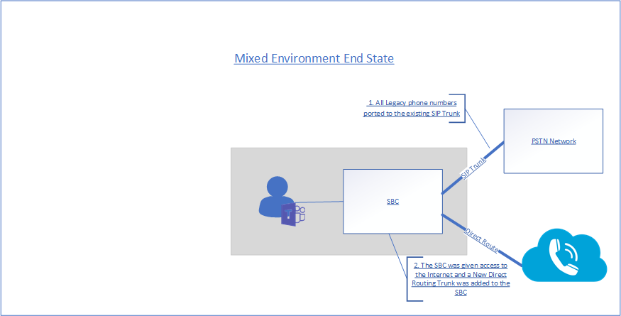

# Contoso case study: Phone System for a multi-national corporation

Depending on geographic location and other factors, Contoso had offices using the following telephony solutions:

- Site Type A: Skype for Business Enterprise Voice

- Site Type B: Traditional legacy telephony systems

- Site Type C: A combination of Skype for Business Enterprise Voice and traditional legacy telephony systems

To implement a Microsoft Phone System solution for their entire organization, Contoso had to determine&mdash;for each site type&mdash;which of the following options would be used with Phone System to connect to the Public Switched Telephone Network (PSTN):

- Phone System with Calling Plan 

- Phone System with own PSTN carrier through Direct Routing 

- Combination of Phone System with Calling Plan and Phone System with own PSTN carrier through Direct Routing
 
To determine the right solution for their organization, Contoso used [Plan your Teams voice solution](/microsoftteams/cloud-voice-landing-page) and the Ignite 2019 session [Calling in Microsoft Teams](https://myignite.techcommunity.microsoft.com/sessions/83170?source=sessions).  

## Site Type A: Skype for Business Enterprise Voice 

Contoso Skype for Business Enterprise Voice was set up as a hub and spoke. There was a central location that maintained the PSTN gateway in the region that provided the connection to the PSTN for the Skype for Business Enterprise Voice users in country. Often these satellite offices did not have their own Internet egress. The numbers for these users resided on the SIP trunk connecting to an existing SBC. 

To determine if the SBC already deployed is certified for Direct Routing and Media Bypass, Contoso checked the [List of Session Border Controllers certified for Direct Routing](direct-routing-border-controllers.md).  

The user's dialing habits were to dial a user on the legacy telephony system using an extension, even when the user has a Skype for Business client available for peer-to-peer audio. 

Contoso based their decision on the following questions:

- Q. Do we need to retain functionality provided by our on-premises deployment? 
  A. No 

- Q. Do we need to interoperate with third-party PBX systems and other telephony equipment? 
  A. No 

- Q. Do we need to retain our current third-party carrier?  
  A. Yes (regulated countries) and No 

- Q. Do we need to get the ROI on SBCs deployed?  
  A. Yes and No  

- Q. Is Microsoft PSTN Calling Plans available in this region?  
  A. Yes and No 

Based on the answers to their questions, Contoso decided to:

- Move the users that are located in a region where PSTN calling plans is available to Phone System with Calling Plans. 

- Move the users that are not located in a region where PSTN calling plans is available, users located in a site where the ROI on the SBCs have yet to be met, and users that resided in a country that has telephony regulations to Phone System with Direct Routing. 

The following diagram shows the initial Skype for Business Enterprise Voice deployment and how this deployment was migrated to both Microsoft Calling Plans and Direct Routing:

## Site Type B: Traditional legacy telephony systems

Contoso had many offices that leveraged legacy telephony systems. There were a subset of users that had an E1.64 phone number while others only had an extension. These numbers resided on the TDM trunk to the PSTN gateway. Intra-site dialing was configured by leveraging a site code in front of the extension to determine where to route the call. The users' dialing habits were to dial by extension.   

Contoso based their decision on the following questions:

- Q. Do we need to retain functionality provided by our on-premises deployment? 
  A. No 

- Q. Do we need to interoperate with third-party PBX systems and other telephony equipment?  
  A. Yes

- Q. Do we need to retain our current third-party carrier?  
  A. No 

- Q. Is Microsoft PSTN's Calling Plan available in our region?  
  A. Yes and No 

Based on the answers to their questions, Contoso decided to: 

- Move the users that are located in a region where PSTN calling plans is available to Phone System with Calling Plans. 

- Move the users that are not located in a region where PSTN calling plans is available to Phone System with Direct Routing. 

- Maintain a PSTN connection to business critical analog devices.

The following diagrams show the original legacy system deployment with remote sites and the migration to a Direct Routing deployment with Local Media Optimization:

**Original legacy deployment** 

**Deployment with Direct Routing**

 
## Site Type C: Combination of Skype for Business Enterprise Voice and traditional legacy telephony systems

Contoso Skype for Business Enterprise Voice users' numbers reside on the SIP trunk to the SBC from the carrier. The numbers for the traditional telephony systems resided on the TDM trunk to the PSTN gateway.   

Contoso based their decision on the following questions:

- Q. Do we need to retain functionality provided by our on-premises deployment? 
  A. No 

- Q. Do we need to interoperate with third-party PBX systems and other telephony equipment?  
  A. No 

- Q. Do we need to retain our current third-party carrier?  
  A. No 

- Q. Do we need to get the ROI on SBCs deployed?  
  A. Yes and No  

- Q. Is Microsoft's PSTN Calling Plan available in this region?  
  A. No 

Based on the answers to their questions, Contoso decided on the following: 

- For the legacy telephony users that will be enabled for Direct Routing, Contoso ported the numbers from the TDM trunk to the SIP Trunk for the SBC, since the SBC is certified for Direct Routing. 

- To support a subset of users moving to Phone System and to allow continued routing through the legacy system, the legacy telephony system was set up as the next hop to the SBC.   

- In addition, to encourage user behavior change and remove the dependency on inter- and intra-site extension dialing, Contoso provided guidance to use Teams for all internal calls.  

The following diagrams show the original Skype for Business Enterprise Voice and legacy telephony system deployment and the migration to a mixed deployment using Direct Routing:

**Original mixed deployment**

**Mixed deployment with Direct Routing**

## Calling Plans

To determine the configuration requirements for Calling Plans, Contoso reviewed the [Calling Plan core deployment decisions](calling-plan-landing-page.md#core-deployment-decisions). The resulting decisions were made: 

- Q. Do my users need international calling?  
  A. Yes 

- Q. Do my users each have a direct inward DID phone number?  
  A. Not today. All users enabled will receive a DID. 

- Q. Do I want to mask or disable caller ID?  
  A. The caller ID for a user will be masked to the local number for Contoso. 

## Direct Routing

Contoso attended Ignite to stay current on Office 365 features including those available with Phone system and Direct Routing. Technical leadership and architects used the guidance provided during the Ignite 2019 to determine their direction.  Key sessions that were used: 

- [Plan for success with Microsoft Teams Direct Routing](https://myignite.techcommunity.microsoft.com/sessions/80381?source=sessions)

- [Updates for Direct Routing](https://myignite.techcommunity.microsoft.com/sessions/80381?source=sessions)

## Configuration

### Calling Plans sites

To obtain licenses and assign phone numbers to users, Contoso followed the steps in [Set up Calling Plans](set-up-calling-plans.md). 

Due to the number of users that needed to be assigned phone numbers, Contoso decided to use PowerShell to assign the phone numbers. To learn how to assign numbers by using PowerShell&mdash;in addition to other settings&mdash;Contoso used the [Teams PowerShell Overview](teams-powershell-overview.md).  

### Direct Routing sites

To connect Contoso's on-premises telephony infrastructure to Microsoft Teams, Contoso's administrator followed the steps in [Configure Direct Routing](direct-routing-configure.md) and reviewed the video [Direct Routing in Microsoft Teams](https://www.youtube.com/watch?v=1ASftX_Msb8&index=10&list=PLaSOUojkSiGnKuE30ckcjnDVkMNqDv0Vl) for guidance.  Contoso also referred to the Direct routing deployment documentation by the certified SBC vendor. 

Once Direct Routing was configured between the SBC and Microsoft Phone System, it was necessary for Contoso to test the configuration. To do this, Contoso administrators used the SIP Tester client that was discussed in the [Updates for Direct Routing session at Ignite 2019](https://myignite.techcommunity.microsoft.com/sessions/83178?source=sessions). The SIP Tester client script and documentation was downloaded from the PowerShell script to test Direct Routing Session Border Controller connections.   

### Local Media Optimization

Contoso saw the opportunity to leverage Local Media Optimization in the different regions across the globe. The supported scenarios for Contoso are described in [Local Media Optimization for Direct Routing](direct-routing-media-optimization.md). The configuration of the local media optimization was completed by following guidance from both the SBC vendor and Microsoft. The configuration steps for Local Media Optimization include: 

- Configure the user and SBC sites 

- Configure the SBC  according to the SBC vendor specification, 

- Add external trusted IP addresses to each site used for Local Media Optimization    

- Define the network topology 

- Define the virtual network topology 

- Determine the mode: Always Bypass or Only for local users 

## Networking considerations

Contoso had a number of users who needed to work remotely for an extended period of time after they were enabled for Phone System. The users used VPN to access certain Line of Business applications. While on VPN, the Phone System users experienced a degradation of call quality. 

To resolve the quality issue, Contoso implemented VPN split tunneling, which allowed their Office 365 traffic to traverse the Internet while the connection to the internal apps remained on the VPN. To implement VPN split tunneling, Contoso followed the guidance in [Implementing VPN split tunneling for Office 365](/office365/enterprise/office-365-vpn-implement-split-tunnel).  

