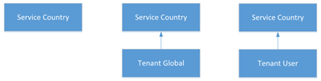

# What are dial plans?

A dial plan is a named set of normalization rules that translate dialed phone numbers by an individual user into an alternate format (typically E.164) for purposes of call authorization and call routing.

A dial plan consists of one or more normalization rules that define how phone numbers expressed in various formats are translated to an alternate format. The same dial string may be interpreted and translated differently in different dial plans, so depending on which dial plan is assigned to a given user, the same dialed number may be translated and routed differently.

See [Create and manage dial plans](create-and-manage-dial-plans.md) to create and manage tenant dial plans.

## Tenant dial plan scope

A dial plan's scope determines the hierarchical level at which the dial plan can be applied. The scopes are different than in a Skype for Business Server on-premises deployment. Clients obtain the appropriate dial plan through provisioning settings that are automatically provided when users log on to Teams or Skype for Business Online. As an administrator, you can manage and assign dial plan scope levels by using Remote PowerShell.

In Teams and Skype for Business Online, there are two types of dial plans - service scoped and tenant (which is for your organization) scoped. A service scoped dial plan is defined for every country/region where the Office 365 Phone System is available. Each user is automatically assigned the service country dial plan that matches the Office 365 Usage Location assigned to the user. You can't change the service country dial plan, but you can create tenant scoped dial plans, which augment the service country dial plan. As clients are provisioned, they obtain an "effective dial plan," which is a combination of the service country dial plan and the appropriately scoped tenant dial plan. Therefore, it's not necessary to define all normalization rules in tenant dial plans as they might already exist in the service country dial plan.

Tenant dial plans can be further broken into two scopes - tenant scope or user scope. If a tenant defines and assigns a user scoped dial plan, then that user will be provisioned with an effective dial plan of the user's service country dial plan and the assigned user dial plan. If a tenant defines a tenant scoped dial plan but doesn't assign a user scoped dial plan, then that user will be provisioned with an effective dial plan of the user's service country dial plan and the tenant dial plan.

The following is the inheritance model of dial plans in Teams and Skype for Business Online.

The following are the possible effective dial plans:

 **Service Country** If no tenant scoped dial plan is defined and no tenant user scoped dial plan is assigned to the provisioned user, the user will receive an effective dial plan mapped to the service country associated with their Office 365 Usage Location.

 **Tenant Global - Service Country** If a tenant user dial plan is defined but not assigned to a user, the provisioned user will receive an effective dial plan consisting of a merged tenant dial plan and the service country dial plan associated with their Office 365 Usage Location.

 **Tenant User - Service Country** If a tenant user dial plan is defined and assigned to a user, the provisioned user will receive an effective dial plan consisting of the merged tenant user dial plan and the service country dial plan associated with their Office 365 Usage Location.

See [Create and manage dial plans](create-and-manage-dial-plans.md) to create your tenant dial plans.

## Planning for tenant dial plans

To plan custom dial plans, follow these steps:

- **Step 1** Decide whether a custom dial plan is needed to enhance the user dialing experience. Typically, the need for one would be to support non-E.164 dialing, such as extensions or abbreviated national dialing.

- **Step 2** Determine whether tenant global or tenant user scoped dial plans are needed, or both. User scoped dial plans are needed if users have different local dialing requirements.

- **Step 3** Identify valid number patterns for each required dial plan. Only the number patterns that are not defined in the service level country dial plans are required.

- **Step 4** Develop an organization-wide scheme for naming dial plans. Adopting a standard naming scheme assures consistency across an organization and makes maintenance and updates easier.

The [FastTrack](https://fasttrack.microsoft.com/microsoft365/capabilities?view=voice) has additional resources and partners that can assist you with implementing tenant dial plans.

## Creating your new tenant dial plan

When you create a new dial plan, you must put in the information that is required.

### Name and simple name

For user dial plans, you should specify a descriptive name that identifies to the users the dial plan will be assigned. The dial plan Simple Name is prepopulated with a string that is derived from the dial plan name. The Simple Name field is editable, which enables you to create a more descriptive naming convention for your dial plans. The Simple Name value cannot be empty and must be unique. A best practice is to develop a naming convention for your entire organization and then use this convention consistently across all sites and users.

### Description

We recommend that you type the common, recognizable name of the geographic location or group of users to which the corresponding dial plan applies.

### External access prefix

You can specify an external access prefix of up to four characters (#, *, and 0-9) if users need to dial one or more additional leading digits (for example, 9) to get an external line.

> [!NOTE]
> If you specify an external access prefix, you don't need to create an additional normalization rule to accommodate the prefix. 

See [Create and manage dial plans](create-and-manage-dial-plans.md) to create your tenant dial plans.

## Normalization rules

Normalization rules define how phone numbers expressed in various formats are to be translated. The same number string may be interpreted and translated differently, depending on the locale from which it is dialed. Normalization rules may be necessary if users need to be able to dial abbreviated internal or external numbers.

One or more normalization rules must be assigned to the dial plan. Normalization rules are matched from top to bottom, so the order in which they appear in a tenant dial plan is important. For example, if a tenant dial plan has 10 normalization rules, the dialed number matching logic will be tried starting with the first normalization rule, if there isn't a match then the second, and so forth. If a match is made, that rule is used and there is no effort to match any other rules that are defined. There can be a maximum of 25 normalization rules in a given tenant dial plan.

### Determining the required normalization rules

Because any tenant dial plan is effectively merged with a given user's service country dial plan it, it is likely that the service country dial plan's normalization rules need to be evaluated in order to determine which tenant dial plan normalization rules are needed. The **Get-CsEffectiveTenantDialPlan** cmdlet can be used for this purpose. The cmdlet takes the user's identity as the input parameter and will return all normalization rules that are applicable to the user.

### Creating normalization rules

Normalization rules use .NET Framework regular expressions to specify numeric match patterns that the server uses to translate dial strings to E.164 format for the purpose of performing reverse number lookup. Normalization rules can be created by specifying the regular expression for the match and the translation to be done when a match is found. When you finish, you can enter a test number to verify that the normalization rule works as expected.

For details about using .NET Framework regular expressions, see [.NET Framework Regular Expressions](https://go.microsoft.com/fwlink/p/?linkId=140927).

See [Create and manage dial plans](create-and-manage-dial-plans.md) to create and manage normalization rules for your tenant dial plans.

### Sample normalization rules

The following table shows sample normalization rules that are written as .NET Framework regular expressions. The samples are examples only and are not meant to be a prescriptive reference for creating your own normalization rules.

 **Normalization rules using .NET Framework regular expressions**

||||||
|:-----|:-----|:-----|:-----|:-----|
|**Rule name**   |**Description**   |**Number pattern**   |**Translation**   |**Example**   |
|4digitExtension    |Translates 4-digit extensions.    |^(\\d{4})$    |+1425555$1    |0100 is translated to +14255550100    |
|5digitExtension    |Translates 5-digit extensions.    |^5(\\d{4})$    |+1425555$1    |50100 is translated to +14255550100    |
|7digitcallingRedmond    |Translates 7-digit numbers to Redmond local numbers.    |^(\\d{7})$    |+1425$1    |5550100 is translated to +14255550100   |
|RedmondOperator    |Translates 0 to Redmond Operator.    |^0$    |+14255550100    |0 is translated to +14255550100    |
|RedmondSitePrefix    |Translates numbers with on-net prefix (6) and Redmond site code (222).    |^6222(\\d{4})$    |+1425555$1    |62220100 is translated to +14255550100    |
|5digitRange    |Translates 5-digit extensions starting with the digit range between 3-7 inclusive.    |^([3-7]\\d{4})$    |+142555$1   |54567 is translated to +14255554567    |
|PrefixAdded    |Adds a country prefix in front of a 9 digit number with restrictions on the first and third digits.    |^([2-9]\\d\\d[2-9]\\d{6})$    |1$1    |4255554567 is translated to 14255554567    |
|NoTranslation    |Match 5 digits but no translation.    |^(\\d{5})$    |$1    |34567 is translated to 34567    |

 **Redmond dial plan based on normalization rules shown above.**

| The following table illustrates a sample dial plan for Redmond, Washington, United States, based on the normalization rules shown in the previous table. |
|:---------------------------------------------------------------------------------------------------------------------------------------------------------|
| **Redmond dial plan**                                                                                                                                |
| 5digitExtension                                                                                                                                      |
| 7digitcallingRedmond                                                                                                                                 |
| RedmondSitePrefix                                                                                                                                    |
| RedmondOperator                                                                                                                                      |

> [!NOTE]
> The normalization rules names shown in the preceding table do not include spaces, but this is a matter of choice. The first name in the table, for example, could have been written "5 digit extension" or "5-digit Extension" and still be valid. 

## Related topics

[Create and manage dial plans](create-and-manage-dial-plans.md)

[Transferring phone numbers common questions](transferring-phone-numbers-common-questions.md)

[Different kinds of phone numbers used for Calling Plans](different-kinds-of-phone-numbers-used-for-calling-plans.md)

[Manage phone numbers for your organization](manage-phone-numbers-for-your-organization/manage-phone-numbers-for-your-organization.md)
[Emergency calling terms and conditions](emergency-calling-terms-and-conditions.md)

[Emergency Calling disclaimer label](https://github.com/MicrosoftDocs/OfficeDocs-SkypeForBusiness/blob/live/Teams/downloads/emergency-calling/emergency-calling-label-(en-us)-(v.1.0).zip?raw=true)
