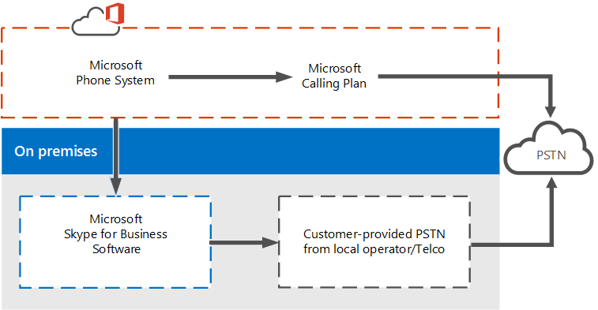

# What is Phone System in Office 365?

## Phone System in Office 365 and Skype for Business Server

**Phone System** is the Microsoft technology for enabling call control and PBX capabilities in the Office 365 cloud with Skype for Business Online and Microsoft Teams. Phone System allows you to replace your existing PBX system with a set of features delivered from Office 365 and tightly integrated into your organization's cloud experience. For more about the features, see [Here's what you get with Phone System in Office 365](here-s-what-you-get-with-phone-system.md).
  
With Phone System, your users can use Skype for Business Online and Microsoft Teams to take care of basic call control tasks, such as placing and receiving calls, transferring calls, and muting and unmuting calls. Phone System users can click a name in their address book, and Skype for Business or Microsoft Teams places a call to that person. To place and receive calls, Phone System users can use their mobile devices, a headset with a laptop or PC, or one of many IP phones that work with Skype for Business and Microsoft Teams. For admins, Phone System provides the ability to manage calling within the same admin console used for messaging, collaboration, and so on.
  
With traditional PBX systems, calls between users in your organization are handled internally within Phone System, and never go to the PSTN. This applies to calls between users in your organization located in different geographical areas, removing long-distance costs on these internal calls.
  
To enable calls to landlines and mobile phones, Phone System can be connected to the PSTN in one of two ways:
  
- By purchasing the a Calling Plan (domestic or domestic and international) for Office 365. See [Phone System and Calling Plans](calling-plan-landing-page.md)
    
- By using on-premises PSTN connectivity, where software on premises connects with your existing telephony infrastructure. See [Planning your Phone System](/skypeforbusiness/skype-for-business-hybrid-solutions/plan-your-phone-system-cloud-pbx-solution/plan-your-phone-system-cloud-pbx-solution).

.

## More about Calling Plans

Using a Calling Plan add-on to Phone System in Office 365 enables PSTN connectivity for calling to landlines and mobile phones around the world (depending on the level of service being licensed). Your users are homed in the cloud and are enabled for Phone System with the Calling Plan add-on provided by Microsoft. Using Calling Plans doesn't require an on-premises server deployment. Calling Plans only work with Phone System in Office 365, and you can't use Calling Plans with another PBX system.

Because Calling Plans operate within Office 365, this is a completely-in-the-cloud offering that doesn't require an on-premises server deployment. You have the choice of using a Domestic or Domestic and International Calling Plan, which be assigned to each user that you want to make calls. [Want to know more?](calling-plan-landing-page.md).
  
Users who are homed in Skype for Business Online or Microsoft Teams in Office 365 will have access to Office 365 voice services. Microsoft is the provider of both core calling and PSTN services, and can even provide or port your users' phone numbers. 
  
Calling Plans in Office 365 allows you to search, acquire, and assign phone numbers to users in your organization so that users can make and receive phone calls with people inside and outside of your organization.
  
In all types of business, having a phone number that allows users to send and receive voice calls is an important requirement to do business, as phone numbers are used to identify a user and allow for communication across organizations. The users who are assigned phone numbers will be able to make voice calls across all Skype for Business and Microsoft Teams devices, including VoIP phones, PCs, and mobile devices. 

Calling Plans (domestic and domestic and international) are available in specific but growing geographic locations. Please check for [availability](country-and-region-availability-for-audio-conferencing-and-calling-plans/country-and-region-availability-for-audio-conferencing-and-calling-plans.md) in your country or region. 

**Ready to get started?**  To set up your calling plans for your users, see [Set up Calling Plans](set-up-calling-plans.md).  

## Phone System with Services
 Phone System can aso be used for services and voicemail:
- **Auto attendants**  Phone System in Office 365 auto attendants can be used to create a menu system for your organization that lets external and internal callers move through a menu system to locate and place or transfer calls to company users or departments in your organization. See [What are Cloud auto attendants?](what-are-phone-system-auto-attendants.md)

- **Call queues**  With Phone System, you can create call queue greetings that are used when someone calls in to a phone number for your organization; this includes the ability to automatically put the calls on hold and the ability to search for the next available call agent to handle the call while the people who call are listening to music on hold. You can create single or multiple call queues for your organization. See [Create a Cloud call queue](/SkypeForBusiness/what-is-phone-system-in-office-365/create-a-phone-system-call-queue).

- **Voicemail** When you get a Phone System license for a user, that user will be able to get voicemail that has been left by callers. Cloud Voicemail is automatically set up and provisioned for users after you assign a Phone System license and a phone number to them. See [Set up Cloud Voicemail](set-up-phone-system-voicemail.md).

If you're ready to get started, see [Setting up Phone System in your organization](setting-up-your-phone-system.md).

## Related topics
- [Microsoft Teams add-on licensing](teams-add-on-licensing/microsoft-teams-add-on-licensing.md)
- [Manage phone numbers for your organization](manage-phone-numbers-for-your-organization/manage-phone-numbers-for-your-organization.md)
- [Different kinds of phone numbers used for Calling Plans](different-kinds-of-phone-numbers-used-for-calling-plans.md)
- [Getting phones for Skype for Business Online](/skypeforbusiness/what-is-phone-system-in-office-365/getting-phones-for-skype-for-business-online/getting-phones-for-skype-for-business-online)

