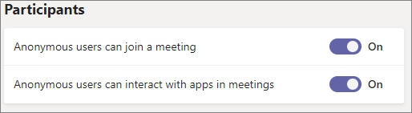

--- 
title: IT Admins - Manage lobby options in Microsoft Teams
ms.author: wlibebe
author: wlibebe
ms.reviewer: vivek.mohan
ms.date: 6/6/2024
manager: pamgreen
ms.topic: article
ms.service: msteams
audience: admin
ms.localizationpriority: medium
search.appverid: MET150
ms.collection: 
  - M365-collaboration
  - m365initiative-meetings
appliesto: 
  - Microsoft Teams
f1.keywords:
- NOCSH
description: Learn how admins can configure the meeting lobby in Microsoft Teams to allow only certain meeting participants to join the meeting directly.
---

# IT Admins - Manage lobby options in Microsoft Teams

**APPLIES TO:** ✔️Meetings ✔️Webinars ✖️Town halls

The Teams meeting lobby prevents certain types of participants from joining a meeting until a meeting organizer, co-organizer, or presenter admits them. When a participant goes to the lobby, organizers, co-organizers, and presenters are notified and can choose to admit them to the meeting or not.

Using the lobby settings in the Teams admin center, you can create defaults for which types of meeting participants are able to bypass the lobby and which participants must wait there until admitted to the meeting. You can control how the following types of participants interact with the lobby:

- Meeting organizer and co-organizers
- People in your organization
- Guests
- People in trusted organizations
- Anonymous participants

## Prerequisites for meeting with people outside your organization

There are several settings in Teams that control whether people outside the organization can interact with Teams. The following settings must be enabled for people outside the organization to join meetings:

- [Guest access in Teams](guest-access.md) must be enabled for guests to be able to join meetings. Guests aren't anonymous and can log into your organization.
- [External access](manage-external-access.md) must be enabled for people in trusted organizations to join meetings. A mutual trust between your organization and the external organization must be configured. In addition, the meeting organizer in your organization and any participants from the external organization must be enabled for external access.
- [Anonymous meeting join](anonymous-users-in-meetings.md) must be enabled if you want to allow anonymous meeting participants.

> [!IMPORTANT]
> If any of these settings are turned off, that type of external participant can't join meetings in your org regardless of lobby settings.

## Overview of lobby settings and policies

The following table shows the Teams meeting policies that affect how meeting participants interact with the lobby.

|Setting|Description|
|:------|:----------|
|**Anonymous users and dial-in callers can start a meeting**|This per-organizer policy allows for leaderless meetings. This setting controls whether anonymous participants and dial-in users can join the meeting without a verified participant in attendance. This setting only applies when **Who can bypass the lobby** is set to **Everyone**. If the **Anonymous users can join a meeting** organization-level setting or meeting policy is **Off**, this setting only applies to dial-in callers. By default, this setting is turned off to prevent anonymous users from misusing your meeting links. <br><br> While **Off**, anonymous participants and dial-in users wait in the lobby until a verified participant (including a dial-in organizer) joins the meeting, at which point they're automatically admitted. Once the meeting starts, anonymous participants and dial-in users join the call automatically, even if the organizer leaves. <br><br> If this setting is **On**, anonymous and dial-in participants can start and join the meeting without a verified participant present.|
|**People dialing in can bypass the lobby**|This is a per-organizer policy. This setting controls whether people who dial in by phone join the meeting directly or wait in the lobby. When this setting is **Off**, dial-in users wait in the lobby until an organizer, co-organizer, or presenter joins the meeting and admits them. When this setting is **On**, dial-in users automatically join the meeting without going through the lobby. (If **Anonymous users and dial-in callers can start a meeting** is **Off**, they wait in the lobby until the meeting starts.) This policy sets a default that your organizers can change through their **Meeting options**.|
|**Who can admit from lobby**| This per-organizer policy controls who can bring participants from the lobby into the meeting or webinar. When set to it's default value of **Organizers and presenters**, only organizers and presenters can admit participants into the meeting from the lobby. This policy sets a default that your organizers can change through their **Meeting options**.|
|**Who can bypass the lobby**|This is a per-organizer policy. This setting controls which types of participants (except participants dialing in by phone) join a meeting directly. This policy also controls which types of participants wait in the lobby until an organizer, co-organizer, or presenter admits them. This policy sets a default that your organizers can change through their **Meeting options**.|

The following table shows how each option for the **Who can bypass the lobby** policy affects each *type of meeting participant*.

|Policy value:|Everyone|People in my org, trusted orgs, and guests|People in my org and guests|People in my org|People who were invited|Only organizers and co-organizers|
|:--------|:------|:-----|:-----|:------|:-------|:---------------|
|*Organizer and co-organizers*|Bypass|Bypass|Bypass|Bypass|Bypass|Bypass|
|*People in your organization*|Bypass|Bypass|Bypass|Bypass|People who were sent or forwarded an invite bypass; others wait in the lobby|Lobby|
|*Guests*|Bypass|Bypass|Bypass|Lobby|People who were sent or forwarded an invite bypass; others wait in the lobby|Lobby|
|*People in trusted organizations*|Bypass|Bypass|Lobby|Lobby|People who were sent or forwarded an invite bypass; others wait in the lobby|Lobby|
|*Anonymous participants*|Bypass|Lobby|Lobby|Lobby|People signed in to nontrusted organizations in external access bypass the lobby; others wait in the lobby.|Lobby|

**Only people who were invited** applies only to participants who were sent an invite directly, who are part of an invited distribution list (of up to 10,000 users), or to whom an invite was forwarded. Users added via *Invite members* in a channel meeting wait in the lobby.

To manage who can bypass the lobby using PowerShell, see the [Control who can bypass the lobby](#control-who-can-bypass-the-lobby) section in this article.

## Use the Teams admin center to manage lobby options in meetings hosted by your organization

You can manage lobby settings and policies in the Teams admin center. See the following sections for guidance on which setting to choose for different circumstances. For information about how meeting policies work, see [Manage meeting policies in Microsoft Teams](/microsoftteams/meeting-policies-overview).

> [!IMPORTANT]
> Meeting organizers can change the default values that you choose for the **People dialing in can bypass the lobby**, **Who can admit from lobby** and **Who can bypass the lobby** settings through their **Meeting options**. If you need to enforce these settings to a particular value, you can use a meeting template or sensitivity label (Teams Premium license required).or more information, see [Configure the Microsoft Teams meeting lobby for sensitive meetings](configure-lobby-sensitive-meetings.md).
>
> Meeting templates and sensitivity labels don't support the **Who can admit from lobby** setting.

To manage meeting join and lobby policies, follow these steps:

1. In the Teams admin center, expand **Meetings** and then select **Meeting policies**.
1. Select the policy that you want to update.
1. In the **Meeting join & lobby** sections, update the settings that you want to change:
   - **Anonymous users can join a meeting**
   - **Anonymous users and dial-in callers can start a meeting**
   - **Who can bypass the lobby** (Who can bypass the lobby)
   - **People dialing in can bypass the lobby**
   - **Who can admit from lobby**
1. Select **Save**.

Changes can take up to 24 hours to take effect.

If you want to allow anonymous meeting access, be sure the **Anonymous users can join a meeting** meeting setting is also turned on.

To set the organization-wide meeting setting for anonymous meeting join:

1. In the Teams admin center, expand **Meetings** and then select **Meeting settings**.
1. In the **Participants** section, set **Anonymous users can join a meeting** to **On** or **Off**.
    
1. Select **Save**.

## Control access to meetings by anonymous participants

Anonymous participants are anonymous because they're not logged in to an account that can be verified. Users considered to be anonymous could include:

- People who aren't logged in to Microsoft 365 with a work or school account 
- People from nontrusted organizations (as configured in [external access](manage-external-access.md)).
- People from organizations that you trust but that don't trust your organization

If you want to prevent anonymous participants from joining meetings completely, you can turn off the **Anonymous users can join a meeting** organization-wide meeting setting. You can also disable anonymous join for specific meeting organizers by keeping the org-wide setting enabled and using the **Anonymous users can join a meeting** meeting policy.

If you want people joining anonymously to wait in the lobby, you can set the **Who can bypass the lobby** meeting policy to any setting except **Everyone**. (This setting doesn't affect people dialing in by phone.)

By default, the **Anonymous users and dial-in callers can start a meeting** policy is **Off**. This means that anonymous participants and people calling in by phone always wait in the lobby until a verified participant starts the meeting.

To manage this setting using PowerShell, see the [Control whether anonymous users can join meetings](#control-whether-anonymous-users-can-join-meetings) section in this article.

> [!IMPORTANT]
> We recommend that you leave this setting off. When the setting is on, people with unverified accounts can start meetings, including using the meeting link to have meetings at unscheduled times.

## Control access to meetings by people dialing in by phone

By default, the **People dialing in can bypass the lobby** policy is **Off**, but meeting organizers can change this in Meeting Options when they set up a meeting. You can change the default by updating the **People dialing in can bypass the lobby** policy or you can enforce a particular value by using a meeting template.

To manage this setting using PowerShell, see the [Control whether users dialing in by phone can bypass the lobby](#control-whether-users-dialing-in-by-phone-can-bypass-the-lobby) section in this article.

## Control who can admit participants from the lobby

By default, the **Who can admit from lobby** policy is set to **Organizers and presenters**, but meeting organizers can change this in their **Meeting options** when they set up a meeting or webinar. You can change the default by updating the **Who can admit from lobby** policy.

To manage this setting using PowerShell, see the [Control who can admit users from the lobby](#control-who-can-admit-users-from-the-lobby) section in this article.

## Control access to meetings by guests and people from trusted organizations

There are two types of people outside your organization who can join meetings as verified participants:

- Guests - people who have an [Microsoft Entra B2B collaboration account](/azure/active-directory/external-identities/what-is-b2b) in your organization
- External access users - people who have Microsoft Entra accounts in a trusted organization, as defined in Teams [external access](manage-external-access.md)

If you want all verified meeting participants from outside your organization to wait in the lobby, you can set the Who can bypass the lobby policy to **People in my org** or **Only organizers and co-organizers** (as long as a guest isn't the organizer or co-organizer). If you want only people from trusted organizations (external access users) to wait in the lobby, you can choose **People in my org and guests**.

## Control access to meetings by people without invitations

If you want to allow only people who have invitations to join meetings directly and have all other participants wait in the lobby, set **Who can bypass the lobby** to **People who were invited**. (People invited via a distribution list of up to 10,000 users are included.)

The **People who were invited** setting includes all participants with a work or school account and guests to whom the invite was forwarded, not just participants the organizer invited directly. This includes participants from blocked organizations in external access if anonymous meeting join is enabled. It doesn’t include people who have the meeting join link but not the invitation itself and participants who aren't signed in. They must wait in the lobby.

Meeting organizers can disable forwarding the meeting invite if they only want people directly invited by them to attend the meeting.

## Control access to meetings by non-organizers

For meetings with sensitive or regulated information, have all participants wait in the lobby until an organizer or co-organizer admits them. In this case, you can set **Who can bypass the lobby** to **Only organizers and co-organizers**.

Since **Who can bypass the lobby** only sets a default that meeting organizers can change, consider enforcing the value with a sensitivity label or meeting template if you have compliance requirements in this area. For more information, see [Configure the Microsoft Teams meeting lobby for sensitive meetings](configure-lobby-sensitive-meetings.md).

## Turn off the lobby

While there isn't a specific control that turns off the meeting lobby completely, you can effectively disable the meeting lobby by using a combination of settings:

- Set **Who can bypass the lobby** to **Everyone**.
- Set **People dialing in can bypass the lobby** to **On**.

With these settings, anonymous users and dial-in callers still wait in the lobby if the meeting hasn't started. While you can set **Anonymous users and dial-in callers can start a meeting** to **On** to avoid this, we don't recommend it.

## Use PowerShell to manage lobby policies

You can use the [Set-CsTeamsMeetingPolicy](/powershell/module/teams/set-csteamsmeetingpolicy) PowerShell cmdlet to manage the following lobby options:

- Anonymous users can join meetings
- Users dialing in by phone can bypass the lobby
- Who can bypass the lobby
- Who can admit users from the lobby

### Control whether anonymous users can join meetings

To control whether anonymous users can join meetings, use the [**`-AllowAnonymousUsersToJoinMeeting`**](/powershell/module/teams/set-csteamsmeetingpolicy?#-allowanonymoususerstojoinmeeting) parameter.

#### Prevent anonymous participants from joining meetings

To prevent anonymous participants from joining meetings and webinars created by organizers with this policy, use the following script:

```powershell
Set-CsTeamsEventsPolicy -Identity <policy name> -AllowAnonymousUsersToJoinMeeting $false
```

#### Allow anonymous participants to join meetings

**This is the default setting.** To allow anonymous participants to join meetings and webinars created by organizers with this policy, use the following script:

```powershell
Set-CsTeamsEventsPolicy -Identity <policy name> -AllowAnonymousUsersToJoinMeeting $true
```

### Control whether users dialing in by phone can bypass the lobby

To control whether users dialing in by phone can bypass the lobby, use the [**`-AllowPSTNUsersToBypassLobby`**](/powershell/module/teams/set-csteamsmeetingpolicy#-allowpstnuserstobypasslobby) parameter.

#### Prevent users dialing in by phone from bypassing the lobby

To prevent users dialing in by phone from bypassing the lobby in meetings and webinars created by organizers with this policy, use the following script:

```powershell
Set-CsTeamsEventsPolicy -Identity <policy name> -AllowPSTNUsersToBypassLobby $false
```

#### Allow users dialing in by phone to bypass the lobby

To allow users dialing in by phone to bypass the lobby in meetings and webinars created by organizers with this policy, use the following script:

```powershell
Set-CsTeamsEventsPolicy -Identity <policy name> -AllowPSTNUsersToBypassLobby $true
```

### Control who can bypass the lobby

To control who can bypass the lobby, use the [**`-AutoAdmittedUsers`**](/powershell/module/teams/set-csteamsmeetingpolicy?#-autoadmittedusers) parameter.

#### Allow everyone to bypass the lobby

To allow everyone to bypass the lobby in meetings and webinars created by organizers with this policy, use the following script:

```powershell
Set-CsTeamsEventsPolicy -Identity <policy name> -AutoAdmittedUsers Everyone 
```

#### Only allow people in my org, trusted orgs, and guests to bypass the lobby

To only allow people in your org, trusted orgs, and guests to bypass to bypass the lobby in meetings and webinars created by organizers with this policy, use the following script:

```powershell
Set-CsTeamsEventsPolicy -Identity <policy name> -AutoAdmittedUsers EveryoneInSameAndFederatedCompany 
```

#### Only allow people in my org and guests to bypass the lobby

To only allow people in your org and guests to bypass to bypass the lobby in meetings and webinars created by organizers with this policy, use the following script:

```powershell
Set-CsTeamsEventsPolicy -Identity <policy name> -AutoAdmittedUsers EveryoneInCompany 
```

#### Only allow people in my org to bypass the lobby

To only allow people in your org to bypass to bypass the lobby in meetings and webinars created by organizers with this policy, use the following script:

```powershell
Set-CsTeamsEventsPolicy -Identity <policy name> -AutoAdmittedUsers EveryoneInCompany 
```

#### Only allow people who were invited to bypass the lobby

To only allow people who were invited to bypass the lobby in meetings and webinars created by organizers with this policy, use the following script:

```powershell
Set-CsTeamsEventsPolicy -Identity <policy name> -AutoAdmittedUsers InvitedUsers 
```

#### Only allow organizers and co-organizers to bypass the lobby

To only allow organizers and co-organizers to bypass the lobby in meetings and webinars created by organizers with this policy, use the following script:

```powershell
Set-CsTeamsEventsPolicy -Identity <policy name> -AutoAdmittedUsers OrganizerOnly 
```

### Control who can admit users from the lobby

To control who can admit users from the lobby, use the [**`-UsersCanAdmitFromLobby`**](/powershell/module/teams/set-csteamsmeetingpolicy?#-userscanadmitfromlobby) parameter.

#### Only allow organizers and presenters to admit participants from the lobby

**This is the default value.** To only allow organizers and presenters to bypass the lobby in meetings and webinars created by organizers with this policy, use the following script:

```powershell
Set-CsTeamsEventsPolicy -Identity <policy name> -AutoAdmittedUsers OrganizersAndPresentersOnly
```

#### Only allow organizers and co-organizers to admit participants from the lobby

To only allow organizers and co-organizers to bypass the lobby in meetings and webinars created by organizers with this policy, use the following script:

```powershell
Set-CsTeamsEventsPolicy -Identity <policy name> -AutoAdmittedUsers OrganizerAndCoOrganizersOnly 
```

## Run the lobby diagnostic tool

If a user recently had an undesired lobby experience in a meeting hosted by your organization, you can use the lobby diagnostic tool to investigate the expected lobby experience. This tool explains the expected lobby experience for a specific user in a specific meeting and provides guidance to make policy changes if the current experience isn't aligned with your configuration. Make sure you're signed into Microsoft 365 as a Teams administrator to access the tool.

> [!div class="nextstepaction"]
> [Run Tests: Lobby Access](https://admin.microsoft.com/AdminPortal/?searchSolutions=Diag:%20Bypass%20Lobby#/homepage)

## Related topics

- [Who can admit from lobby](https://support.microsoft.com/office/using-the-lobby-in-microsoft-teams-meetings-eaf70322-d771-4043-b595-b40794bac057)
- [Join a meeting without a Teams account](https://support.microsoft.com/office/c6efc38f-4e03-4e79-b28f-e65a4c039508)
- [Using the Microsoft Teams admin center to configure organization-wide policy](meeting-settings-in-teams.md#allow-anonymous-users-to-join-meetings)
- [External participants receive "Sign in to Teams to join, or contact the meeting organizer"](/microsoftteams/troubleshoot/meetings/external-participants-join-meeting-blocked)
