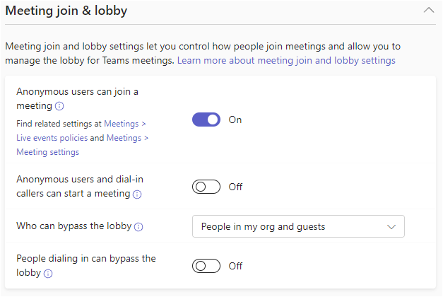
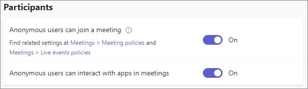

--- 
title: Control who can bypass the meeting lobby in Microsoft Teams
ms.author: mikeplum
author: MikePlumleyMSFT
ms.reviewer: rbronisevsky
manager: serdars
ms.topic: article
ms.service: msteams
audience: admin
ms.localizationpriority: medium
search.appverid: MET150
ms.collection: 
  - M365-collaboration
appliesto: 
  - Microsoft Teams
f1.keywords:
- NOCSH
description: Learn to use the meeting lobby in Microsoft Teams to allow only certain meeting participants to join the meeting directly
---

# Control who can bypass the meeting lobby in Microsoft Teams

The Teams meeting lobby is a way of preventing certain types of meeting attendees from joining a meeting until a meeting organizer or other authorized person admits them. When an attendee goes to the lobby, meeting organizers are notified and can choose to admit them to the meeting or not.

Using the lobby settings in the Teams admin center, you can control which types of meeting participants are able to bypass the lobby and which must wait there until admitted to the meeting. You can control the following types of participants:

- Meeting organizer and co-organizers
- People in your organization
- Guests
- People in trusted organizations
- Anonymous participants

## Prerequisites for meeting with people outside your organization

There are several settings in Teams that control whether people outside the organization can interact with Teams. The following settings must be enabled for people outside the organization to join meetings:

- [Guest access in Teams](guest-access.md) must be enabled in order for guests to be able to join meetings.
- [External access](manage-external-access.md) must be enabled in order for people in trusted organizations to join meetings. A mutual trust between your organization and the external organization must also be configured.
- Both the **Anonymous users can join a meeting** meeting setting (organization level) and meeting policy (for the organizer who is creating the meeting) must be **On** in order for anonymous participants to join meetings.

If any of these settings are turned off, that type of external participant won't be able to join meetings regardless of lobby settings.

## Overview of lobby settings and policies

The following table shows the Teams meeting settings and policies that affect how meeting participants interact with the lobby.

|Setting|Description|
|:------|:----------|
|**Anonymous users and dial-in callers can start a meeting**|This is a per-organizer policy that allows for leaderless dial-in conferencing meetings. This setting controls whether anonymous participants and dial-in users can join the meeting without an authenticated user from the organization in attendance. By default, this setting is turned off, which means anonymous participants and dial-in users will wait in the lobby until an authenticated user from the organization joins the meeting. If the **Anonymous users can join a meeting** organization or meeting setting is **Off**, this setting only applies to dial-in callers.|
|**People dialing in can bypass the lobby**|This is a per-organizer policy. This setting controls whether people who dial in by phone join the meeting directly or wait in the lobby. When this setting is **Off**, dial-in users will wait in the lobby until an organization user joins the meeting and admits them. When this setting is **On**, dial-in users will automatically join the meeting without going through the lobby, or after an organization user joins the meeting if **Anonymous users and dial-in callers can start a meeting** is **Off**.|
|**Who can bypass the lobby**|This is a per-organizer policy. This setting controls which types of participants join a meeting directly and which wait in the lobby until they're admitted by an authenticated user. This setting doesn't apply to dial-in users.|

The following table shows how each option for the **Who can bypass the lobby** control affects each type of meeting participant.

|*Who can bypass the lobby?* policy vlaue|Everyone|People in my organization, trusted organizations, and guests|People in my organization and guests|People in my organization|Only people who were invited|Only organizers and co-organizers|
|:------------------------|:------:|:----------------------------------------------------------:|:-----------------------------------|:------------------------|:---------------------------|:--------------------------------|
|*Participant type*|||*Lobby behavior*||||
|Organizer and co-organizers|Bypass|Bypass|Bypass|Bypass|Bypass|Bypass|
|People in the organization|Bypass|Bypass|Bypass|Bypass|People who were sent or forwarded an invite will bypass; others go to the lobby|Lobby|
|Guests|Bypass|Bypass|Bypass|Lobby|Lobby|Lobby|
|People in trusted organizations|Bypass|Bypass|Lobby|Lobby|Lobby|Lobby|
|Anonymous participants|Bypass|Lobby|Lobby|Lobby|Lobby|Lobby|

**Only people who were invited** applies only to individual users who were sent an invite or to whom an invite was forwarded. Users added as a part of a distribution group will go through the lobby.

## Choose who can bypass the lobby in meetings hosted by your organization

You can configure the settings and policies described above in the Teams admin center. See the sections below for guidance on which setting to choose for different circumstances.

> [!Important]
> Meeting organizers can change the values that you choose for the **People dialing in can bypass the lobby** and **Who can bypass the lobby** settings. If you need to enforce these settings to a particular value, you can use a meeting template or sensitivity label (Teams Premium required).  For more information, see [Configure the Microsoft Teams meeting lobby for sensitive meetings](configure-lobby-sensitive-meetings.md).

To set meeting join and lobby policies
1. In the Teams admin center, expand **Meetings** and then select **Meeting policies**.
1. Select the policy that you want to update.
1. In the **Meeting join & lobby** sections, update the settings that you want to change.
    
1. Select **Save**.

If you want to allow anonymous meeting access, be sure the **Anonymous users can join a meeting** meeting setting is also turned on.

To set the organization-wide meeting setting for anonymous meeting join
1. In the Teams admin center, expand **Meetings** and then select **Meeting settings**.
1. In the **Participants** section, set **Anonymous users can join a meeting** to **On** or **Off**.
    
1. Select **Save**.

## Control access to meetings by anonymous participants

Anonymous participants are anonymous because they are not logged in to an account that can be verified by Microsoft 365. This could include:
- People from domains that you have blocked using [external access](manage-external-access.md) who are not currently logged in to that domain
- People from domains that you allow but which do not allow your domain
- People from your organization who are not logged in

If you want to prevent anonymous participants from joining meeting completely, you can turn off the **Anonymous users can join a meeting** organization-wide meeting setting.

If you want people joining anonymously to go through the lobby, you can set the **Who can bypass the lobby** meeting policy to any setting except **Everyone**. (This setting does not affect people dialing in by phone.)

By default, the **Anonymous users and dial-in callers can start a meeting** policy is **Off**. This means that anonymous participants and people calling in by phone will always go to the lobby if an authenticated user has not yet started the meeting. While you can turn this setting on if there are circumstances where you want to allow anonymous participants and people calling in by phone to start meetings, we recommend that you leave it off to prevent people with unverified accounts from starting meetings.

## Control access to meetings by people dialing in by phone

By default, the **People dialing in can bypass the lobby** policy is **Off**, but meeting organizers can change this when they set up the meeting. You can change the default by updating the **People dialing in can bypass the lobby** policy or you can enforce a particular value by using a meeting template.

## Control access to meetings by guests and people from trusted organizations

There are two types of people outside your organization who can join meetings as verified participants:

- Guests - people who have an [Azure Active Directory (Azure AD) B2B collaboration account](/azure/active-directory/external-identities/what-is-b2b) in your organization
- External access users - people who have Azure AD accounts in a trusted organization defined in Teams [external access](manage-external-access.md)

If you want all verified meeting participants from outside your organization to wait in the lobby, you can set the Who can bypass the lobby policy to **People in my organization** or **Only organizers and co-organizers** (as long as a guest isn't the organizer or co-organizer). If you want only external access users to wait in the lobby, you can choose **People in my organization and guests**.

## Control access to meetings by people without invitations

If you want to allow only people who have invitations to join meetings directly and have all other participants wait in the lobby, set **Who can bypass the lobby** to **Only people who were invited**.

The **Only people who were invited** setting includes verified participants to whom the invite was forwarded, not just those invited directly by the organizer. It doesn’t include people who have the meeting join link but not the invitation itself and unverified (anonymous) participants. They must wait in the lobby.

Note that meeting organizers can disable forwarding the meeting invite if they only want people directly invited by them to attend the meeting.

## Control access to meetings by non-organizers

If you have meetings where sensitive information is shared or that are subject to regulatory requirements, you might want to have all attendees wait in the lobby until they are admitted by a meeting organizer or co-organizers. In this case, you can set **Who can bypass the lobby** to **Only organizers and co-organizers**.

Since **Who can bypass the lobby** only sets a default that meeting organizers can change, consider enforcing the value with a sensitivity label or meeting template if you have compliance requirements in this area. For more information, see [Configure the Microsoft Teams meeting lobby for sensitive meetings](configure-lobby-sensitive-meetings.md).

## Related topics

[Join a meeting without a Teams account](https://support.microsoft.com/office/c6efc38f-4e03-4e79-b28f-e65a4c039508)

[Using the Microsoft Teams admin center to configure organization-wide policy](meeting-settings-in-teams.md#allow-anonymous-users-to-join-meetings)
